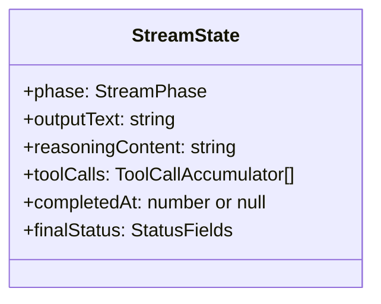

# Stream State

The `StreamState` object is the mutable accumulator used by the `ResponseSessionPersistenceTransformer` to collect partial results as stream events arrive.

## State Structure

## Accumulation Flow

As each `ResponseStreamEvent` flows through the transformer:

1. **Content delta events** append text to `outputText` and track the current content item
2. **Tool call events** accumulate function call arguments in `toolCalls`
3. **Reasoning events** append thinking content to `reasoningContent`
4. **Terminal events** set `completedAt`, `finalStatus`, and trigger session save

When the terminal event arrives, `StreamMapper.buildResponseObject(ctx, state)` constructs the complete `ResponseObject` from the accumulated state.

[Error Hierarchy](/06-error-handling/error-hierarchy)
