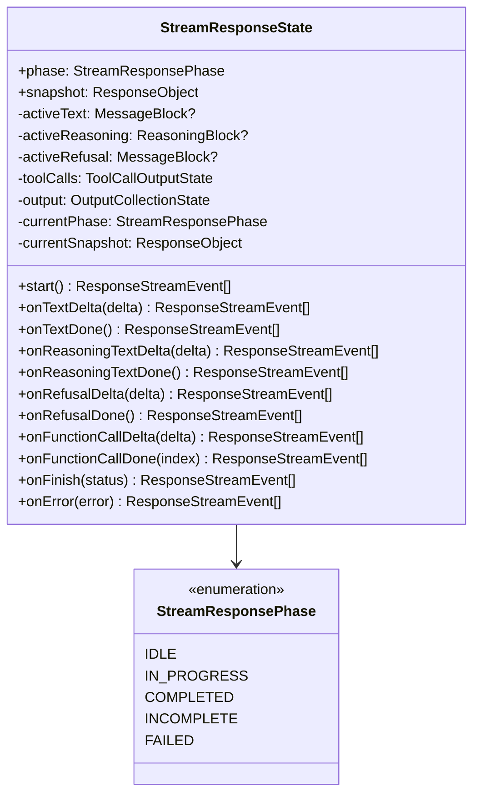

# Stream State

The `StreamResponseState` is the core state machine that drives the streaming pipeline. Unlike a simple accumulator, it produces `ResponseStreamEvent` arrays from every method call and maintains a live `snapshot` property that reflects the current response at all times.

## State Structure



## Lifecycle Phases

The state machine has five phases, tracked via `StreamResponsePhase`:

| Phase | Description |
|-------|-------------|
| `IDLE` | Initial state before `start()` is called |
| `IN_PROGRESS` | Actively processing deltas (text, reasoning, refusal, tool calls) |
| `COMPLETED` | Stream finished normally via `onFinish({ status: "completed" })` |
| `INCOMPLETE` | Stream finished with incomplete output via `onFinish({ status: "incomplete" })` |
| `FAILED` | Stream terminated due to error via `onError()` |

Phase transitions are validated -- any call from the wrong phase throws an `AdapterError` with an appropriate error code.

## Instance Management

`StreamResponseState` provides three static methods for lifecycle control:

- **`StreamResponseState.create(ctx, options)`** -- Creates a new state instance for a request. Throws if one already exists (guarding against double initialization).
- **`StreamResponseState.from(ctx)`** -- Retrieves the existing state instance. Throws if no state has been created yet.
- **`StreamResponseState.get(ctx)`** -- Returns the state instance, or `undefined` if none exists. Used by the persistence transformer for defensive checks.

The state is stored in `ResponsesContext.attributes` under the key `"stream-response-state"`.

## Event Production

Unlike the old accumulator pattern, the state machine produces events directly from its methods. Each delta method returns an array of `ResponseStreamEvent` objects that the provider's `StreamMapper` passes to the pipeline.

### Sequence

```
start() -> response.created, response.in_progress
  ├── onTextDelta() -> output_item.added, content_part.added, output_text.delta
  ├── onTextDone() -> output_text.done, content_part.done, output_item.done
  ├── onReasoningTextDelta() -> output_item.added, reasoning_text_part.added, reasoning_text.delta
  ├── onReasoningTextDone() -> reasoning_text.done, reasoning_text_part.done, output_item.done
  ├── onRefusalDelta() -> output_item.added, content_part.added, refusal.delta
  ├── onRefusalDone() -> refusal.done, content_part.done, output_item.done
  ├── onFunctionCallDelta() -> output_item.added, function_call_arguments.delta
  └── onFunctionCallDone() -> function_call_arguments.done, output_item.done

onFinish() -> closes open blocks, emits terminal event (response.completed/incomplete/failed)
onError() -> response.failed
```

### Auto-close on Finish

When `onFinish()` is called, the state machine automatically closes any open blocks (active reasoning, text, refusal, and tool calls), emitting all remaining done events before the terminal event.

## The Snapshot

The `snapshot` getter returns a `ResponseObject` that is always current -- it includes the live output items, output text, and terminal status fields (when applicable). This snapshot is used by `ResponseSessionPersistenceTransformer` for session persistence, replacing the old `buildResponseObject()` pattern.

## Tool Call State

Tool calls are tracked via `ToolCallOutputState` (from `stream-response-tool-call.ts`), which maintains accumulators per call index. `onFunctionCallDelta()` applies incremental changes and emits events when the call becomes sufficiently formed (has a name). `onFunctionCallDone()` marks the call complete and emits the closing events.

[Error Hierarchy](/06-error-handling/error-hierarchy)
