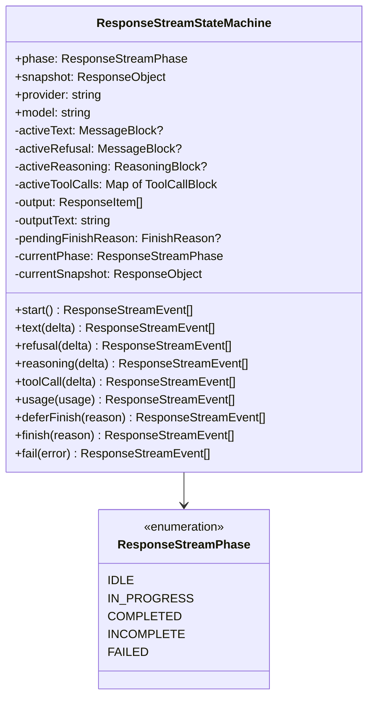

# Stream State

The `ResponseStreamStateMachine` is the core state machine that drives the streaming pipeline. It produces `ResponseStreamEvent` arrays from every method call and maintains a live `snapshot` property that reflects the current response at all times.

## State Structure



## Lifecycle Phases

The state machine has five phases, tracked via `ResponseStreamPhase`:

| Phase | Description |
|-------|-------------|
| `IDLE` | Initial state before `start()` is called |
| `IN_PROGRESS` | Actively processing deltas (text, reasoning, refusal, tool calls) |
| `COMPLETED` | Stream finished normally via `finish()` |
| `INCOMPLETE` | Stream finished with incomplete output via `finish()` |
| `FAILED` | Stream terminated due to error via `fail()` |

Phase transitions are validated — any call from the wrong phase throws a `BridgeError` with an appropriate code.

## Event Production

The state machine produces events directly from its methods. Each delta method returns an array of `ResponseStreamEvent` objects.

### Sequence

```
start() -> response.created, response.in_progress
  ├── text() -> output_item.added, content_part.added, output_text.delta
  ├── refusal() -> output_item.added, content_part.added, refusal.delta
  ├── reasoning() -> output_item.added, reasoning_text_part.added, reasoning_text.delta
  ├── toolCall() -> output_item.added, function_call_arguments.delta
  └── usage() -> (updates snapshot, no events emitted)

deferFinish() -> (records pending reason, no events)
finish() -> closes open blocks, emits terminal event (response.completed/incomplete)
fail() -> response.failed
```

### Auto-close on Finish

When `finish()` is called, the state machine automatically closes any open blocks (active text, refusal, reasoning, and tool calls), emitting all remaining done events before the terminal event.

## The Snapshot

The `snapshot` getter returns a `ResponseObject` that is always current — it includes the live output items, output text, and terminal status fields (when applicable). This snapshot is used by `ResponseSessionPersistenceTransformer` for session persistence.

## Tool Call State

Tool calls are tracked via `ToolCallBlock` instances, which maintain accumulators per stream index. The `toolCall()` method applies incremental changes and emits events when the call becomes sufficiently formed. Custom tool calls (shell, apply_patch, local_shell) are detected through the `ToolIdentityMap` and reconstructed with their proper output types.

## Error Handling

The state machine validates phase transitions and throws `BridgeError` for:

| Code | When |
|------|------|
| `bridge.stream.output_before_start` | Delta received before `start()` |
| `bridge.stream.delta_after_terminal` | Delta received after `finish()` or `fail()` |
| `bridge.stream.invalid_transition` | Method called in an unexpected phase |
| `bridge.stream.incomplete_tool_call` | Stream ended with an unfinished tool call |

[Error Hierarchy](/06-error-handling/error-hierarchy)

