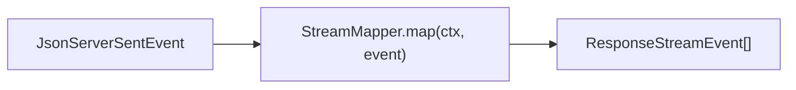
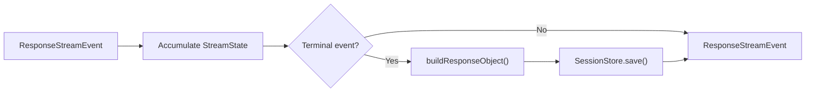

# Transformers

Each transformer in the pipeline is a `TransformStream` that processes events one at a time. They are connected using `pipeTransform()` (a thin wrapper over `ReadableStream.pipeThrough()`).

## ProviderEventToResponseTransformer

Converts raw provider SSE events into Responses API `ResponseStreamEvent` objects.



- Calls `StreamMapper.map()` for each incoming SSE chunk
- May emit zero, one, or multiple `ResponseStreamEvent` per chunk
- Handles provider-specific event type mapping

## ResponseSessionPersistenceTransformer

Accumulates stream state and persists the session when the stream completes.



- Skipped entirely when `request.store === false`
- On terminal event, calls `StreamMapper.buildResponseObject()` then saves

## ResponseSseEncodeTransformer

Serializes `ResponseStreamEvent` into the SSE wire format that the client expects.

```
event: response.output_item.added
data: {"type":"response.output_item.added","output_index":0,"item":{...}}

```

[Stream State](/05-streaming-pipeline/stream-state)
