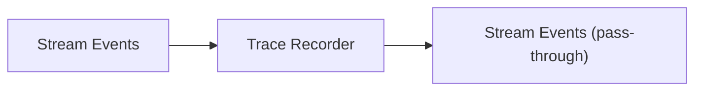
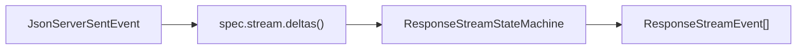
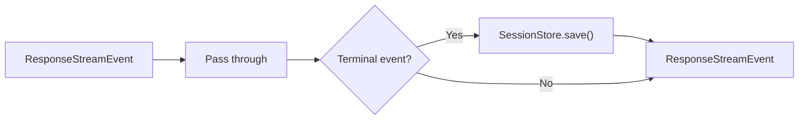

# Transformers

Each transformer in the pipeline is a `TransformStream` that processes events one at a time. They are connected using `pipeTransform()` (a thin wrapper over `ReadableStream.pipeThrough()`).

## TraceTransformer

Records raw or transformed stream events to the trace database.



Two instances are used in the pipeline — one for raw upstream events and one for transformed Responses events. Each records events under different labels (`upstream.stream.event.raw` and `upstream.stream.event.transformed`).

## ProviderStreamEventBridge

Converts raw provider SSE events into Responses API `ResponseStreamEvent` objects.



- Calls `spec.stream.deltas()` for each incoming SSE chunk to extract typed deltas
- Feeds deltas into the state machine which produces events
- In `flush()`, if the state machine is still `IN_PROGRESS`, it auto-finishes with the deferred finish reason

## StreamErrorHandler

Wraps the event stream to catch errors and emit a `response.failed` event before the stream terminates.

## ResponseOutputContractValidationTransformer

Validates structured output on terminal events. If the output contract requires `json_schema` but the provider degraded to `json_object`, this transformer validates that the final output is valid JSON.

Invalid sync output fails the response; invalid stream output is rewritten to a terminal `response.failed` event.

## ResponseLogTransformer

Logs terminal events (completed, incomplete, failed) with timing, usage, and cache hit ratio.

## ResponseSessionPersistenceTransformer

Accumulates stream state and persists the session when the stream completes.



- Skipped entirely when `request.store === false`
- On terminal event, extracts the `ResponseObject` from the event and saves

## CompatibilityLogTransformer

Logs all accumulated compatibility diagnostics from `ResponsesContext.diagnostics` when the stream ends.

## ResponseSseEncoder

Located in the server route (not in the pipeline itself), this encoder serializes `ResponseStreamEvent` into the SSE wire format that the client expects.

```
event: response.output_item.added
data: {"type":"response.output_item.added","output_index":0,"item":{...}}

```

[Stream State](/05-streaming-pipeline/stream-state)
