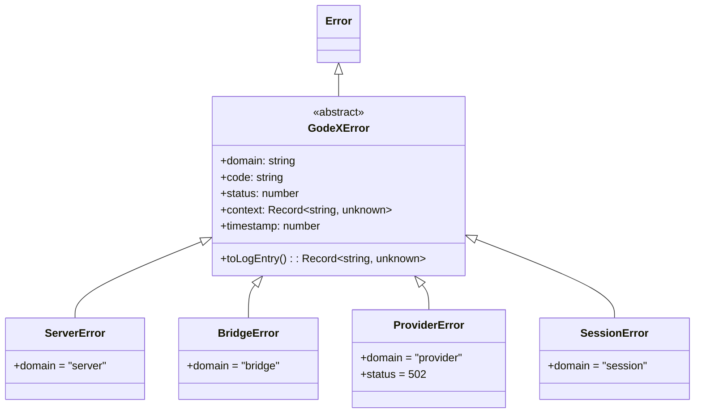
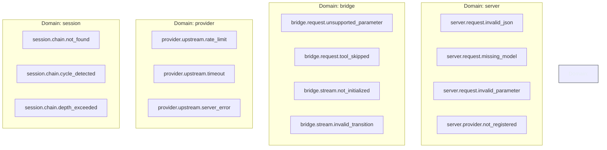
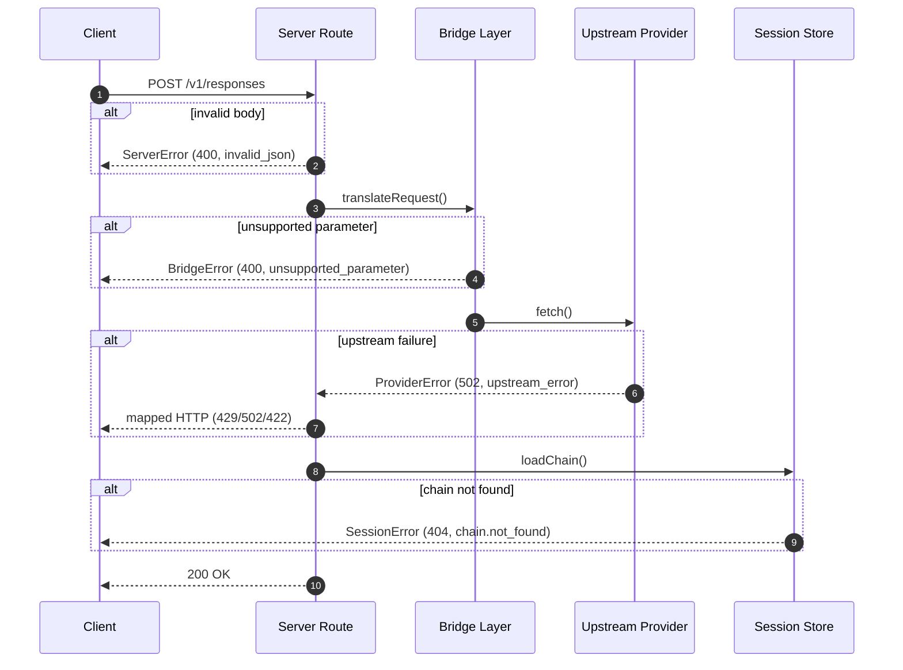
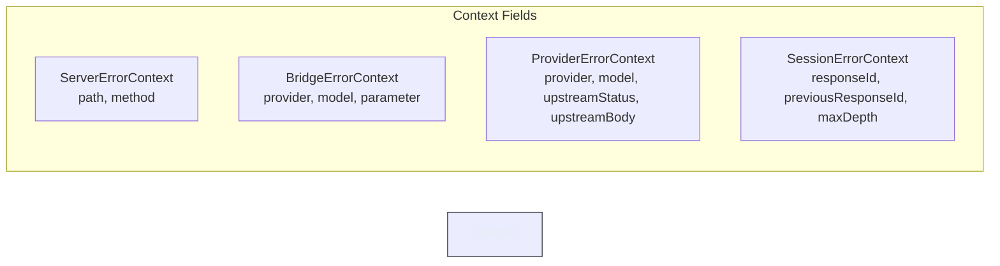

# Error Handling

GodeX models every failure as a typed, domain-scoped object so that callers,
operators, and log aggregation pipelines all speak the same language. Rather
than scattering string messages throughout the codebase, the system defines a
single abstract base -- `GodeXError` -- and four concrete subclasses that map
one-to-one with architectural layers. Each error carries a machine-readable
code, an HTTP status, a structured context bag, and a millisecond-precision
timestamp, making it straightforward to trace failures end-to-end from an
upstream provider timeout down to the JSON body returned to the client.

## At a Glance

| Aspect | Detail |
|---|---|
| Base class | `GodeXError` -- abstract, extends `Error` |
| Domains | `server`, `bridge`, `provider`, `session` |
| Key fields | `domain`, `code`, `status`, `context`, `timestamp` |
| Logging | `toLogEntry()` produces a plain-object snapshot |
| HTTP mapping | `godeXErrorToHttp` / `providerErrorToHttp` in [server/errors.ts](https://github.com/Ahoo-Wang/GodeX/blob/main/src/server/errors.ts) |
| Error codes | Centralised in [src/error/codes.ts](https://github.com/Ahoo-Wang/GodeX/blob/main/src/error/codes.ts) |

## Error Class Hierarchy



The abstract `GodeXError` class is defined at
[src/error/godex-error.ts:2-35](https://github.com/Ahoo-Wang/GodeX/blob/main/src/error/godex-error.ts#L2).
Every subclass declares a fixed `domain` string and forwards constructor
arguments to the base, which normalises `status` and `context` defaults.

## Error Domains and Codes

Error codes follow the pattern `<domain>.<subdomain>.<specific>` and are
exported as string constants from
[src/error/codes.ts:1-52](https://github.com/Ahoo-Wang/GodeX/blob/main/src/error/codes.ts#L1).



### Server Domain

Raised during request parsing and configuration validation.

| Code | HTTP | When |
|---|---|---|
| `server.request.invalid_json` | 400 | Request body is not valid JSON |
| `server.request.missing_model` | 400 | Required `model` field absent |
| `server.request.invalid_parameter` | 400 | Parameter fails validation |
| `server.provider.not_registered` | 400 | Referenced provider has no registration |

[source: src/error/codes.ts:46-51](https://github.com/Ahoo-Wang/GodeX/blob/main/src/error/codes.ts#L46)

### Bridge Domain

Raised when translating between the OpenAI Responses schema and a provider's
native format.

| Code | HTTP | When |
|---|---|---|
| `bridge.request.unsupported_parameter` | 400 | Parameter has no provider equivalent |
| `bridge.request.tool_skipped` | 400 | Tool not supported by provider |
| `bridge.request.unsupported_input_item` | 400 | Input item type not translatable |
| `bridge.request.unsupported_input_content` | 400 | Content type not translatable |
| `bridge.request.unsupported_tool` | 400 | Tool definition not translatable |
| `bridge.response.invalid_output_format` | 400 | Provider output cannot be mapped back |
| `bridge.stream.*` | 400 | Stream state-machine violations |

[source: src/error/codes.ts:3-31](https://github.com/Ahoo-Wang/GodeX/blob/main/src/error/codes.ts#L3)

### Provider Domain

Raised on upstream HTTP failures; always maps to 502 unless the upstream
status carries a specific meaning.

| Code | Upstream Status | Mapped HTTP |
|---|---|---|
| `provider.upstream.rate_limit` | 429 | 429 |
| `provider.upstream.timeout` | 408 | 408 |
| `provider.upstream.server_error` | >= 500 | 502 |
| `provider.upstream.error` | other | 422 |

[source: src/error/codes.ts:33-36](https://github.com/Ahoo-Wang/GodeX/blob/main/src/error/codes.ts#L33),
[source: src/server/errors.ts:20-44](https://github.com/Ahoo-Wang/GodeX/blob/main/src/server/errors.ts#L20)

### Session Domain

Raised when managing conversation chains.

| Code | HTTP | When |
|---|---|---|
| `session.chain.not_found` | 404 | Previous response ID does not exist |
| `session.chain.cycle_detected` | 400 | Circular chain reference detected |
| `session.chain.depth_exceeded` | 400 | Chain exceeds configured max depth |
| `session.chain.unavailable` | 503 | Session store temporarily unavailable |
| `session.store.conflict` | 409 | Concurrent write conflict |

[source: src/error/codes.ts:39-43](https://github.com/Ahoo-Wang/GodeX/blob/main/src/error/codes.ts#L39)

## Error Propagation Flow



The route-level error handler at
[src/server/routes/responses/error-handler.ts:12-50](https://github.com/Ahoo-Wang/GodeX/blob/main/src/server/routes/responses/error-handler.ts#L12)
dispatches errors in priority order:

1. **ProviderError** -- logged at `error` level, mapped via `providerErrorToHttp`.
2. **Other GodeXError** -- logged at `info` level, returned with its own `status` and `code`.
3. **Unexpected errors** -- logged at `error` level, masked as 500 `server_error`.

## Subclass Construction

Each subclass adds a typed context interface that captures the information
relevant to its domain.



| Subclass | Default Status | Context Highlights | Source |
|---|---|---|---|
| `ServerError` | 400 | `path`, `method` | [src/error/server-error.ts:10-27](https://github.com/Ahoo-Wang/GodeX/blob/main/src/error/server-error.ts#L10) |
| `BridgeError` | 400 | `provider`, `model`, `parameter` | [src/error/bridge-error.ts:11-28](https://github.com/Ahoo-Wang/GodeX/blob/main/src/error/bridge-error.ts#L11) |
| `ProviderError` | 502 | `provider`, `model`, `upstreamStatus`, `upstreamBody` | [src/error/provider-error.ts:12-29](https://github.com/Ahoo-Wang/GodeX/blob/main/src/error/provider-error.ts#L12) |
| `SessionError` | 400 | `responseId`, `previousResponseId`, `maxDepth` | [src/error/session-error.ts:11-27](https://github.com/Ahoo-Wang/GodeX/blob/main/src/error/session-error.ts#L11) |

## HTTP Mapping

The `jsonError` helper at
[src/server/errors.ts:50-63](https://github.com/Ahoo-Wang/GodeX/blob/main/src/server/errors.ts#L50)
produces a standard JSON envelope:

```json
{
  "error": {
    "code": "server.request.missing_model",
    "message": "Missing required field: model"
  }
}
```

Provider-specific mapping (`providerErrorToHttp`) translates upstream HTTP
status codes into client-facing equivalents at
[src/server/errors.ts:20-44](https://github.com/Ahoo-Wang/GodeX/blob/main/src/server/errors.ts#L20).

## Structured Logging via toLogEntry

Every `GodeXError` can produce a serialisable log entry via `toLogEntry()` at
[src/error/godex-error.ts:24-34](https://github.com/Ahoo-Wang/GodeX/blob/main/src/error/godex-error.ts#L24).
The standalone `toLogEntry(err)` overload at
[line 37](https://github.com/Ahoo-Wang/GodeX/blob/main/src/error/godex-error.ts#L37)
gracefully handles non-GodeXError values by wrapping them in a plain object.

## Cross-References

- [Error Codes Reference](https://github.com/Ahoo-Wang/GodeX/blob/main/src/error/codes.ts) -- full list of error codes
- [Error Hierarchy](https://github.com/Ahoo-Wang/GodeX/tree/main/src/error) -- error class implementation
- [Request Flow](../02-architecture/request-flow.md) -- where errors originate in the pipeline
- [Streaming Pipeline](../02-architecture/streaming-pipeline.md) -- bridge stream state errors
- [Configuration Schema](../07-configuration/config-schema.md) -- session depth limits

## References

- [src/error/godex-error.ts](https://github.com/Ahoo-Wang/GodeX/blob/main/src/error/godex-error.ts) -- abstract base class
- [src/error/codes.ts](https://github.com/Ahoo-Wang/GodeX/blob/main/src/error/codes.ts) -- all domain error code constants
- [src/error/bridge-error.ts](https://github.com/Ahoo-Wang/GodeX/blob/main/src/error/bridge-error.ts) -- bridge domain subclass
- [src/error/provider-error.ts](https://github.com/Ahoo-Wang/GodeX/blob/main/src/error/provider-error.ts) -- provider domain subclass
- [src/error/server-error.ts](https://github.com/Ahoo-Wang/GodeX/blob/main/src/error/server-error.ts) -- server domain subclass
- [src/error/session-error.ts](https://github.com/Ahoo-Wang/GodeX/blob/main/src/error/session-error.ts) -- session domain subclass
- [src/server/errors.ts](https://github.com/Ahoo-Wang/GodeX/blob/main/src/server/errors.ts) -- HTTP mapping helpers
- [src/server/routes/responses/error-handler.ts](https://github.com/Ahoo-Wang/GodeX/blob/main/src/server/routes/responses/error-handler.ts) -- route error handler
