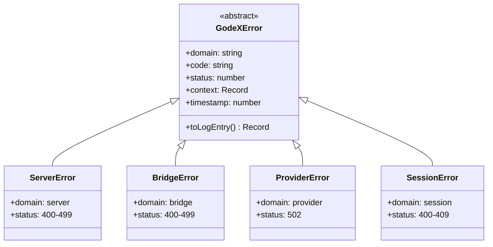

# Error Hierarchy

All errors in GodeX extend the abstract `GodeXError` base class. Each error carries a domain, code, HTTP status, structured context, and a timestamp.

## Class Hierarchy



## Error Domains

| Domain | Class | When It Occurs |
|--------|-------|----------------|
| `server` | `ServerError` | Invalid JSON, missing model, unknown provider, config validation |
| `bridge` | `BridgeError` | Unsupported parameters, tools, input items, stream state violations, output contract failures |
| `provider` | `ProviderError` | Upstream rate limits, timeouts, 5xx errors, invalid usage data |
| `session` | `SessionError` | Chain not found, cycles, depth exceeded, unavailable sessions |

## Structured Logging

Every `GodeXError` produces a structured log entry via `toLogEntry()`:

```json
{
  "domain": "session",
  "code": "session.chain.cycle_detected",
  "message": "Previous response chain contains a cycle.",
  "status": 400,
  "timestamp": 1716451200000,
  "responseId": "resp_abc",
  "previousResponseId": "resp_xyz"
}
```

[Error Codes](/06-error-handling/error-codes)
