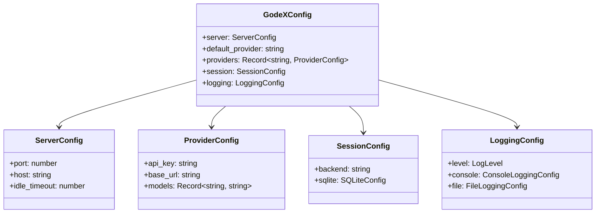

# Config Schema

GodeX is configured via a `godex.yaml` file, typically created by `godex init`. Environment variables are interpolated using `${VAR_NAME}` syntax.

## Full Schema

```yaml
server:
  port: 5678              # HTTP listen port
  host: "0.0.0.0"         # Listen address
  idle_timeout: 30000     # Idle connection timeout (ms)

default_provider: zhipu   # Provider used when model has no slash prefix

providers:
  zhipu:
    api_key: ${ZHIPU_API_KEY}
    base_url: https://open.bigmodel.cn/api/coding/paas/v4
    models:               # Model name mapping table
      "gpt-4o": glm-4.7   # Maps gpt-4o to provider-native glm-4.7
      "*": glm-5.1        # Catch-all fallback

session:
  backend: sqlite         # "sqlite" or "memory"
  sqlite:
    path: ./data/sessions.db

logging:
  level: info             # trace | debug | info | warn | error
  console:
    enabled: true
    level: info
  file:
    enabled: false
    level: debug
    dir: ./logs
    filename: godex.log
    max_size: 10485760    # 10MB
    max_files: 5
```

## Type Definitions



## Environment Interpolation

Values like `${ZHIPU_API_KEY}` are resolved at load time from `process.env`. Missing variables produce a startup error.

[CLI Commands](/07-configuration/cli-commands)
