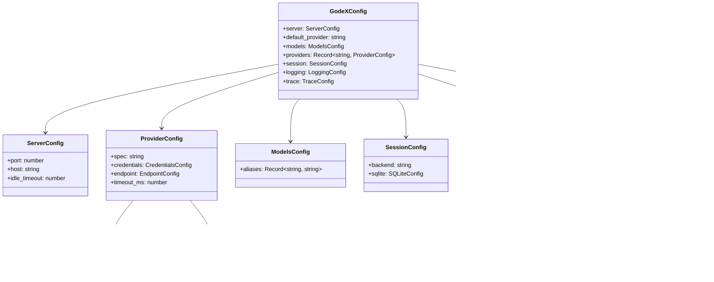

# Config Schema

GodeX is configured via a `godex.yaml` file, typically created by `godex init`. Environment variables are interpolated using `${VAR_NAME}` syntax.

## Full Schema

```yaml
server:
  port: 5678              # HTTP listen port
  host: "0.0.0.0"         # Listen address
  idle_timeout: 30000     # Idle connection timeout (ms)

default_provider: deepseek   # Provider used when model has no slash prefix

models:
  aliases:
    "gpt-5.5": deepseek/deepseek-v4-pro   # Maps alias to provider/model
    "glm": zhipu/glm-5.1                   # Maps alias to provider/model
    "*": deepseek/deepseek-v4-flash        # Catch-all fallback

providers:
  deepseek:
    spec: deepseek                      # Provider spec name (required)
    credentials:
      api_key: ${DEEPSEEK_API_KEY}
    endpoint:
      base_url: https://api.deepseek.com
    timeout_ms: 30000

  zhipu:
    spec: zhipu                         # Provider spec name (required)
    credentials:
      api_key: ${ZHIPU_API_KEY}
    endpoint:
      base_url: https://open.bigmodel.cn/api/coding/paas/v4
    timeout_ms: 30000

session:
  backend: sqlite         # "sqlite" or "memory"
  sqlite:
    path: ./data/sessions.db

logging:
  level: info             # trace | debug | info | warn | error
  console:
    enabled: true
    level: info
  file:
    enabled: false
    level: debug
    dir: ./logs
    filename: godex.log
    max_size: 10485760    # 10MB
    max_files: 5

trace:
  enabled: true
  path: ./data/trace.db
  max_queue_size: 1000
  flush_interval_ms: 1000
  batch_size: 50
  capture_payload: false
  payload_max_bytes: 102400
```

## Type Definitions



## Provider Config

Each provider entry must include a `spec` field that matches a registered provider definition name. Legacy provider config without `spec` is rejected at startup.

```yaml
providers:
  myprovider:
    spec: myprovider           # Required: matches registered definition
    credentials:
      api_key: ${MY_API_KEY}
    endpoint:
      base_url: https://api.example.com/v1
    timeout_ms: 30000
```

## Environment Interpolation

Values like `${DEEPSEEK_API_KEY}` are resolved at load time from environment variables. Missing variables produce a startup error.

[CLI Commands](/07-configuration/cli-commands)
