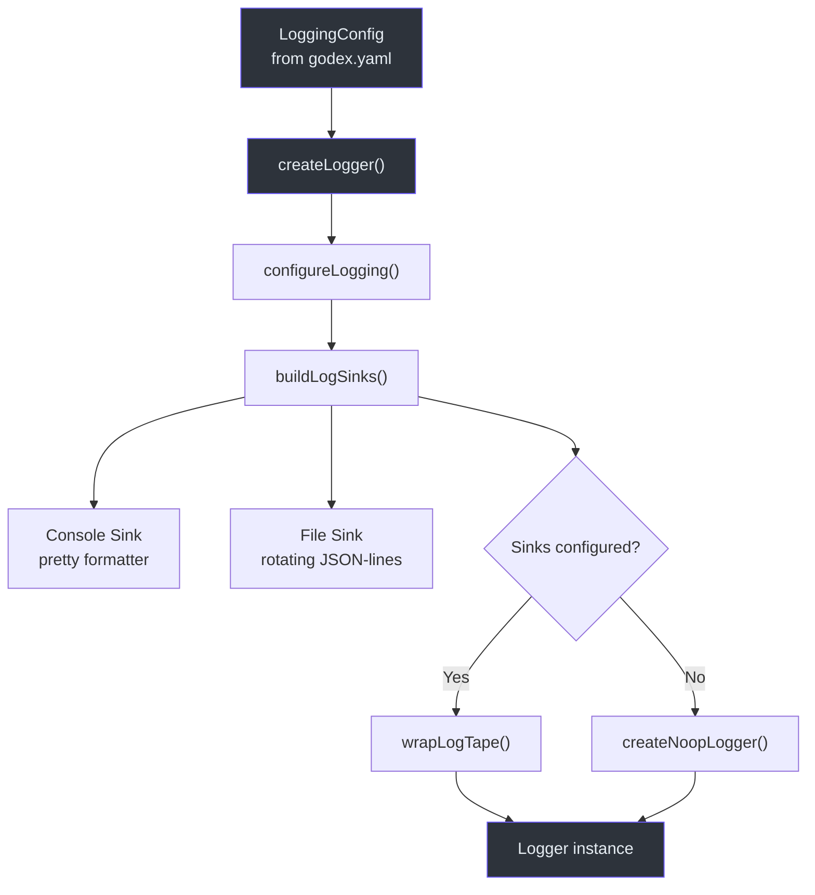
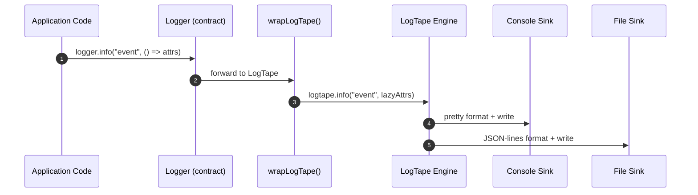

# Logging

Observability is fundamental to operating a multi-provider API gateway. GodeX
uses LogTape as its logging engine, wrapped behind a thin `Logger` contract
that supports lazy attribute evaluation -- attributes are only serialised when
the log level is active, preventing unnecessary object allocation on hot paths.
The system is fully configurable via the `logging` section of `godex.yaml`,
supporting console output with pretty formatting, rotating file output with
JSON-lines format, and per-sink level overrides.

## At a Glance

| Aspect | Detail |
|---|---|
| Engine | `@logtape/logtape` with `@logtape/pretty` and `@logtape/file` |
| Contract | `Logger` interface at [src/logger/contract.ts](https://github.com/Ahoo-Wang/GodeX/blob/main/src/logger/contract.ts) |
| Levels | `trace`, `debug`, `info`, `warn`, `error` |
| Sinks | Console (pretty), File (rotating JSON-lines) |
| Lazy attrs | `LogAttr = Record | () => Record` |
| Noop fallback | `NoopLogger` when all sinks disabled |

## Logger Architecture



## Logger Contract

The `Logger` interface at
[src/logger/contract.ts:6-14](https://github.com/Ahoo-Wang/GodeX/blob/main/src/logger/contract.ts#L6)
defines the shape consumed throughout the codebase:

```typescript
interface Logger {
  readonly level: LogLevel;
  child(bindings: Record<string, unknown>): Logger;
  trace(event: string, attr?: LogAttr): void;
  debug(event: string, attr?: LogAttr): void;
  info(event: string, attr?: LogAttr): void;
  warn(event: string, attr?: LogAttr): void;
  error(event: string, attr?: LogAttr): void;
}
```

The `LogAttr` type at
[line 4](https://github.com/Ahoo-Wang/GodeX/blob/main/src/logger/contract.ts#L4)
accepts either a plain object or a **lazy getter function**. The getter form
is preferred on hot paths:

```typescript
// Eager -- object created regardless of log level
logger.info("event", { data: expensiveCall() });

// Lazy -- function called only when level is active
logger.info("event", () => ({ data: expensiveCall() }));
```

## Logger Creation

`createLogger` at
[src/logger/logger.ts:8-14](https://github.com/Ahoo-Wang/GodeX/blob/main/src/logger/logger.ts#L8)
decides between a real LogTape-backed logger and the no-op fallback:

| Condition | Result |
|---|---|
| `configureLogging` returns `true` | `wrapLogTape(getLogTapeLogger([]), level)` |
| No sinks configured | `createNoopLogger(level)` |

## LogTape Configuration

`configureLogging` at
[src/logger/configure.ts:7-26](https://github.com/Ahoo-Wang/GodeX/blob/main/src/logger/configure.ts#L7)
calls LogTape's `configureSync` with two logger categories:

| Category | Lowest Level | Purpose |
|---|---|---|
| `[]` (root) | Computed from sinks | All application log events |
| `["logtape", "meta"]` | `warning` | Suppress LogTape internal noise |

The computed `lowestLevel` is the minimum level across all active sinks,
ensuring no sink misses events it should receive.

## Sink Types

### Console Sink

Configured when `console.enabled` is not explicitly `false`. Uses the pretty
formatter from `@logtape/pretty` at
[src/logger/sinks.ts:29-45](https://github.com/Ahoo-Wang/GodeX/blob/main/src/logger/sinks.ts#L29).

| Setting | Default | Description |
|---|---|---|
| `formatter` | pretty (date-time, properties) | Human-readable output |
| `level` | Inherits `logging.level` | Per-sink override |

### File Sink

Activated when `file.enabled` is `true`. Uses a rotating file sink from
`@logtape/file` with JSON-lines formatting at
[src/logger/sinks.ts:47-62](https://github.com/Ahoo-Wang/GodeX/blob/main/src/logger/sinks.ts#L47).

| Setting | Default | Description |
|---|---|---|
| `dir` | Required | Directory for log files |
| `filename` | Required | Log file name |
| `max_size` | 10 (MB) | Max file size before rotation |
| `max_files` | 5 | Number of rotated files to keep |
| `formatter` | JSON-lines (flattened) | Machine-parseable output |
| `level` | Inherits `logging.level` | Per-sink override |



## Level Mapping

GodeX uses five log levels. The mapping to LogTape's internal levels is
handled by `toLogTapeLevel` at
[src/logger/levels.ts:7-13](https://github.com/Ahoo-Wang/GodeX/blob/main/src/logger/levels.ts#L7):

| GodeX Level | LogTape Level |
|---|---|
| `trace` | `trace` |
| `debug` | `debug` |
| `info` | `info` |
| `warn` | `warning` |
| `error` | `error` |

`minLogTapeLevel` at
[line 19](https://github.com/Ahoo-Wang/GodeX/blob/main/src/logger/levels.ts#L19)
computes the most verbose level from a set of sink levels, ensuring the root
logger captures everything the most permissive sink needs.

## NoopLogger

When all sinks are disabled, `createNoopLogger` at
[src/logger/noop-logger.ts:3-14](https://github.com/Ahoo-Wang/GodeX/blob/main/src/logger/noop-logger.ts#L3)
returns a logger whose methods are all no-ops. This avoids LogTape overhead
when logging is intentionally turned off (e.g., in lightweight tests).

## File Path Expansion

`expandHomeDir` at
[src/logger/paths.ts:4-9](https://github.com/Ahoo-Wang/GodeX/blob/main/src/logger/paths.ts#L4)
resolves `~/` prefixes in file paths using `process.env.HOME` or Node's
`homedir()`, allowing configs like:

```yaml
logging:
  file:
    enabled: true
    dir: ~/logs/godex
    filename: godex.log
```

## Configuration Example

```yaml
logging:
  level: info
  console:
    enabled: true
    level: debug       # console sees debug and above
  file:
    enabled: true
    dir: /var/log/godex
    filename: godex.log
    max_size: 20       # 20 MB per file
    max_files: 10      # keep 10 rotated files
    level: info        # file sees info and above
```

## Cross-References

- [Configuration Schema](./config-schema.md) -- full logging section reference
- [CLI Commands](./cli-commands.md) -- `--log-level` CLI override
- [Error Handling](../06-error-handling/error-handling.md) -- structured error logging via `toLogEntry()`
- [Server Routes](../02-architecture/server-routes.md) -- per-request logging with `responseRequestLogEntry`
- [Request Flow](../02-architecture/request-flow.md) -- where log events fire in the pipeline

## References

- [src/logger/logger.ts](https://github.com/Ahoo-Wang/GodeX/blob/main/src/logger/logger.ts) -- `createLogger` factory
- [src/logger/contract.ts](https://github.com/Ahoo-Wang/GodeX/blob/main/src/logger/contract.ts) -- `Logger` interface and `LogAttr` type
- [src/logger/configure.ts](https://github.com/Ahoo-Wang/GodeX/blob/main/src/logger/configure.ts) -- LogTape `configureSync` setup
- [src/logger/noop-logger.ts](https://github.com/Ahoo-Wang/GodeX/blob/main/src/logger/noop-logger.ts) -- no-op logger fallback
- [src/logger/logtape-logger.ts](https://github.com/Ahoo-Wang/GodeX/blob/main/src/logger/logtape-logger.ts) -- LogTape wrapper adapter
- [src/logger/sinks.ts](https://github.com/Ahoo-Wang/GodeX/blob/main/src/logger/sinks.ts) -- console and file sink builders
- [src/logger/levels.ts](https://github.com/Ahoo-Wang/GodeX/blob/main/src/logger/levels.ts) -- level mapping and minimum computation
- [src/logger/paths.ts](https://github.com/Ahoo-Wang/GodeX/blob/main/src/logger/paths.ts) -- home directory path expansion
