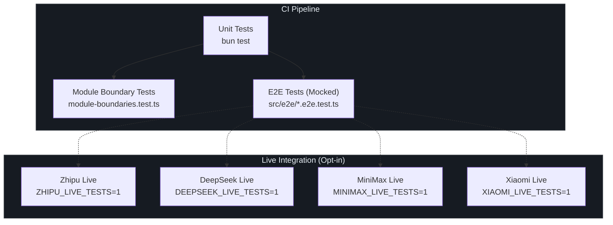
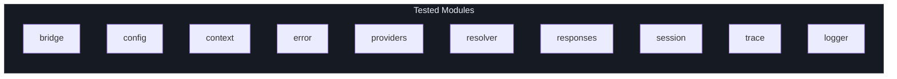
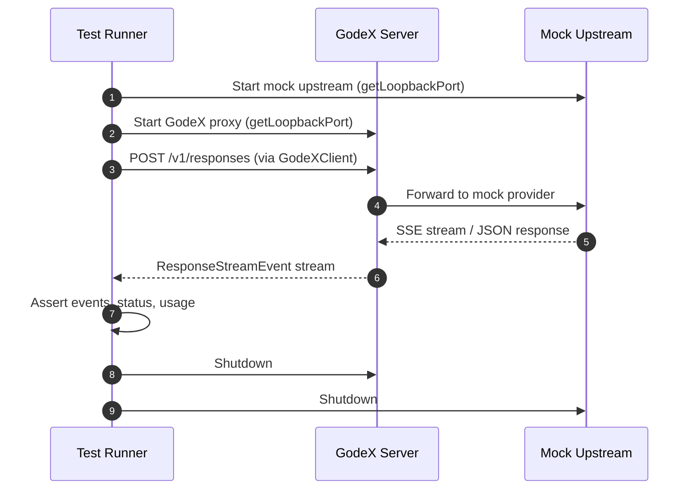
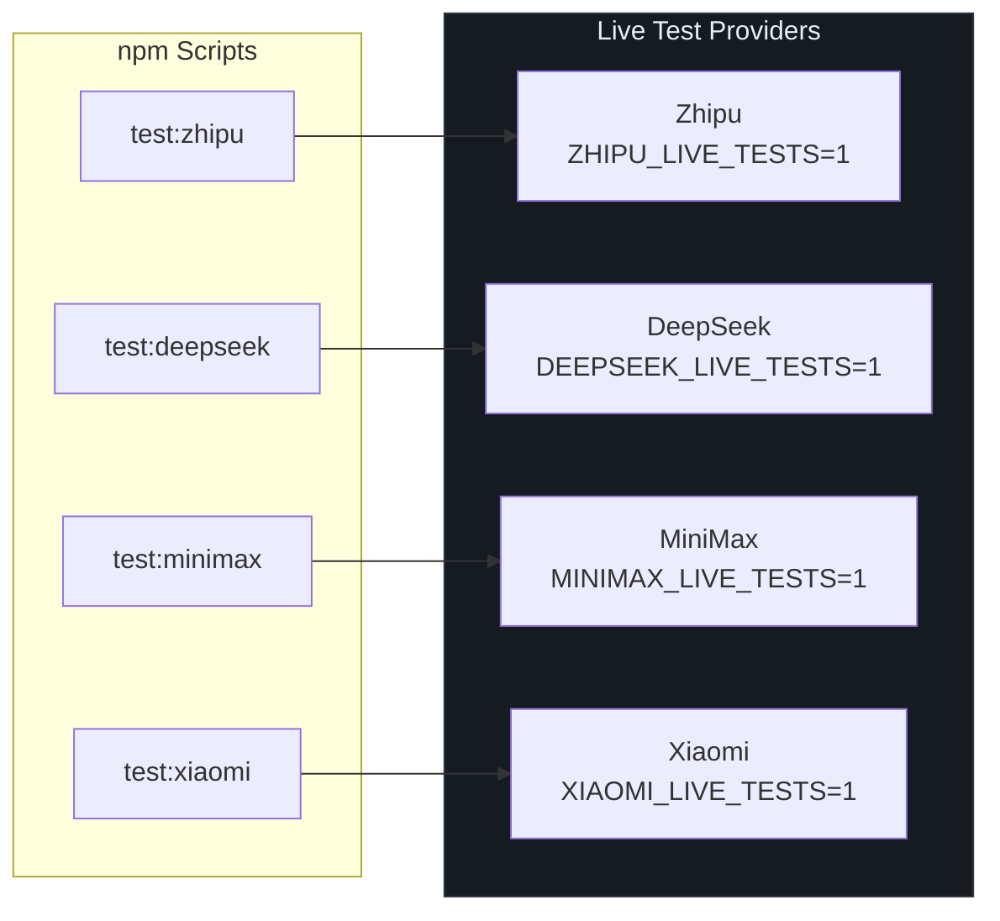
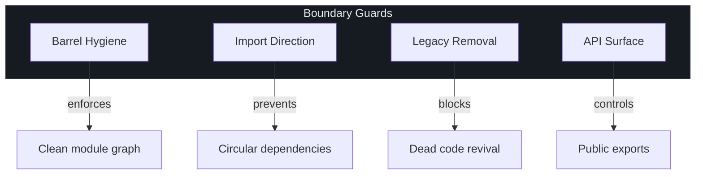

# Testing Strategy

GodeX ships a multi-layered testing strategy that catches bugs at every level -- from individual transformer functions to full proxy round-trips against live provider APIs. Every module has co-located `*.test.ts` files, the project enforces architectural invariants at test time, and provider compatibility is validated through a shared test suite that any new provider must pass. Understanding this strategy is essential for contributors who want to add features safely and for operators who need confidence before deploying to production.

## At a Glance

| Layer | Scope | Runner Flag | Trigger |
|---|---|---|---|
| Unit tests | All modules (`bridge`, `config`, `context`, `error`, `providers`, `resolver`, `responses`, `session`, `trace`, `logger`) | `bun test` | Every commit |
| Module boundary tests | Architectural invariants (barrel files, import hygiene, legacy cleanup) | `bun test` | Every commit |
| E2E tests (mocked) | Full proxy round-trip with mock upstream server | `bun test src/e2e` | CI pipeline |
| Live tests (Zhipu) | Real Zhipu API calls | `ZHIPU_LIVE_TESTS=1` | Manual / CI opt-in |
| Live tests (DeepSeek) | Real DeepSeek API calls | `DEEPSEEK_LIVE_TESTS=1` | Manual / CI opt-in |
| Live tests (MiniMax) | Real MiniMax API calls | `MINIMAX_LIVE_TESTS=1` | Manual / CI opt-in |
| Live tests (Xiaomi) | Real Xiaomi MiMo API calls | `XIAOMI_LIVE_TESTS=1` | Manual / CI opt-in |
| Compatibility suite | Per-provider input/tool degradation behavior | `bun test` | Every commit |

## Test Architecture Overview



## Unit Tests

All production modules are covered by co-located `*.test.ts` files. Tests use [Bun's built-in test runner](https://bun.sh/docs/cli/test) with `describe`/`expect`/`test` imported from `bun:test`.



The test command excludes E2E tests by default via path-ignore-patterns:

```json
"test": "bun test --path-ignore-patterns 'src/e2e/**'"
```

This keeps the unit test suite fast and deterministic ([package.json:31](https://github.com/Ahoo-Wang/GodeX/blob/main/package.json#L31)).

## Test Fixtures

GodeX provides dedicated test fixture modules that make it easy to construct test contexts without reaching out to real services.

### Context Fixtures

[context/test-fixtures.ts](https://github.com/Ahoo-Wang/GodeX/blob/main/src/context/test-fixtures.ts) provides:

| Export | Purpose |
|---|---|
| `baseConfig` | Minimal `GodeXConfig` with in-memory session and trace disabled |
| `createRegistrar(names)` | Registrar pre-loaded with mock provider edges |
| `createCapturingLogger(logs)` | Logger that captures all log events into an array for assertions |
| `CapturedLog` | Type for captured log entries (level, event, attr) |

The `baseConfig` fixture disables trace and uses an error-level log threshold to keep test output clean ([src/context/test-fixtures.ts:6](https://github.com/Ahoo-Wang/GodeX/blob/main/src/context/test-fixtures.ts#L6)).

### Session Fixtures

[session/test-fixtures.ts](https://github.com/Ahoo-Wang/GodeX/blob/main/src/session/test-fixtures.ts) supplies pre-built session data:

| Export | Purpose |
|---|---|
| `userInput` | A standard user input text item |
| `completedTurn(id, prevId)` | Builds a `StoredResponseSession` in completed state |
| `incompleteTurn(id, prevId)` | Builds a session in `in_progress` state |
| `cycleTurns()` | Returns two sessions that reference each other (cycle detection tests) |

The `completedTurn` helper at [src/session/test-fixtures.ts:16](https://github.com/Ahoo-Wang/GodeX/blob/main/src/session/test-fixtures.ts#L16) creates a full response session with output, usage stats, and metadata.

### Server / Response Fixtures

[server/routes/responses/test-fixtures.ts](https://github.com/Ahoo-Wang/GodeX/blob/main/src/server/routes/responses/test-fixtures.ts) provides:

| Export | Purpose |
|---|---|
| `testConfig` | Server config for route-level tests |
| `createTestApp(options)` | Full `ApplicationContext` with mock providers |
| `responseObject(ctx)` | Builds a `ResponseObject` from a `ResponsesContext` |
| `jsonRequest(body)` / `textRequest(body)` | Construct `Request` objects for handler tests |
| `basicRequest` | A minimal `ResponseCreateRequest` |

## E2E Tests with Mocked Upstreams

The E2E test suite ([src/e2e/e2e.test.ts](https://github.com/Ahoo-Wang/GodeX/blob/main/src/e2e/e2e.test.ts)) starts a real GodeX server alongside a mock upstream server. No real API keys are needed.



### GodeX E2E Client

The [GodeXClient](https://github.com/Ahoo-Wang/GodeX/blob/main/src/e2e/godex-client.ts) is a typed HTTP client built with `@ahoo-wang/fetcher` decorators. It exposes three API groups ([src/e2e/godex-client.ts:39](https://github.com/Ahoo-Wang/GodeX/blob/main/src/e2e/godex-client.ts#L39)):

| API | Endpoint | Method |
|---|---|---|
| `health.get()` | `GET /health` | Health check |
| `models.list()` | `GET /v1/models` | Model listing |
| `responses.create(req)` | `POST /v1/responses` | Non-streaming response |
| `responses.stream(req)` | `POST /v1/responses` | Streaming response (SSE) |

The `collectGodexStreamEvents` helper ([src/e2e/godex-client.ts:114](https://github.com/Ahoo-Wang/GodeX/blob/main/src/e2e/godex-client.ts#L114)) reads an entire SSE stream into an array for assertion.

### Port Allocation

The [`getLoopbackPort()`](https://github.com/Ahoo-Wang/GodeX/blob/main/src/e2e/ports.ts#L3) function allocates an ephemeral loopback port by briefly opening a TCP server on port 0, reading the assigned port, then closing the server. This avoids port conflicts in parallel test runs.

## Live Integration Tests

Live tests exercise the full proxy pipeline against real provider APIs. They are **opt-in** and skipped unless explicitly enabled via environment variables.



Each live test file (e.g., [src/e2e/zhipu-live.test.ts](https://github.com/Ahoo-Wang/GodeX/blob/main/src/e2e/zhipu-live.test.ts)) starts a real GodeX server configured with the provider's actual base URL, then sends requests using the typed `GodeXClient`. Tests verify streaming and non-streaming response shapes, tool calling behavior, and multi-turn conversations.

## Module Boundary Tests

The [module-boundaries.test.ts](https://github.com/Ahoo-Wang/GodeX/blob/main/src/module-boundaries.test.ts) suite enforces architectural invariants using the TypeScript compiler API:

| Test | Invariant |
|---|---|
| `every src subdirectory has an index barrel` | No directory lacks an `index.ts` |
| `index.ts files only re-export local modules` | Barrel files contain no logic |
| `index.ts files only re-export from own directory` | No cross-directory re-exports |
| `non-index modules do not re-export` | Only barrels re-export |
| `legacy modules stay removed` | Forbidden paths must not exist |
| `output contract slot` | Legacy accessor has been cleaned up |
| `bridge does not import responses context` | Bridge layer stays independent |
| `root index.ts stays executable entrypoint` | Entrypoint structure preserved |
| `session helpers do not leak through protocol barrel` | Public API surface is controlled |

These tests run as part of the standard `bun test` suite and act as a guardian against architectural drift ([src/module-boundaries.test.ts:95](https://github.com/Ahoo-Wang/GodeX/blob/main/src/module-boundaries.test.ts#L95)).



## Provider Compatibility Test Suite

The shared compatibility test suite at [src/providers/shared/compatibility-test-suite.ts](https://github.com/Ahoo-Wang/GodeX/blob/main/src/providers/shared/compatibility-test-suite.ts) validates that every provider correctly handles content and tool degradation scenarios:

| Function | Validates |
|---|---|
| `describeCurrentInputContentCompatibility` | Unsupported content types are stripped, supported text is kept, diagnostics are recorded |
| `describeUnsupportedToolCompatibility` | Unsupported tool types are skipped with diagnostics instead of causing errors |

Each provider integration imports these suite functions and provides provider-specific mapping and assertion callbacks ([src/providers/shared/compatibility-test-suite.ts:30](https://github.com/Ahoo-Wang/GodeX/blob/main/src/providers/shared/compatibility-test-suite.ts#L30)).

## Shared Test Utilities

The [src/testing/](https://github.com/Ahoo-Wang/GodeX/blob/main/src/testing) module exports reusable test infrastructure:

| Export | Purpose |
|---|---|
| `createTestProviderEdge(options)` | Builds a fully-configured mock `ProviderEdge` with configurable request/stream behavior |
| `completedTextResponse(text, usage)` | Creates a standard chat completion response for assertions |
| `CreateTestProviderEdgeOptions` | Options interface for controlling mock responses, stream events, and callbacks |

The `createTestProviderEdge` function at [src/testing/provider-edge.ts:34](https://github.com/Ahoo-Wang/GodeX/blob/main/src/testing/provider-edge.ts#L34) creates a mock provider with configurable callbacks (`onRequest`, `onStream`), pre-built stream events, and a full provider spec including capabilities and tool support.

## Test Structure

```
src/
├── bridge/
│   ├── compatibility/*.test.ts
│   ├── tools/*.test.ts
│   ├── output/*.test.ts
│   ├── request/*.test.ts
│   ├── response/*.test.ts
│   ├── stream/*.test.ts
│   ├── provider-spec/*.test.ts
│   └── finish-reason/*.test.ts
├── config/
│   ├── builder.test.ts
│   ├── env.test.ts
│   └── raw.test.ts
├── context/
│   ├── application-context.test.ts
│   ├── responses-context.test.ts
│   └── responses-context-factory.test.ts
├── e2e/
│   ├── e2e.test.ts
│   ├── deepseek.e2e.test.ts
│   ├── minimax.e2e.test.ts
│   ├── trace.test.ts
│   └── zhipu-api.test.ts
├── error/*.test.ts
├── providers/
│   ├── registrar.test.ts
│   ├── builtin.test.ts
│   ├── provider-conformance.test.ts
│   ├── deepseek/provider.test.ts
│   └── minimax/provider.test.ts
├── resolver/*.test.ts
├── responses/
│   ├── runtime.test.ts
│   ├── provider-exchange.test.ts
│   ├── stream-pipeline.test.ts
│   ├── sync-request-pipeline.test.ts
│   └── stream-transforms/*.test.ts
├── server/
│   ├── index.test.ts
│   └── routes/**/*.test.ts
├── session/*.test.ts
├── trace/*.test.ts
└── module-boundaries.test.ts
```

## Test Execution Commands

| Command | What It Runs |
|---|---|
| `bun test` | Unit + boundary tests (excludes E2E) |
| `bun test src/e2e` | Mocked E2E tests |
| `bun run test:e2e` | Mocked E2E tests (alias) |
| `ZHIPU_LIVE_TESTS=1 bun test src/e2e/zhipu-live.test.ts` | Zhipu live tests |
| `DEEPSEEK_LIVE_TESTS=1 bun test src/e2e/deepseek-live.test.ts` | DeepSeek live tests |
| `MINIMAX_LIVE_TESTS=1 bun test src/e2e/minimax-live.test.ts` | MiniMax live tests |
| `XIAOMI_LIVE_TESTS=1 bun test src/e2e/xiaomi-live.test.ts` | Xiaomi live tests |
| `bun run test:coverage` | Unit tests with coverage report |
| `bun run check` | TypeCheck + Lint + Unit tests |
| `bun run ci` | Full CI: TypeCheck + Lint + Unit + E2E |

All scripts are defined in [package.json:36-53](https://github.com/Ahoo-Wang/GodeX/blob/main/package.json#L36-L53).

## Cross-References

- [Stream Pipeline](../02-architecture/streaming-pipeline.md) -- where unit-tested transformers assemble into the response pipeline
- [Architecture Overview](../02-architecture/overview.md) -- how the tested modules relate to the system architecture
- [Provider Development](../03-provider-development/provider-spec.md) -- how the compatibility test suite applies to new providers
- [Session Management](../04-session-management/session-stores.md) -- session fixtures and multi-turn test scenarios
- [Trace System](../10-trace/trace-system.md) -- trace-related unit tests and live tracing validation

## References

1. [src/module-boundaries.test.ts](https://github.com/Ahoo-Wang/GodeX/blob/main/src/module-boundaries.test.ts) -- Architectural invariant tests
2. [src/e2e/e2e.test.ts](https://github.com/Ahoo-Wang/GodeX/blob/main/src/e2e/e2e.test.ts) -- Mocked end-to-end test suite
3. [src/e2e/godex-client.ts](https://github.com/Ahoo-Wang/GodeX/blob/main/src/e2e/godex-client.ts) -- Typed E2E HTTP client
4. [src/e2e/ports.ts](https://github.com/Ahoo-Wang/GodeX/blob/main/src/e2e/ports.ts) -- Ephemeral port allocation
5. [src/context/test-fixtures.ts](https://github.com/Ahoo-Wang/GodeX/blob/main/src/context/test-fixtures.ts) -- Context and config fixtures
6. [src/session/test-fixtures.ts](https://github.com/Ahoo-Wang/GodeX/blob/main/src/session/test-fixtures.ts) -- Session data fixtures
7. [src/server/routes/responses/test-fixtures.ts](https://github.com/Ahoo-Wang/GodeX/blob/main/src/server/routes/responses/test-fixtures.ts) -- Route handler fixtures
8. [src/providers/shared/compatibility-test-suite.ts](https://github.com/Ahoo-Wang/GodeX/blob/main/src/providers/shared/compatibility-test-suite.ts) -- Shared provider compatibility tests
9. [src/testing/provider-edge.ts](https://github.com/Ahoo-Wang/GodeX/blob/main/src/testing/provider-edge.ts) -- Mock provider edge factory
10. [package.json](https://github.com/Ahoo-Wang/GodeX/blob/main/package.json) -- Test scripts (lines 25-44)
