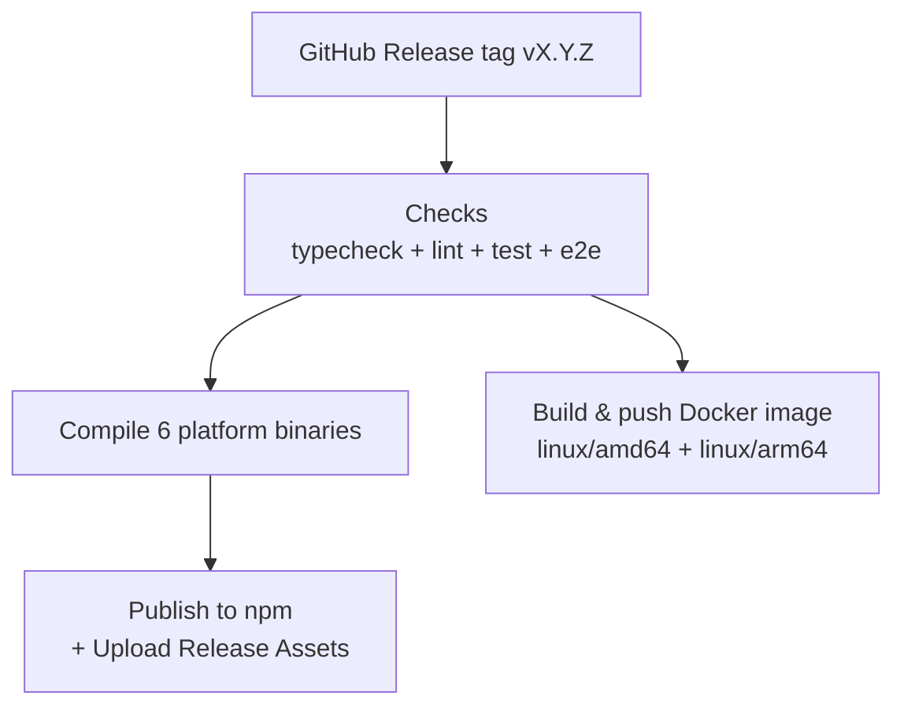

# CI/CD & Publishing

## CI Pipeline

The CI pipeline runs on every push and pull request via GitHub Actions:

1. **Typecheck** (`bun run typecheck`) — `tsc --noEmit`
2. **Lint** (`bun run lint`) — Biome check
3. **Unit tests** (`bun run test`)
4. **E2E tests** (`bun run test:e2e`)

## Publishing Flow

### Platform Binaries

| Platform | Package |
|----------|---------|
| macOS Apple Silicon | `@ahoo-wang/godex-darwin-arm64` |
| macOS Intel | `@ahoo-wang/godex-darwin-x64` |
| Linux x86_64 | `@ahoo-wang/godex-linux-x64` |
| Linux ARM64 | `@ahoo-wang/godex-linux-arm64` |
| Windows x86_64 | `@ahoo-wang/godex-win32-x64` |
| Windows ARM64 | `@ahoo-wang/godex-win32-arm64` |

### Package Architecture

The main `@ahoo-wang/godex` npm package is a lightweight shell:
- `engines: { node: ">=18.0.0" }` — only needed during `postinstall`
- `postinstall: scripts/install.cjs` — detects platform, links binary
- `optionalDependencies` — platform-specific packages

### Release Workflow

1. A GitHub Release tagged `vX.Y.Z` triggers the Release workflow
2. **Checks** job runs typecheck, lint, unit tests, and mock e2e
3. **Compile** job builds all 6 platform binaries (parallel, one per platform runner)
4. **Publish** job downloads binaries, packages archives with SHA256 checksums, uploads to Release Assets, and publishes to npm
5. **Docker** job builds multi-arch images and pushes to Docker Hub and GHCR (runs in parallel with Publish)

## Docker Publishing

Docker images are published alongside npm packages on every release.

| Registry | Image |
|----------|-------|
| Docker Hub | `ahoowang/godex` |
| GitHub Container Registry | `ghcr.io/ahoo-wang/godex` |

Images are tagged with semantic versioning:

- `ahoowang/godex:X.Y.Z` — exact version
- `ahoowang/godex:X.Y` — latest minor
- `ahoowang/godex:X` — latest major
- `ahoowang/godex:latest` — latest release

Supported platforms: `linux/amd64`, `linux/arm64`.

### Dockerfile

The Dockerfile uses a multi-stage build:

1. **Build stage** — Uses `oven/bun` to compile a standalone binary with `bun build --compile`
2. **Runtime stage** — `debian:bookworm-slim` with just the binary and `ca-certificates`

### Configuration

| Build Arg | Default | Description |
|-----------|---------|-------------|
| `VERSION` | `0.0.0` | Release version injected into the binary |

| Repository Variable | Required | Description |
|---------------------|----------|-------------|
| `DOCKERHUB_IMAGE` | No | Docker Hub org/username. Falls back to `github.repository_owner` |

| Repository Secret | Required | Description |
|-------------------|----------|-------------|
| `DOCKERHUB_USERNAME` | If `DOCKERHUB_IMAGE` is set | Docker Hub login username |
| `DOCKERHUB_TOKEN` | If `DOCKERHUB_IMAGE` is set | Docker Hub access token |

When `DOCKERHUB_IMAGE` is not set, only GHCR publishing is active.

[Back to Overview](/01-getting-started/overview)
