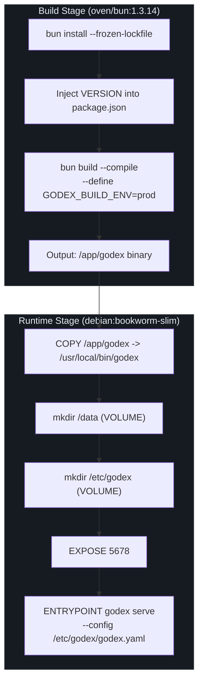
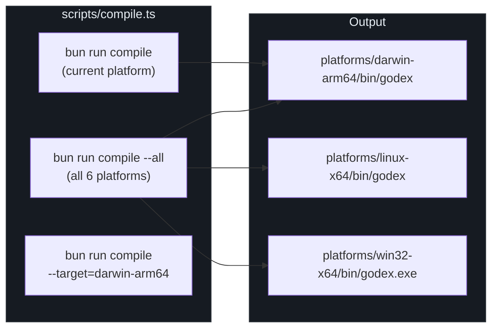
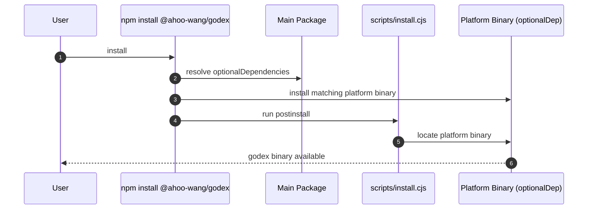

# Deployment

GodeX is designed for zero-dependency deployment: a single static binary that
exposes the OpenAI-compatible Responses API gateway. Three distribution
channels are supported -- a multi-stage Docker image, native compiled
binaries for six platform targets, and an npm package that automatically
selects the correct platform binary on install. The build system uses Bun's
`--compile` flag to produce self-contained executables, and the Docker image
uses a two-stage build to keep the runtime layer minimal.

## At a Glance

| Aspect | Detail |
|---|---|
| Runtime | Standalone binary (Bun compile) |
| Docker | Multi-stage: `oven/bun` build + `debian:bookworm-slim` runtime |
| Platforms | darwin-arm64, darwin-x64, linux-x64, linux-arm64, win32-x64, win32-arm64 |
| Default port | `GODEX_PORT=5678` |
| Config path | `/etc/godex/godex.yaml` (Docker) |
| Data volume | `/data` for sessions and trace |

## Docker Deployment



The Dockerfile at
[Dockerfile:1-53](https://github.com/Ahoo-Wang/GodeX/blob/main/Dockerfile#L1)
uses a two-stage build:

### Build Stage

| Step | Description |
|---|---|
| Base image | `oven/bun:1.3.14` |
| Dependency install | `bun install --frozen-lockfile --ignore-scripts` |
| Version injection | `sed` replaces version in `package.json` via `ARG VERSION` |
| Compilation | `bun build --compile` with target derived from `TARGETARCH` |
| Define | `GODEX_BUILD_ENV="prod"` baked into binary |

The `TARGETARCH` build argument is mapped to a Bun compile target at
[Dockerfile:22-28](https://github.com/Ahoo-Wang/GodeX/blob/main/Dockerfile#L22):
`amd64` -> `x64`, `arm64` -> `arm64`.

### Runtime Stage

| Aspect | Value |
|---|---|
| Base image | `debian:bookworm-slim` |
| Binary location | `/usr/local/bin/godex` |
| Data volume | `/data` (sessions, trace) |
| Config volume | `/etc/godex` |
| Default port | `5678` (env `GODEX_PORT`) |
| Entry point | `godex serve --config /etc/godex/godex.yaml` |

### Docker Usage

```bash
# Build
docker build --build-arg VERSION=1.0.0 -t godex .

# Run
docker run -d \
  -p 5678:5678 \
  -v /path/to/godex.yaml:/etc/godex/godex.yaml \
  -v godex-data:/data \
  godex
```

## Native Binary Compilation



The compile script at
[scripts/compile.ts:1-107](https://github.com/Ahoo-Wang/GodeX/blob/main/scripts/compile.ts#L1)
supports three modes:

| Mode | Command | Targets |
|---|---|---|
| Current platform | `bun run compile` | Matches `process.platform` + `process.arch` |
| All platforms | `bun run compile --all` | All six platforms |
| Specific target | `bun run compile --target=darwin-arm64` | One platform |

### Platform Matrix

Defined at
[scripts/compile.ts:11-42](https://github.com/Ahoo-Wang/GodeX/blob/main/scripts/compile.ts#L11):

| Platform | npm Package | Bun Target |
|---|---|---|
| macOS ARM64 | `@ahoo-wang/godex-darwin-arm64` | `bun-darwin-arm64` |
| macOS x64 | `@ahoo-wang/godex-darwin-x64` | `bun-darwin-x64` |
| Linux x64 | `@ahoo-wang/godex-linux-x64` | `bun-linux-x64` |
| Linux ARM64 | `@ahoo-wang/godex-linux-arm64` | `bun-linux-arm64` |
| Windows x64 | `@ahoo-wang/godex-win32-x64` | `bun-windows-x64` |
| Windows ARM64 | `@ahoo-wang/godex-win32-arm64` | `bun-windows-arm64` |

All builds inject `GODEX_BUILD_ENV="prod"` via `--define` at
[line 83](https://github.com/Ahoo-Wang/GodeX/blob/main/scripts/compile.ts#L83).

## npm Package Distribution



The `package.json` at
[package.json:1-75](https://github.com/Ahoo-Wang/GodeX/blob/main/package.json#L1)
declares platform-specific binaries as `optionalDependencies` at
[lines 49-55](https://github.com/Ahoo-Wang/GodeX/blob/main/package.json#L49):

```json
"optionalDependencies": {
  "@ahoo-wang/godex-darwin-arm64": "0.0.2",
  "@ahoo-wang/godex-darwin-x64": "0.0.2",
  "@ahoo-wang/godex-linux-x64": "0.0.2",
  "@ahoo-wang/godex-linux-arm64": "0.0.2",
  "@ahoo-wang/godex-win32-x64": "0.0.2",
  "@ahoo-wang/godex-win32-arm64": "0.0.2"
}
```

The `postinstall` script at
[line 45](https://github.com/Ahoo-Wang/GodeX/blob/main/package.json#L45)
runs `scripts/install.cjs` to locate and link the correct binary.

## Environment Variables

`EnvVars` at
[src/config/env.ts:15-30](https://github.com/Ahoo-Wang/GodeX/blob/main/src/config/env.ts#L15)
resolves the runtime environment from the compile-time `GODEX_BUILD_ENV` define:

| Variable | Purpose | Values |
|---|---|---|
| `GODEX_BUILD_ENV` | Compile-time env (baked into binary) | `prod`, `dev` (default) |
| `GODEX_PORT` | Default server port (Docker) | Default: `5678` |

The `Env` enum at
[src/config/env.ts:2-5](https://github.com/Ahoo-Wang/GodeX/blob/main/src/config/env.ts#L2)
exposes `EnvVars.isDev` and `EnvVars.isProd` for conditional behaviour
throughout the codebase.

## CI Pipeline

The `ci` script at
[package.json:42](https://github.com/Ahoo-Wang/GodeX/blob/main/package.json#L42)
runs the full validation chain:

```bash
bun run typecheck && biome ci src && bun run test && bun run test:e2e
```

| Step | Command | Purpose |
|---|---|---|
| Type check | `tsc --noEmit` | TypeScript correctness |
| Lint | `biome ci src` | Code style enforcement |
| Unit tests | `bun test` | All tests excluding E2E |
| E2E tests | `bun test src/e2e` | End-to-end integration |

The `check` script at
[line 41](https://github.com/Ahoo-Wang/GodeX/blob/main/package.json#L41)
is a pre-push gate: `typecheck + lint + test`.

### E2E Test Targets

| Command | Provider | Live Flag |
|---|---|---|
| `test:zhipu` | Zhipu (智谱) | `ZHIPU_LIVE_TESTS=1` |
| `test:deepseek` | DeepSeek | `DEEPSEEK_LIVE_TESTS=1` |
| `test:minimax` | MiniMax | `MINIMAX_LIVE_TESTS=1` |

## Cross-References

- [CLI](../01-getting-started/cli.md) -- `godex serve` and `godex init` commands
- [Configuration Schema](../07-configuration/config-schema.md) -- godex.yaml structure
- [Server Routes](../02-architecture/server-routes.md) -- what the deployed server exposes
- [CI/CD](./ci-cd.md) -- CI pipeline details

## References

- [Dockerfile](https://github.com/Ahoo-Wang/GodeX/blob/main/Dockerfile) -- multi-stage Docker build
- [package.json](https://github.com/Ahoo-Wang/GodeX/blob/main/package.json) -- npm package and scripts
- [scripts/compile.ts](https://github.com/Ahoo-Wang/GodeX/blob/main/scripts/compile.ts) -- native binary compilation
- [src/config/env.ts](https://github.com/Ahoo-Wang/GodeX/blob/main/src/config/env.ts) -- environment variable resolution
- [src/cli/serve.ts](https://github.com/Ahoo-Wang/GodeX/blob/main/src/cli/serve.ts) -- serve command and shutdown handlers
