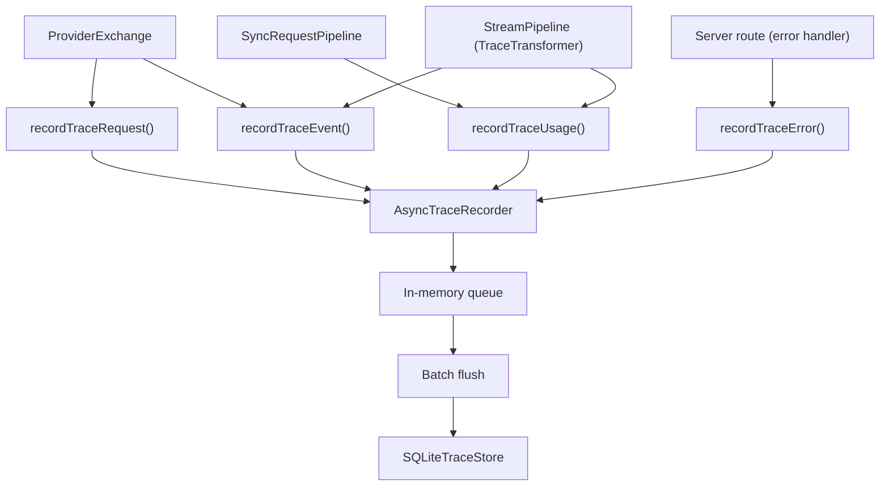
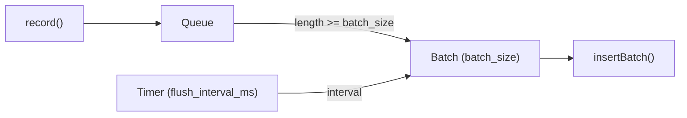

# Trace Recording

Trace recording is enabled by default and writes structured rows to SQLite. It captures the full lifecycle of each request — from the provider request through stream events to usage and errors — without affecting request latency.

## Architecture



## Record Types

The trace subsystem records four kinds of rows, all sharing `request_id`, `response_id`, `provider`, and `model` metadata:

### Request Records

Written when `ProviderExchange` sends the provider request.

| Field | Description |
|-------|-------------|
| `request_id` | Unique request identifier |
| `response_id` | Unique response identifier |
| `provider` | Provider name (e.g., `deepseek`) |
| `model` | Upstream model name |
| `stream` | Whether this is a streaming request |
| `requested_prompt_cache_key` | Client-side prompt cache key (if present) |
| `payload_hash` | SHA-256 hash of the request payload |
| `payload_bytes` | Size of the request payload in bytes |
| `payload_json` | Full payload JSON (only when `capture_payload: true`) |

### Usage Records

Written after a sync response completes or a stream finishes.

| Field | Description |
|-------|-------------|
| `input_tokens` | Tokens consumed from the prompt |
| `output_tokens` | Tokens generated in the response |
| `total_tokens` | Total tokens (input + output) |
| `cached_tokens` | Cache-hit tokens (when reported by upstream) |
| `reasoning_tokens` | Tokens spent on reasoning (when reported) |
| `cache_hit_ratio` | Ratio of cached to total input tokens |

### Event Records

Written at key points during request processing.

| Event Name | When Recorded |
|------------|---------------|
| `provider.request.body` | Before sending to upstream |
| `provider.response.body` | After receiving sync response |
| `upstream.stream.event.raw` | Raw SSE chunk from upstream |
| `upstream.stream.event.transformed` | After bridge kernel transforms |

Each event record includes an optional `sequence` number for ordering within a request.

### Error Records

Written when an error occurs during request processing.

| Field | Description |
|-------|-------------|
| `event_name` | Dot-separated event name (e.g., `responses.request.provider.error`) |
| `error_type` | JavaScript error class name |
| `domain` | GodeX error domain (`server`, `bridge`, `provider`, `session`) |
| `code` | Domain-specific error code |
| `message` | Human-readable error message |
| `status` | HTTP status code |

## Async Recorder

The `AsyncTraceRecorder` buffers records in an in-memory queue and flushes them to SQLite in batches:



- **`max_queue_size`**: Records are dropped and a warning is logged when the queue is full (default: 1000).
- **`batch_size`**: Number of records per batch insert (default: 50).
- **`flush_interval_ms`**: Maximum time between flushes (default: 1000ms).
- **Graceful shutdown**: `close()` waits for in-flight flushes before closing the store.

When trace is disabled (`trace.enabled: false`), a `NoopTraceRecorder` is used that discards all records with zero overhead.

## SQLite Schema

The trace database uses four tables with indexes optimized for request-level lookups:

```sql
trace_requests    — indexed on request_id, response_id
trace_usage       — indexed on request_id, response_id
trace_events      — indexed on (request_id, sequence), event_name
trace_errors      — indexed on request_id, response_id, code
```

The database file is auto-created at startup. Use `trace.path` to configure the location.

## Payload Capture

By default, payloads are summarized (hash + byte count only). Enable `trace.capture_payload: true` to store full JSON payloads up to `trace.payload_max_bytes`:

```yaml
trace:
  enabled: true
  path: ./data/trace.db
  capture_payload: true
  payload_max_bytes: 102400
```

Treat captured payloads as sensitive — they contain the full request and response content including user prompts.

## Configuration Reference

```yaml
trace:
  enabled: true                # Enable/disable trace recording
  path: ./data/trace.db        # SQLite database path
  max_queue_size: 1000         # Max records in memory queue before dropping
  flush_interval_ms: 1000      # Max ms between batch flushes
  batch_size: 50               # Records per batch insert
  capture_payload: false       # Store full JSON payloads
  payload_max_bytes: 102400    # Max payload JSON size in bytes
```

[Testing Guide](/08-testing/testing-guide)
