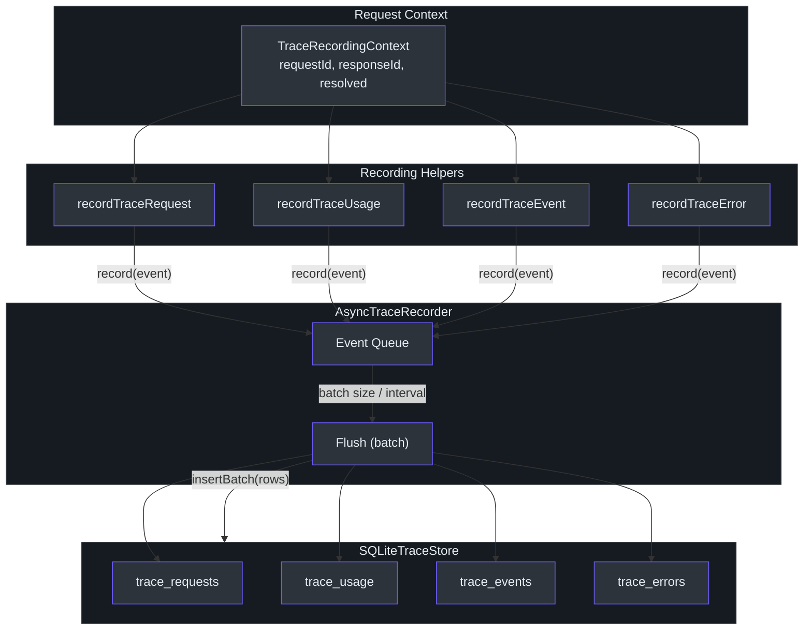
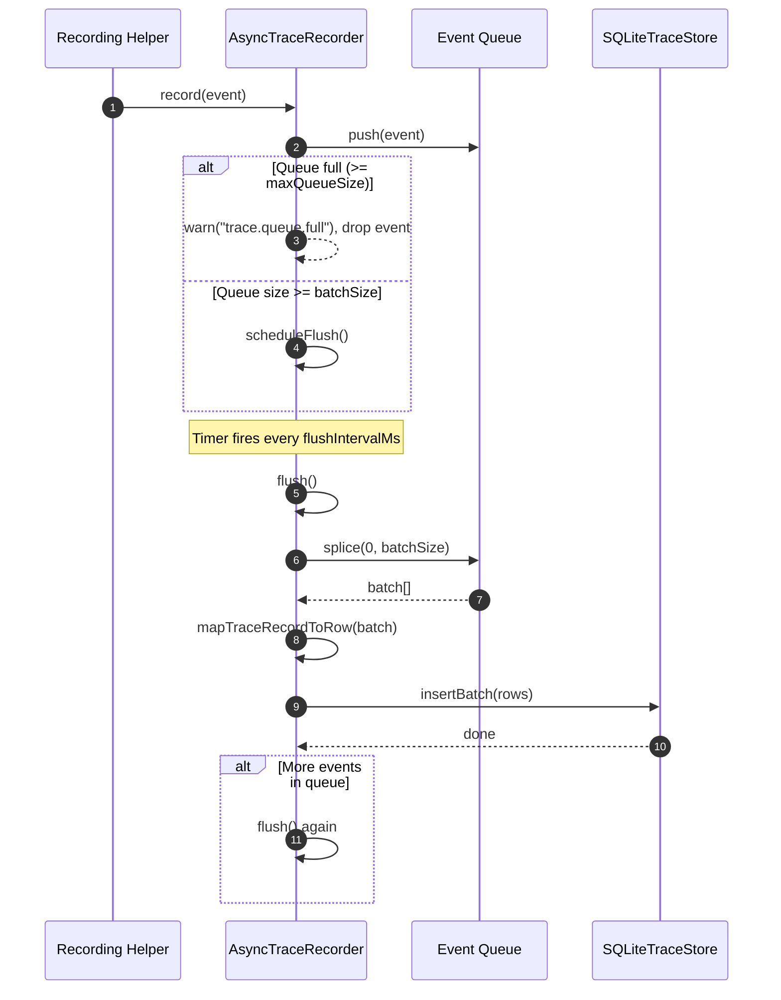
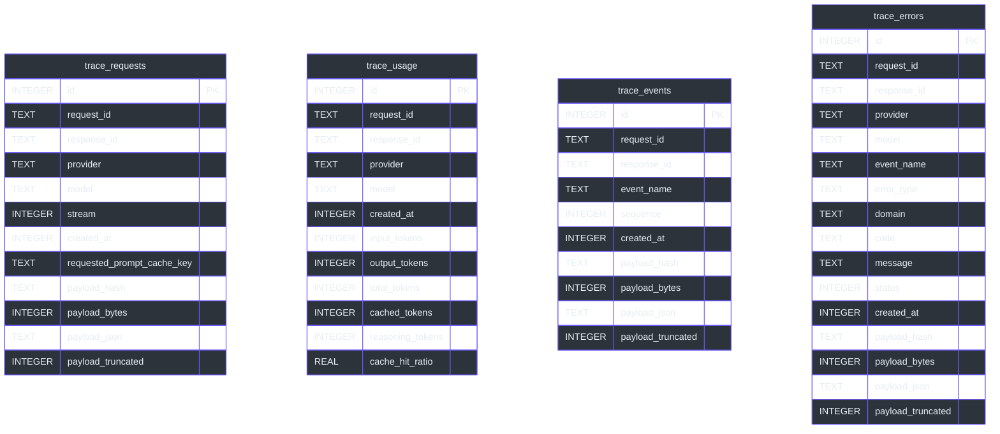
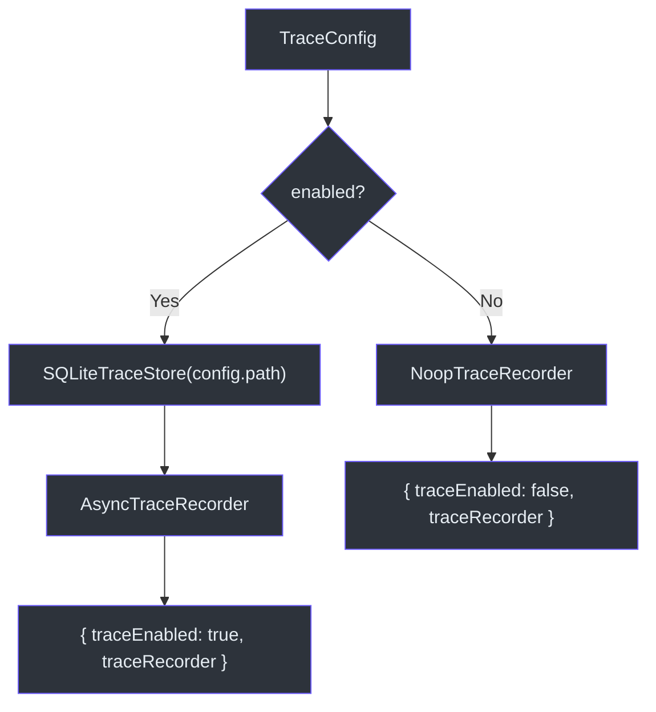

# Trace System

Observability is essential for any LLM gateway. GodeX's trace system captures every request, token usage event, streaming event, and error across the entire request lifecycle, persisting them to SQLite for offline analysis. The system is designed for production throughput: an `AsyncTraceRecorder` batches events in a queue and flushes them periodically or when the batch size threshold is reached, keeping the hot path free from disk I/O. When tracing is disabled, a `NoopTraceRecorder` replaces the real one at zero cost.

The trace system is attached to the `ResponsesContext` via `TraceRecordingContext`, so any code that has access to the context can emit trace records without knowing about the storage backend.

## At a Glance

| Component | File | Purpose |
|---|---|---|
| `TraceRecorder` | [recorder.ts:5-8](https://github.com/Ahoo-Wang/GodeX/blob/main/src/trace/recorder.ts#L5) | Core interface (`record`, `close`) |
| `AsyncTraceRecorder` | [recorder.ts:30-110](https://github.com/Ahoo-Wang/GodeX/blob/main/src/trace/recorder.ts#L30) | Queue-based batching recorder |
| `NoopTraceRecorder` | [recorder.ts:25-28](https://github.com/Ahoo-Wang/GodeX/blob/main/src/trace/recorder.ts#L25) | Zero-op recorder when tracing is disabled |
| `SQLiteTraceStore` | [sqlite.ts:69-297](https://github.com/Ahoo-Wang/GodeX/blob/main/src/trace/sqlite.ts#L69) | SQLite storage with four tables |
| `TraceRecordEvent` | [types.ts:70-74](https://github.com/Ahoo-Wang/GodeX/blob/main/src/trace/types.ts#L70) | Union of all record kinds |
| `mapTraceRecordToRow` | [row-mapper.ts:16-98](https://github.com/Ahoo-Wang/GodeX/blob/main/src/trace/row-mapper.ts#L16) | Converts events to storage rows |
| `summarizePayload` | [payload.ts:10-35](https://github.com/Ahoo-Wang/GodeX/blob/main/src/trace/payload.ts#L10) | SHA-256 hash, byte count, optional JSON capture |
| `TraceRecordingContext` | [context.ts:4-12](https://github.com/Ahoo-Wang/GodeX/blob/main/src/trace/context.ts#L4) | Context attached to every request |
| `createTraceServices` | [trace-services.ts:15-34](https://github.com/Ahoo-Wang/GodeX/blob/main/src/context/trace-services.ts#L15) | Factory from config |

## Architecture Overview

## TraceRecorder Interface

The `TraceRecorder` interface ([recorder.ts:5-8](https://github.com/Ahoo-Wang/GodeX/blob/main/src/trace/recorder.ts#L5)) is minimal by design:

| Method | Description |
|---|---|
| `record(event)` | Enqueue a trace event for persistence |
| `close()` | Flush remaining events and release resources |

## AsyncTraceRecorder

The production recorder ([recorder.ts:30-110](https://github.com/Ahoo-Wang/GodeX/blob/main/src/trace/recorder.ts#L30)) uses an in-memory queue with two flush triggers:

### Configuration Options

| Option | Type | Description |
|---|---|---|
| `maxQueueSize` | `number` | Maximum events in queue; overflow is dropped |
| `batchSize` | `number` | Number of events per flush |
| `flushIntervalMs` | `number` | Timer interval for automatic flushing |
| `store` | `TraceStoreWriter` | Storage backend (typically `SQLiteTraceStore`) |
| `logger` | `TraceRecorderLogger` | For warning about drops and errors |
| `capturePayload` | `boolean` | Whether to store full JSON payloads |
| `payloadMaxBytes` | `number` | Byte limit for stored payloads |

## SQLiteTraceStore

The SQLite store ([sqlite.ts:69-297](https://github.com/Ahoo-Wang/GodeX/blob/main/src/trace/sqlite.ts#L69)) auto-migrates four tables on construction:

### Schema

Batch inserts are wrapped in a transaction ([sqlite.ts:90-95](https://github.com/Ahoo-Wang/GodeX/blob/main/src/trace/sqlite.ts#L90)) for atomicity. Indexes are created on `request_id`, `response_id`, `event_name`, and `code` for common query patterns.

## Trace Record Types

The `TraceRecordEvent` union ([types.ts:70-74](https://github.com/Ahoo-Wang/GodeX/blob/main/src/trace/types.ts#L70)) has four variants:

| Kind | Interface | Key Fields |
|---|---|---|
| `request` | `TraceRequestRecordEvent` | `stream`, `requested_prompt_cache_key`, `payload` |
| `usage` | `TraceUsageRecordEvent` | `usage` (input_tokens, output_tokens, total_tokens, cached_tokens, reasoning_tokens, cache_hit_ratio) |
| `event` | `TraceEventRecordEvent` | `event_name`, `sequence`, `payload` |
| `error` | `TraceErrorRecordEvent` | `event_name`, `error_type`, `domain`, `code`, `message`, `status`, `payload` |

All variants share a `TraceRecordBase` ([types.ts:19-25](https://github.com/Ahoo-Wang/GodeX/blob/main/src/trace/types.ts#L19)) with `request_id`, `response_id`, `provider`, `model`, and `created_at`.

### Event Names

The `TraceEventRecordEvent` restricts `event_name` ([types.ts:50-54](https://github.com/Ahoo-Wang/GodeX/blob/main/src/trace/types.ts#L50)) to:

| Event Name | When Recorded |
|---|---|
| `provider.request.prepared` | Final provider request has been patched and is about to enter the provider client; no request body is stored on this event |
| `provider.response.body` | Sync response body received from upstream |
| `upstream.stream.event.raw` | Raw SSE chunk from upstream |
| `upstream.stream.event.transformed` | After bridge transforms are applied |

Provider request payloads are stored on `trace_requests`, not duplicated in `trace_events`. Join the request row with `provider.request.prepared` to see both the final patched request summary and the lifecycle point that preceded the provider client call. The `prepared` event is recorded after provider `patchRequest` hooks run and before `request()` or `stream()` invokes the provider client's HTTP operation; it does not prove that the network send succeeded.

## Payload Capture

`summarizePayload` ([payload.ts:10-35](https://github.com/Ahoo-Wang/GodeX/blob/main/src/trace/payload.ts#L10)) controls how much data is stored:

| Mode | `capturePayload` | `payload_json` | `payload_hash` |
|---|---|---|---|
| Summary only | `false` | `null` | SHA-256 hex of the full JSON |
| Full capture | `true` | Full JSON string (up to `payloadMaxBytes`) | SHA-256 hex |
| Truncated capture | `true` | Truncated JSON string | SHA-256 hex |

The `payload_bytes` field always records the original byte length regardless of truncation ([payload.ts:23-24](https://github.com/Ahoo-Wang/GodeX/blob/main/src/trace/payload.ts#L23)). The hash is computed with `Bun.CryptoHasher("sha256")` ([payload.ts:6-8](https://github.com/Ahoo-Wang/GodeX/blob/main/src/trace/payload.ts#L6)).

## Row Mapping

`mapTraceRecordToRow` ([row-mapper.ts:16-98](https://github.com/Ahoo-Wang/GodeX/blob/main/src/trace/row-mapper.ts#L16)) dispatches on `event.kind`:

| Kind | Target Table | Payload Handling |
|---|---|---|
| `request` | `trace_requests` | Summarized with `summarizePayload` |
| `usage` | `trace_usage` | Fields extracted directly from `TraceUsageSnapshot` |
| `event` | `trace_events` | Summarized with `summarizePayload` |
| `error` | `trace_errors` | Summarized with `summarizePayload` |

If serialization fails for any event, the mapper returns `null` and logs a warning instead of crashing the flush ([row-mapper.ts:91-97](https://github.com/Ahoo-Wang/GodeX/blob/main/src/trace/row-mapper.ts#L91)).

## Recording Helpers

Four helper functions attach to the `TraceRecordingContext` and provide ergonomic recording:

### recordTraceRequest

[request-recorder.ts:4-22](https://github.com/Ahoo-Wang/GodeX/blob/main/src/trace/request-recorder.ts#L4) records the final patched provider request after provider hooks have run, including whether it is streaming, the optional `prompt_cache_key`, and an optional captured payload summary for the provider request body. The paired `provider.request.prepared` trace event marks the lifecycle point without carrying the request body again.

### recordTraceUsage

[usage-recorder.ts:6-22](https://github.com/Ahoo-Wang/GodeX/blob/main/src/trace/usage-recorder.ts#L6) converts a `ResponseUsage` into a `TraceUsageSnapshot` via `traceUsageFromResponseUsage` ([usage.ts:4-23](https://github.com/Ahoo-Wang/GodeX/blob/main/src/trace/usage.ts#L4)), which also computes `cache_hit_ratio` as `cached_tokens / input_tokens` when both are available.

### recordTraceEvent

[event-recorder.ts:5-25](https://github.com/Ahoo-Wang/GodeX/blob/main/src/trace/event-recorder.ts#L5) records a named event with an optional payload and sequence number for ordering within a stream.

### recordTraceError

[error-recorder.ts:5-27](https://github.com/Ahoo-Wang/GodeX/blob/main/src/trace/error-recorder.ts#L5) extracts error metadata (type, domain, code, message, status) from `GodeXError` or generic errors and records it with the full error context as payload.

## Service Wiring

`createTraceServices` ([trace-services.ts:15-34](https://github.com/Ahoo-Wang/GodeX/blob/main/src/context/trace-services.ts#L15)) reads the `TraceConfig` and creates either an `AsyncTraceRecorder` backed by `SQLiteTraceStore` (when `config.enabled` is true) or a `NoopTraceRecorder` (when false):

## Cross-references

- [Session Stores](../04-session-management/session-stores.md) -- the session store system uses a similar SQLite persistence pattern
- [ProviderSpec Contract](../03-provider-development/provider-spec.md) -- the provider and model fields in trace records come from the resolved spec

## References

- [src/trace/recorder.ts](https://github.com/Ahoo-Wang/GodeX/blob/main/src/trace/recorder.ts) -- `TraceRecorder`, `AsyncTraceRecorder`, `NoopTraceRecorder`
- [src/trace/sqlite.ts](https://github.com/Ahoo-Wang/GodeX/blob/main/src/trace/sqlite.ts) -- `SQLiteTraceStore`, schema migration
- [src/trace/types.ts](https://github.com/Ahoo-Wang/GodeX/blob/main/src/trace/types.ts) -- all trace record event types
- [src/trace/context.ts](https://github.com/Ahoo-Wang/GodeX/blob/main/src/trace/context.ts) -- `TraceRecordingContext`
- [src/trace/request-recorder.ts](https://github.com/Ahoo-Wang/GodeX/blob/main/src/trace/request-recorder.ts) -- `recordTraceRequest`
- [src/trace/usage-recorder.ts](https://github.com/Ahoo-Wang/GodeX/blob/main/src/trace/usage-recorder.ts) -- `recordTraceUsage`
- [src/trace/event-recorder.ts](https://github.com/Ahoo-Wang/GodeX/blob/main/src/trace/event-recorder.ts) -- `recordTraceEvent`
- [src/trace/error-recorder.ts](https://github.com/Ahoo-Wang/GodeX/blob/main/src/trace/error-recorder.ts) -- `recordTraceError`
- [src/trace/row-mapper.ts](https://github.com/Ahoo-Wang/GodeX/blob/main/src/trace/row-mapper.ts) -- `mapTraceRecordToRow`
- [src/trace/payload.ts](https://github.com/Ahoo-Wang/GodeX/blob/main/src/trace/payload.ts) -- `summarizePayload`, `sha256Hex`
- [src/trace/usage.ts](https://github.com/Ahoo-Wang/GodeX/blob/main/src/trace/usage.ts) -- `traceUsageFromResponseUsage`
- [src/trace/time.ts](https://github.com/Ahoo-Wang/GodeX/blob/main/src/trace/time.ts) -- `nowTraceMillis`
- [src/context/trace-services.ts](https://github.com/Ahoo-Wang/GodeX/blob/main/src/context/trace-services.ts) -- `createTraceServices`
