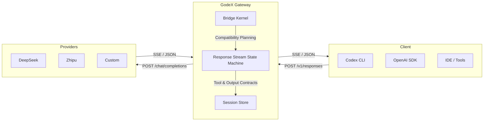

## How It Works



GodeX sits between your tools and upstream model providers. It accepts OpenAI Responses API requests, translates them to Chat Completions API calls via the bridge kernel and provider specs, and streams results back — preserving the full protocol semantics that Codex expects.

## Quick Start

```bash
# Install — no Bun required at runtime
npm install -g @ahoo-wang/godex

# Create config interactively
godex init

# Start the gateway
godex serve
```

Point Codex CLI at your GodeX instance:

```bash
export OPENAI_BASE_URL=http://localhost:5678/v1
export OPENAI_API_KEY=any-value
codex
```

---

::: info
Read the full [Getting Started guide](/01-getting-started/overview) or explore the [Architecture](/02-architecture/overview).
:::
