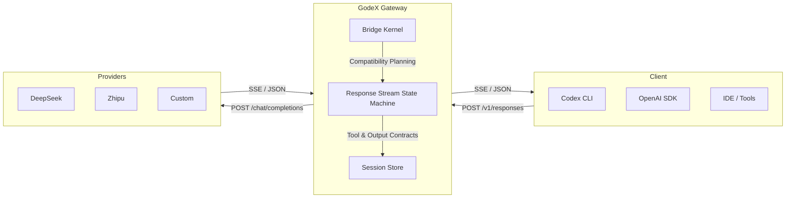

## How It Works



GodeX sits between your tools and upstream model providers. It accepts OpenAI Responses API requests, translates them to Chat Completions API calls via the bridge kernel and provider specs, and streams results back — preserving the full protocol semantics that Codex expects.

## Quick Start

```bash
# Install — no Bun required at runtime
npm install -g @ahoo-wang/godex

# Create config interactively
godex init

# Start the gateway
godex serve
```

Point Codex CLI at your GodeX instance:

```bash
export OPENAI_BASE_URL=http://localhost:5678/v1
export OPENAI_API_KEY=any-value
codex
```

---

::: info
Read the full [Getting Started guide](/01-getting-started/overview) or explore the [Architecture](/02-architecture/architecture-overview).
:::

## Documentation Map

| Section | Description | Start Here |
|---------|-------------|------------|
| [Getting Started](/01-getting-started/overview) | Overview, quick start, config, providers | [Overview](/01-getting-started/overview) |
| [Architecture](/02-architecture/architecture-overview) | End-to-end request flow, core types | [Architecture Overview](/02-architecture/architecture-overview) |
| [Bridge Kernel](/02-architecture/compatibility) | Compatibility, request/response, tools, output | [Compatibility](/02-architecture/compatibility) |
| [Responses Pipeline](/02-architecture/sync-pipeline) | Sync and streaming orchestration | [Sync Pipeline](/02-architecture/sync-pipeline) |
| [Provider Development](/03-provider-development/provider-spec) | How to add a new LLM provider | [Provider Spec](/03-provider-development/provider-spec) |
| [Session Management](/04-session-management/session-stores) | Multi-turn conversation support | [Session Stores](/04-session-management/session-stores) |
| [Trace System](/10-trace/trace-system) | Request tracing and observability | [Trace System](/10-trace/trace-system) |
| [Error Handling](/06-error-handling/error-handling) | Error hierarchy and propagation | [Error Handling](/06-error-handling/error-handling) |
| [CLI](/01-getting-started/cli) | Command-line interface reference | [CLI](/01-getting-started/cli) |
| [Deployment](/09-deployment/deployment) | Docker, native binary, CI/CD | [Deployment](/09-deployment/deployment) |
| [Onboarding](/onboarding/contributor-guide) | Audience-tailored guides | [Contributor Guide](/onboarding/contributor-guide) |

## Key Files

| File | Responsibility | Source |
|------|---------------|--------|
| `src/index.ts` | Entry point — delegates to CLI | [src/index.ts:1-5](https://github.com/Ahoo-Wang/GodeX/blob/main/src/index.ts#L1-L5) |
| `src/server/server.ts` | Bun HTTP server, route map | [src/server/server.ts:21-51](https://github.com/Ahoo-Wang/GodeX/blob/main/src/server/server.ts#L21-L51) |
| `src/responses/runtime.ts` | Bridge runtime, pipeline wiring | [src/responses/runtime.ts:19-41](https://github.com/Ahoo-Wang/GodeX/blob/main/src/responses/runtime.ts#L19-L41) |
| `src/bridge/request/request-builder.ts` | Responses → Chat Completions | [src/bridge/request/request-builder.ts:54-92](https://github.com/Ahoo-Wang/GodeX/blob/main/src/bridge/request/request-builder.ts#L54-L92) |
| `src/bridge/provider-spec/contract.ts` | ProviderSpec and ProviderEdge types | [src/bridge/provider-spec/contract.ts:54-94](https://github.com/Ahoo-Wang/GodeX/blob/main/src/bridge/provider-spec/contract.ts#L54-L94) |
| `src/providers/builtin.ts` | Built-in provider registry | [src/providers/builtin.ts:37-55](https://github.com/Ahoo-Wang/GodeX/blob/main/src/providers/builtin.ts#L37-L55) |
| `src/session/types.ts` | Session store interface | [src/session/types.ts:99-121](https://github.com/Ahoo-Wang/GodeX/blob/main/src/session/types.ts#L99-L121) |
| `src/config/schema.ts` | Configuration type definitions | [src/config/schema.ts:62-71](https://github.com/Ahoo-Wang/GodeX/blob/main/src/config/schema.ts#L62-L71) |
| `src/error/godex-error.ts` | Base error class hierarchy | [src/error/godex-error.ts:2-35](https://github.com/Ahoo-Wang/GodeX/blob/main/src/error/godex-error.ts#L2-L35) |

## Tech Stack

| Technology | Purpose | Version |
|-----------|---------|---------|
| [Bun](https://bun.sh) | Runtime, test runner, SQLite, binary compilation | >=1.2 |
| TypeScript | Language (strict, ESNext, ESM) | ^6 |
| [Biome](https://biomejs.dev) | Formatting and linting | ^2.4 |
| [Commander.js](https://github.com/tj/commander.js) | CLI framework | ^15 |
| [LogTape](https://logtape.org) | Structured logging | ^2.1 |
| SQLite | Sessions and trace storage | built-in |
| [fetcher](https://github.com/Ahoo-Wang/fetcher) | HTTP client with SSE | ^3.16 |
