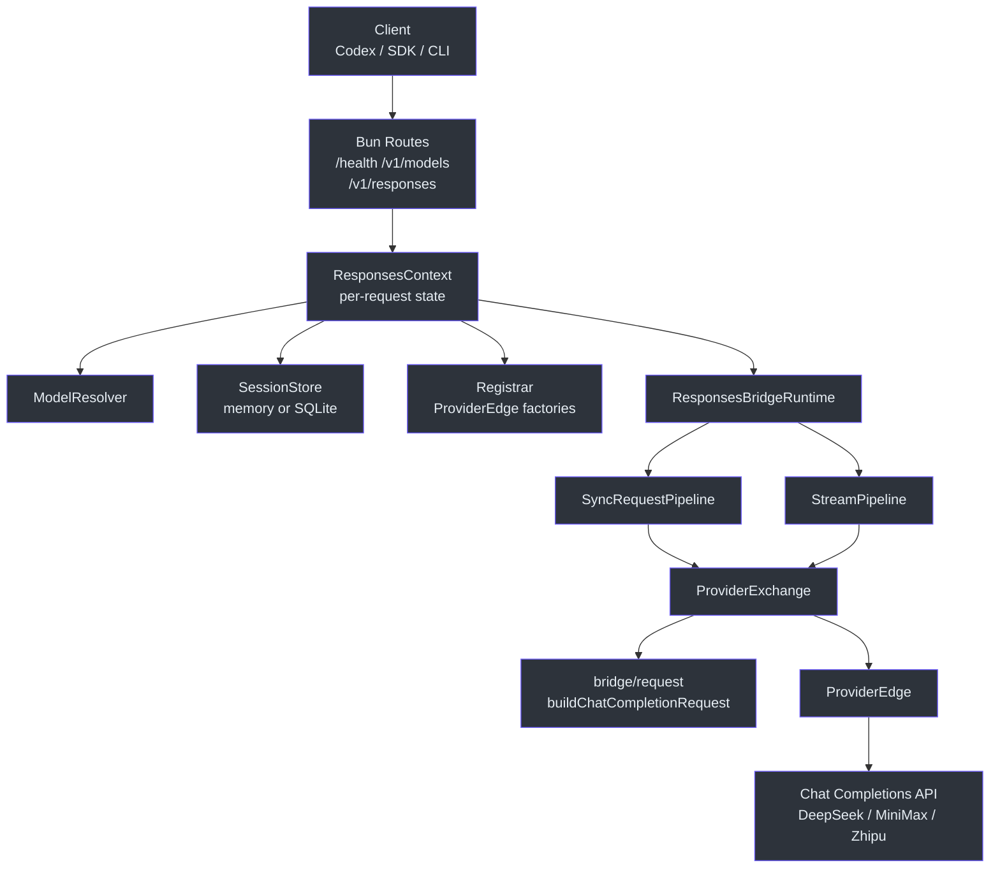
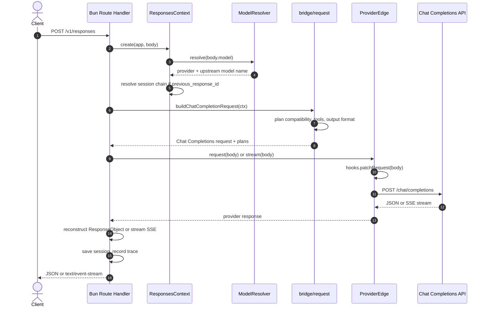
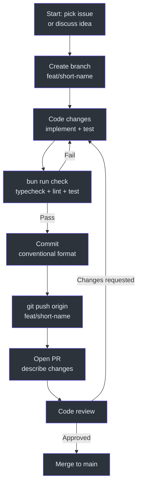

# Contributor Guide

This guide walks you from cloning GodeX to landing your first pull request. You should be comfortable with TypeScript or JavaScript and have basic HTTP/REST knowledge.

## Part I: Foundations

### TypeScript for JavaScript Engineers

GodeX is written in TypeScript running on Bun. If you know JavaScript, the key additions are:

| Concept | JavaScript | TypeScript |
|---------|-----------|------------|
| Type annotation | None | `const x: string = "hello"` |
| Interface | N/A | `interface User { name: string; age?: number }` |
| Union type | N/A | `type Result = Success \| Error` |
| Generic | N/A | `function first<T>(arr: T[]): T \| undefined` |
| Enum | Object constant | `enum Direction { Up, Down }` |
| Readonly | `Object.freeze()` | `interface Config { readonly port: number }` |

GodeX relies heavily on `readonly` interfaces for immutability and discriminated unions for protocol types. Example from `src/protocol/openai/responses.ts`:

```typescript
// Discriminated union — check `type` to narrow
type ResponseStreamEvent =
  | { type: "response.created"; response: ResponseObject }
  | { type: "response.output_text.delta"; delta: string }
  | { type: "response.completed"; response: ResponseObject };
```

### Bun for Node.js Engineers

Bun is the runtime — not Node. Key differences:

| Feature | Node.js | Bun |
|---------|---------|-----|
| Package manager | npm/yarn/pnpm | `bun install` (built-in) |
| Test runner | jest/vitest | `bun test` (built-in) |
| SQLite | better-sqlite3 | `bun:sqlite` (built-in) |
| Hot reload | nodemon | `bun --hot` (built-in) |
| Fetch API | node-fetch polyfill | Native |
| `ReadableStream` | Polyfill | Native, zero-copy |
| Start time | ~200ms | ~10ms |

GodeX uses Bun's native `ReadableStream` and `TransformStream` for the streaming pipeline — no polyfills or external libraries.

### OpenAI Responses API

The Responses API is the wire protocol GodeX exposes. It differs from Chat Completions:

| Aspect | Chat Completions (`/v1/chat/completions`) | Responses (`/v1/responses`) |
|--------|------------------------------------------|----------------------------|
| Input | `messages: Message[]` | `input: string \| InputItem[]` |
| Tools | `tools: { type: "function" }[]` | `tools: { type: "function" \| "local_shell" \| ... }[]` |
| Tool choice | `tool_choice: "auto" \| ...` | `tool_choice: "auto" \| ...` (same) |
| Session | Manual message arrays | `previous_response_id` chain |
| Output | `choices[].message` | `output: OutputItem[]` |
| Streaming | `text/event-stream` with `data: {...}` | Same SSE format, different event names |

GodeX's core job: accept Responses requests, translate to Chat Completions, call upstream, translate back.

## Part II: This Codebase

### The Big Picture

GodeX is a protocol-translation gateway. A single Bun HTTP server receives OpenAI Responses API calls and routes them through provider-specific adapters to Chat Completions upstreams.

Core entities:

| Entity | Location | Responsibility |
|--------|----------|----------------|
| `ProviderSpec` | `src/bridge/provider-spec/contract.ts` | Declares provider capabilities and hooks |
| `ProviderEdge` | `src/bridge/provider-spec/contract.ts` | Runtime boundary for request/stream |
| `ApplicationContext` | `src/context/application-context.ts` | DI container for config, session, trace |
| `ResponsesContext` | `src/context/responses-context.ts` | Per-request state (model, provider, session) |
| `ModelResolver` | `src/resolver/model-resolver.ts` | Maps model selectors to provider + upstream model |
| `CompatibilityPlan` | `src/bridge/compatibility/compatibility-plan.ts` | Planned parameter adaptations |
| `ResponseStreamStateMachine` | `src/bridge/stream/response-stream-state-machine.ts` | Converts Chat delta events to Responses SSE |

Architecture diagram:

<!-- Sources: src/context/application-context.ts, src/bridge/provider-spec/contract.ts, src/resolver/model-resolver.ts -->


### Project Structure

```
src/
├── cli/              Commander CLI (serve, config, init)
├── config/           godex.yaml schema, env interpolation, defaults
├── context/          ApplicationContext (DI), ResponsesContext (per-request)
├── bridge/           Provider-agnostic Responses-to-Chat bridge kernel
│   ├── compatibility/  Parameter and response-format compatibility planning
│   ├── request/        Input normalization and message building
│   ├── tools/          Tool declarations, tool_choice, identity mapping
│   ├── output/         Structured-output contract planning and validation
│   ├── response/       Sync ResponseObject reconstruction
│   ├── stream/         Stream state machine and delta mapping
│   ├── provider-spec/  ProviderSpec, ProviderEdge, factory helpers
│   └── finish-reason/  Provider finish reason mapping
├── providers/        Provider registry, specs, hooks, clients
│   ├── deepseek/      DeepSeek provider
│   ├── minimax/       MiniMax provider
│   ├── zhipu/         Zhipu provider
│   ├── example/       Spec-only example provider
│   └── shared/        Shared provider utilities (ChatProviderClient, etc.)
├── responses/        Sync and stream orchestration pipelines
│   └── stream-transforms/  Composable TransformStream stages
├── server/           Bun routes for /health, /v1/models, /v1/responses
├── resolver/         ModelResolver (model selector to provider + model)
├── session/          Memory and SQLite response session stores
├── trace/            SQLite trace recorder and usage/error/event mappers
├── error/            GodeXError hierarchy with domain codes
├── protocol/         OpenAI protocol type definitions
├── tools/            Built-in tool definitions (shell, apply_patch, etc.)
└── e2e/              End-to-end tests with mocked upstream
```

### Data Flow: A Request's Journey

When a `POST /v1/responses` arrives:

<!-- Sources: src/server/routes.ts, src/context/responses-context.ts, src/responses/ -->


Step-by-step:

1. **Route handler** (`src/server/`) parses the JSON body and validates the envelope.
2. **ResponsesContext** (`src/context/responses-context.ts`) is created per-request with resolved model, provider, and optional session chain.
3. **ModelResolver** (`src/resolver/model-resolver.ts`) maps the client's model selector (alias, `provider/model`, or bare name) to a provider name and upstream model.
4. **Bridge request builder** (`src/bridge/request/request-builder.ts`) builds a Chat Completions request:
   - `input-normalizer.ts` converts Responses `input` to Chat `messages`
   - `tool-plan.ts` plans tool degradation and identity mapping
   - `compatibility/planner.ts` plans parameter filtering based on `ProviderCapabilities`
   - `output/output-contract.ts` plans structured output handling
5. **ProviderEdge** (`src/bridge/provider-spec/`) calls the upstream:
   - Applies `hooks.patchRequest()` for provider-specific adjustments
   - Sends via `ChatProviderClient` (`src/providers/shared/`)
6. **Response reconstruction** (`src/bridge/response/` or `src/bridge/stream/`) converts the upstream response back to Responses format.
7. **Stream transforms** (`src/responses/stream-transforms/`) apply composable stages: trace, validate output, log, persist session, diagnostics.
8. **Session store** saves the response if `store !== false`.

### Key Pattern: ProviderSpec

Every provider follows the same shape. The spec declares capabilities; hooks handle provider-specific quirks.

From [src/bridge/provider-spec/contract.ts](https://github.com/Ahoo-Wang/GodeX/blob/main/src/bridge/provider-spec/contract.ts):

```typescript
interface ProviderSpec<TBridgeReq, TResponse, TChunk, TProviderReq> {
  readonly name: string;
  readonly protocol: ProviderProtocol;
  readonly capabilities: ProviderCapabilities;
  readonly endpoint: ProviderEndpointSpec;
  readonly auth: ProviderAuthSpec;
  readonly toolName: ToolNameCodec;
  readonly response: ChatCompletionResponseAccessor<TResponse>;
  readonly stream: ChatCompletionStreamAccessor<TChunk>;
  readonly hooks?: ProviderHooks<...>;
}
```

Key capabilities (from `src/bridge/compatibility/`):

| Capability | What it controls |
|-----------|-----------------|
| `reasoning` | Whether provider supports reasoning effort |
| `tool_choice_modes` | Supported tool_choice values: `"auto"`, `"none"`, `"required"`, `"function"` |
| `response_formats` | Supported formats: `"text"`, `"json_object"` |
| `supports_stream_usage` | Whether provider returns usage in stream chunks |
| `supports_cached_tokens` | Whether provider reports cached tokens in usage |

### Key Pattern: Tool Identity

Codex sends built-in tool types like `local_shell` and `apply_patch`. Most providers only support `function` type tools. GodeX handles this:

1. **Degradation** (`src/bridge/tools/tool-plan.ts`): Codex tool types are converted to `function` with known names.
2. **Declaration rendering** (`src/bridge/tools/declaration-renderer.ts`): Tool definitions are rendered as Chat Completions `function` objects.
3. **Identity restoration** (`src/bridge/tools/call-restorer.ts`): When the upstream returns a `function` call, GodeX maps it back to the original Codex type (e.g., `local_shell` → `local_shell_call` with structured `action`).

### Key Pattern: Stream Pipeline

The streaming pipeline uses composable `TransformStream` stages:

```mermaid
graph LR
  Upstream["Upstream SSE<br>Chat Completions chunks"] --> Bridge["Bridge Transform<br>state machine maps deltas"]
  Bridge --> Validate["Output Validator<br>check json_object"]
  Validate --> Trace["Trace Transform<br>record events + usage"]
  Trace --> Log["Log Transform<br>structured logging"]
  Log --> Persist["Session Persist<br>save completed response"]
  Persist --> Diag["Diagnostics Transform<br>timings and counts"]
  Diag --> SSE["SSE Encode<br>Responses event stream"]

  style Upstream fill:#2d333b,stroke:#6d5dfc,color:#e6edf3
  style Bridge fill:#2d333b,stroke:#6d5dfc,color:#e6edf3
  style Validate fill:#2d333b,stroke:#6d5dfc,color:#e6edf3
  style Trace fill:#2d333b,stroke:#6d5dfc,color:#e6edf3
  style Log fill:#2d333b,stroke:#6d5dfc,color:#e6edf3
  style Persist fill:#2d333b,stroke:#6d5dfc,color:#e6edf3
  style Diag fill:#2d333b,stroke:#6d5dfc,color:#e6edf3
  style SSE fill:#2d333b,stroke:#6d5dfc,color:#e6edf3
```

<!-- Sources: src/responses/stream-transforms/, src/bridge/stream/response-stream-state-machine.ts -->


Each transform is an independent `TransformStream`. They compose by piping through each other. The state machine (`ResponseStreamStateMachine`) converts Chat delta format to Responses delta format.

### Key Pattern: Session Chain

When a request includes `previous_response_id`, GodeX:

1. Looks up the stored response from the session store (memory or SQLite).
2. Extracts the `output` items and original request.
3. Converts them into Chat Completions message history.
4. Prepends them to the current request's messages.

The chain supports cycle detection and maximum depth to prevent unbounded growth. Session storage is abstracted behind `ResponseSessionStore` in `src/session/`.

### Error Handling

Errors use a domain-specific hierarchy (`src/error/`):

| Error Class | Domain | When |
|-------------|--------|------|
| `GodeXError` | Base | All GodeX errors |
| `ServerError` | `server` | Route-level failures (invalid JSON, unknown route) |
| `BridgeError` | `bridge` | Translation failures (incompatible parameters) |
| `ProviderError` | `provider` | Upstream failures (HTTP errors, timeouts) |
| `SessionError` | `session` | Chain resolution failures (not found, cycle detected) |

Each error includes structured context (provider name, model, upstream status) for trace correlation.

## Part III: Getting Productive

### Development Environment Setup

| Tool | Version | Install |
|------|---------|---------|
| Bun | >= 1.2 | `curl -fsSL https://bun.sh/install \| bash` |
| Git | >= 2.40 | System package manager |
| curl | Any | For manual API testing |

Setup steps:

```bash
git clone https://github.com/Ahoo-Wang/GodeX.git
cd GodeX
bun install
bun run check    # typecheck + lint + test
```

Expected `bun run check` output: all checks pass with 0 errors.

### Your First Task: Add a Provider Feature Flag

This walkthrough adds a hypothetical `supports_parallel_tool_calls` capability flag to an existing provider.

**Step 1**: Define the capability in the provider's `spec.ts`:

```typescript
// src/providers/minimax/spec.ts — already uses MINIMAX_SPEC_CAPABILITIES
// The capabilities object is defined in hooks.ts
```

**Step 2**: Add the flag to the provider's capabilities in `hooks.ts`:

```typescript
// src/providers/minimax/hooks.ts
export const MINIMAX_SPEC_CAPABILITIES: ProviderCapabilities = {
  // ... existing flags ...
  supports_parallel_tool_calls: false, // MiniMax doesn't support this
};
```

**Step 3**: Use the flag in the bridge compatibility planner:

```typescript
// src/bridge/compatibility/planner.ts
// Check ctx.provider.spec.capabilities.supports_parallel_tool_calls
// If false, strip parallel_tool_calls from the request
```

**Step 4**: Write tests. Add a unit test in the provider's test file:

```typescript
// Test that parallel_tool_calls is stripped when not supported
```

**Step 5**: Run the quality gates:

```bash
bun run typecheck   # TypeScript type checking
bun run lint        # Biome lint
bun run test        # Unit and integration tests
```

**Step 6**: Commit with conventional format:

```bash
git commit -m "feat(bridge): add supports_parallel_tool_calls capability flag"
```

### Development Workflow

<!-- Sources: package.json scripts -->


Commit format: `type(scope): description` where type is `feat`, `fix`, `refactor`, `test`, `docs`, or `chore`.

### Running Tests

```bash
bun run test              # All unit + integration tests (excludes e2e)
bun run test:e2e          # Mocked end-to-end tests
bun run test:deepseek     # Live DeepSeek tests (needs DEEPSEEK_API_KEY)
bun run test:minimax      # Live MiniMax tests (needs MINIMAX_API_KEY)
bun run test:zhipu        # Live Zhipu tests (needs ZHIPU_API_KEY)
bun run check             # typecheck + lint + test
bun run ci                # typecheck + biome ci + test + e2e
```

Run a single test file:

```bash
bun test src/providers/minimax/hooks.test.ts
```

Run a single test by name:

```bash
bun test -t "maps usage" src/providers/minimax/hooks.test.ts
```

### Debugging Guide

| Symptom | Cause | Fix |
|---------|-------|-----|
| `TypeError: Cannot read properties of undefined` at `firstChoice()` | Provider returns unexpected response shape | Check the provider's `response.firstChoice` hook — upstream may have changed its response format |
| `ProviderError: upstream error (status 400)` | Invalid request sent to upstream | Enable `trace.capture_payload: true` and inspect the request payload in trace DB |
| Stream stops mid-response | Upstream closed connection | Check upstream rate limits; look at trace DB for the last event before disconnect |
| `SessionError: cycle detected` | `previous_response_id` chain loops | Session chain has built-in cycle detection; fix the client to not create circular references |
| `BridgeError: incompatible parameter` | Client sent a parameter the provider doesn't support | The compatibility planner should have stripped it; check the capability flag |
| Tests fail with `ECONNREFUSED` | Mock upstream not running | E2e tests start their own mock; check port conflicts with `lsof -i :PORT` |
| `bun install` hangs | Network or registry issue | Try `bun install --no-cache` |

### Common Pitfalls

1. **Don't modify `ProviderCapabilities` at runtime.** Capabilities are declared as immutable objects in each provider's `hooks.ts`. The bridge reads them once during compatibility planning.

2. **Don't skip the compatibility planner.** When adding a new request parameter, always check if any provider needs it stripped or transformed. Add logic to `src/bridge/compatibility/planner.ts`.

3. **Don't forget tool identity restoration.** When a provider returns tool calls, the bridge must restore Codex-specific types (like `local_shell_call`). If you add a new built-in tool type, update `src/bridge/tools/tool-identity.ts` and `src/bridge/tools/call-restorer.ts`.

4. **Don't hardcode provider URLs.** Use `spec.endpoint.defaultBaseURL` as the fallback, but always allow the config to override via `providers.<name>.endpoint.base_url`.

5. **Don't write provider-specific logic in `src/bridge/`.** The bridge kernel is provider-agnostic. Provider quirks go in `src/providers/<name>/hooks.ts`. If multiple providers need the same logic, consider adding a shared utility to `src/providers/shared/`.

6. **Don't forget e2e tests.** When adding provider features, add mocked e2e tests to `src/e2e/<provider>.e2e.test.ts`. These start a mock upstream and a real GodeX server.

## Appendices

### Glossary

| Term | Definition |
|------|-----------|
| **Bridge** | The kernel that translates between Responses and Chat Completions protocols |
| **Compatibility Plan** | Decisions about which parameters to strip or transform for a given provider |
| **ProviderEdge** | Runtime boundary wrapping a ProviderSpec with HTTP client methods |
| **ProviderSpec** | Immutable declaration of a provider's capabilities and hooks |
| **ProviderCapabilities** | Feature flags describing what a provider supports |
| **Registrar** | Registry that maps provider names to ProviderEdge factories |
| **ModelResolver** | Maps client model selectors to provider + upstream model |
| **Session Chain** | Linked list of responses connected via `previous_response_id` |
| **Session Store** | Persistence backend for session chains (memory or SQLite) |
| **Trace DB** | SQLite database recording request/response metadata and events |
| **Tool Degradation** | Converting Codex built-in tool types to generic `function` type |
| **Tool Identity Restoration** | Mapping provider function calls back to Codex tool types |
| **ToolNameCodec** | Interface for encoding/decoding tool names between Codex and provider |
| **ResponseStreamStateMachine** | State machine that converts Chat delta events to Responses SSE events |
| **Input Normalizer** | Converts Responses `input` items to Chat `messages` |
| **Output Validator** | Validates structured output (JSON syntax check) for downgraded schemas |
| **ApplicationContext** | DI container holding config, session store, trace recorder, logger |
| **ResponsesContext** | Per-request context with resolved model, provider, session, diagnostics |
| **ChatProviderClient** | Shared HTTP client for calling Chat Completions upstreams |
| **GodeXError** | Base error class with domain code, message, and structured context |
| **SSE** | Server-Sent Events — text/event-stream protocol used for streaming |
| **Delta** | Incremental text or event fragment in a streaming response |
| **Finish Reason** | Why the model stopped generating: `stop`, `tool_calls`, `length` |
| **Bun** | JavaScript/TypeScript runtime used by GodeX (alternative to Node.js) |
| **TransformStream** | Web Streams API primitive for piping data through processing stages |
| **Readonly** | TypeScript modifier preventing mutation of object properties |
| **Discriminated Union** | Type union narrowed by a common property (e.g., `type` field) |
| **Barrel Export** | `index.ts` file that re-exports from sibling modules |
| **Protocol Types** | TypeScript interfaces defining wire formats (OpenAI Responses, Chat Completions) |
| **Hook** | Provider-specific function for patching requests, normalizing responses |
| **Mock Upstream** | Fake Chat Completions server used in e2e tests |

### Key File Reference

| Path | Purpose | Why It Matters |
|------|---------|---------------|
| [src/bridge/provider-spec/contract.ts](https://github.com/Ahoo-Wang/GodeX/blob/main/src/bridge/provider-spec/contract.ts) | `ProviderSpec` and `ProviderEdge` interfaces | Core abstraction every provider implements |
| [src/bridge/provider-spec/factory.ts](https://github.com/Ahoo-Wang/GodeX/blob/main/src/bridge/provider-spec/factory.ts) | `createProviderEdge()` factory | Creates runtime boundaries from specs |
| [src/bridge/compatibility/planner.ts](https://github.com/Ahoo-Wang/GodeX/blob/main/src/bridge/compatibility/planner.ts) | `planCompatibility()` | Decides parameter filtering per provider |
| [src/bridge/request/request-builder.ts](https://github.com/Ahoo-Wang/GodeX/blob/main/src/bridge/request/request-builder.ts) | `buildChatCompletionRequest()` | Main bridge entry: Responses to Chat |
| [src/bridge/request/input-normalizer.ts](https://github.com/Ahoo-Wang/GodeX/blob/main/src/bridge/request/input-normalizer.ts) | Input normalization | Converts Responses input to messages |
| [src/bridge/tools/tool-plan.ts](https://github.com/Ahoo-Wang/GodeX/blob/main/src/bridge/tools/tool-plan.ts) | Tool planning | Handles tool degradation and mapping |
| [src/bridge/tools/call-restorer.ts](https://github.com/Ahoo-Wang/GodeX/blob/main/src/bridge/tools/call-restorer.ts) | Call restoration | Restores Codex tool types from provider calls |
| [src/bridge/response/response-reconstructor.ts](https://github.com/Ahoo-Wang/GodeX/blob/main/src/bridge/response/response-reconstructor.ts) | Sync response reconstruction | Chat response to Responses object |
| [src/bridge/stream/response-stream-state-machine.ts](https://github.com/Ahoo-Wang/GodeX/blob/main/src/bridge/stream/response-stream-state-machine.ts) | Stream state machine | Converts Chat deltas to Responses SSE |
| [src/context/application-context.ts](https://github.com/Ahoo-Wang/GodeX/blob/main/src/context/application-context.ts) | `ApplicationContext` | DI container, app-wide singletons |
| [src/context/responses-context.ts](https://github.com/Ahoo-Wang/GodeX/blob/main/src/context/responses-context.ts) | `ResponsesContext` | Per-request state factory |
| [src/resolver/model-resolver.ts](https://github.com/Ahoo-Wang/GodeX/blob/main/src/resolver/model-resolver.ts) | `ModelResolver` | Model alias and provider resolution |
| [src/session/](https://github.com/Ahoo-Wang/GodeX/blob/main/src/session/) | Session stores | Memory and SQLite backends |
| [src/trace/](https://github.com/Ahoo-Wang/GodeX/blob/main/src/trace/) | Trace recorder | SQLite-based request/response tracing |
| [src/server/](https://github.com/Ahoo-Wang/GodeX/blob/main/src/server/) | Route handlers | `/health`, `/v1/models`, `/v1/responses` |
| [src/config/](https://github.com/Ahoo-Wang/GodeX/blob/main/src/config/) | Config schema | `godex.yaml` parsing and validation |
| [src/error/](https://github.com/Ahoo-Wang/GodeX/blob/main/src/error/) | Error hierarchy | `GodeXError` subclasses with domain codes |
| [src/protocol/](https://github.com/Ahoo-Wang/GodeX/blob/main/src/protocol/) | Protocol types | OpenAI Responses and Chat Completions types |
| [src/providers/minimax/spec.ts](https://github.com/Ahoo-Wang/GodeX/blob/main/src/providers/minimax/spec.ts) | MiniMax provider spec | Example of a complete provider spec |

### Quick Reference Card

```bash
# Development
bun install                    # Install dependencies
bun run dev                    # Hot-reload server on port 13145
bun run start                  # Start server from source

# Quality gates
bun run typecheck              # TypeScript type checking
bun run lint                   # Biome lint
bun run lint:fix               # Biome auto-fix
bun run format                 # Biome format
bun run test                   # Unit + integration tests
bun run test:e2e               # Mocked e2e tests
bun run check                  # typecheck + lint + test
bun run ci                     # typecheck + biome ci + test + e2e

# Single test
bun test src/path/to/file.test.ts
bun test -t "test name pattern"

# Build
bun run build                  # Binary for current platform
bun run compile:all            # Cross-compile all platforms

# Manual API test
curl http://localhost:5678/health
curl http://localhost:5678/v1/models
curl http://localhost:5678/v1/responses \
  -H 'content-type: application/json' \
  -d '{"model":"deepseek/deepseek-v4-pro","input":"Hello"}'
```

[Staff Engineer Guide](./staff-engineer-guide.md) — for deeper architectural understanding.
