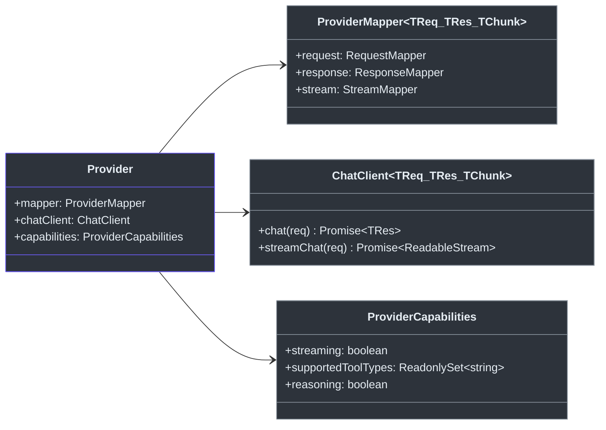

# Contributor Guide

## What This Project Does

Godex is an **OpenAI Responses API gateway**. It accepts OpenAI Responses API (`POST /v1/responses`) requests and translates them into upstream provider-specific Chat Completions API calls. Write your client code once against the OpenAI Responses API, and Godex routes to any configured provider.

## Prerequisites & Setup

| Tool | Version | Install |
|------|---------|---------|
| [Bun](https://bun.sh/) | >= 1.2 | `curl -fsSL https://bun.sh/install \| bash` |
| Node.js | >= 18 | (optional, for npm publish) |
| Git | any | system package manager |

```bash
git clone https://github.com/Ahoo-Wang/Godex.git
cd Godex
bun install
bun run dev          # Dev server with hot reload on port 13145
```

## Project Structure

```
src/
├── cli/              Commander CLI (serve, config, init)
├── config/           godex.yaml schema, env interpolation, defaults
├── context/          ApplicationContext (DI), ResponsesContext (per-request)
├── adapter/          Adapter interface, DefaultAdapter, stream transformers
│   ├── mapper/       RequestMapper/ResponseMapper/StreamMapper contracts, StreamState
│   └── transformers/ ProviderEvent → Response → SSE encode pipeline
├── providers/        Provider registry + builtin factories
│   └── zhipu/        Reference provider implementation
├── resolver/         ModelResolver (model selector → provider + model)
├── server/           Bun HTTP server, routes (/v1/responses, /health, /v1/models)
├── session/          ResponseSessionStore (Memory + SQLite), chain resolution
├── error/            GodexError hierarchy with domain codes
├── protocol/openai/  OpenAI Responses API type definitions
└── logger/           Structured JSON logger
```

## Core Concepts

### Provider

A `Provider` bundles three concerns:



<!-- Sources: src/adapter/provider.ts, src/adapter/mapper/contract.ts -->

### Request Flow

```mermaid
sequenceDiagram
    autonumber
    participant Client
    participant Server as Bun HTTP Server
    participant Ctx as ResponsesContext
    participant Resolver as ModelResolver
    participant Adapter as DefaultAdapter
    participant Provider as Provider
    participant Upstream

    Client->>Server: POST /v1/responses
    Server->>Ctx: create(app, body)
    Ctx->>Resolver: resolve(body.model)
    Resolver-->>Ctx: ResolvedModel
    Ctx-->>Server: context ready
    Server->>Adapter: request(ctx) or stream(ctx)
    Adapter->>Provider: mapper.request.map(ctx)
    Provider->>Upstream: HTTP /chat/completions
    Upstream-->>Provider: response
    Provider-->>Adapter: mapped ResponseObject
    Adapter-->>Server: result
    Server-->>Client: JSON or SSE stream

    style Client fill:#2d333b,stroke:#6d5dfc,color:#e6edf3
    style Server fill:#2d333b,stroke:#8b949e,color:#e6edf3
    style Ctx fill:#2d333b,stroke:#8b949e,color:#e6edf3
    style Resolver fill:#2d333b,stroke:#8b949e,color:#e6edf3
    style Adapter fill:#2d333b,stroke:#8b949e,color:#e6edf3
    style Provider fill:#2d333b,stroke:#8b949e,color:#e6edf3
    style Upstream fill:#2d333b,stroke:#6d5dfc,color:#e6edf3
```

<!-- Sources: src/server/routes/responses/index.ts, src/adapter/default-adapter.ts -->

### Error Hierarchy

All domain errors extend `GodexError` with structured codes from [src/error/codes.ts](https://github.com/Ahoo-Wang/Godex/blob/main/src/error/codes.ts):

| Error Class | Domain | Example Code |
|-------------|--------|-------------|
| `ServerError` | server | `server.request.invalid_json` |
| `AdapterError` | adapter | `adapter.request.unsupported_tool` |
| `ProviderError` | provider | `provider.upstream.timeout` |
| `SessionError` | session | `session.chain.not_found` |

## Development Workflow

```bash
bun run dev              # Dev server with hot reload
bun run typecheck        # TypeScript type checking
bun run lint             # Biome lint
bun run lint:fix         # Biome auto-fix
bun run format           # Biome format
bun run check            # typecheck + lint + test (run before commit)
bun run ci               # Full CI: typecheck + biome ci + test + e2e
```

### Running Tests

```bash
bun test                           # All unit + integration tests
bun test src/adapter/              # Tests for a specific module
bun run test:e2e                   # E2E tests with mocked upstream
bun run test:coverage              # Tests with coverage report
```

### Adding a New Provider

To add a new LLM provider (e.g., "acme"):

1. Create `src/providers/acme/` directory
2. Implement the `Provider` interface — you need:
   - `ProviderMapper` (request/response/stream mapping)
   - `ChatClient` (HTTP boundary to upstream)
   - `ProviderCapabilities` (feature declaration)
3. Create a `ProviderFactory` function
4. Register it in [src/providers/builtin.ts](https://github.com/Ahoo-Wang/Godex/blob/main/src/providers/builtin.ts)
5. Add tests alongside source files (`*.test.ts`)
6. Update `godex.yaml` to configure the provider

The Zhipu provider at `src/providers/zhipu/` serves as a complete reference implementation.

## Code Style

- **TypeScript** strict mode, ESNext target, ESM modules
- **Biome** for linting and formatting (tab indentation)
- **Bun test runner** — no external test frameworks
- **GodexError hierarchy** for all domain errors — never throw raw `Error` in adapter/provider code
- **No comments** unless explaining WHY, not WHAT

## Common Pitfalls

| Pitfall | Fix |
|---------|-----|
| Using Node.js APIs instead of Bun equivalents | Use `Bun.serve()`, `bun:sqlite`, etc. |
| Throwing raw `Error` in provider code | Use `ProviderError` or `AdapterError` with domain codes |
| Forgetting to register a new provider factory | Add to `createBuiltinRegistrar()` in `src/providers/builtin.ts` |
| Running Jest/Vitest tests | Use `bun test` — the project uses Bun's built-in runner |

## Key File Reference

| Path | Purpose |
|------|---------|
| [src/index.ts](https://github.com/Ahoo-Wang/Godex/blob/main/src/index.ts) | Entry point, delegates to CLI |
| [src/cli/serve.ts](https://github.com/Ahoo-Wang/Godex/blob/main/src/cli/serve.ts) | Server startup, config loading |
| [src/context/application-context.ts](https://github.com/Ahoo-Wang/Godex/blob/main/src/context/application-context.ts) | DI container, assembles all components |
| [src/adapter/default-adapter.ts](https://github.com/Ahoo-Wang/Godex/blob/main/src/adapter/default-adapter.ts) | Request/stream orchestration |
| [src/providers/zhipu/](https://github.com/Ahoo-Wang/Godex/blob/main/src/providers/zhipu/) | Reference provider implementation |
| [src/error/codes.ts](https://github.com/Ahoo-Wang/Godex/blob/main/src/error/codes.ts) | All domain error codes |

[Architecture Overview](/02-architecture/overview) · [Provider Development](/03-provider-development/provider-interface) · [Testing Guide](/08-testing/testing-guide)
