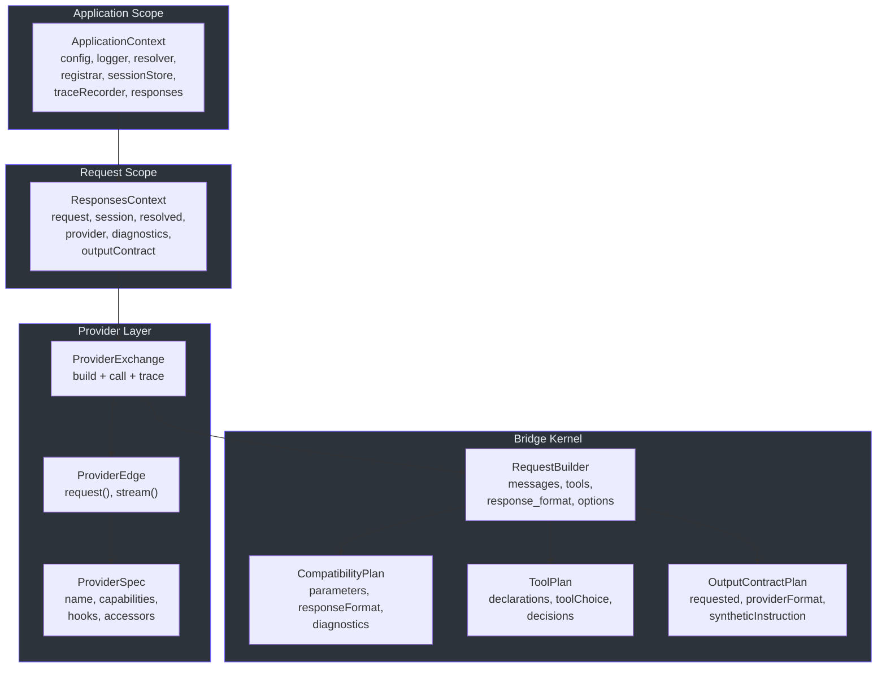
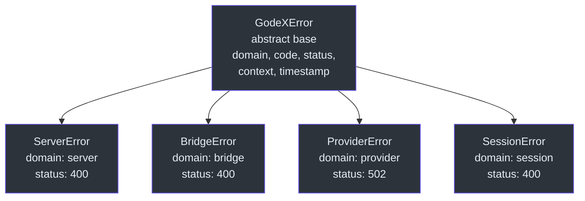

# Contributor Guide

Welcome to GodeX. This guide will take you from zero knowledge of the codebase to landing your first pull request. It is written for engineers who are comfortable with TypeScript or JavaScript and HTTP APIs but may not yet know the GodeX domain, the Bun runtime, or the architectural patterns used here.

---

## Part I: Language & Framework Foundations

### 1.1 TypeScript Strict Mode and ESNext

GodeX uses TypeScript in strict mode with the ESNext target and ESM modules. The [tsconfig.json](https://github.com/Ahoo-Wang/GodeX/blob/main/tsconfig.json) enables these flags:

| Flag | Effect |
|------|--------|
| `"strict": true` | Enables all strict type-checking options |
| `"target": "ESNext"` | Targets the latest ECMAScript features |
| `"module": "Preserve"` | Keeps import/export syntax as written (ESM) |
| `"moduleResolution": "bundler"` | Resolves modules the way Bun does |
| `"verbatimModuleSyntax": true` | Requires explicit `import type` for type-only imports |
| `"noUncheckedIndexedAccess": true` | Array/object index access returns `T \| undefined` |
| `"noImplicitOverride": true` | Override members must use the `override` keyword |
| `"noFallthroughCasesInSwitch": true` | Every switch case must end with break/return/throw |

The most impactful rule for contributors is `verbatimModuleSyntax`. When you import a type, interface, or anything that only exists at compile time, you must write `import type`:

```typescript
// Correct — type-only import
import type { ProviderCapabilities } from "../compatibility";
import type { ResponseObject } from "../protocol/openai/responses";

// Wrong — will fail at runtime or build time
import { ProviderCapabilities } from "../compatibility";
```

You can mix value and type imports on the same line using inline type specifiers:

```typescript
import { type ResponseUsage, type ResponseObject } from "../protocol/openai/responses";
```

The codebase also uses `readonly` heavily. Most interfaces mark fields as `readonly` to signal immutability. When you see `readonly` on an interface, treat it as a contract: do not mutate the value. The `ReadonlySet`, `ReadonlyMap`, and `readonly` array modifiers appear throughout the bridge kernel.

### 1.2 Bun Runtime (Not Node.js)

GodeX runs on [Bun](https://bun.sh/), not Node.js. Bun is a fast JavaScript/TypeScript runtime that bundles a package manager, test runner, bundler, and built-in APIs. The most important difference is that Bun has native support for `ReadableStream`, `TransformStream`, `Response`, `Request`, and `fetch` — no polyfills needed.

If you come from Node.js, here is a cross-reference:

| You know (Node.js) | In Bun |
|---------------------|--------|
| `npm install` | `bun install` |
| `jest` or `vitest` | `bun test` (built-in, [Bun test runner](https://github.com/Ahoo-Wang/GodeX/blob/main/package.json)) |
| `better-sqlite3` | `bun:sqlite` (built-in) |
| `nodemon` | `bun --hot` (built-in) |
| `node-fetch` | Native `fetch` |
| `stream.Readable` | Native `ReadableStream` |
| `express` or `fastify` | Bun's built-in `Bun.serve()` |
| `ts-node` or `tsx` | Bun runs TypeScript natively |
| `esbuild` or `webpack` | Bun bundles natively |
| `child_process.spawn` | `Bun.spawn()` |

If you know Go, the comparison is even simpler:

| You know (Go) | In GodeX (Bun/TypeScript) |
|---------------|---------------------------|
| `go test ./...` | `bun test` |
| `go run main.go` | `bun src/index.ts` |
| `go build` | `bun run build` |
| `database/sql` + driver | `bun:sqlite` |
| `net/http` | `Bun.serve()` |
| `context.Context` | `ApplicationContext` / `ResponsesContext` |
| `interface { ServeHTTP(...) }` | `ProviderEdge` interface |
| `io.Reader` | `ReadableStream` |
| `fmt.Errorf("... %w", err)` | `new BridgeError(code, msg, ctx, { cause: err })` |

If you know Python:

| You know (Python) | In GodeX (Bun/TypeScript) |
|-------------------|---------------------------|
| `pytest` | `bun test` |
| `typing.Protocol` | TypeScript `interface` |
| `dataclass(frozen=True)` | `readonly` interface fields |
| `asyncio` | Bun's native async/await |
| `sqlite3` stdlib | `bun:sqlite` |
| `FastAPI` | `Bun.serve()` with route handlers |

Bun's test runner uses `describe`, `test`, `expect`, `beforeEach`, and `afterEach` — familiar to anyone who has used Jest or Vitest. Tests are colocated as `*.test.ts` files next to the source they test.

### 1.3 Biome for Formatting and Linting

GodeX uses [Biome](https://biomejs.dev/) for both formatting and linting. The configuration is in [biome.json](https://github.com/Ahoo-Wang/GodeX/blob/main/biome.json). Key conventions:

- **Tabs** for indentation (not spaces).
- **Organized imports** — Biome auto-organizes import statements via the `assist` feature.
- **Recommended rules** are enabled with a few project-specific overrides (e.g., `noTemplateCurlyInString` is off because config files use `${ENV_VAR}` interpolation).

Run these commands regularly:

| Command | Purpose |
|---------|---------|
| `bun run lint` | Check for lint errors |
| `bun run lint:fix` | Auto-fix lint errors |
| `bun run format` | Auto-format code |
| `bun run typecheck` | Run TypeScript type checking |

Always run `bun run check` before committing. This runs typecheck, lint, and tests together.

### 1.4 Commander.js for CLI

GodeX uses [Commander.js](https://github.com/tj/commander.js) for the command-line interface. The CLI lives in `src/cli/`. Key commands:

- `godex serve --config ./godex.yaml` — start the gateway server
- `godex init` — create a `godex.yaml` interactively
- `godex config check` — validate a config file
- `godex config print` — print the resolved config

The CLI module parses arguments, reads the config file, creates the `ApplicationContext`, and starts the Bun HTTP server. The CLI also provides interactive prompts via `@clack/prompts` for the `init` wizard.

### 1.5 LogTape for Structured Logging

GodeX uses [LogTape](https://github.com/robot-love/logtape) for structured logging. Loggers are created through a factory and attached to the `ApplicationContext`. Log messages use namespaced strings like `"providers.built"` or `"session.save.error"` with structured payload objects.

The logging module ([src/logger/](https://github.com/Ahoo-Wang/GodeX/blob/main/src/logger)) supports configurable log levels and sinks (console, file). The `Logger` interface is defined in [src/logger/contract.ts](https://github.com/Ahoo-Wang/GodeX/blob/main/src/logger/contract.ts).

Log messages use lazy evaluation — payloads are wrapped in thunk functions so they are only computed if the log level is active:

```typescript
ctx.logger.info("responses.request.completed", () => ({
  status: response.status,
  model: response.model,
  usage: response.usage,
}));
```

---

## Part II: This Codebase's Architecture & Domain Model

### 2.1 What GodeX Does

GodeX is an API gateway that translates OpenAI's **Responses API** into provider-specific **Chat Completions API** calls. It is not a proxy — it actively translates between two fundamentally different API surface areas.

The Responses API is OpenAI's newer API for conversational AI. It uses concepts like `previous_response_id` for multi-turn, structured output via `text.format`, and tool types like `function`, `shell`, `apply_patch`, and `custom`. Most LLM providers, however, only support the older Chat Completions API, which uses a flat `messages` array, `function` tools, and `response_format` for structured output.

GodeX bridges this gap. When a client sends a Responses API request, GodeX:

1. Resolves which provider handles the requested model
2. Resolves the session history if `previous_response_id` is provided
3. Plans compatibility — what the provider supports, what must be degraded, and what must be rejected
4. Plans tool declarations — mapping Responses tool types to Chat Completions tool types
5. Plans output contracts — handling `json_schema` when the provider only supports `json_object`
6. Builds a Chat Completions request from the translated input
7. Calls the upstream provider
8. Reconstructs a Responses API response from the Chat Completions response
9. Persists the session and records a trace

### 2.2 Domain Vocabulary

| Term | Definition |
|------|-----------|
| **Responses API** | OpenAI's API for conversational AI. Uses `ResponseObject`, `ResponseCreateRequest`, `previous_response_id`, and typed tool calls. |
| **Chat Completions API** | The older, widely-supported API. Uses `messages`, `function` tools, `response_format`, and streaming SSE chunks. |
| **ProviderSpec** | A typed contract that declares a provider's capabilities, endpoint, auth, tool codec, response accessors, stream accessors, and hooks. Defined in [src/bridge/provider-spec/contract.ts](https://github.com/Ahoo-Wang/GodeX/blob/main/src/bridge/provider-spec/contract.ts). |
| **ProviderEdge** | A callable wrapper around a ProviderSpec. Has `request()` and `stream()` methods for calling the upstream provider. |
| **Bridge** | The core translation logic in `src/bridge/`. Converts Responses API semantics to Chat Completions semantics — and back. |
| **Compatibility Plan** | A per-request analysis of what the provider supports, degrades, ignores, or rejects. Produced by `planBridgeCompatibility`. |
| **Tool Plan** | A per-request plan for tool declarations, tool_choice, degradation, identity mapping, and call restoration. Produced by `planTools`. |
| **Output Contract** | A per-request plan for structured output. Handles `json_schema` to `json_object` degradation with synthetic instructions and post-validation. Produced by `planOutputContract`. |
| **Session Chain** | A linked list of `StoredResponseSession` entries connected by `previous_response_id` parent pointers. Resolved by `ResponseSessionStore.resolveChain`. |
| **Trace** | SQLite-backed records of requests, usage, events, and errors for observability. |
| **Registrar** | A registry that maps provider names to factories and resolves `ProviderEdge` instances. |
| **Model Resolver** | Resolves model aliases to `{ provider, model }` pairs. Handles bare model names and `provider/model` selectors. |
| **ApplicationContext** | The application-scoped container holding config, logger, resolver, registrar, session store, trace recorder, and the bridge runtime. |
| **ResponsesContext** | A per-request context holding the request, resolved model, provider edge, session snapshot, diagnostics, and output contract slot. |
| **Diagnostic** | A structured compatibility warning or error attached to a request. Carries code, severity, path, action, message, and metadata. |
| **Delta** | A normalized unit of streaming data from a provider. Contains text, reasoning, refusal, tool call, usage, finish reason, or error fields. |
| **Stream State Machine** | The stateful processor that maps provider deltas to Responses SSE lifecycle events. |

### 2.3 Directory Layout

```
src/
  cli/                Commander CLI, commands, init wizard, runtime config
    errors/           CLI-specific error types
  config/             godex.yaml parsing, defaults, validation, env interpolation
  context/            ApplicationContext and request-scoped ResponsesContext
  bridge/             Provider-agnostic Responses-to-Chat translation kernel
    compatibility/    Feature support planning and diagnostics
    request/          Input normalization and Chat Completions request building
    tools/            Tool declaration planning, identity mapping, call restoration
    output/           Structured output contracts and validation
    response/         Sync ResponseObject reconstruction from provider responses
    stream/           Streaming state machine and delta-to-event mapping
    provider-spec/    ProviderSpec, ProviderEdge contracts and factory
    finish-reason/    Provider finish reason to Responses status mapping
  providers/          Provider registry, specs, clients, hooks, protocol DTOs
    deepseek/         DeepSeek provider (spec, client, hooks, protocol)
    xiaomi/           Xiaomi provider (spec, client, hooks, protocol)
    zhipu/            Zhipu provider (spec, client, hooks, protocol)
    minimax/          MiniMax provider (spec, client, hooks, protocol)
    shared/           Shared provider utilities (ChatProviderClient, ChatApi)
    example/          Spec example template (not a runtime provider)
  responses/          Sync and streaming orchestration pipelines
    stream-transforms/ Composable TransformStream stages for streaming
  server/             Bun routes: /health, /v1/models, /v1/responses
    routes/
      responses/      The main /v1/responses route handler, parser, dispatcher, SSE encoder
  resolver/           Model selector and alias resolution
  session/            Memory and SQLite session stores for previous_response_id
  trace/              SQLite trace records for requests, usage, events, errors
  logger/             LogTape-based structured logging configuration
  error/              GodeXError hierarchy and domain codes
  protocol/           OpenAI protocol type definitions
    openai/
      responses/      Responses API types (ResponseObject, ResponseCreateRequest, items, tools)
      completions/    Chat Completions API types (ChatCompletion, ChatCompletionCreateRequest)
      shared/         Shared types (ResponseFormat, ResponseError)
  tools/              Codex built-in tool definitions (shell, apply_patch, local_shell, etc.)
  testing/            Shared test provider utilities
```

### 2.4 Core Type Relationships

The system has a layered type architecture. At the top is the application scope; at the bottom is the provider call.



The flow is: `ApplicationContext` is created once at startup. For each request, a `ResponsesContext` is created. The `ProviderExchange` uses the bridge kernel (`compatibility`, `tools`, `output`, `request`) to build a Chat Completions request, then calls the `ProviderEdge`. The `ProviderEdge` delegates to its `ProviderSpec`'s hooks and accessors.

### 2.5 The Bridge Kernel: Why This Is the Hardest Problem

The bridge kernel in [src/bridge/](https://github.com/Ahoo-Wang/GodeX/blob/main/src/bridge) is the heart of GodeX. It solves the fundamental problem of translating between two API surface areas that were never designed to be compatible.

**Multi-turn semantics differ.** The Responses API uses `previous_response_id` — a pointer to a past response that the server stores. The Chat Completions API uses a flat `messages` array that the client sends every time. GodeX must resolve the session chain, flatten it into API-shaped input items, normalize them into Chat Completions messages, and append the current input. The normalization logic in [src/bridge/request/input-normalizer.ts](https://github.com/Ahoo-Wang/GodeX/blob/main/src/bridge/request/input-normalizer.ts) handles every item type: messages, function calls, function call outputs, shell calls, shell call outputs, local shell calls, apply patch calls, custom tool calls, and reasoning items. Adjacent assistant messages with tool calls are merged by [src/bridge/request/message-builder.ts](https://github.com/Ahoo-Wang/GodeX/blob/main/src/bridge/request/message-builder.ts) to produce a valid Chat Completions message sequence.

**Tool types differ.** The Responses API supports `function`, `shell`, `apply_patch`, `custom`, `mcp`, `tool_search`, and `namespace` tools. Chat Completions only supports `function` tools. GodeX must plan which tool types are supported natively, which are degraded to `function`, and which must be rejected. The tool declaration renderer in [src/bridge/tools/declaration-renderer.ts](https://github.com/Ahoo-Wang/GodeX/blob/main/src/bridge/tools/declaration-renderer.ts) generates the correct function declarations for each degraded tool type, including custom tool descriptions that instruct the model how to use the degraded interface. The tool call restorer in [src/bridge/tools/call-restorer.ts](https://github.com/Ahoo-Wang/GodeX/blob/main/src/bridge/tools/call-restorer.ts) reverses this mapping: it takes a function call from the provider and reconstructs the original Responses tool call type (shell_call, apply_patch_call, custom_tool_call, etc.) by looking up the tool identity.

**Output contracts differ.** The Responses API supports `json_schema` with strict validation. Many providers only support `json_object` (which just says "return JSON"). GodeX must degrade `json_schema` to `json_object`, inject a synthetic system instruction with the schema, and validate the output JSON after the fact.

**Streaming is a state machine.** The Responses streaming API emits structured events (`response.created`, `response.output_text.delta`, `response.completed`). Provider SSE chunks have no such structure. GodeX must maintain a state machine that tracks message blocks, tool call blocks, and reasoning blocks — and emits the correct sequence of Responses events, including terminal events that are deferred until all active blocks are closed.

The bridge kernel is provider-agnostic. It never imports provider-specific code. It operates entirely against the `ProviderSpec` interface. This is the key architectural invariant: adding a new provider requires zero changes to the bridge kernel.

### 2.6 Session Model: Parent Pointer Chains

The session model uses **parent pointer chains**, not mutable conversation cursors. Each `StoredResponseSession` has a `previous_response_id` field that points to its parent. This design:

- **Allows forking.** Multiple responses can reference the same parent, enabling branching conversations.
- **Is immutable.** Once stored, a session snapshot is never modified. New turns are appended.
- **Requires chain resolution.** When `previous_response_id` is provided, GodeX follows the parent pointers from newest to oldest, collecting turns along the way.

The session store ([src/session/](https://github.com/Ahoo-Wang/GodeX/blob/main/src/session)) handles:

- Chain traversal with cycle detection
- Maximum depth enforcement to prevent infinite chains
- Status filtering (skipping incomplete responses)
- Conflict detection when saving

The `ResponseSessionStore` interface defines the contract:

| Method | Purpose |
|--------|---------|
| `get(responseId)` | Return one stored response by ID, or null |
| `save(session, options?)` | Persist a response snapshot after generation |
| `resolveChain(id, options?)` | Resolve a parent chain ordered from oldest to newest |
| `delete(responseId)` | Remove one response snapshot |
| `close()` | Release resources held by this store |

Session stores must keep **API-shaped snapshots** — the stored data mirrors the Responses API types. Provider-specific Chat Completions conversion belongs in the bridge, not in the session store. This separation is critical: if the conversion logic changes, stored sessions must still be interpretable.

Two backends are supported: `memory` (in-process map) and `sqlite` (persistent). The backend is configured in `godex.yaml` under `session.backend`.

### 2.7 Provider Pattern: Spec + Client + Hooks + Protocol DTOs

Each provider follows a consistent structure defined in [src/providers/](https://github.com/Ahoo-Wang/GodeX/blob/main/src/providers):

```
src/providers/<name>/
  spec.ts       Capabilities, endpoint, auth, tool codec, accessors, hooks
  client.ts     create<Name>ProviderEdge(config)
  hooks.ts      Provider-specific request patching, usage, finish reason, stream deltas
  protocol/     Provider-specific Chat Completions DTOs
  index.ts      Barrel exports
```

The **ProviderSpec** ([src/bridge/provider-spec/contract.ts](https://github.com/Ahoo-Wang/GodeX/blob/main/src/bridge/provider-spec/contract.ts)) is the central contract. It declares:

| Field | Type | Purpose |
|-------|------|---------|
| `name` | `string` | Provider identifier (e.g., `"deepseek"`) |
| `protocol` | `"chat_completions"` | Always `CHAT_COMPLETIONS_PROTOCOL` |
| `capabilities` | `ProviderCapabilities` | What the provider supports |
| `endpoint` | `{ defaultBaseURL }` | Default base URL |
| `auth` | `{ scheme: "bearer" }` | Auth scheme (always `BEARER_AUTH`) |
| `toolName` | `ToolNameCodec` | Bidirectional name mapping |
| `response` | `ChatCompletionResponseAccessor` | Accessors for sync response data |
| `stream` | `ChatCompletionStreamAccessor` | Accessors for SSE chunk deltas |
| `hooks` | `ProviderHooks` | Optional provider-specific patching |

The `ProviderCapabilities` type declares what a provider supports:

| Capability Field | Type | Controls |
|------------------|------|----------|
| `parameters.supported` | `Set<string>` | Which request parameters are forwarded (e.g., `"stream"`, `"temperature"`, `"max_output_tokens"`) |
| `tools.supported` | `Set<string>` | Which tool types are natively handled (e.g., `"function"`) |
| `tools.degraded` | `Map<string, string>` | Tool type degradation mapping (e.g., `"shell"` to `"function"`) |
| `tools.maxTools` | `number?` | Maximum number of tool declarations |
| `toolChoice.supported` | `Set<string>` | Which tool_choice modes are supported (e.g., `"auto"`, `"required"`, `"function"`) |
| `responseFormats.supported` | `Set<string>` | Which response formats (e.g., `"text"`, `"json_object"`) |
| `reasoning.effort` | `"none" \| "boolean" \| "native"` | How reasoning effort is handled |
| `streaming.usage` | `boolean` | Whether the provider returns usage in streams |

The **ProviderEdge** is the callable wrapper. It has two methods:

- `request(body)` — sends a sync Chat Completions request
- `stream(body)` — sends a streaming Chat Completions request, returns `ReadableStream<JsonServerSentEvent>`

The **hooks** are optional functions that the bridge calls at specific points:

| Hook | Signature | Purpose |
|------|-----------|---------|
| `patchRequest` | `(bridgeRequest) -> providerRequest` | Transform the bridge-built request into the provider's format |
| `normalizeResponse` | `(response) -> response` | Normalize a provider response before the bridge processes it |
| `normalizeChunk` | `(chunk) -> chunk` | Normalize a provider SSE chunk before delta extraction |

The `patchRequest` hook is the most commonly used. For example, DeepSeek's hook in [src/providers/deepseek/hooks.ts](https://github.com/Ahoo-Wang/GodeX/blob/main/src/providers/deepseek/hooks.ts) adds the `thinking` field to requests that have reasoning enabled:

The **protocol DTOs** are TypeScript interfaces that define the provider-specific shape of Chat Completions requests and responses. For example, DeepSeek has its own `ChatCompletionRequest` type that adds `thinking` and `reasoning_effort` fields. These types live in `src/providers/<name>/protocol/`.

### 2.8 Error Hierarchy

GodeX uses a structured error hierarchy defined in [src/error/](https://github.com/Ahoo-Wang/GodeX/blob/main/src/error). All expected runtime failures use domain-specific error classes:



| Error Class | Domain | Use When | Default Status |
|-------------|--------|----------|---------------|
| `ServerError` | `server` | Route/request/config validation failures | 400 |
| `BridgeError` | `bridge` | Responses-to-Chat compatibility and reconstruction errors | 400 |
| `ProviderError` | `provider` | Upstream HTTP/fetch failures | 502 |
| `SessionError` | `session` | Session chain and persistence errors | 400 |

Every `GodeXError` carries structured context:

- `domain` — which subsystem produced the error
- `code` — a dot-namespaced string like `"bridge.stream.invalid_transition"`
- `status` — the HTTP status code to return
- `context` — a typed record with domain-specific fields (e.g., `provider`, `model`, `parameter`)
- `timestamp` — when the error was created

All error codes are defined in [src/error/codes.ts](https://github.com/Ahoo-Wang/GodeX/blob/main/src/error/codes.ts) as string constants:

| Domain | Example Codes |
|--------|---------------|
| bridge | `bridge.request.unsupported_parameter`, `bridge.request.tool_skipped`, `bridge.request.unsupported_input_item`, `bridge.request.unsupported_input_content`, `bridge.request.unsupported_tool`, `bridge.response.invalid_output_format`, `bridge.stream.not_initialized`, `bridge.stream.already_initialized`, `bridge.stream.invalid_transition`, `bridge.stream.output_before_start`, `bridge.stream.delta_after_terminal`, `bridge.stream.missing_options`, `bridge.stream.missing_output_block`, `bridge.stream.incomplete_tool_call` |
| provider | `provider.upstream.rate_limit`, `provider.upstream.timeout`, `provider.upstream.server_error`, `provider.upstream.error` |
| session | `session.chain.not_found`, `session.chain.cycle_detected`, `session.chain.depth_exceeded`, `session.chain.unavailable`, `session.store.conflict` |
| server | `server.request.invalid_json`, `server.request.missing_model`, `server.request.invalid_parameter`, `server.provider.not_registered`, `server_error` |

**Rule:** Never throw raw `Error` for expected runtime failures. Always use the appropriate `GodeXError` subclass with the correct domain code.

### 2.9 Key Files Reference

| File | Description |
|------|-------------|
| [src/index.ts](https://github.com/Ahoo-Wang/GodeX/blob/main/src/index.ts) | Entry point — runs the CLI |
| [src/context/application-context.ts](https://github.com/Ahoo-Wang/GodeX/blob/main/src/context/application-context.ts) | Application-scoped container: config, logger, resolver, registrar, session store, trace recorder |
| [src/context/responses-context.ts](https://github.com/Ahoo-Wang/GodeX/blob/main/src/context/responses-context.ts) | Per-request context: request, session, resolved model, provider, diagnostics, output contract |
| [src/bridge/provider-spec/contract.ts](https://github.com/Ahoo-Wang/GodeX/blob/main/src/bridge/provider-spec/contract.ts) | Core interfaces: `ProviderSpec`, `ProviderEdge`, `ProviderHooks`, accessors |
| [src/bridge/compatibility/planner.ts](https://github.com/Ahoo-Wang/GodeX/blob/main/src/bridge/compatibility/planner.ts) | Compatibility planning — what is supported, degraded, ignored, rejected |
| [src/bridge/compatibility/compatibility-plan.ts](https://github.com/Ahoo-Wang/GodeX/blob/main/src/bridge/compatibility/compatibility-plan.ts) | `ProviderCapabilities`, `CompatibilityPlan`, `CompatibilityDecision` types |
| [src/bridge/tools/tool-plan.ts](https://github.com/Ahoo-Wang/GodeX/blob/main/src/bridge/tools/tool-plan.ts) | Tool declaration planning, tool_choice mapping, identity allocation |
| [src/bridge/tools/tool-identity.ts](https://github.com/Ahoo-Wang/GodeX/blob/main/src/bridge/tools/tool-identity.ts) | Tool name identity mapping and `ToolIdentityMap` |
| [src/bridge/tools/call-restorer.ts](https://github.com/Ahoo-Wang/GodeX/blob/main/src/bridge/tools/call-restorer.ts) | Tool call reconstruction — converts function calls back to shell_call, apply_patch_call, etc. |
| [src/bridge/tools/declaration-renderer.ts](https://github.com/Ahoo-Wang/GodeX/blob/main/src/bridge/tools/declaration-renderer.ts) | Tool declaration rendering for degraded tool types |
| [src/bridge/tools/custom-tool-degradation.ts](https://github.com/Ahoo-Wang/GodeX/blob/main/src/bridge/tools/custom-tool-degradation.ts) | Custom tool degradation description and parameters |
| [src/bridge/output/output-contract.ts](https://github.com/Ahoo-Wang/GodeX/blob/main/src/bridge/output/output-contract.ts) | Structured output planning — `json_schema` to `json_object` degradation |
| [src/bridge/output/output-validator.ts](https://github.com/Ahoo-Wang/GodeX/blob/main/src/bridge/output/output-validator.ts) | Post-response JSON validation for degraded output contracts |
| [src/bridge/request/request-builder.ts](https://github.com/Ahoo-Wang/GodeX/blob/main/src/bridge/request/request-builder.ts) | Builds Chat Completions requests from Responses API input |
| [src/bridge/request/input-normalizer.ts](https://github.com/Ahoo-Wang/GodeX/blob/main/src/bridge/request/input-normalizer.ts) | Responses input to Chat messages normalization |
| [src/bridge/request/message-builder.ts](https://github.com/Ahoo-Wang/GodeX/blob/main/src/bridge/request/message-builder.ts) | Merges adjacent assistant messages with tool calls |
| [src/bridge/response/response-reconstructor.ts](https://github.com/Ahoo-Wang/GodeX/blob/main/src/bridge/response/response-reconstructor.ts) | Sync response reconstruction |
| [src/bridge/stream/response-stream-state-machine.ts](https://github.com/Ahoo-Wang/GodeX/blob/main/src/bridge/stream/response-stream-state-machine.ts) | Streaming state machine — tracks phases, blocks, and emits Responses events |
| [src/bridge/stream/stream-reconstructor.ts](https://github.com/Ahoo-Wang/GodeX/blob/main/src/bridge/stream/stream-reconstructor.ts) | Maps provider deltas to Responses SSE events |
| [src/bridge/finish-reason/finish-reason.ts](https://github.com/Ahoo-Wang/GodeX/blob/main/src/bridge/finish-reason/finish-reason.ts) | Maps provider finish reasons to Responses terminal states |
| [src/responses/runtime.ts](https://github.com/Ahoo-Wang/GodeX/blob/main/src/responses/runtime.ts) | `ResponsesBridgeRuntime` — delegates to sync and stream pipelines |
| [src/responses/provider-exchange.ts](https://github.com/Ahoo-Wang/GodeX/blob/main/src/responses/provider-exchange.ts) | `ProviderExchange` — builds provider request, calls upstream, records trace |
| [src/responses/sync-request-pipeline.ts](https://github.com/Ahoo-Wang/GodeX/blob/main/src/responses/sync-request-pipeline.ts) | Sync pipeline: call provider, reconstruct response, validate output, persist session |
| [src/responses/stream-pipeline.ts](https://github.com/Ahoo-Wang/GodeX/blob/main/src/responses/stream-pipeline.ts) | Stream pipeline: transform provider SSE into Responses events through composable stages |
| [src/providers/builtin.ts](https://github.com/Ahoo-Wang/GodeX/blob/main/src/providers/builtin.ts) | Built-in provider definitions and registrar factory |
| [src/providers/registrar.ts](https://github.com/Ahoo-Wang/GodeX/blob/main/src/providers/registrar.ts) | `Registrar` — maps provider names to factories, resolves `ProviderEdge` instances |
| [src/providers/shared/chat-provider-client.ts](https://github.com/Ahoo-Wang/GodeX/blob/main/src/providers/shared/chat-provider-client.ts) | Shared HTTP client for providers |
| [src/resolver/model-resolver.ts](https://github.com/Ahoo-Wang/GodeX/blob/main/src/resolver/model-resolver.ts) | `ModelResolver` — resolves model aliases and bare model names |
| [src/session/types.ts](https://github.com/Ahoo-Wang/GodeX/blob/main/src/session/types.ts) | Session types: `StoredResponseSession`, `ResponseSessionStore`, chain resolution |
| [src/error/codes.ts](https://github.com/Ahoo-Wang/GodeX/blob/main/src/error/codes.ts) | All domain error codes as string constants |
| [src/error/godex-error.ts](https://github.com/Ahoo-Wang/GodeX/blob/main/src/error/godex-error.ts) | `GodeXError` abstract base class |

---

## Part III: Getting Productive

### 3.1 Setup

**Prerequisites:** Install [Bun](https://bun.sh/) (v1.2+ recommended) and Git.

```bash
# Clone the repository
git clone https://github.com/Ahoo-Wang/GodeX.git
cd GodeX

# Install dependencies
bun install

# Verify everything works
bun run check
```

After `bun run check` succeeds, you are ready to develop.

To build a native binary:

```bash
bun run build                    # Build for the current platform
bun run compile:all              # Cross-compile all supported platforms
```

### 3.2 Development Workflow

Start the dev server with hot reload:

```bash
bun run dev
```

This starts the server on port 13145 with hot reload enabled. Edit any source file and Bun will automatically reload.

For a production-like start from source:

```bash
bun run start
```

The default config port is `5678`; `bun run dev` explicitly overrides to `13145`.

To create or verify a config file:

```bash
godex init                       # Create godex.yaml interactively
godex config check --config ./godex.yaml
godex config print --config ./godex.yaml
```

**Before every commit, run:**

```bash
bun run check
```

This runs `typecheck + lint + test` in sequence. If any step fails, fix it before committing.

**When you change route, provider, session, stream, trace, or CLI behavior:**

```bash
bun run test:e2e
```

The E2E tests use mocked upstreams to verify end-to-end behavior without real API keys.

### 3.3 Testing Strategy

GodeX uses a three-tier testing approach:

**Unit tests** are colocated with source as `*.test.ts` files. They test individual functions and classes in isolation. Run with:

```bash
bun test                          # All unit/integration tests
bun test src/bridge/tools/tool-plan.test.ts  # Specific file
```

Bun's test runner provides `describe`, `test`, `expect`, `beforeEach`, `afterEach`, and `mock`. The test API is compatible with Jest for the most common patterns.

**E2E tests with mocked upstreams** live in `src/e2e/`. They start the full server, mock the upstream provider, and send real HTTP requests. Run with:

```bash
bun run test:e2e
```

E2E tests verify request routing, provider selection, session persistence, trace recording, stream behavior, and error handling — all without real API keys.

**Live tests** call real provider APIs and require API keys. They are opt-in:

```bash
ZHIPU_API_KEY=sk-xxx bun run test:zhipu
DEEPSEEK_API_KEY=sk-xxx bun run test:deepseek
MINIMAX_API_KEY=sk-xxx bun run test:minimax
```

Live tests only run in CI on push to `main` when the corresponding API key secret is configured.

**Coverage:**

```bash
bun run test:coverage
```

The CI pipeline (`bun run ci`) runs typecheck, Biome in CI mode (no auto-fix), unit/integration tests, E2E tests, and coverage.

### 3.4 Adding a New Provider

Follow these steps to add a new provider. As an example, we will outline what it takes to add a hypothetical "acme" provider.

**Step 1: Create the provider directory structure.**

```
src/providers/acme/
  protocol/
    completions.ts    # Acme-specific Chat Completions DTOs
    index.ts          # Barrel exports
  hooks.ts            # Acme-specific request patching, usage, stream deltas
  spec.ts             # Acme ProviderSpec
  client.ts           # createAcmeProviderEdge(config)
  index.ts            # Barrel exports
```

**Step 2: Define protocol DTOs.**

Create `src/providers/acme/protocol/completions.ts` with the TypeScript interfaces that describe the Acme provider's Chat Completions request and response shapes. Start from the standard Chat Completions types and add any provider-specific fields. For example, if Acme adds a `thinking` field to its request, define:

```typescript
// src/providers/acme/protocol/completions.ts
export interface AcmeChatCompletionRequest extends ChatCompletionCreateRequest {
  thinking?: { type: "enabled" | "disabled" };
}
```

**Step 3: Declare capabilities.**

In `src/providers/acme/hooks.ts`, define a `ACME_SPEC_CAPABILITIES` constant of type `ProviderCapabilities`. This declares what parameters, tool types, tool choice modes, response formats, and reasoning modes the provider supports.

Use the four-category system for tool types:
- **Supported** — types the provider handles natively (e.g., `"function"`)
- **Degraded** — types that must be mapped to another type (e.g., `"shell"` mapped to `"function"`)
- **Ignored** — types that are silently skipped (not in supported or degraded)
- **Rejected** — handled by the compatibility planner when unsupported parameters are present

For most providers, the tool capability declaration looks like this:

```typescript
export const ACME_SPEC_CAPABILITIES: ProviderCapabilities = {
  parameters: {
    supported: new Set([
      "stream",
      "temperature",
      "top_p",
      "max_output_tokens",
      "user",
    ]),
  },
  tools: {
    supported: new Set(["function"]),
    degraded: new Map([
      ["local_shell", "function"],
      ["shell", "function"],
      ["apply_patch", "function"],
      ["custom", "function"],
    ]),
    maxTools: 128,
  },
  toolChoice: { supported: new Set(["auto", "none", "required", "function"]) },
  responseFormats: {
    supported: new Set(["text", "json_object"]),
  },
  reasoning: { effort: "none" },
  streaming: { usage: true },
};
```

**Step 4: Implement hooks.**

Write the accessor functions in `hooks.ts`:

| Function | Signature | Purpose |
|----------|-----------|---------|
| `acmeFirstChoice` | `(response) => choice \| undefined` | Extract the first choice from the response |
| `acmeFinishReason` | `(response) => string \| undefined` | Extract the finish reason |
| `acmeOutputText` | `(response) => string` | Extract the output text |
| `acmeResponseUsage` | `(response) => ResponseUsage \| null` | Extract and map usage data |
| `acmeStreamDeltas` | `(chunk) => ProviderStreamDelta[]` | Extract normalized deltas from an SSE chunk |
| `acmePatchRequest` | `(request) => AcmeChatCompletionRequest` | Transform the bridge-built request into Acme's format |

The stream deltas function is the bridge between the provider's SSE chunk format and the bridge kernel's normalized delta format. Each delta can contain: `text`, `reasoning`, `refusal`, `toolCall`, `usage`, `finishReason`, or `error`.

**Step 5: Create the ProviderSpec.**

In `spec.ts`, create the `ACME_PROVIDER_SPEC` constant of type `ProviderSpec`. Wire in the capabilities, endpoint, auth, tool name codec, response accessors, stream accessors, and hooks:

```typescript
export const ACME_PROVIDER_SPEC: ProviderSpec<...> = {
  name: "acme",
  protocol: CHAT_COMPLETIONS_PROTOCOL,
  capabilities: ACME_SPEC_CAPABILITIES,
  endpoint: { defaultBaseURL: "https://api.acme.com" },
  auth: BEARER_AUTH,
  toolName: DEFAULT_TOOL_NAME_CODEC,
  response: {
    firstChoice: acmeFirstChoice,
    finishReason: acmeFinishReason,
    outputText: acmeOutputText,
    usage: acmeResponseUsage,
  },
  stream: { deltas: acmeStreamDeltas },
  hooks: { patchRequest: acmePatchRequest },
};
```

**Step 6: Create the client.**

In `client.ts`, create `createAcmeProviderEdge(config)`. Use `ChatProviderClient` from `src/providers/shared/` unless there is a clear provider-specific transport reason not to. Use `createProviderEdge` from `src/bridge/provider-spec/factory.ts` to wrap the client and spec into a `ProviderEdge`.

**Step 7: Register the provider.**

Add the provider definition to [src/providers/builtin.ts](https://github.com/Ahoo-Wang/GodeX/blob/main/src/providers/builtin.ts):

1. Import `createAcmeProviderEdge`, `ACME_PROVIDER_NAME`, and `ACME_PROVIDER_SPEC`
2. Create `ACME_PROVIDER_DEFINITION` using `createProviderDefinition`
3. Add it to `BUILTIN_PROVIDER_DEFINITIONS` and `BUILTIN_PROVIDER_SPECS`

**Step 8: Add tests.**

Write tests for the hooks, the spec, and at least one E2E test with a mocked upstream. The shared test utilities in `src/testing/` provide helpers for creating mock providers.

### 3.5 Adding a New Bridge Feature

Bridge features fall into categories: compatibility planning, tool planning, output contracts, and streaming.

**Adding a new compatibility parameter:**

1. Add the parameter name to `GODEX_OWNED_PARAMETERS` in [src/bridge/compatibility/planner.ts](https://github.com/Ahoo-Wang/GodeX/blob/main/src/bridge/compatibility/planner.ts) if GodeX owns it (not forwarded upstream)
2. Or add a new `planXxxParameter` function if it needs provider-aware planning
3. Add the parameter to `ProviderCapabilities.parameters.supported` in provider specs that support it
4. Add the parameter mapping in [src/bridge/request/request-builder.ts](https://github.com/Ahoo-Wang/GodeX/blob/main/src/bridge/request/request-builder.ts) if it needs to be forwarded to the provider

**Adding a new tool type:**

1. Add the type to `ToolCapabilities.supported` or `ToolCapabilities.degraded` in the relevant provider specs
2. Update `renderProviderToolDeclarations` in [src/bridge/tools/declaration-renderer.ts](https://github.com/Ahoo-Wang/GodeX/blob/main/src/bridge/tools/declaration-renderer.ts) if the type has a non-function provider representation
3. Update `restoreToolCall` in [src/bridge/tools/call-restorer.ts](https://github.com/Ahoo-Wang/GodeX/blob/main/src/bridge/tools/call-restorer.ts) if the type needs special response reconstruction
4. Update the input normalizer in [src/bridge/request/input-normalizer.ts](https://github.com/Ahoo-Wang/GodeX/blob/main/src/bridge/request/input-normalizer.ts) if the type needs input message conversion
5. Update the stream state machine in [src/bridge/stream/response-stream-state-machine.ts](https://github.com/Ahoo-Wang/GodeX/blob/main/src/bridge/stream/response-stream-state-machine.ts) if the type needs stream-specific event handling

**Adding a new output contract:**

1. Update `planOutputContract` in [src/bridge/output/output-contract.ts](https://github.com/Ahoo-Wang/GodeX/blob/main/src/bridge/output/output-contract.ts)
2. Add validation logic in [src/bridge/output/output-validator.ts](https://github.com/Ahoo-Wang/GodeX/blob/main/src/bridge/output/output-validator.ts)
3. Wire validation into the sync and stream pipelines

### 3.6 Git Workflow

- **Main branch:** `main`
- **PRs target:** `main`
- **PR title format:** Conventional commits — `fix:`, `feat:`, `docs:`, `refactor:`, `test:`, `chore:`
- **CI runs:** typecheck, Biome lint, unit/integration tests, mocked E2E, coverage, native binary compilation

The CI pipeline is defined in the repository's GitHub Actions. On pull requests, it runs `bun run ci` which is equivalent to:

```bash
bun run typecheck    # TypeScript type checking
biome ci src         # Biome lint in CI mode (no auto-fix)
bun run test         # Unit + integration tests
bun run test:e2e     # Mocked E2E tests
```

On push to `main`, live Zhipu tests run if `ZHIPU_API_KEY` is configured as a repository secret.

### 3.7 Common Patterns

**Pattern: Discriminated union narrowing.** The Responses API uses discriminated unions extensively. Always narrow by checking the `type` field:

```typescript
// Correct — narrow by type
if (tool.type === "function") {
  // TypeScript knows tool has 'name' and 'parameters'
}

// Also correct — switch statement
switch (item.type) {
  case "function_call":
    return assistantToolCallMessage(item.call_id, ...);
  case "shell_call":
    return assistantToolCallMessage(item.call_id, ...);
  default:
    throw unsupportedInputItemError(item);
}
```

**Pattern: Readonly interfaces.** Most interfaces use `readonly` fields. When you need to construct a mutable object and return it as readonly, build it as a plain object and return it:

```typescript
function buildPlan(): ToolPlan {
  const decisions: PlannedToolDecision[] = [];
  // ... populate decisions ...
  return {
    enabled: true,
    declarations: [...],
    decisions,
  };
}
```

**Pattern: Accessor functions on ProviderSpec.** The `response` and `stream` fields on `ProviderSpec` are objects with accessor functions, not raw data. The bridge calls these accessors to extract data from provider responses:

```typescript
const text = spec.response.outputText(providerResponse);
const reason = spec.response.finishReason(providerResponse);
const usage = spec.response.usage(providerResponse);
```

**Pattern: Diagnostic collection.** Compatibility diagnostics are collected during request building and attached to the `ResponsesContext` via `ctx.addDiagnostic()`. The pipelines then log them:

```typescript
ctx.addDiagnostic({
  code: "bridge.param.degraded",
  severity: "warn",
  path: "text.format",
  action: "degraded",
  message: "...",
  metadata: { provider, model },
});
```

**Pattern: TransformStream pipeline.** The stream pipeline uses composable `TransformStream` stages. Each stage is a `Transformer` implementation that processes events and passes them to the next stage:

```typescript
const stream1 = pipeTransform(providerStream, new TraceTransformer(...));
const stream2 = pipeTransform(stream1, new EventBridge(...));
const stream3 = pipeTransform(stream2, new OutputContractValidator(...));
```

### 3.8 Anti-Patterns

**Anti-pattern: Duplicating compatibility decisions in provider hooks.** Provider hooks should expose protocol differences (e.g., how to extract usage from this provider's response format). The bridge decides support, degradation, rejection, and diagnostics. If you find yourself writing compatibility logic in a provider's `hooks.ts`, move it to `src/bridge/`.

**Anti-pattern: Creating mapper forests.** The codebase explicitly avoids per-provider mapper classes. The bridge kernel handles all translation. Provider-specific data goes in hooks and protocol DTOs only. Never create directories like `src/adapter/mapper/` or files like `src/adapter/provider.ts`.

**Anti-pattern: Throwing raw `Error`.** For expected runtime failures, always use `ServerError`, `BridgeError`, `ProviderError`, or `SessionError` with the correct domain code from [src/error/codes.ts](https://github.com/Ahoo-Wang/GodeX/blob/main/src/error/codes.ts). Raw `Error` is acceptable only for truly unexpected failures (bugs) that the route-level error handler catches.

**Anti-pattern: Storing provider-specific data in sessions.** Session stores must keep API-shaped snapshots. Provider-specific chat message conversion belongs in the bridge, not in the session store. If you find yourself serializing Chat Completions messages into the session, stop — store the Responses API types instead.

**Anti-pattern: Adding runtime dependencies without discussion.** Runtime dependencies affect binary size, startup time, and supply-chain surface area. Always ask before adding a new runtime dependency. The current runtime dependencies are intentionally minimal: `@logtape/logtape`, `@logtape/file`, `@logtape/pretty`, `commander`, and `nanoid`.

**Anti-pattern: Committing secrets.** Never commit API keys, trace databases, session databases, or local config files with real credentials. Use environment variable interpolation (`${API_KEY}`) in config files.

### 3.9 Glossary

| Term | Definition |
|------|-----------|
| **Bridge kernel** | The provider-agnostic translation layer in `src/bridge/` |
| **Compatibility plan** | Per-request analysis of provider support levels |
| **Degraded** | A feature that must be downgraded (e.g., `json_schema` to `json_object`) |
| **Ignored** | A feature that is silently skipped |
| **Rejected** | A feature that causes the request to fail with an error |
| **Tool plan** | Per-request mapping of tool declarations and tool_choice |
| **Tool identity** | A mapping between a requested tool name/type and the provider name/type |
| **Tool identity map** | A lookup table used during call restoration to reverse tool name/type mappings |
| **Output contract** | Per-request structured output strategy |
| **Session chain** | Linked list of stored responses connected by `previous_response_id` |
| **Provider edge** | The callable wrapper for calling a provider |
| **Provider spec** | The typed contract declaring a provider's capabilities |
| **Registrar** | The registry that maps provider names to factories |
| **Model resolver** | Resolves model aliases to provider+model pairs |
| **Stream state machine** | The stateful processor that maps provider deltas to Responses events |
| **Delta** | A normalized unit of streaming data from a provider |
| **Diagnostic** | A compatibility warning or error attached to a request |
| **Trace** | SQLite-backed observability records |
| **ApplicationContext** | Application-scoped container created once at startup |
| **ResponsesContext** | Per-request context created for each `/v1/responses` call |
| **Finish reason** | The provider's signal that generation is complete (e.g., `"stop"`, `"tool_calls"`, `"length"`) |
| **Synthetic instruction** | A system message injected by the bridge when output contracts require degradation |
| **Call restoration** | Converting a function call back to the original tool type (shell_call, apply_patch_call, etc.) |
| **ProviderExchange** | The orchestration step that builds the provider request, calls upstream, and records trace |

### 3.10 Key File Reference Appendix

The following table provides a quick-reference for the most important files, organized by subsystem.

**Context Layer:**

| File | Purpose |
|------|---------|
| [src/context/application-context.ts](https://github.com/Ahoo-Wang/GodeX/blob/main/src/context/application-context.ts) | Application-scoped container |
| [src/context/responses-context.ts](https://github.com/Ahoo-Wang/GodeX/blob/main/src/context/responses-context.ts) | Per-request context |
| [src/context/application-services.ts](https://github.com/Ahoo-Wang/GodeX/blob/main/src/context/application-services.ts) | Factory for application-scoped services |
| [src/context/output-contract-slot.ts](https://github.com/Ahoo-Wang/GodeX/blob/main/src/context/output-contract-slot.ts) | Mutable slot for the output contract within ResponsesContext |

**Bridge Kernel:**

| File | Purpose |
|------|---------|
| [src/bridge/provider-spec/contract.ts](https://github.com/Ahoo-Wang/GodeX/blob/main/src/bridge/provider-spec/contract.ts) | Core interfaces: `ProviderSpec`, `ProviderEdge`, `ProviderHooks`, accessors |
| [src/bridge/provider-spec/factory.ts](https://github.com/Ahoo-Wang/GodeX/blob/main/src/bridge/provider-spec/factory.ts) | Factory for creating `ProviderEdge` instances |
| [src/bridge/compatibility/compatibility-plan.ts](https://github.com/Ahoo-Wang/GodeX/blob/main/src/bridge/compatibility/compatibility-plan.ts) | `ProviderCapabilities`, `CompatibilityPlan`, `CompatibilityDecision` types |
| [src/bridge/compatibility/planner.ts](https://github.com/Ahoo-Wang/GodeX/blob/main/src/bridge/compatibility/planner.ts) | `planBridgeCompatibility` function |
| [src/bridge/compatibility/diagnostic.ts](https://github.com/Ahoo-Wang/GodeX/blob/main/src/bridge/compatibility/diagnostic.ts) | `CompatibilityDiagnostic` type |
| [src/bridge/tools/tool-plan.ts](https://github.com/Ahoo-Wang/GodeX/blob/main/src/bridge/tools/tool-plan.ts) | Tool declaration planning |
| [src/bridge/tools/tool-identity.ts](https://github.com/Ahoo-Wang/GodeX/blob/main/src/bridge/tools/tool-identity.ts) | Tool name identity mapping |
| [src/bridge/tools/call-restorer.ts](https://github.com/Ahoo-Wang/GodeX/blob/main/src/bridge/tools/call-restorer.ts) | Tool call reconstruction |
| [src/bridge/tools/declaration-renderer.ts](https://github.com/Ahoo-Wang/GodeX/blob/main/src/bridge/tools/declaration-renderer.ts) | Tool declaration rendering for degraded types |
| [src/bridge/tools/custom-tool-degradation.ts](https://github.com/Ahoo-Wang/GodeX/blob/main/src/bridge/tools/custom-tool-degradation.ts) | Custom tool degradation helpers |
| [src/bridge/output/output-contract.ts](https://github.com/Ahoo-Wang/GodeX/blob/main/src/bridge/output/output-contract.ts) | Structured output planning |
| [src/bridge/output/output-validator.ts](https://github.com/Ahoo-Wang/GodeX/blob/main/src/bridge/output/output-validator.ts) | Post-response JSON validation |
| [src/bridge/request/request-builder.ts](https://github.com/Ahoo-Wang/GodeX/blob/main/src/bridge/request/request-builder.ts) | Chat Completions request building |
| [src/bridge/request/input-normalizer.ts](https://github.com/Ahoo-Wang/GodeX/blob/main/src/bridge/request/input-normalizer.ts) | Responses input to Chat messages normalization |
| [src/bridge/request/message-builder.ts](https://github.com/Ahoo-Wang/GodeX/blob/main/src/bridge/request/message-builder.ts) | Merges adjacent assistant messages |
| [src/bridge/response/response-reconstructor.ts](https://github.com/Ahoo-Wang/GodeX/blob/main/src/bridge/response/response-reconstructor.ts) | Sync response reconstruction |
| [src/bridge/stream/response-stream-state-machine.ts](https://github.com/Ahoo-Wang/GodeX/blob/main/src/bridge/stream/response-stream-state-machine.ts) | Streaming state machine |
| [src/bridge/stream/stream-reconstructor.ts](https://github.com/Ahoo-Wang/GodeX/blob/main/src/bridge/stream/stream-reconstructor.ts) | Delta-to-event mapping |
| [src/bridge/stream/stream-delta.ts](https://github.com/Ahoo-Wang/GodeX/blob/main/src/bridge/stream/stream-delta.ts) | Normalized delta types |
| [src/bridge/finish-reason/finish-reason.ts](https://github.com/Ahoo-Wang/GodeX/blob/main/src/bridge/finish-reason/finish-reason.ts) | Finish reason mapping |

**Provider Layer:**

| File | Purpose |
|------|---------|
| [src/providers/builtin.ts](https://github.com/Ahoo-Wang/GodeX/blob/main/src/providers/builtin.ts) | Built-in provider definitions |
| [src/providers/registrar.ts](https://github.com/Ahoo-Wang/GodeX/blob/main/src/providers/registrar.ts) | Provider registry |
| [src/providers/shared/chat-provider-client.ts](https://github.com/Ahoo-Wang/GodeX/blob/main/src/providers/shared/chat-provider-client.ts) | Shared HTTP client for providers |
| [src/providers/deepseek/spec.ts](https://github.com/Ahoo-Wang/GodeX/blob/main/src/providers/deepseek/spec.ts) | DeepSeek ProviderSpec |
| [src/providers/deepseek/hooks.ts](https://github.com/Ahoo-Wang/GodeX/blob/main/src/providers/deepseek/hooks.ts) | DeepSeek hooks and capabilities |
| [src/providers/deepseek/client.ts](https://github.com/Ahoo-Wang/GodeX/blob/main/src/providers/deepseek/client.ts) | DeepSeek client factory |

**Orchestration Layer:**

| File | Purpose |
|------|---------|
| [src/responses/runtime.ts](https://github.com/Ahoo-Wang/GodeX/blob/main/src/responses/runtime.ts) | Bridge runtime entry point |
| [src/responses/provider-exchange.ts](https://github.com/Ahoo-Wang/GodeX/blob/main/src/responses/provider-exchange.ts) | Provider request exchange |
| [src/responses/sync-request-pipeline.ts](https://github.com/Ahoo-Wang/GodeX/blob/main/src/responses/sync-request-pipeline.ts) | Sync request pipeline |
| [src/responses/stream-pipeline.ts](https://github.com/Ahoo-Wang/GodeX/blob/main/src/responses/stream-pipeline.ts) | Stream pipeline with composable transformers |

**Session and Trace:**

| File | Purpose |
|------|---------|
| [src/session/types.ts](https://github.com/Ahoo-Wang/GodeX/blob/main/src/session/types.ts) | Session types and store interface |
| [src/trace/types.ts](https://github.com/Ahoo-Wang/GodeX/blob/main/src/trace/types.ts) | Trace record types |

**Error Handling:**

| File | Purpose |
|------|---------|
| [src/error/codes.ts](https://github.com/Ahoo-Wang/GodeX/blob/main/src/error/codes.ts) | Domain error codes |
| [src/error/godex-error.ts](https://github.com/Ahoo-Wang/GodeX/blob/main/src/error/godex-error.ts) | Base error class |
| [src/error/bridge-error.ts](https://github.com/Ahoo-Wang/GodeX/blob/main/src/error/bridge-error.ts) | Bridge domain error |
| [src/error/provider-error.ts](https://github.com/Ahoo-Wang/GodeX/blob/main/src/error/provider-error.ts) | Provider domain error |
| [src/error/session-error.ts](https://github.com/Ahoo-Wang/GodeX/blob/main/src/error/session-error.ts) | Session domain error |
| [src/error/server-error.ts](https://github.com/Ahoo-Wang/GodeX/blob/main/src/error/server-error.ts) | Server domain error |

**Configuration:**

| File | Purpose |
|------|---------|
| [tsconfig.json](https://github.com/Ahoo-Wang/GodeX/blob/main/tsconfig.json) | TypeScript configuration |
| [biome.json](https://github.com/Ahoo-Wang/GodeX/blob/main/biome.json) | Biome linting and formatting configuration |
| [package.json](https://github.com/Ahoo-Wang/GodeX/blob/main/package.json) | Package manifest, scripts, dependencies |

### 3.11 Configuration Reference

GodeX is configured via a `godex.yaml` file. The configuration is parsed into a `GodeXConfig` object by the config module in [src/config/](https://github.com/Ahoo-Wang/GodeX/blob/main/src/config). Key configuration sections:

**Server settings:**

```yaml
server:
  port: 5678           # Default port (overridden by --port CLI flag)
  host: "0.0.0.0"     # Bind address
  idle_timeout: 255    # Seconds before idle connections are closed
```

**Default provider and model aliases:**

```yaml
default_provider: deepseek

models:
  aliases:
    codex: "deepseek/deepseek-v4-pro"
    smart: "deepseek/deepseek-reasoner"
    fast: "zhipu/glm-4-flash"
```

Model alias values must follow the `provider/model` format. The model resolver first checks aliases, then falls back to `default_provider/model`.

**Provider configuration:**

```yaml
providers:
  deepseek:
    spec: deepseek                              # Must match a registered spec name
    credentials:
      api_key: ${DEEPSEEK_API_KEY}              # Environment variable interpolation
    endpoint:
      base_url: https://api.deepseek.com        # Optional override
    timeout_ms: 30000                           # Optional request timeout
```

The `spec` field is **required**. Legacy provider config without `spec` is intentionally rejected.

**Session configuration:**

```yaml
session:
  backend: memory    # or "sqlite"
  # path: ./data/sessions.db  # Required for sqlite backend
```

**Trace configuration:**

```yaml
trace:
  enabled: true
  path: ./data/trace.db
  capture_payload: false         # Set true to store full request/response payloads
  payload_max_bytes: 65536       # Maximum payload size to capture
```

**Logging configuration:**

```yaml
logging:
  level: info          # debug, info, warn, error
  console: true        # Log to stdout
  file:                # Optional file logging
    path: ./logs/godex.log
    level: debug
```

Environment interpolation supports `${ENV_VAR}` and `${ENV_VAR:-default}` syntax in all string values.

### 3.12 Quick Reference: Common Commands

| Command | Description |
|---------|-------------|
| `bun install` | Install dependencies |
| `bun run dev` | Start dev server with hot reload (port 13145) |
| `bun run start` | Start server from source (port 5678) |
| `bun run build` | Build native binary for current platform |
| `bun run compile:all` | Cross-compile all supported platforms |
| `bun run typecheck` | TypeScript type checking (`tsc --noEmit`) |
| `bun run lint` | Check for lint errors (`biome check src`) |
| `bun run lint:fix` | Auto-fix lint errors |
| `bun run format` | Auto-format code |
| `bun run test` | Unit + integration tests (excludes E2E) |
| `bun run test:e2e` | E2E tests with mocked upstreams |
| `bun run test:coverage` | Coverage for non-E2E tests |
| `bun run check` | typecheck + lint + test (run before commits) |
| `bun run ci` | typecheck + biome ci + test + E2E (CI pipeline) |
| `godex init` | Create godex.yaml interactively |
| `godex serve --config ./godex.yaml` | Start server with config |
| `godex config check --config ./godex.yaml` | Validate config |
| `godex config print --config ./godex.yaml` | Print resolved config |
