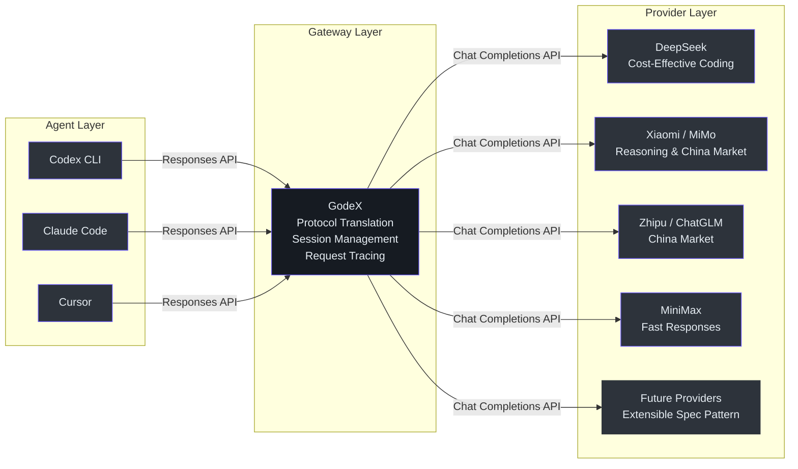
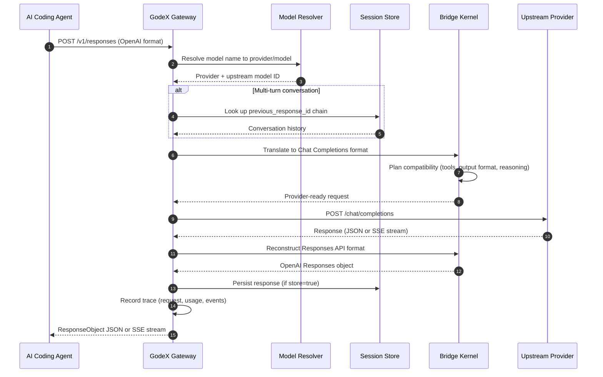
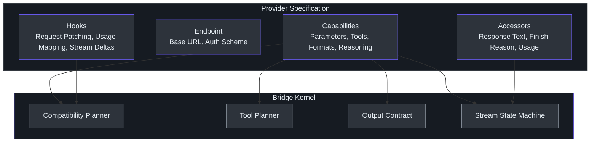

# Executive Guide

> **Audience**: VP/director-level engineering leaders evaluating GodeX for organizational adoption, cost optimization, or strategic AI infrastructure decisions.
>
> **Reading time**: ~15 minutes.
>
> **No code snippets** — this guide uses service-level diagrams and tables only.

---

## What GodeX Is

GodeX is an OpenAI-compatible Responses API gateway. It sits between AI coding agents (Codex CLI, Claude Code, Cursor) and non-OpenAI LLM providers (DeepSeek, Xiaomi, Zhipu/ChatGLM, MiniMax), translating requests and responses between the two protocols transparently.

The agents speak OpenAI's Responses API format. GodeX converts those requests into each provider's Chat Completions API format, calls the upstream provider, and converts the response back. The agent never knows it is not talking to OpenAI.

This matters because the Responses API is becoming the standard protocol for next-generation AI coding tools. Without GodeX, every non-OpenAI provider requires custom integration work per agent. With GodeX, one gateway handles all of them.

---

## Capability Map

### Core Service Capabilities

| Capability | Description | Business Value |
|-----------|-------------|----------------|
| **Protocol Translation** | Converts OpenAI Responses API requests to provider-specific Chat Completions API calls and back | Zero client-side code changes required |
| **Multi-Provider Routing** | Supports DeepSeek, Xiaomi, Zhipu/ChatGLM, and MiniMax with a single configuration file | Vendor diversification without fragmentation |
| **Streaming Support** | Passes through server-sent events (SSE) in real-time | Agents receive streaming responses indistinguishable from OpenAI |
| **Session Management** | Multi-turn conversations via `previous_response_id` chain resolution | Agents maintain conversation context across turns |
| **Model Aliasing** | Maps friendly model names (e.g., `gpt-5.5`) to actual provider/model combinations | Teams switch providers without changing agent configuration |
| **Tool Calling** | Translates Codex tool declarations (shell, apply_patch, function) into provider equivalents | Agents execute tools on non-OpenAI providers |
| **Structured Output** | Downgrades JSON Schema to JSON Object when the provider lacks native support | Consistent output format guarantees across providers |
| **Request Tracing** | SQLite-based trace recording for requests, usage, events, and errors | Full audit trail and debugging capability |
| **Usage Tracking** | Tracks input tokens, output tokens, cached tokens, and reasoning tokens per request | Cost visibility and chargeback capability |
| **Docker Deployment** | Pre-built images for linux/amd64 and linux/arm64 | Standard containerized deployment |

### Capability Maturity

| Capability | Maturity | Notes |
|-----------|----------|-------|
| Protocol translation (sync) | Stable | Core path, well-tested |
| Protocol translation (streaming) | Stable | State-machine-based SSE reconstruction |
| Tool calling degradation | Stable | Built-in Codex tools map to `function` on all providers |
| JSON Schema structured output | Beta | Downgraded to `json_object` with validation |
| Reasoning/thinking tokens | Beta | DeepSeek: native. Xiaomi: boolean toggle. Zhipu: boolean toggle. MiniMax: boolean adaptive/disabled thinking |
| Cached token tracking | Stable | Reported when provider returns cache metadata |
| Session chain resolution | Stable | Cycle detection, depth limits, incomplete response handling |
| Web search passthrough | Planned | Not yet implemented |
| Multi-tenant isolation | Not built | Single-tenant today |
| Automatic provider failover | Not built | Requests fail if the target provider is down |

---

## Technology Investment Thesis

### Why This Exists

AI coding agents are converging on the OpenAI Responses API as their standard protocol. But the best and cheapest models are not always from OpenAI. Teams face a choice: lock into OpenAI, or build and maintain custom integrations for each alternative provider.

GodeX eliminates that trade-off. One gateway, one configuration file, any supported provider.

### Business Value Drivers

| Driver | Explanation |
|--------|-------------|
| **Cost Optimization** | DeepSeek and MiniMax models are significantly cheaper than GPT-4-class models. GodeX lets teams use these cheaper providers without rewriting agent code or maintaining provider-specific SDK integrations. |
| **Vendor Diversification** | Dependency on a single LLM provider is a strategic risk. GodeX makes it trivial to route to multiple providers, reducing lock-in and providing negotiating leverage. |
| **China Market Access** | Xiaomi, Zhipu (ChatGLM), and MiniMax are leading China-market LLM providers. GodeX enables teams deploying AI coding tools in China to use domestic providers without custom integration work. The Zhipu coding endpoint is pre-configured. |
| **Protocol Future-Proofing** | The Responses API is the newer OpenAI standard for agentic AI interactions. As more tools adopt it, GodeX positions the organization to use any Chat Completions provider without waiting for native Responses API support. |
| **Operational Simplicity** | Single binary or Docker container. No external databases. No message brokers. SQLite for sessions and traces. One YAML configuration file. |

### Strategic Positioning

GodeX occupies the translation layer between agent tools and model providers. Adding a new provider requires implementing a single specification interface — no changes to agents, no changes to the bridge kernel.

---

## Architecture Overview

### Service Diagram

The following diagram shows the request flow from an AI coding agent through GodeX to the upstream provider and back.

### Component Responsibilities

| Component | Responsibility |
|-----------|---------------|
| **Server Routes** | Accept `/v1/responses`, `/v1/models`, and `/health` HTTP requests |
| **Model Resolver** | Translate model names and aliases to provider/model pairs |
| **Session Store** | Persist and retrieve multi-turn conversation chains |
| **Bridge Kernel** | Translate between Responses API and Chat Completions API; plan compatibility; handle tool mapping, output contracts, and streaming state |
| **Provider Specs** | Declare per-provider capabilities, endpoint configuration, and protocol quirks |
| **Trace Recorder** | Record request metadata, usage, events, and errors to SQLite |
| **Error Hierarchy** | Domain-specific error codes for server, bridge, provider, and session failures |

### Provider Specification Pattern

Each provider is defined by a compact specification that declares its capabilities, not its implementation. The bridge kernel reads these declarations and plans compatibility automatically.

This separation means adding a new provider does not require modifying the bridge kernel. The new provider declares what it supports, and the kernel adapts.

---

## Risk Assessment

### Technical Risks

| Risk | Likelihood | Impact | Mitigation |
|------|-----------|--------|------------|
| **Protocol drift** — OpenAI changes the Responses API in ways GodeX does not yet support | Medium | High | GodeX isolates the change to the bridge kernel. Agent code and provider specs remain untouched. Community updates typically follow OpenAI releases within days. |
| **Provider API changes** — Upstream providers modify their Chat Completions endpoints | Medium | Medium | Provider abstraction isolates changes to individual provider hooks. Other providers are unaffected. Each provider spec is independent. |
| **Streaming complexity** — SSE state machine edge cases (partial chunks, reordered events, missing terminal events) | Low | Medium | State machine has explicit transitions and terminal state validation. Invalid stream output is rewritten to a `response.failed` event rather than silently corrupting. |
| **Structured output downgrade gaps** — JSON Schema degradation loses validation fidelity | Low | Low | GodeX validates that output is valid JSON. Full JSON Schema conformance checking is not performed, but this is sufficient for most use cases. |
| **Session chain corruption** — Long chains with missing parents or cycles | Low | Medium | Built-in cycle detection, depth overflow protection, and incomplete response handling. Corrupted chains return structured errors, not silent failures. |

### Operational Risks

| Risk | Likelihood | Impact | Mitigation |
|------|-----------|--------|------------|
| **Single point of failure** — GodeX is a single-process gateway | Medium | High | Deploy multiple instances behind a load balancer. For session continuity, use SQLite backend and sticky sessions, or migrate to a shared session store. |
| **Latency overhead** — GodeX adds processing between agent and provider | Low | Low | Measured overhead is approximately 10-50ms per request for translation, compatibility planning, and session resolution. Dominated by upstream provider latency. |
| **Session storage scaling** — SQLite write contention under high concurrency | Low | Medium | SQLite handles concurrent reads well. Write contention can be mitigated with WAL mode and batched trace writes. For very high throughput, migrate sessions to an external database. |
| **Configuration errors** — Invalid godex.yaml blocks startup | Medium | Low | Config validation runs at startup with clear error messages. `godex config check` validates without starting the server. Legacy provider config without `spec` is explicitly rejected. |
| **Provider credential rotation** — API keys expire or are revoked | Medium | Medium | Environment variable interpolation (`${DEEPSEEK_API_KEY}`) supports standard secret management. Restart required for key rotation today. |

### Security Risks

| Risk | Likelihood | Impact | Mitigation |
|------|-----------|--------|------------|
| **API key exposure in config files** | Medium | High | Use environment variable interpolation. Never commit `godex.yaml` with hardcoded keys. CI pipelines should inject keys at deploy time. |
| **Trace payload sensitivity** — Captured payloads contain full request/response text | Low | High | Payload capture is disabled by default (`trace.capture_payload: false`). When enabled, treat the trace database as sensitive. Limit retention and access. |
| **No client authentication** — Any network-reachable client can use the gateway | High | Medium | Deploy behind a reverse proxy with authentication. Do not expose directly to the internet. This is the highest-priority gap for production deployment. |
| **No rate limiting** — Gateway accepts unlimited requests | High | Low | Deploy behind a rate-limiting reverse proxy. For internal team use, this is low risk. For shared environments, add external rate limiting. |
| **Pass-through data** — GodeX forwards all request content to upstream providers | By Design | Context-dependent | GodeX does not inspect, log, or modify request content beyond protocol translation. Organizations must trust their configured upstream providers. |

---

## Cost and Scaling Model

### Resource Requirements

GodeX is designed as a lightweight single-process gateway. Resource consumption is minimal compared to the upstream LLM providers.

| Resource | Baseline | Per-Request | Scaling Factor |
|----------|----------|-------------|----------------|
| **CPU** | <5% idle | ~10-50ms translation overhead | Proportional to concurrent requests (event-loop model) |
| **Memory** | ~50MB base | ~1KB per active session | Proportional to session store size and concurrent streaming connections |
| **Disk** | Minimal | SQLite writes for sessions and trace | Proportional to request volume and trace retention policy |
| **Network** | Pass-through | Same as upstream request/response | Dominated by upstream provider payload sizes |

### Latency Profile

| Operation | GodeX Overhead | Total (Typical) |
|-----------|---------------|-----------------|
| Request parsing and validation | <1ms | — |
| Model resolution | <1ms | — |
| Session chain lookup (SQLite) | <10ms | — |
| Compatibility planning and request building | <5ms | — |
| Provider call (network) | 0ms (pass-through) | 500ms - 10s (provider-dependent) |
| Response reconstruction | <5ms | — |
| Trace recording (async batch) | 0ms (non-blocking) | — |
| **Total GodeX overhead** | **~10-50ms** | **Dominated by upstream** |

### Scaling Limits

| Dimension | Limit | Strategy |
|-----------|-------|----------|
| Concurrent connections | Single-process event loop | Vertical scaling sufficient for single-team use |
| Session store | SQLite single-writer | WAL mode for read concurrency; migrate to external DB for multi-writer |
| Trace throughput | Batched async writes | Queue + flush interval (configurable) |
| Horizontal scaling | No shared state between instances | Deploy behind load balancer with sticky sessions; shared session store required |

### Cost Comparison

The primary cost saving comes from using cheaper providers. GodeX itself adds negligible infrastructure cost.

| Scenario | Without GodeX | With GodeX |
|----------|--------------|------------|
| Agent using OpenAI GPT-4 | OpenAI pricing only | — |
| Agent using DeepSeek instead | Custom integration engineering cost | One-time GodeX setup + DeepSeek pricing |
| Switching providers | Per-agent code changes + testing | Update one config line in `godex.yaml` |
| Multi-provider support | N x integration effort | Single gateway, N provider configs |

---

## Technology Stack

| Technology | Role | Justification |
|-----------|------|---------------|
| **Bun Runtime** | Execution environment | Native TypeScript, fast startup, single-binary compilation, Web Streams API support |
| **TypeScript** | Language | Type safety across provider specifications; strict mode with `verbatimModuleSyntax` |
| **SQLite (bun:sqlite)** | Session and trace persistence | Zero external dependencies, ACID transactions, embedded in process |
| **Web Streams API** | Streaming pipeline | Native platform API for composable SSE transformation stages |
| **Biome** | Linting and formatting | Single tool replacing ESLint + Prettier; fast Rust-based |
| **LogTape** | Structured logging | JSON structured logs with configurable levels and file output |
| **Commander.js** | CLI framework | Powers `godex init`, `godex serve`, `godex config check` commands |
| **Docker** | Containerized deployment | Multi-arch images (amd64, arm64) on Docker Hub and GHCR |

### Key Architectural Decisions

| Decision | Rationale |
|----------|-----------|
| Spec-based provider model | Providers declare capabilities, not implementations. The bridge kernel plans compatibility centrally. This prevents per-provider mapper forests and keeps the codebase maintainable. |
| Centralized bridge kernel | All Responses-to-Chat policy lives in `src/bridge/`. Provider hooks expose protocol differences only. This eliminates duplicated compatibility decisions across providers. |
| SQLite for persistence | No external database dependency. Suitable for single-gateway deployment. Can be replaced with an external store for horizontal scaling. |
| Domain error hierarchy | Structured error codes (server, bridge, provider, session) instead of raw errors. Every expected failure has a domain code, making monitoring and alerting reliable. |

---

## Provider Coverage

### Supported Providers

| Provider | Default Model | Reasoning | Tool Choice | Response Format | Cached Tokens | Special Notes |
|----------|--------------|-----------|-------------|----------------|---------------|---------------|
| **DeepSeek** | `deepseek-v4-pro` | Native (high, max) | auto, none, required, function | text, json_object | Yes | Best for cost-effective coding. Native reasoning support. |
| **Xiaomi / MiMo** | `mimo-v2.5-pro` | Boolean toggle | auto | text, json_object | Yes | Reasoning via thinking toggle. Up to 128 tools. |
| **MiniMax** | `MiniMax-M3` | Boolean toggle | auto, none, required, function | text, json_object | Yes | Fast responses, image/video understanding, and full tool choice support. |
| **Zhipu / ChatGLM** | `glm-5.1` | Boolean toggle | auto, none | text, json_object | Yes | China-market provider. Pre-configured coding endpoint. Web search tool support. |

### Adding New Providers

The provider specification pattern is designed for extensibility. A new provider requires:

1. A `ProviderSpec` declaring capabilities, endpoint, and auth scheme
2. Hooks for request patching and response/stream accessors
3. Protocol-specific DTOs if the provider's Chat Completions format differs

No changes to the bridge kernel, agent code, or other provider specs are needed.

---

## Observability

### Built-In Observability

| Signal | Source | Configuration |
|--------|--------|---------------|
| **Health endpoint** | `GET /health` | Always available. Returns registered and unsupported providers. |
| **Structured logging** | LogTape JSON logger | Level configurable via `godex.yaml`. Console and file output. |
| **Request tracing** | SQLite trace database | Enabled by default. Records request metadata, usage, events, and errors. |
| **Payload capture** | Trace subsystem | Disabled by default. Enable `trace.capture_payload: true` for debugging. Treat as sensitive. |
| **Error domain codes** | GodeXError hierarchy | Every expected failure maps to a domain code: `server.*`, `bridge.*`, `provider.*`, `session.*` |
| **Usage tracking** | Per-response `usage` field | Input tokens, output tokens, cached tokens, reasoning tokens. |

### What Is Not Built Yet

| Gap | Impact | Priority |
|-----|--------|----------|
| No Prometheus/OpenTelemetry metrics | Cannot integrate with standard observability stacks | Medium |
| No admin API for config reload | Requires restart for provider changes | Medium |
| No dashboard or UI | Trace data requires direct SQLite queries | Low |

---

## Team Onboarding

### Time to Productivity

| Role | Time to First Value | Path |
|------|-------------------|------|
| Developer using GodeX | 15 minutes | Install, run `godex init`, configure one provider, point agent at GodeX |
| Operator deploying GodeX | 30 minutes | Docker pull, create `godex.yaml`, deploy with env vars for API keys |
| Contributor adding a provider | 2-4 hours | Study existing provider spec pattern, implement spec + hooks + tests |
| Contributor modifying bridge kernel | 1-2 days | Understand compatibility planner, tool planner, stream state machine |

### Onboarding Paths

| If you are... | Read this... |
|---------------|-------------|
| A developer setting up GodeX for your team | Getting Started guide |
| A contributor joining the project | [Contributor Guide](./contributor-guide.md) |
| A staff engineer evaluating architecture decisions | [Staff Engineer Guide](./staff-engineer-guide.md) |
| A product manager understanding features | [Product Manager Guide](./product-manager-guide.md) |

---

## Recommendations

Based on the current state of GodeX, the following recommendations are ordered by priority for leadership consideration:

### 1. Add Client Authentication Before Production Exposure

GodeX has no built-in authentication. Before exposing the gateway beyond trusted internal networks, implement at minimum an API key check. This is the single highest-priority security gap. A reverse proxy with authentication is an acceptable interim solution.

### 2. Add Prometheus Metrics for Production Observability

Standard metrics — request latency histogram, error rate by provider, upstream latency, session store size, trace queue depth — would enable production monitoring without custom tooling. This is the highest-priority observability gap.

### 3. Implement Rate Limiting

Before multi-team or external access, add rate limiting. This prevents a single misconfigured agent from consuming all gateway capacity. External rate limiting via a reverse proxy is acceptable.

### 4. Plan for Horizontal Scaling

Today, GodeX is a single-process gateway with local session storage. For multi-team deployment, plan for a shared session store (Redis or PostgreSQL) to enable horizontal scaling behind a load balancer without sticky sessions.

### 5. Expand Provider Coverage Proactively

The spec-based architecture makes adding providers low-effort. As adoption grows, proactively add providers that teams request. Each new provider increases the value of the gateway without increasing integration complexity for consumers.

---

## Summary

GodeX delivers a focused, high-value capability: letting AI coding agents use any Chat Completions provider through a single OpenAI-compatible gateway. The architecture is clean, the provider model is extensible, and the operational footprint is minimal.

The primary risks are operational (single point of failure, no authentication, no rate limiting) rather than technical. These are addressable with standard infrastructure patterns and do not require changes to GodeX itself.

The investment thesis is straightforward: reduce provider lock-in, enable cost optimization, and provide China-market access — all without modifying agent code.

---

[Contributor Guide](./contributor-guide.md) · [Staff Engineer Guide](./staff-engineer-guide.md) · [Product Manager Guide](./product-manager-guide.md) · [Onboarding Index](./index.md)
