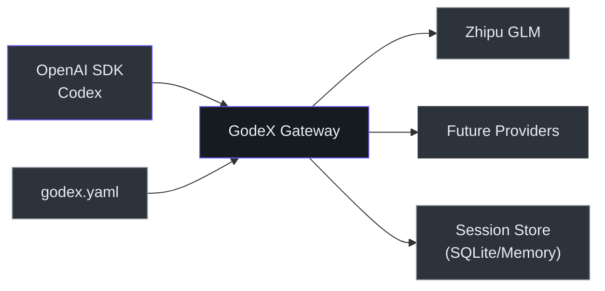
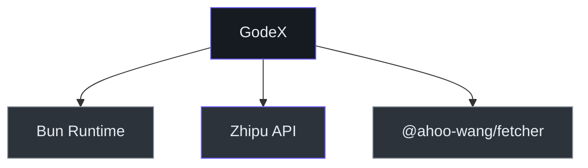

# Executive Guide

## System Overview

GodeX is an **API gateway** that translates OpenAI's Responses API into provider-specific Chat Completions API calls. It enables organizations to use Codex and other OpenAI-compatible clients with any configured LLM provider, without modifying client code. Built with TypeScript on Bun for high throughput and low latency.

## Capability Map

| Capability | Status | Maturity | Dependencies |
|-----------|--------|----------|-------------|
| OpenAI Responses API proxy | Built | Stable | Upstream provider API |
| Streaming (SSE) | Built | Stable | Upstream SSE support |
| Multi-provider routing | Built | Stable | Provider configuration |
| Model name aliasing | Built | Stable | — |
| Session chain resolution | Built | Stable | SQLite or memory backend |
| Tool/function calling | Built | Stable | Upstream tool support |
| Structured output | Built | Beta | Upstream JSON schema support |
| Reasoning/thinking tokens | Built | Beta | Upstream thinking support |
| Web search passthrough | Planned | — | Upstream web search API |
| Multi-tenant isolation | Not built | — | — |

## Architecture at a Glance

<!-- Sources: src/server/index.ts, src/providers/builtin.ts -->

## Technology Investment Thesis

| Technology | Purpose | Alternatives Considered | Risk Level |
|-----------|---------|------------------------|-----------|
| Bun runtime | Performance, native TS, single-binary compilation | Node.js, Deno | Low — Bun is production-ready |
| TypeScript | Type safety across provider specs | JavaScript, Go | Low — industry standard |
| SQLite (bun:sqlite) | Session persistence with zero external deps | Redis, PostgreSQL | Low — embedded, ACID |
| Web Streams API | Streaming pipeline composition | RxJS, custom event system | Low — native platform API |
| Biome | Linting + formatting (single tool) | ESLint + Prettier | Low — active development |

## Risk Assessment

| Risk | Likelihood | Impact | Mitigation | Owner |
|------|-----------|--------|------------|-------|
| Upstream provider API changes | Medium | High | Provider abstraction isolates changes | Contributor |
| Single provider dependency (Zhipu) | Low | High | Provider interface designed for extensibility | Contributor |
| Bun runtime regression | Low | Medium | Bun maintains Node.js compatibility | External |
| Session data loss (SQLite) | Low | Medium | ACID transactions, can add backup | Operator |

## Dependency Map

<!-- Sources: package.json -->

## Key Metrics & Observability

| Metric | Current State | Notes |
|--------|--------------|-------|
| Health endpoint | Built | `GET /health` returns 200 |
| Structured logging | Built | JSON logger with log levels |
| Error codes | Built | Domain-specific error codes per layer |
| Request tracing | Partial | `requestId` via nanoid per request |

## Technical Debt Summary

| Issue | Business Impact | Effort to Fix | Priority |
|-------|----------------|---------------|----------|
| Single provider (Zhipu only) | Limits provider choice | Medium | High |
| No admin API for config reload | Requires restart for changes | Low | Medium |
| No rate limiting | Vulnerable to abuse | Low | Medium |

## Recommendations

1. **Add a second provider** (e.g., OpenAI, DeepSeek) to validate the bridge pattern and reduce single-provider risk
2. **Add request-level metrics** (latency histograms, error rates) for production observability
3. **Implement rate limiting** before exposing the gateway to external traffic
4. **Add hot config reload** to avoid downtime during provider configuration changes

[Contributor Guide](./contributor-guide.md) · [Staff Engineer Guide](./staff-engineer-guide.md)
