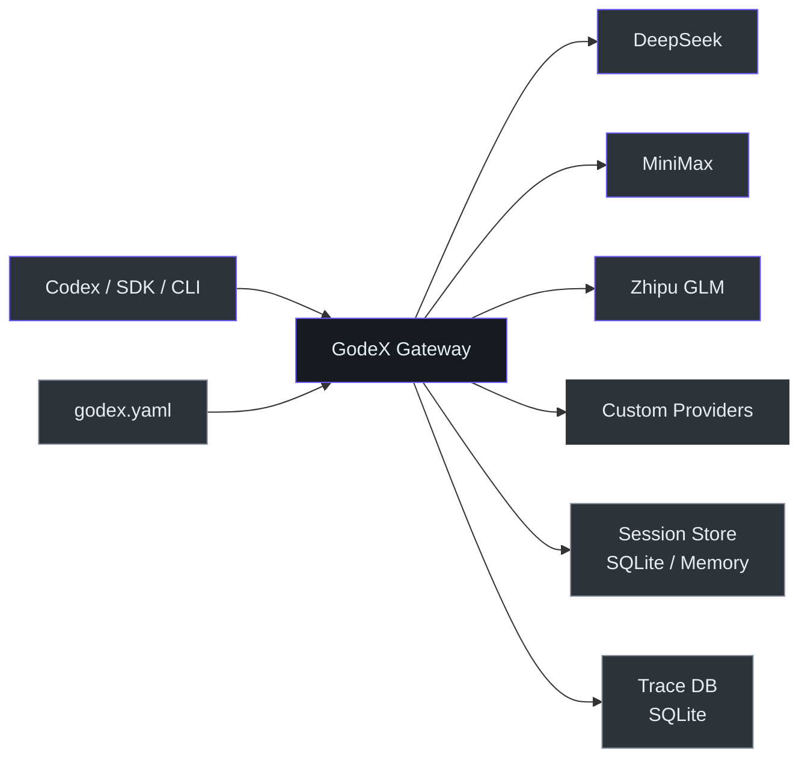
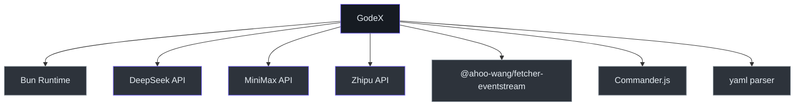

# Executive Guide

## System Overview

GodeX is an API gateway that translates OpenAI's Responses API into provider-specific Chat Completions API calls. It enables teams to use Codex CLI and other OpenAI-compatible tools with DeepSeek, MiniMax, Zhipu, or any Chat Completions provider — without modifying client code. Built with TypeScript on the Bun runtime for high throughput and low latency.

## Capability Map

| Capability | Status | Maturity | Dependencies |
|-----------|--------|----------|-------------|
| OpenAI Responses API proxy | Built | Stable | Upstream provider API |
| Streaming (SSE) | Built | Stable | Upstream SSE support |
| Multi-provider routing | Built | Stable | Provider configuration |
| Model name aliasing | Built | Stable | — |
| Session chain resolution | Built | Stable | SQLite or memory backend |
| Tool/function calling | Built | Stable | Upstream tool support |
| Structured output (json_object) | Built | Stable | Upstream JSON support |
| Structured output (json_schema) | Built | Beta | Downgraded to json_object when provider lacks support |
| Reasoning/thinking tokens | Built | Beta | Provider-specific (DeepSeek native, Zhipu boolean) |
| Cached token tracking | Built | Stable | Provider support |
| Trace recording | Built | Stable | SQLite |
| Docker deployment | Built | Stable | linux/amd64, linux/arm64 |
| Web search passthrough | Planned | — | Upstream web search API |
| Multi-tenant isolation | Not built | — | — |

## Architecture at a Glance

<!-- Sources: src/server/index.ts, src/providers/ -->

## Team Topology

| Component | Owner | Criticality | Bus Factor |
|-----------|-------|-------------|-----------|
| Bridge kernel (`src/bridge/`) | Core contributors | Critical — all requests flow through | 1-2 |
| Provider specs (`src/providers/`) | Core contributors + community | High — each provider is independent | 2-3 |
| Session management | Core contributors | Medium — can degrade to memory-only | 1-2 |
| Trace system | Core contributors | Low — diagnostic only | 1-2 |
| CLI and config | Core contributors | Low — startup only | 1-2 |
| Wiki documentation | Core contributors | Low — informational | 1-2 |

## Technology Investment Thesis

| Technology | Purpose | Alternatives Considered | Risk Level |
|-----------|---------|------------------------|-----------|
| Bun runtime | Performance, native TypeScript, single-binary compilation | Node.js, Deno | Low — Bun is production-ready |
| TypeScript | Type safety across provider specs | JavaScript, Go | Low — industry standard |
| SQLite (bun:sqlite) | Session persistence and trace recording with zero external deps | Redis, PostgreSQL | Low — embedded, ACID |
| Web Streams API | Streaming pipeline composition | RxJS, custom event system | Low — native platform API |
| Biome | Linting + formatting (single tool) | ESLint + Prettier | Low — active development |

## Risk Assessment

| Risk | Likelihood | Impact | Mitigation | Owner |
|------|-----------|--------|------------|-------|
| Upstream provider API changes | Medium | High | Provider abstraction layer isolates changes to individual provider hooks | Contributor |
| Provider credential exposure | Medium | High | Config uses env variable interpolation; no credentials in code | Operator |
| Bun runtime regression | Low | Medium | Bun maintains Node.js compatibility; pin Bun version in CI | External |
| Session data loss (SQLite) | Low | Medium | ACID transactions; can add backup or migrate to external DB | Operator |
| Single-process bottleneck | Low | Medium | Vertical scaling sufficient for single-gateway use; can deploy multiple instances behind load balancer | Operator |

## Cost & Scaling Model

GodeX is a lightweight single-process gateway. Resource costs are minimal:

| Resource | Usage | Scaling Factor |
|----------|-------|---------------|
| CPU | <5% per concurrent request | Proportional to concurrent streaming connections |
| Memory | ~50MB base + ~1KB per active session | Proportional to session store size |
| Disk | SQLite files (sessions + trace) | Proportional to request volume and trace retention |
| Network | Pass-through to upstream | Proportional to request/response payload sizes |

Scaling limits: single-process event loop. For high-throughput scenarios, deploy multiple instances behind a load balancer with sticky sessions (for `previous_response_id` support).

## Dependency Map

<!-- Sources: package.json -->

| Dependency | Type | Risk if Unavailable |
|-----------|------|-------------------|
| Bun runtime | Platform | Complete outage — no fallback runtime |
| DeepSeek API | Service | DeepSeek provider unavailable; other providers unaffected |
| MiniMax API | Service | MiniMax provider unavailable; other providers unaffected |
| Zhipu API | Service | Zhipu provider unavailable; other providers unaffected |
| `@ahoo-wang/fetcher-eventstream` | Library | Streaming broken; can vendor if needed |

## Key Metrics & Observability

| Metric | Source | Notes |
|--------|--------|-------|
| Health check | `GET /health` | Returns 200 when server is ready |
| Structured logging | JSON logger | Log levels configurable via `godex.yaml` |
| Error codes | Domain-specific codes | `server`, `bridge`, `provider`, `session` domains |
| Request tracing | SQLite trace DB | Records requests, responses, stream events, usage, errors |
| Trace payload capture | Configurable | `trace.capture_payload: true` enables full payload recording |

## Technical Debt Summary

| Issue | Business Impact | Effort to Fix | Priority |
|-------|----------------|---------------|----------|
| No client authentication layer | Relies on network-level security | Medium | High |
| No rate limiting | Vulnerable to abuse in shared environments | Low | Medium |
| No admin API for config reload | Requires restart for provider changes | Low | Medium |
| No Prometheus/OpenTelemetry metrics | Limited production observability | Medium | Medium |
| No request timeout per provider | Uses fetch default; may hang on slow providers | Low | Low |

## Recommendations

1. **Add client authentication** before exposing the gateway beyond trusted networks — even a simple API key check would prevent unauthorized use
2. **Add Prometheus metrics** (request latency, error rate, upstream latency) for production observability
3. **Implement rate limiting** before exposing the gateway to external traffic
4. **Add hot config reload** to avoid downtime during provider configuration changes
5. **Expand provider coverage** to include additional providers as adoption grows — the spec-based architecture makes this low-effort

[Contributor Guide](./contributor-guide.md) · [Staff Engineer Guide](./staff-engineer-guide.md)
