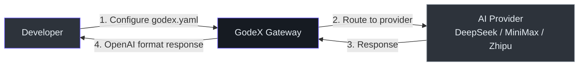
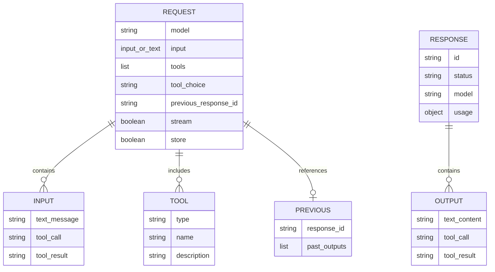

# Product Manager Guide

## What This System Does

GodeX is a **translator** between two AI API formats. Your team writes code using OpenAI's Responses API once, and GodeX automatically converts those requests to work with different AI providers (like DeepSeek, MiniMax, and Zhipu). Think of it as a universal adapter — plug in any supported AI model, and your existing tools (like Codex CLI) just work.

No code changes needed on the client side. Just point your tool at GodeX, configure which providers to use, and everything connects.

## User Journey

<!-- Sources: src/server/routes/, src/config/ -->

The developer configures providers once in `godex.yaml`, then sends requests using OpenAI format. GodeX handles the translation transparently.

## Supported Providers

| Provider | Best For | Default Model | Special Features |
|----------|----------|---------------|-----------------|
| DeepSeek | General coding, reasoning tasks | `deepseek-v4-pro` | Native reasoning, cached tokens |
| MiniMax | Fast responses, tool calling | `MiniMax-M2.7` | Cached tokens |
| Zhipu | Chinese-language coding | `glm-5.1` | Boolean reasoning, cached tokens |

## Feature Capability Map

| Feature | Status | User-Facing Behavior | Limitations |
|---------|--------|---------------------|-------------|
| Text generation | Live | Send messages, get AI responses | Depends on provider model |
| Streaming responses | Live | See responses appear in real-time | SSE only, no WebSocket |
| Multi-turn conversations | Live | Continue previous chats using `previous_response_id` | Session stored locally |
| Tool/function calling | Live | AI can call tools you define | Limited to provider-supported types |
| Model routing | Live | Use `"provider/model"` to pick provider and model | Must be pre-configured |
| Model aliases | Live | Map friendly names like `"gpt-5.5"` to actual models | Static config, no auto-discovery |
| Reasoning/thinking | Beta | See AI's reasoning process | Only if provider supports it |
| Structured output (JSON) | Live | Force AI to respond in JSON format | Provider must support json_object |
| Structured output (JSON Schema) | Beta | Force AI to respond matching a JSON Schema | Downgraded to json_object when provider lacks support |
| Cached token tracking | Live | Track how many tokens were served from cache | Provider must support it |
| Trace recording | Live | Debug and audit all requests and responses | Requires SQLite |
| Docker deployment | Live | Run in containers on any platform | linux/amd64, linux/arm64 |
| Web search | Not available | — | Planned |
| Image generation | Not available | — | Planned |

## Data Model (Product View)

<!-- Sources: src/protocol/openai/responses.ts -->

A Request contains inputs (messages or tool results), optional tools, and may reference a previous conversation turn. The Response contains output items (text, tool calls) and usage statistics.

## Configuration & Feature Flags

| Setting | What It Controls | Default | Who Can Change |
|---------|-----------------|---------|---------------|
| `server.port` | Which port the gateway listens on | `5678` | Operator (config file) |
| `default_provider` | Which AI provider to use when model name has no prefix | — | Operator (config file) |
| `providers.*.api_key` | Authentication key for each AI provider | — | Operator (env var or config) |
| `models.aliases` | Model name shortcuts (e.g., `"gpt-5.5"` → `deepseek/deepseek-v4-pro`) | — | Operator (config file) |
| `session.backend` | Where conversation history is stored | `memory` | Operator (config file) |
| `trace.enabled` | Whether to record request traces | `true` | Operator (config file) |
| `trace.capture_payload` | Whether to save full request/response bodies | `false` | Operator (config file) |
| `logging.level` | How much detail to log | `info` | Operator (config file) |

## API Capabilities

| Endpoint | Method | Purpose | Notes |
|----------|--------|---------|-------|
| `/v1/responses` | POST | Main AI request endpoint (sync or streaming) | OpenAI Responses API format |
| `/v1/models` | GET | List configured model aliases | Excludes wildcard `*` alias |
| `/health` | GET | Check if gateway is running | Returns 200 when healthy |

Integration partners should use the OpenAI SDK with `baseURL` pointed at GodeX.

## Performance & SLAs

| Operation | Expected Latency | Notes |
|-----------|-----------------|-------|
| Non-streaming request | Upstream latency + ~1ms overhead | Gateway adds minimal translation overhead |
| Streaming first token | Upstream time-to-first-token | Gateway is pass-through after translation |
| Session chain resolution | <10ms | Local SQLite lookup |
| Model alias resolution | <1ms | In-memory lookup |

There are no hard SLAs. Performance is dominated by upstream provider latency.

## Known Limitations & Constraints

| Limitation | User Impact | Workaround | Planned Fix |
|-----------|-------------|------------|-------------|
| No built-in authentication | Cannot restrict who uses the gateway | Deploy behind a reverse proxy with auth | Yes |
| No rate limiting | Gateway vulnerable to excessive requests | External rate limiter | Yes |
| No automatic failover | If a provider goes down, requests to that provider fail | Configure multiple providers and route manually | Under consideration |
| Sessions lost on memory backend restart | Conversation history disappears on gateway restart | Use SQLite backend (`session.backend: sqlite`) | By design |
| No admin UI | Configuration requires file editing | CLI commands for basic setup (`godex init`) | Under consideration |
| Wildcard alias `*` not listed | Models endpoint doesn't show the catch-all alias | Check config file directly | By design |
| No request queuing | All requests processed immediately | Size your deployment for peak load | Not planned |

## Data & Privacy

| Data Type | Storage Location | Retention | Notes |
|-----------|-----------------|-----------|-------|
| Session history | Local (memory or SQLite) | Until manually cleared | Only if `store: true` (default) |
| Request traces | Local SQLite | Until manually cleared | Only if `trace.enabled: true` |
| Request payloads | Local SQLite (opt-in) | Until manually cleared | Only if `trace.capture_payload: true` |
| API keys | Config file or env vars | Permanent until rotated | Never sent to third parties |
| AI responses | Pass-through only | Not stored by default | Only stored in session if `store: true` |

GodeX is a pass-through gateway. It does not send data to any third party beyond the configured upstream provider. All persistent data stays on the machine where GodeX runs.

## Glossary

| Term | Plain Language |
|------|---------------|
| **Gateway** | A service that sits between your app and the AI provider, translating requests |
| **Provider** | An AI service (like DeepSeek or MiniMax) that actually generates responses |
| **Session** | A saved conversation that can be continued later |
| **Streaming** | Getting the AI's response piece by piece in real-time instead of waiting for the full answer |
| **Tool calling** | Letting the AI trigger actions (like running a shell command) during a conversation |
| **Model** | A specific version of an AI (like "deepseek-v4-pro") |
| **SSE** | Server-Sent Events — a way to stream data from server to client |
| **Alias** | A friendly name for a model (like "gpt-5.5" instead of "deepseek/deepseek-v4-pro") |
| **Cached tokens** | Tokens that the AI provider already processed before, so they're faster and cheaper |
| **Trace** | A record of what happened during a request, useful for debugging |

## FAQ

**Q: Do I need to change my OpenAI SDK code to use GodeX?**
A: No. Just point your OpenAI SDK's `baseURL` to GodeX and configure the provider in `godex.yaml`. The SDK sends OpenAI format; GodeX translates.

**Q: Can I use multiple AI providers at the same time?**
A: Yes. Use `"provider/model"` syntax in the model field to route to different providers. You can also set up aliases for convenience.

**Q: What happens if the upstream AI provider goes down?**
A: GodeX returns a structured error with a provider-specific error code. It does not currently retry or failover to another provider automatically.

**Q: Is my data sent anywhere besides the configured AI provider?**
A: No. GodeX is a pass-through gateway. Session data and traces are stored locally in memory or SQLite. No data is sent to third parties.

**Q: Can I deploy GodeX in production?**
A: Yes. GodeX compiles to a standalone binary and supports Docker. For production, consider adding authentication and rate limiting via a reverse proxy.

**Q: How do I add a new AI provider?**
A: A developer needs to implement the provider interface. See the [Contributor Guide](./contributor-guide.md) for details. The spec-based architecture makes this straightforward.

**Q: What's the difference between memory and SQLite session storage?**
A: Memory is faster but sessions are lost when GodeX restarts. SQLite persists sessions across restarts. For development, memory is fine; for production, use SQLite.

**Q: Can I use GodeX with the Codex CLI?**
A: Yes — that's the primary use case. Set the Codex CLI's API endpoint to your GodeX server and configure a provider in `godex.yaml`.

**Q: Does GodeX support JSON Schema structured output?**
A: Yes, with automatic downgrade. If the provider supports `json_object` but not `json_schema`, GodeX includes the schema as a prompt instruction and validates the output.

**Q: What models are available?**
A: GodeX routes to whatever models your configured providers offer. Default models are `deepseek-v4-pro` (DeepSeek), `MiniMax-M2.7` (MiniMax), and `glm-5.1` (Zhipu). You can configure others via model aliases.

[Contributor Guide](./contributor-guide.md) · [Getting Started](/01-getting-started/overview)
