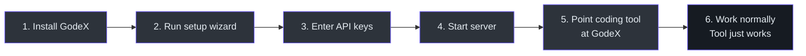
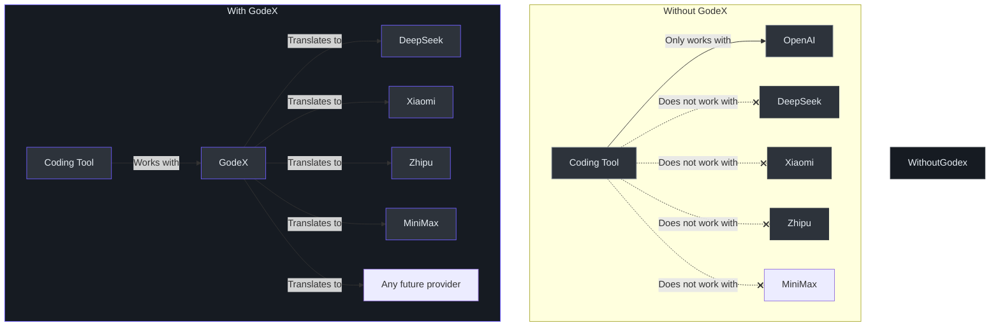
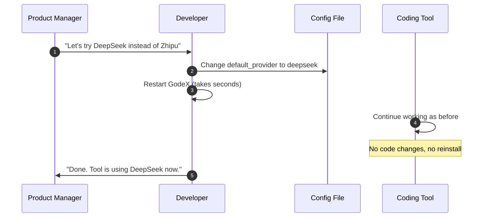
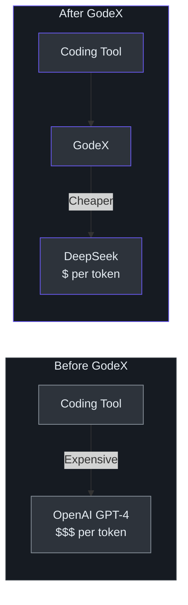
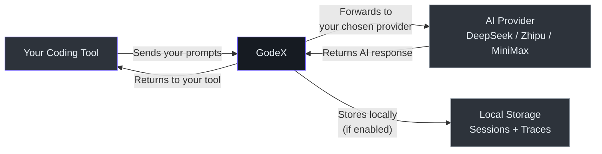

# Product Manager Guide

> **Audience**: Product managers, business analysts, project managers, and non-engineering stakeholders who need to understand what GodeX does, why it matters, and what the boundaries are.
>
> **Reading time**: ~15 minutes.
>
> **No engineering jargon** — technical terms are defined in the Glossary.

---

## What GodeX Does (Plain English)

### The Universal Adapter for AI Coding Tools

Imagine you are traveling internationally. Your phone charger has a US plug, but the wall outlet in Europe is different. You use a **universal power adapter** — it converts the plug shape so your charger works anywhere.

GodeX is that adapter, but for AI coding tools.

Your AI coding assistant (like Codex CLI) expects to talk to OpenAI in a specific format. But you might want to use a different AI provider — like DeepSeek (which is cheaper) or Zhipu (which works better in China). These providers speak a different format.

**GodeX sits in the middle and translates.** Your coding assistant talks to GodeX in OpenAI format. GodeX translates and forwards the request to whichever provider you configured. The provider responds, GodeX translates the response back to OpenAI format, and your assistant carries on as if nothing changed.

Your coding tool never knows it is not talking to OpenAI. You never change your tool's code. You just configure GodeX once and everything connects.

### The One-Sentence Summary

GodeX lets your team use cheaper or region-specific AI models with coding tools that were built for OpenAI, without changing any code.

---

## User Journey Maps

### Journey 1: Developer Sets Up GodeX (The Happy Path)

**What happens at each step:**

1. **Install GodeX** — Download the tool (npm package or Docker image)
2. **Run setup wizard** — A guided command (`godex init`) asks which AI providers to use
3. **Enter API keys** — Provide access keys for each AI provider (like passwords for the AI services)
4. **Start server** — Run `godex serve` to start the translation service
5. **Point coding tool at GodeX** — Tell your coding assistant to send requests to GodeX instead of OpenAI
6. **Work normally** — The coding assistant works exactly as before, but uses your chosen AI provider

**Time to complete**: 10-15 minutes for a developer familiar with command-line tools.

### Journey 2: Without GodeX vs. With GodeX

**Without GodeX**: Your coding tool only works with OpenAI. To use a different provider, someone has to write custom integration code for each tool and each provider.

**With GodeX**: Your coding tool works with any supported provider. Switching providers is a one-line configuration change.

### Journey 3: Switching Providers

This is the key value proposition for PMs: **provider decisions become configuration, not engineering work.**

---

## Feature Capability Map

### What Works Today

| Feature | Status | What This Means for Users |
|---------|--------|--------------------------|
| **Text generation** | Live | Send a question or instruction, get an AI-written response |
| **Streaming responses** | Live | Watch the AI type its response in real-time, word by word |
| **Multi-turn conversations** | Live | The AI remembers previous messages in the same conversation |
| **Tool/function calling** | Live | The AI can trigger actions (like running code or applying changes) during a conversation |
| **Model name aliases** | Live | Use friendly names like "coding-assistant" instead of technical model names |
| **Multiple providers at once** | Live | Different team members or projects can use different AI providers simultaneously |
| **JSON output format** | Live | Force the AI to respond in JSON format for structured data |
| **Reasoning / thinking** | Beta | See the AI's reasoning process before the final answer (provider-dependent) |
| **Cached token tracking** | Live | See how many tokens were served from cache (cheaper and faster) |
| **Request tracing** | Live | Full audit trail of every request for debugging and compliance |
| **Docker deployment** | Live | Run in a container on any cloud platform or local machine |

### What Is Limited

| Feature | Limitation | User Impact |
|---------|-----------|-------------|
| **Reasoning support** | Varies by provider: DeepSeek has native support; Xiaomi, Zhipu, and MiniMax use boolean thinking switches | Choose the provider whose thinking behavior fits the task |
| **Tool choice control** | Xiaomi only supports "auto"; Zhipu supports "auto" and "none" (no "required" or specific function) | On Xiaomi or Zhipu, you cannot force the AI to always call a specific tool |
| **JSON Schema validation** | Downgraded to JSON Object format when the provider does not support schemas | The AI will produce JSON, but strict schema validation is not guaranteed on all providers |
| **Web search** | Not yet supported | The AI cannot search the web for information during a conversation |

### What Does Not Work Yet

| Feature | Status | When |
|---------|--------|------|
| **Web search integration** | Planned | Future release |
| **Image generation** | Planned | Future release |
| **Automatic failover** | Under consideration | If one provider goes down, requests do not automatically reroute to another |
| **Built-in authentication** | Not built | Anyone who can reach the server can use it |
| **Rate limiting** | Not built | No protection against excessive requests |
| **Admin dashboard** | Under consideration | Configuration requires editing a file |

---

## Supported AI Models

### Provider Overview

| Provider | What It Is Best For | Default Model | Models Available |
|----------|-------------------|---------------|-----------------|
| **DeepSeek** | Cost-effective coding and reasoning | `deepseek-v4-pro` | `deepseek-v4-pro`, `deepseek-v4-flash`, and others from DeepSeek's catalog |
| **Xiaomi / MiMo** | Reasoning and China-market deployment | `mimo-v2.5-pro` | `mimo-v2.5-pro`, `mimo-v2.5`, `mimo-v2-flash`, and others from MiMo's catalog |
| **MiniMax** | Fast responses, tool calling, and image/video understanding | `MiniMax-M3` | `MiniMax-M3` and others from MiniMax's catalog |
| **Zhipu / ChatGLM** | China-market deployment and Chinese-language coding | `glm-5.2` | `glm-5.2`, `glm-5.1` and others from Zhipu's catalog |

> **Note**: GodeX routes to whatever models your configured providers offer. The default models above are just the recommended starting points. You can configure any model from each provider's catalog.

### Provider Comparison

| Capability | DeepSeek | Xiaomi | MiniMax | Zhipu |
|-----------|----------|--------|---------|-------|
| Text generation | Yes | Yes | Yes | Yes |
| Streaming | Yes | Yes | Yes | Yes |
| Tool calling (functions) | Yes | Yes | Yes | Yes |
| Tool choice: auto | Yes | Yes | Yes | Yes |
| Tool choice: none | Yes | No | Yes | Yes |
| Tool choice: required | Yes | No | Yes | No |
| Tool choice: specific function | Yes | No | Yes | No |
| JSON output | Yes | Yes | Yes | Yes |
| Reasoning / thinking | Yes (native) | Yes (boolean) | Yes (boolean) | Yes (basic) |
| Image/video understanding | No | No | Yes | No |
| Cached tokens | Yes | Yes | Yes | Yes |
| Web search tools | No | No | No | Yes (via Zhipu's web_search) |
| Max concurrent tools | 128 | 128 | 128 | 128 |

---

## Use Cases

### Use Case 1: Cost Savings

**Scenario**: Your team uses Codex CLI for coding assistance. Currently, every request goes to OpenAI, which is the most expensive option.

**With GodeX**: Route requests to DeepSeek instead. DeepSeek models are significantly cheaper per token than GPT-4-class models.

**Who benefits**: Engineering managers tracking cloud costs, finance teams reviewing AI spend, teams with high-volume coding assistance usage.

### Use Case 2: China Market Deployment

**Scenario**: Your company has engineering teams in China. OpenAI services are not reliably accessible from China.

**With GodeX**: Route requests to Zhipu (ChatGLM), a leading China-market AI provider with a pre-configured coding endpoint. The coding tool works the same way — the team does not need special training.

**Who benefits**: Global engineering organizations with China-based teams, companies deploying AI tools in the Chinese market.

### Use Case 3: Provider Comparison and Evaluation

**Scenario**: Your team is evaluating which AI model produces the best code for your use case. You want to compare outputs side-by-side.

**With GodeX**: Set up model aliases for each provider. Run the same prompt through DeepSeek, Xiaomi, MiniMax, and Zhipu by changing one line in the request. Compare outputs without switching tools or writing integration code.

**Who benefits**: Technical product managers evaluating AI models, ML engineers benchmarking providers, teams deciding which provider to use.

### Use Case 4: Provider Fallback

**Scenario**: Your primary AI provider has an outage. Your coding tools stop working.

**With GodeX**: Switch to a backup provider by changing one line in the configuration file and restarting. Your team is back to work in seconds.

**Who benefits**: Teams that depend on AI coding tools for daily productivity, organizations that cannot tolerate tool downtime.

### Use Case 5: Multi-Team Provider Management

**Scenario**: You manage multiple engineering teams. One team works with sensitive data and must use a specific provider. Another team is cost-sensitive and wants the cheapest option.

**With GodeX**: Deploy separate GodeX instances with different configurations. Each team's coding tool points to their own GodeX instance with their own provider settings.

**Who benefits**: Engineering managers with multiple teams, platform teams managing AI infrastructure, organizations with compliance requirements.

---

## Known Limitations

### Limitations That Affect Users

| Limitation | What This Means | Workaround |
|-----------|----------------|------------|
| **No built-in login or access control** | Anyone who can reach the GodeX server can use it | Deploy behind a secure network or add a reverse proxy with authentication |
| **No automatic failover** | If your chosen AI provider goes down, requests fail until you switch providers | Keep a second provider configured; switch manually in the config file |
| **Sessions lost on restart (memory mode)** | If you use the default session storage and restart GodeX, conversation history is lost | Use SQLite session storage (`session.backend: sqlite`) to persist conversations |
| **No admin interface** | Configuration changes require editing a file and restarting the server | Use the CLI wizard (`godex init`) for initial setup |
| **Provider differences exist** | Not all providers support all features (see Provider Comparison above) | Choose providers based on the features your team needs |
| **Restart required for config changes** | Changing providers or model aliases requires restarting GodeX | Restart takes seconds; plan changes during low-usage periods |
| **No request queuing** | All requests are processed immediately | Ensure your deployment can handle peak load |

### Limitations That Affect Administrators

| Limitation | What This Means | Workaround |
|-----------|----------------|------------|
| **No rate limiting** | The gateway accepts unlimited requests | Deploy behind a rate-limiting proxy for shared environments |
| **No usage quotas per user** | Cannot limit how much one person or team uses the gateway | Monitor usage through the trace database |
| **No Prometheus metrics** | Cannot connect to standard monitoring dashboards | Check the trace database directly, or parse structured logs |
| **Single-process architecture** | GodeX runs as one process; no built-in clustering | Deploy multiple instances behind a load balancer for high availability |
| **SQLite write limits** | Very high request volumes may contend on session/trace writes | Adjust trace batch settings; consider external database for very high throughput |

---

## Data and Privacy Overview

### What Data GodeX Handles

Understanding data flow is important for privacy and compliance decisions.

### Data Storage Details

| Data Type | Where It Goes | Who Can See It | How Long It Stays |
|-----------|--------------|----------------|-------------------|
| **Your prompts and questions** | Passed through to the AI provider you chose | The AI provider you configured (e.g., DeepSeek, Zhipu) | According to the provider's data policy |
| **AI responses** | Passed back to your coding tool | Only the person who made the request | Not stored by GodeX unless session storage is enabled |
| **Conversation history** | Stored locally on the machine running GodeX (if session storage is enabled) | Anyone with access to the GodeX server | Until manually deleted |
| **Request traces** | Stored locally on the machine running GodeX (if tracing is enabled) | Anyone with access to the GodeX server | Until manually deleted |
| **Full request/response payloads** | Stored locally ONLY if explicitly enabled (`trace.capture_payload: true`) | Anyone with access to the trace database | Until manually deleted |
| **API keys** | Stored in the configuration file or environment variables on the GodeX server | Anyone with access to the server config | Until rotated by an administrator |

### Key Privacy Points

- **GodeX does not send your data to any third party** beyond the AI provider you configured.
- **GodeX does not have a cloud service** — it runs entirely on your infrastructure.
- **Full payload capture is off by default** — you must explicitly enable it.
- **API keys are never sent to third parties** — they are only used to authenticate with the AI provider you chose.
- **Data residency is determined by where you deploy GodeX** and which providers you configure.

### Compliance Considerations

| Concern | How GodeX Addresses It |
|---------|----------------------|
| **Data residency** | GodeX runs on your infrastructure. Choose providers that meet your residency requirements. |
| **Audit trail** | Trace recording provides a full record of all requests and responses (when enabled). |
| **Access control** | No built-in access control today. Deploy behind a secure network or authentication proxy. |
| **Data retention** | You control retention by managing the SQLite databases. GodeX does not delete data automatically. |
| **Sensitive data in traces** | Full payload capture is off by default. When enabled, treat the trace database as sensitive. |

---

## FAQ

### Getting Started

**Q: What do I need to start using GodeX?**

A: You need three things: (1) GodeX installed on a machine, (2) an API key from at least one AI provider (DeepSeek, MiniMax, or Zhipu), and (3) a coding tool that supports the OpenAI API format (like Codex CLI).

**Q: How long does setup take?**

A: About 10-15 minutes for someone comfortable with command-line tools. Run the setup wizard, enter your API key, start the server, point your coding tool at GodeX.

**Q: Do I need to change my coding tool's code?**

A: No. Most OpenAI-compatible tools let you change the "base URL" (the server address) in their settings. Point it at your GodeX server instead of OpenAI, and everything else works the same.

### Provider Questions

**Q: Can I use multiple AI providers at the same time?**

A: Yes. Configure all your providers in the setup file. Then use model names to route requests to different providers. For example, `deepseek/deepseek-v4-pro` goes to DeepSeek, `zhipu/glm-5.1` goes to Zhipu.

**Q: What happens if my AI provider goes down?**

A: Requests to that provider will fail with an error message. Other providers are unaffected. You can switch to a working provider by updating the configuration file and restarting GodeX.

**Q: Which provider should I use?**

A: It depends on your priorities:
- **Cheapest**: DeepSeek
- **Works in China**: Zhipu
- **Fastest responses**: MiniMax
- **Best reasoning**: DeepSeek

You can try multiple providers and compare results.

**Q: Can I add a provider that is not on the supported list?**

A: Adding a new provider requires development work. The architecture is designed to make this straightforward — a developer implements a specification for the new provider. See the Contributor Guide for details.

### Cost Questions

**Q: How much does GodeX cost?**

A: GodeX is open-source software (Apache-2.0 license). It is free to use. You only pay for the AI provider API calls that GodeX routes to.

**Q: Does GodeX add extra cost per request?**

A: No. GodeX does not add per-request fees. It adds a tiny amount of processing time (about 10-50 milliseconds) per request, but this is negligible compared to the AI provider's response time.

**Q: How much can I save by using a cheaper provider?**

A: DeepSeek models are typically much cheaper than OpenAI GPT-4-class models per token. The exact savings depend on your usage volume. Check each provider's pricing page for current rates.

### Security Questions

**Q: Is GodeX secure?**

A: GodeX is designed to run on trusted internal networks. It does not have built-in user authentication or rate limiting. For production use, deploy it behind a secure network or a reverse proxy with authentication.

**Q: Where are my API keys stored?**

A: API keys are stored in the GodeX configuration file or as environment variables on the server. They are never sent to anyone except the AI provider they belong to.

**Q: Can someone read my conversations?**

A: Conversation history is stored locally on the GodeX server. Anyone with direct access to that machine could read session data. Full request/response payloads are only recorded if you explicitly enable payload capture (it is off by default).

### Technical Questions

**Q: What coding tools work with GodeX?**

A: Any tool that supports the OpenAI Responses API or can be configured to point at a custom server. The primary use case is Codex CLI, but other tools like Claude Code and Cursor can also work.

**Q: Does GodeX work on my operating system?**

A: GodeX supports macOS, Linux, and Windows. Pre-built binaries are available for all major platforms. Docker images support linux/amd64 and linux/arm64.

**Q: Can I deploy GodeX in Docker?**

A: Yes. Pre-built Docker images are available on Docker Hub and GitHub Container Registry. Configuration and data are mounted as volumes.

**Q: What happens to my conversation history when GodeX restarts?**

A: If you use memory-based session storage (the default), conversation history is lost on restart. If you use SQLite session storage, conversations persist across restarts.

**Q: Does GodeX support streaming responses?**

A: Yes. Responses appear in real-time, word by word, just like streaming from OpenAI directly. The translation happens transparently.

---

## Glossary

Every technical term used in GodeX documentation, defined in plain English.

| Term | Plain-English Definition |
|------|--------------------------|
| **AI coding agent** | A software tool that helps you write code using AI, like an assistant that can read, write, and edit code for you. Examples: Codex CLI, Claude Code, Cursor. |
| **AI model** | A specific version of an AI brain. Like "GPT-4" or "deepseek-v4-pro". Each model has different strengths, speeds, and costs. |
| **AI provider** | A company that offers AI models you can use. Like OpenAI, DeepSeek, Zhipu, or MiniMax. Each provider has its own AI models. |
| **Alias** | A nickname for a model. Instead of remembering "deepseek/deepseek-v4-pro", you can call it "coding-assistant" or "gpt-5.5". |
| **API** | Application Programming Interface — a standardized way for software to talk to other software. In this context, the way your coding tool talks to the AI. |
| **API key** | A secret password that lets GodeX authenticate with an AI provider. Each provider gives you its own key. |
| **Cached tokens** | Parts of a request that the AI provider has seen before, so it can process them faster and cheaper. Like a shortcut for repeated information. |
| **Chat Completions API** | The format that most AI providers (DeepSeek, MiniMax, Zhipu) use to accept requests and return responses. |
| **Coding tool** | See "AI coding agent". |
| **Configuration file** | A text file (called `godex.yaml`) where you tell GodeX which providers to use and how to connect to them. |
| **Conversation history** | The record of previous messages in a conversation, so the AI can remember what you discussed earlier. |
| **Docker** | A tool for running software in containers — lightweight, consistent packages that work the same way on any computer. |
| **Failover** | Automatically switching to a backup system when the primary system fails. GodeX does not do this automatically yet. |
| **Function calling** | See "Tool calling". |
| **Gateway** | A service that sits between your tools and the AI providers, translating requests and responses. GodeX is a gateway. |
| **JSON** | A structured text format commonly used to organize data. Think of it like a very rigid fill-in-the-blank form that computers can read easily. |
| **JSON Schema** | A description of exactly what a JSON response should look like — which fields are required, what types they are, etc. |
| **Latency** | How long something takes. "Low latency" means fast. "High latency" means slow. |
| **LLM** | Large Language Model — the technical term for the AI that generates text. All the "AI models" mentioned in this guide are LLMs. |
| **Model** | See "AI model". |
| **Multi-turn conversation** | A back-and-forth conversation where the AI remembers previous messages. Like a chat thread, not a single question-answer pair. |
| **OpenAI** | The company that created ChatGPT and the API format that GodeX translates. |
| **Payload** | The actual content of a request or response — your question, the AI's answer, etc. |
| **Provider** | See "AI provider". |
| **Rate limiting** | Controlling how many requests someone can make in a time period, to prevent overload. |
| **Reasoning tokens** | Tokens used by the AI to "think" before answering. Some providers show you these thinking steps. |
| **Responses API** | The newer OpenAI format for AI interactions, designed for advanced tools like coding agents. GodeX translates this format to the format each provider understands. |
| **Reverse proxy** | A server that sits in front of GodeX and can add security features like login and rate limiting. |
| **Server-Sent Events (SSE)** | A method for sending data from the server to the client in real-time. This is how streaming works — the AI sends words as it generates them. |
| **Session** | A saved conversation that the AI can continue later. Like saving your place in a book. |
| **Spec** | Short for "specification" — a formal description of what a provider can do. GodeX uses specs to know how to translate for each provider. |
| **SQLite** | A lightweight database that stores data in a single file. GodeX uses it to save conversations and request traces. No separate database server needed. |
| **Streaming** | Getting the AI's response piece by piece in real-time, instead of waiting for the complete answer. Like watching someone type versus receiving a letter. |
| **Token** | A small piece of text that the AI uses to measure usage. Roughly, one token is about 3/4 of a word. You pay per token. |
| **Tool calling** | The AI's ability to trigger actions during a conversation — like running a shell command, applying a code change, or calling a function. |
| **Trace** | A detailed record of what happened during a request, stored for debugging and auditing purposes. |
| **Translation** | In GodeX's context, converting a request from one format (OpenAI) to another (provider-specific) so they can understand each other. |
| **Universal adapter** | A metaphor for GodeX — like a travel power adapter that lets your devices work in any country. |

---

[Contributor Guide](./contributor-guide.md) · [Executive Guide](./executive-guide.md) · [Onboarding Index](./index.md)
