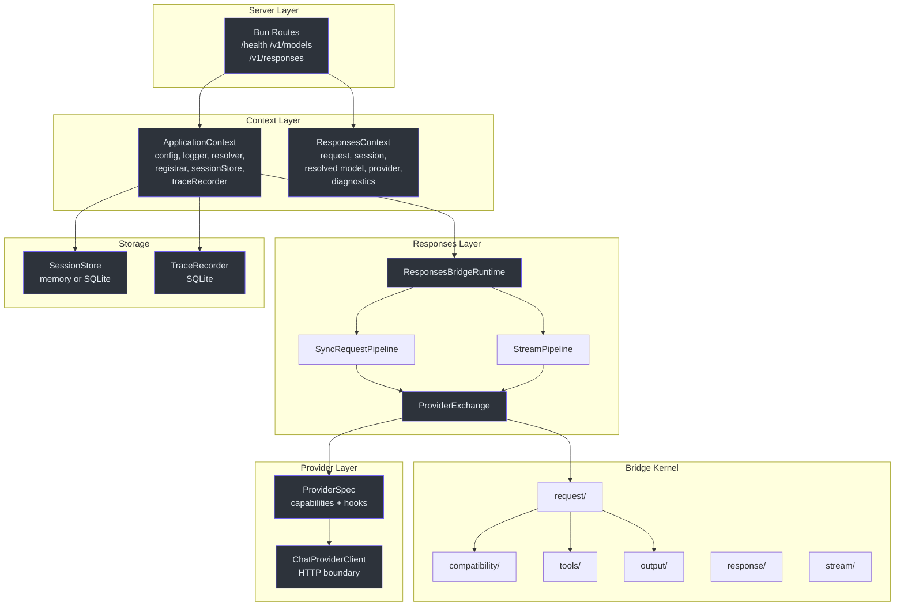
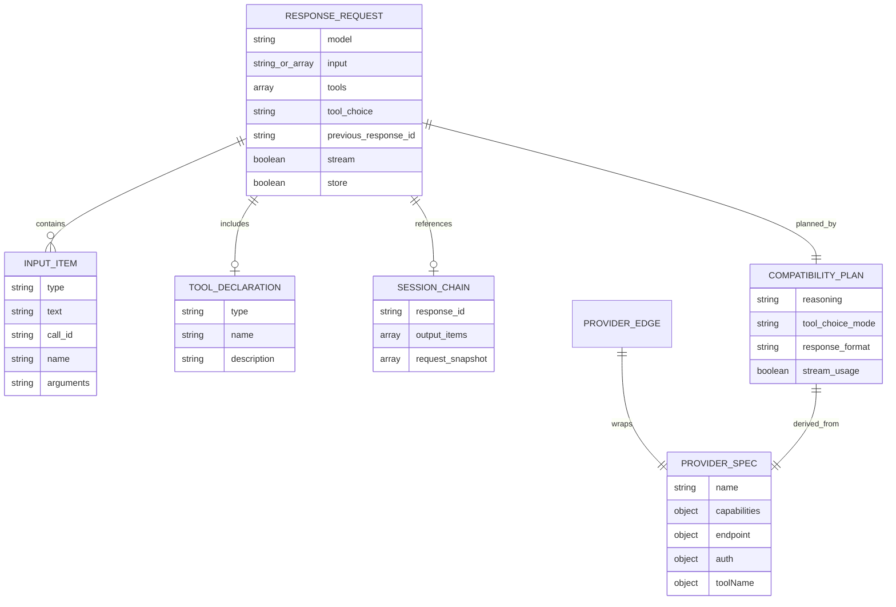
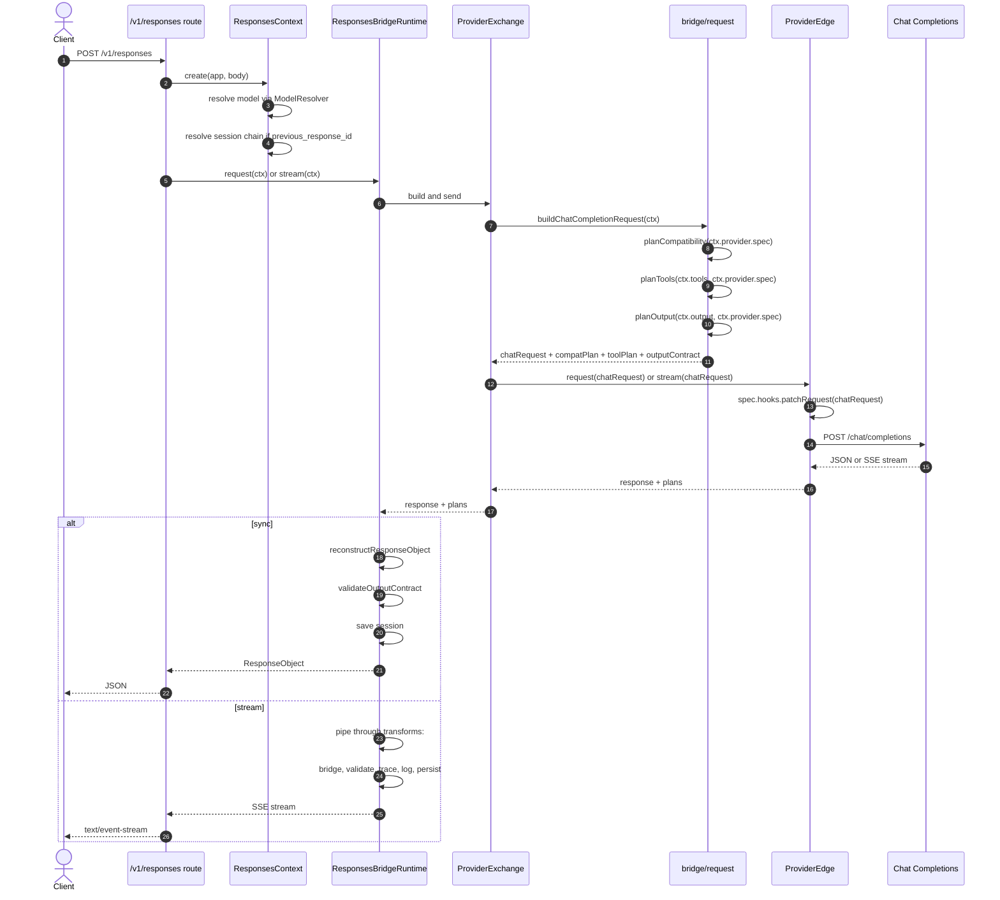
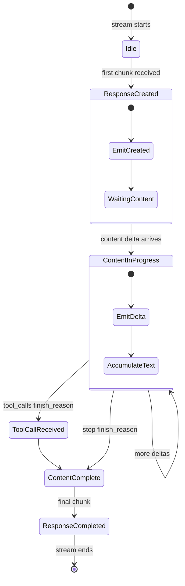
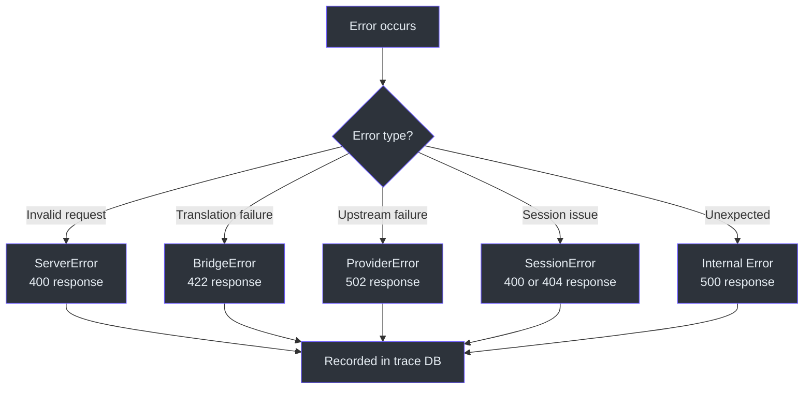

# Staff Engineer Guide

This guide covers the architectural decisions, type safety model, and design patterns that shape GodeX. It is written for senior engineers who need to understand the system deeply before extending or modifying it.

## Executive Summary

GodeX is a single-process Bun HTTP gateway that translates OpenAI Responses API calls into provider-specific Chat Completions API calls. It owns protocol translation, session chain management, tool identity mapping, and structured output validation. It delegates model inference entirely to upstream providers (DeepSeek, MiniMax, Zhipu). The core architectural insight is that the bridge kernel is completely provider-agnostic — providers are data-driven specs with optional hooks.

## The Core Architectural Insight

The bridge kernel (`src/bridge/`) knows nothing about specific providers. Instead, it operates against the `ProviderSpec` interface, which declares capabilities and accessors. Provider-specific behavior is injected through hooks. This means adding a new provider requires zero changes to the bridge kernel.

Conceptually, expressed in Python pseudocode:

```python
# The bridge doesn't know about DeepSeek or MiniMax.
# It knows about the Spec protocol.
class ProviderSpec(Protocol):
    name: str
    capabilities: Capabilities
    hooks: Optional[Hooks]

    def first_choice(self, response) -> dict: ...
    def finish_reason(self, response) -> str: ...
    def output_text(self, response) -> str: ...

# Adding a new provider means implementing this protocol,
# not modifying the bridge.
```

This separation means the bridge kernel changes only when the Responses API protocol changes or when a cross-cutting concern (like structured output) needs new infrastructure.

## System Architecture

<!-- Sources: src/context/application-context.ts, src/responses/runtime.ts, src/bridge/provider-spec/contract.ts -->


The "heart" of the system is the `ProviderExchange` in `src/responses/provider-exchange.ts`. It orchestrates: build the request via the bridge, apply provider patches via `ProviderEdge`, call the upstream, and return the response with compatibility plans attached.

## Type Safety Model

The bridge kernel uses a small set of generic type parameters on `ProviderSpec` and `ProviderEdge`:

```typescript
ProviderSpec<TBridgeRequest, TResponse, TChunk, TProviderRequest>
ProviderEdge<TBridgeRequest, TResponse, TChunk, TProviderRequest>
```

| Parameter | Purpose |
|-----------|---------|
| `TBridgeRequest` | The bridge's Chat Completions request type (`ChatCompletionCreateRequest`) |
| `TResponse` | The provider's specific response type |
| `TChunk` | The provider's specific stream chunk type |
| `TProviderRequest` | The provider's native request type (when `hooks.patchRequest` transforms it) |

The `Registrar` erases generics to `ProviderEdge<unknown, unknown, unknown>` for runtime storage. Type safety is preserved at the provider boundary through the spec's typed accessors. This is a deliberate trade-off: runtime flexibility at the registrar level, compile-time safety at the provider level.

Comparison to Python's typing:

| TypeScript | Python Equivalent |
|-----------|-------------------|
| `ProviderSpec<TReq, TRes, TChunk, TProvReq>` | `ProviderSpec[Req, Res, Chunk, ProvReq]` (Generic) |
| `ProviderEdge<unknown, unknown, unknown>` | `ProviderEdge[Any, Any, Any, Any]` (erased at runtime) |
| `readonly` properties | `Final` attributes or frozen dataclass |
| Discriminated unions | `Literal` type narrowing |

## Domain Model

<!-- Sources: src/protocol/openai/responses.ts, src/bridge/compatibility/compatibility-plan.ts, src/session/ -->


Data invariants:

| Invariant | Enforced By | Source |
|-----------|-------------|--------|
| Capabilities are immutable after creation | `readonly` on all spec fields | `src/bridge/provider-spec/contract.ts` |
| Session chains have no cycles | Cycle detection in chain resolution | `src/session/` |
| Tool identity is restored before response | Call restorer in bridge pipeline | `src/bridge/tools/call-restorer.ts` |
| Structured output is validated for `json_object` | Output validator after response reconstruction | `src/bridge/output/` |
| Provider requests are patched before upstream call | `ProviderEdge.request()` / `stream()` | `src/bridge/provider-spec/factory.ts` |

## Component Types & Execution Paths

| Component | Type | Execution Path | Key File |
|-----------|------|---------------|----------|
| `ApplicationContext` | Singleton | Created once at server startup | `src/context/application-context.ts` |
| `ResponsesContext` | Per-request factory | Created per `/v1/responses` call | `src/context/responses-context.ts` |
| `ModelResolver` | Singleton service | Called during context creation | `src/resolver/model-resolver.ts` |
| `CompatibilityPlanner` | Pure function | Called during request building | `src/bridge/compatibility/planner.ts` |
| `ProviderEdge` | Registered singleton | Resolved from registrar by provider name | `src/bridge/provider-spec/factory.ts` |
| `ResponseStreamStateMachine` | Per-stream | Created per streaming request | `src/bridge/stream/response-stream-state-machine.ts` |
| `SessionStore` | Singleton service | Read/write per request | `src/session/` |
| `TraceRecorder` | Singleton, async queue | Write-behind via batch queue | `src/trace/` |
| `ResponseSseEncoder` | Per-stream transform | Final stage in stream pipeline | `src/server/` |

## Request Lifecycle

<!-- Sources: src/responses/runtime.ts, src/responses/sync-request-pipeline.ts, src/responses/stream-pipeline.ts -->


## State Transitions

The `ResponseStreamStateMachine` manages stream state:

<!-- Sources: src/bridge/stream/response-stream-state-machine.ts -->


## Decision Log

| Decision | Alternatives Considered | Rationale |
|----------|------------------------|-----------|
| Bun over Node.js | Node.js, Deno | Native `ReadableStream`, built-in SQLite, fast startup, native TypeScript |
| Spec-based providers | Class inheritance, plugin system | Data-driven specs are simpler to test and compose; no inheritance hierarchies |
| Composable `TransformStream` | EventEmitter, middleware chain | Native platform API, zero dependencies, backpressure-aware |
| SQLite for sessions and trace | PostgreSQL, Redis, flat files | Zero-config, single-file, Bun built-in, adequate for single-gateway scale |
| Compatibility planner per request | Static provider profiles | Runtime parameters (tools, output format) affect compatibility; static profiles can't capture per-request variance |
| Tool identity restoration | Pass-through function calls | Codex expects structured tool types; pass-through would break clients |
| Registrar erases generics | Preserve generics at runtime | TypeScript generics are compile-time; registrar needs runtime type erasure for heterogeneous storage |
| Write-behind trace recorder | Synchronous trace writes | Async batch writes avoid blocking the request path; acceptable since trace is diagnostic, not operational |
| `previous_response_id` chain | Client-side message history | Matches the OpenAI Responses API contract; server-managed sessions reduce client complexity |

## Dependency Rationale

| Dependency | Purpose | Replaced Alternative |
|-----------|---------|---------------------|
| `@ahoo-wang/fetcher-eventstream` | SSE parsing for upstream streams | Custom SSE parser |
| `commander` | CLI argument parsing | `process.argv` manual parsing |
| `yaml` | `godex.yaml` config parsing | JSON config, TOML |
| `biome` | Linting and formatting | ESLint + Prettier |
| `bun:sqlite` | Session and trace storage | External SQLite library |

## Storage & Data Architecture

| Store | Engine | Write Pattern | Data |
|-------|--------|--------------|------|
| Session store | SQLite or in-memory | Sync write per request | Response objects, request snapshots, output items |
| Trace recorder | SQLite | Async batch write | Request metadata, response payloads, stream events, usage, errors |

Consistency model: eventual consistency for trace (write-behind batching), strong consistency for sessions (sync write before response).

## Failure Modes & Error Handling

<!-- Sources: src/error/ -->


Each error includes: domain code, human message, and structured context (provider name, model, upstream status, operation). This context is written to trace DB for post-mortem analysis.

## API Surface

| Method | Path | Handler | Auth |
|--------|------|---------|------|
| GET | `/health` | Health check | None |
| GET | `/v1/models` | List configured aliases | None |
| POST | `/v1/responses` | Create response (sync or stream) | Bearer token (passthrough) |

Auth is passthrough — GodeX forwards the API key to the upstream provider. It does not authenticate clients itself.

## Configuration

| Key | Default | Description |
|-----|---------|-------------|
| `server.port` | `5678` | HTTP listen port |
| `server.host` | `0.0.0.0` | HTTP listen address |
| `default_provider` | — | Provider used when model selector has no alias or provider prefix |
| `models.aliases` | `{}` | Model name to `provider/model` mappings |
| `session.backend` | `memory` | `memory` or `sqlite` |
| `session.sqlite.path` | — | SQLite file path for sessions |
| `trace.enabled` | `true` | Whether to record traces |
| `trace.path` | `./data/trace.db` | SQLite file path for traces |
| `trace.capture_payload` | `false` | Whether to persist request/response bodies |
| `trace.payload_max_bytes` | `65536` | Max bytes per payload entry |
| `logging.level` | `info` | Log level |

## Performance Characteristics

| Path | Bottleneck | Notes |
|------|-----------|-------|
| Sync request | Upstream latency | GodeX adds <1ms overhead for translation |
| Streaming | Upstream first-token latency | State machine processes chunks in O(1) per chunk |
| Session resolution | SQLite read | Indexed by response_id; typically <1ms |
| Trace recording | Async batch writes | Non-blocking; flushes on interval or queue size |

Hot path: `POST /v1/responses` with `stream: true`. This is the most latency-sensitive path. The bridge kernel and stream state machine are optimized for minimal allocation per chunk.

Scaling limits: single-process, single-threaded event loop. Vertical scaling only. For multi-instance deployment, use a load balancer with sticky sessions (for `previous_response_id` support) or use SQLite on shared storage.

## Testing Strategy

| Level | Scope | What's Covered |
|-------|-------|---------------|
| Unit | `*.test.ts` colocated | Individual functions, accessors, hooks |
| Contract | `provider-conformance.test.ts` | Cross-provider behavior consistency |
| Integration | Module-level tests | Pipeline + bridge interactions |
| E2E | `src/e2e/*.e2e.test.ts` | Full server with mock upstream |

What's NOT tested: live provider API calls (those are separate `test:deepseek`/`test:minimax`/`test:zhipu` scripts), load testing, multi-instance scenarios.

## Known Technical Debt

| Issue | Risk | Affected Area |
|-------|------|---------------|
| No authentication layer | Medium — relies on network-level security | `src/server/` |
| No rate limiting | Low — single-gateway, upstream provider handles limits | `src/server/` |
| No request timeout config per provider | Low — uses fetch default | `src/providers/shared/` |
| Trace recorder not flushable on shutdown | Low — may lose last batch | `src/trace/` |
| No OpenTelemetry integration | Low — custom trace format | `src/trace/` |

## Where to Go Deep

Read these files in order to build a complete mental model:

1. [src/bridge/provider-spec/contract.ts](https://github.com/Ahoo-Wang/GodeX/blob/main/src/bridge/provider-spec/contract.ts) — The interfaces everything else implements
2. [src/bridge/compatibility/planner.ts](https://github.com/Ahoo-Wang/GodeX/blob/main/src/bridge/compatibility/planner.ts) — How parameters are planned
3. [src/bridge/request/request-builder.ts](https://github.com/Ahoo-Wang/GodeX/blob/main/src/bridge/request/request-builder.ts) — The main bridge entry point
4. [src/bridge/stream/response-stream-state-machine.ts](https://github.com/Ahoo-Wang/GodeX/blob/main/src/bridge/stream/response-stream-state-machine.ts) — Stream state management
5. [src/responses/runtime.ts](https://github.com/Ahoo-Wang/GodeX/blob/main/src/responses/runtime.ts) — Sync/stream orchestration
6. [src/providers/minimax/hooks.ts](https://github.com/Ahoo-Wang/GodeX/blob/main/src/providers/minimax/hooks.ts) — Example provider hooks
7. [src/context/application-context.ts](https://github.com/Ahoo-Wang/GodeX/blob/main/src/context/application-context.ts) — DI container

[Architecture Overview](/02-architecture/overview) · [Stream Pipeline](/02-architecture/stream-pipeline) · [Bridge Kernel](/02-architecture/bridge-kernel)
