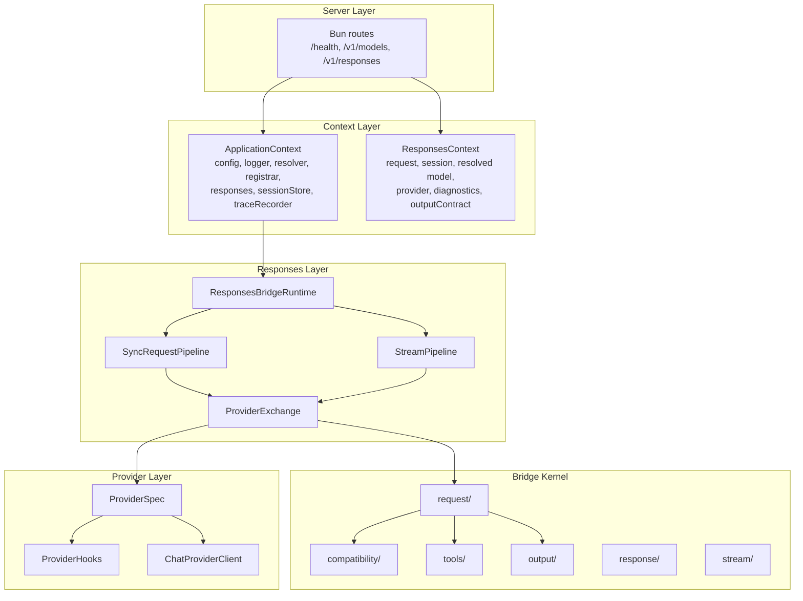

# Staff Engineer Guide

This guide covers the architectural decisions, type safety model, and design patterns that shape GodeX. It is written for senior engineers who need to understand the system deeply before extending or modifying it.

## Type Safety Model

The bridge kernel uses a small set of generic type parameters on `ProviderSpec` and `ProviderEdge`:

```ts
ProviderSpec<TBridgeRequest, TResponse, TChunk, TProviderRequest>
ProviderEdge<TBridgeRequest, TResponse, TChunk, TProviderRequest>
```

- `TBridgeRequest` — The bridge's Chat Completions request type (usually `ChatCompletionCreateRequest`).
- `TResponse` — The provider's response type.
- `TChunk` — The provider's stream chunk type.
- `TProviderRequest` — The provider's native request type (when `hooks.patchRequest` transforms it).

The bridge kernel works against `TBridgeRequest` and the `ProviderSpec` accessors. The `Registrar` erases generics to `ProviderEdge<unknown, unknown, unknown>` for runtime storage. Type safety is preserved at the provider boundary through the spec's typed accessors.

## Architecture Layers



## Key Design Decisions

| Decision | Rationale |
|----------|-----------|
| Bridge kernel owns all compatibility policy | Prevents duplication across providers; providers only expose protocol differences |
| `ProviderSpec` is a data object, not a class | Easy to compose, test, and serialize; no inheritance hierarchies |
| Composable `TransformStream` stages | Zero-dependency, native platform API; each concern is isolated |
| `ResponseStreamStateMachine` owns event production | Single source of truth for stream state; providers only provide deltas |
| `OutputContractSlot` pattern | Lazy output contract initialization that the bridge sets and the pipeline reads |
| Compatibility diagnostics accumulated per-request | Non-intrusive logging; no side-channel coupling between bridge and logging |

<!-- Sources: src/context/application-context.ts, src/responses/runtime.ts -->

## Stream Pipeline Topology

The stream pipeline connects eight stages via `pipeTransform()`:

```
provider SSE stream
  → TraceTransformer (raw)
  → ProviderStreamEventBridge (state machine)
  → StreamErrorHandler
  → ResponseOutputContractValidationTransformer
  → TraceTransformer (transformed)
  → ResponseLogTransformer
  → ResponseSessionPersistenceTransformer (optional)
  → CompatibilityLogTransformer
  → ResponseSseEncoder (in server route)
```

Pipeline order matters: provider events are bridged first, output contracts validated before logging and persistence, then SSE encoding in the server route.

<!-- Sources: src/responses/stream-pipeline.ts, src/responses/stream-transforms/ -->

## Testing Strategy

| Level | Scope | Tool |
|-------|-------|------|
| Unit | Individual functions and classes | `bun test` (colocated `*.test.ts`) |
| Contract | Shared interfaces (session store, provider) | Parameterized test fixtures |
| Integration | Module interactions (pipeline + bridge) | `bun test` with mocks |
| E2E | Full server with mocked upstream | `bun test src/e2e` |

Module boundary tests (`module-boundaries.test.ts`) enforce import restrictions at the type level.

## Critical Code Paths

1. [src/bridge/request/request-builder.ts](https://github.com/Ahoo-Wang/GodeX/blob/main/src/bridge/request/request-builder.ts) — request building with compatibility, tools, and output planning
2. [src/responses/stream-pipeline.ts](https://github.com/Ahoo-Wang/GodeX/blob/main/src/responses/stream-pipeline.ts) — stream orchestration
3. [src/bridge/stream/response-stream-state-machine.ts](https://github.com/Ahoo-Wang/GodeX/blob/main/src/bridge/stream/response-stream-state-machine.ts) — stream state machine
4. [src/responses/sync-request-pipeline.ts](https://github.com/Ahoo-Wang/GodeX/blob/main/src/responses/sync-request-pipeline.ts) — sync orchestration
5. [src/responses/stream-transforms/](https://github.com/Ahoo-Wang/GodeX/blob/main/src/responses/stream-transforms/) — composable transformer stages

[Architecture Overview](/02-architecture/overview) · [Stream Pipeline](/02-architecture/stream-pipeline) · [Bridge Kernel](/02-architecture/bridge-kernel)
