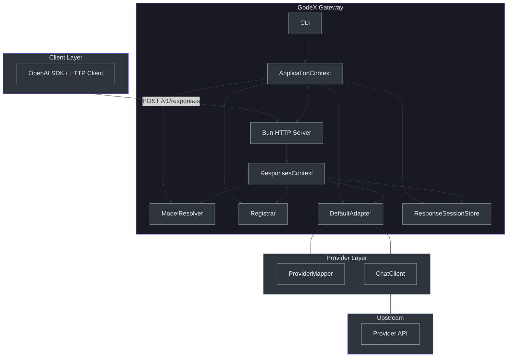

# Staff Engineer Guide

## Executive Summary

GodeX is a **protocol translation gateway** that accepts OpenAI Responses API requests (`/v1/responses`) and translates them into upstream provider-specific Chat Completions API calls. It owns request mapping, streaming pipeline orchestration, session persistence, and model resolution — it delegates HTTP transport to providers and stores sessions in pluggable backends (memory or SQLite).

## The Core Architectural Insight

The entire system revolves around **three generic type parameters** — `TReq`, `TRes`, `TChunk` — that bind a provider's specific types through the full adapter chain. This is the compile-time guarantee that mapping errors are caught before runtime:

```python
# Pseudocode (Python) — the type contract
class ProviderMapper[TReq, TRes, TChunk]:
    request:  RequestMapper[TReq]      # ResponsesContext → TReq
    response: ResponseMapper[TRes]      # (ctx, TRes) → ResponseObject
    stream:   StreamMapper[TChunk]      # (ctx, TChunk) → list[StreamEvent]

class Provider[TReq, TRes, TChunk]:
    mapper:     ProviderMapper[TReq, TRes, TChunk]
    chatClient: ChatClient[TReq, TRes, TChunk]
    capabilities: ProviderCapabilities
```

Adding a new provider means filling in these three types with concrete upstream types, and the compiler catches every mismatch.

## System Architecture



<!-- Sources: src/context/application-context.ts, src/adapter/default-adapter.ts -->

## Key Abstractions

| Abstraction | File | Purpose |
|-------------|------|---------|
| `ApplicationContext` | [src/context/application-context.ts](https://github.com/Ahoo-Wang/GodeX/blob/main/src/context/application-context.ts) | Composition root, assembles all components |
| `ResponsesContext` | [src/context/responses-context.ts](https://github.com/Ahoo-Wang/GodeX/blob/main/src/context/responses-context.ts) | Per-request context, validation, attribute bag |
| `Adapter` | [src/adapter/adapter.ts](https://github.com/Ahoo-Wang/GodeX/blob/main/src/adapter/adapter.ts) | Orchestrates request/stream paths |
| `Provider<TReq, TRes, TChunk>` | [src/adapter/provider.ts](https://github.com/Ahoo-Wang/GodeX/blob/main/src/adapter/provider.ts) | Bundles mapper + client + capabilities |
| `ProviderMapper<TReq, TRes, TChunk>` | [src/adapter/provider.ts](https://github.com/Ahoo-Wang/GodeX/blob/main/src/adapter/provider.ts) | Protocol translation (3 maps) |
| `ModelResolver` | [src/resolver/index.ts](https://github.com/Ahoo-Wang/GodeX/blob/main/src/resolver/index.ts) | Parses "provider/model" selectors |
| `Registrar` | [src/providers/registrar.ts](https://github.com/Ahoo-Wang/GodeX/blob/main/src/providers/registrar.ts) | Two-phase provider lifecycle |

## Decision Log

| Decision | Alternatives Considered | Rationale | Source |
|----------|------------------------|-----------|--------|
| Bun runtime | Node.js, Deno | Native TS, `Bun.serve()` routing, `bun:sqlite` for sessions, single-binary compilation | [package.json](https://github.com/Ahoo-Wang/GodeX/blob/main/package.json) |
| Tab indentation | Spaces | Biome default, consistency with existing codebase | [biome.json](https://github.com/Ahoo-Wang/GodeX/blob/main/biome.json) |
| Web Streams TransformStream | RxJS, custom EventEmitter | Zero-dependency, native platform API, composable pipe() | [src/adapter/transformers/](https://github.com/Ahoo-Wang/GodeX/blob/main/src/adapter/transformers/) |
| SQLite session backend | Redis, file-per-session | Zero external deps via `bun:sqlite`, ACID, simple deployment | [src/session/sqlite.ts](https://github.com/Ahoo-Wang/GodeX/blob/main/src/session/sqlite.ts) |
| Three-generic Provider type | any/dynamic typing | Compile-time safety across entire adapter chain | [src/adapter/provider.ts](https://github.com/Ahoo-Wang/GodeX/blob/main/src/adapter/provider.ts) |
| `nanoid` for IDs | UUID v4 | Shorter, URL-safe, sufficient entropy | [src/context/responses-context.ts](https://github.com/Ahoo-Wang/GodeX/blob/main/src/context/responses-context.ts) |

## Stream Pipeline

The streaming path is the most complex subsystem — a three-stage `TransformStream` pipeline:


<!-- Sources: src/adapter/transformers/stream-utils.ts -->

Each transformer has a single responsibility:
1. **Protocol translation** — upstream SSE chunks → `ResponseStreamEvent[]`
2. **Session persistence** — intercept terminal events, save session
3. **SSE encoding** — `ResponseStreamEvent` → `event: type\ndata: JSON\n\n`

## Failure Modes

| Failure | Handling | Code |
|---------|----------|------|
| Invalid JSON body | `ServerError` → 400 | `server.request.invalid_json` |
| Missing model | `ServerError` → 400 | `server.request.missing_model` |
| Unknown provider | `ServerError` → 400 | `server.request.missing_model` |
| Upstream timeout | `ProviderError` → 504 | `provider.upstream.timeout` |
| Upstream rate limit | `ProviderError` → 429 | `provider.upstream.rate_limit` |
| Session chain not found | `SessionError` → 404 | `session.chain.not_found` |
| Session chain cycle | `SessionError` → 400 | `session.chain.cycle_detected` |

## Testing Strategy

| Layer | Tool | Scope |
|-------|------|-------|
| Unit | `bun test` | Individual functions, mappers |
| Integration | `bun test` (mocked upstream) | Adapter with mocked ChatClient |
| E2E | `bun test src/e2e` | Full server with HTTP mock |
| Live provider | `ZHIPU_LIVE_TESTS=1` | Real upstream API (CI only on main) |

## Known Technical Debt

| Issue | Risk Level | Affected Files | Source |
|-------|-----------|----------------|--------|
| Single provider (Zhipu only) | Medium | `src/providers/` | Only one builtin factory |
| `ignoreDeadLinks: true` in wiki | Low | `wiki/.vitepress/config.mts` | Masks broken links |
| No structured logging output format | Low | `src/logger/` | Plain JSON, no standard schema |

## Where to Go Deep

Recommended reading order:
1. [src/adapter/provider.ts](https://github.com/Ahoo-Wang/GodeX/blob/main/src/adapter/provider.ts) — the core type contract
2. [src/adapter/default-adapter.ts](https://github.com/Ahoo-Wang/GodeX/blob/main/src/adapter/default-adapter.ts) — orchestration logic
3. [src/context/application-context.ts](https://github.com/Ahoo-Wang/GodeX/blob/main/src/context/application-context.ts) — how everything wires together
4. [src/providers/zhipu/](https://github.com/Ahoo-Wang/GodeX/blob/main/src/providers/zhipu/) — complete provider reference
5. [src/adapter/transformers/](https://github.com/Ahoo-Wang/GodeX/blob/main/src/adapter/transformers/) — stream pipeline internals

[Architecture Overview](/02-architecture/overview) · [Stream Pipeline](/02-architecture/stream-pipeline) · [Adapter Pattern](/02-architecture/adapter-pattern)
