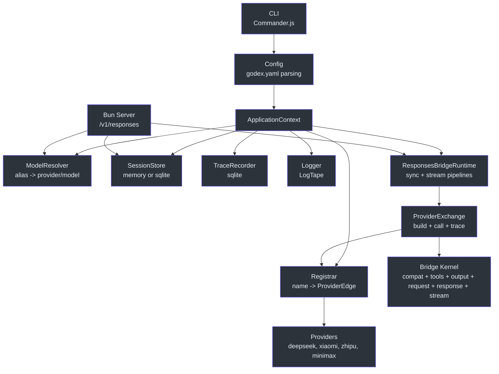
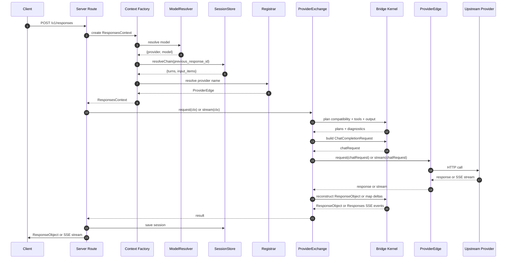
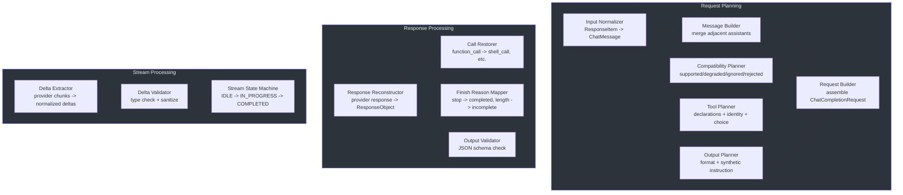

# Staff Engineer Guide

This is a dense, opinionated architectural guide for engineers who need to understand GodeX at the systems level. It assumes you have read the Contributor Guide, understand the domain vocabulary, and are evaluating tradeoffs, extending the bridge kernel, or making cross-cutting architectural decisions.

---

## The One Core Insight

GodeX is a **protocol translation layer**, not a proxy. A proxy forwards requests with minimal transformation. GodeX owns the compatibility contract between two API surface areas — OpenAI's Responses API and the Chat Completions API — that were never designed to be compatible. Every architectural decision in the codebase flows from this fact.

The Responses API uses `previous_response_id` for multi-turn. Chat Completions uses a flat `messages` array. The Responses API supports seven tool types. Chat Completions supports one. The Responses API has `json_schema` with strict validation. Most providers have `json_object` at best. The Responses streaming API emits structured lifecycle events. Chat Completions streaming emits SSE chunks with no event semantics.

GodeX does not hide these differences behind a thin wrapper. It plans, translates, degrades, validates, and reconstructs at every layer — for every request, at runtime.

---

## Architecture as Pseudocode

The full request lifecycle, expressed in Python-style pseudocode:

```python
def handle_responses_request(request):
    # 1. Application scope (created once at startup)
    app = ApplicationContext(config)

    # 2. Resolve which provider handles this model
    resolved = app.resolver.resolve(request.model)  # -> {provider, model}

    # 3. Resolve session chain if previous_response_id is present
    session = None
    if request.previous_response_id:
        session = app.session_store.resolve_chain(
            request.previous_response_id
        )  # -> {turns, input_items}

    # 4. Get the provider edge
    provider = app.registrar.resolve(resolved.provider)  # -> ProviderEdge

    # 5. Create request-scoped context
    ctx = ResponsesContext(app, request, session, resolved, provider)

    # 6. Plan compatibility
    compatibility = plan_bridge_compatibility(request, provider.spec.capabilities)
    # -> {parameters, responseFormat, diagnostics}
    # Each decision is: supported | degraded | ignored | rejected

    # 7. Plan tools
    tool_plan = plan_tools(request.tools, request.tool_choice, provider.spec)
    # -> {declarations, providerToolChoice, decisions}
    # Tool types are: supported | degraded (mapped) | ignored | rejected

    # 8. Plan output contract
    output_contract = plan_output_contract(request.text.format, compatibility)
    # -> {requested, providerResponseFormat, syntheticInstruction, requiresValidJson}

    # 9. Build Chat Completions request
    chat_request = build_chat_request(
        model=resolved.model,
        messages=session.input_items + normalize(request.input),
        tools=tool_plan.declarations,
        tool_choice=tool_plan.providerToolChoice,
        response_format=output_contract.providerResponseFormat,
        options=request,  # temperature, top_p, max_output_tokens, etc.
    )

    # 10. Apply provider-specific patching (hooks)
    if provider.spec.hooks.patchRequest:
        chat_request = provider.spec.hooks.patchRequest(chat_request)

    # 11. Call the upstream provider
    if request.stream:
        return handle_streaming(ctx, provider, chat_request, tool_plan, output_contract)
    else:
        return handle_sync(ctx, provider, chat_request, tool_plan, output_contract)


def handle_sync(ctx, provider, chat_request, tool_plan, output_contract):
    # Call upstream
    provider_response = provider.request(chat_request)

    # Extract data via provider accessors (polymorphic dispatch)
    text = provider.spec.response.outputText(provider_response)
    finish = provider.spec.response.finishReason(provider_response)
    usage = provider.spec.response.usage(provider_response)
    tool_calls = extract_tool_calls(provider_response)

    # Reconstruct ResponseObject
    response = ResponseObject(
        id=ctx.response_id,
        status=map_finish_reason(finish),  # stop -> completed, length -> incomplete
        output=reconstruct_output(text, tool_calls, tool_plan),
        usage=usage,
    )

    # Validate output contract (e.g., JSON schema after degradation)
    if output_contract.requiresValidJson:
        validate_json_schema(response.output_text)  # throws BridgeError on failure

    # Persist session (async, errors are logged but not fatal)
    ctx.session_store.save(response)

    # Record trace
    ctx.trace_recorder.record_usage(response.usage)

    return response


def handle_streaming(ctx, provider, chat_request, tool_plan, output_contract):
    # Connect to upstream SSE stream
    provider_stream = provider.stream(chat_request)

    # Initialize state machine with tool identities for call restoration
    machine = ResponseStreamStateMachine(
        response_id=ctx.response_id,
        tool_identities=tool_plan.identities,
    )

    # Pipeline of composable TransformStream stages:
    # Provider SSE chunks
    #   -> Delta extraction (provider.spec.stream.deltas)
    #   -> Delta validation (type checking, field sanitization)
    #   -> State machine (track blocks, emit Responses events)
    #   -> Error wrapping (catch exceptions, emit response.failed)
    #   -> Output contract validation (check terminal output)
    #   -> Trace recording (raw and transformed events)
    #   -> Response logging (usage, duration)
    #   -> Session persistence (if store != false)
    #   -> Compatibility diagnostics logging
    #   -> SSE encoding (in the server route)

    return pipeline(
        provider_stream,
        extract_and_validate_deltas,
        feed_state_machine(machine),
        wrap_with_error_handler(machine),
        validate_terminal_output(output_contract),
        record_trace_raw,
        record_trace_transformed,
        log_response,
        persist_session,
        log_diagnostics,
    )
```

---

## System Diagrams

### Component Dependency Graph



### Request Data Flow



### Bridge Kernel Detail



---

## The Bridge Kernel is the Hardest Problem

The bridge kernel in `src/bridge/` is where the fundamental complexity lives. Understanding why it is hard requires understanding the semantic gaps between the two APIs.

### Multi-Turn Semantics Differ

The Responses API uses `previous_response_id` — a server-stored pointer to a past response. The client sends only the current turn's input. The server is responsible for reconstructing the full conversation context.

The Chat Completions API uses a flat `messages` array. The client sends every message every time. There is no server-side state.

GodeX bridges this by maintaining a session store. When `previous_response_id` is present:

1. Resolve the chain — follow parent pointers from newest to oldest
2. Flatten all turns into API-shaped input items (not Chat messages yet)
3. Normalize the items into Chat Completions messages via the input normalizer
4. Merge adjacent assistant messages with tool calls via the message builder
5. Prepend the history to the current input

The input normalizer handles every item type in the Responses API: plain messages, function calls, function call outputs, shell calls, shell call outputs, local shell calls, apply patch calls, custom tool calls, and reasoning items. Each type has a specific normalization rule. For example, a `shell_call` item is normalized into an assistant message with a function tool call whose arguments contain the shell action serialized as JSON.

The message builder merges adjacent assistant messages. In the Responses API, each tool call is a separate item. In Chat Completions, multiple tool calls on a single assistant turn must be in one message. The message builder detects adjacent assistant+tool_call messages and merges them.

The chain resolution must handle cycles, missing parents, depth overflow, and incomplete responses. The session store must store API-shaped snapshots — not provider-specific chat messages — because the provider-specific conversion belongs in the bridge.

### Tool Types Differ

The Responses API supports `function`, `shell`, `apply_patch`, `custom`, `mcp`, `tool_search`, and `namespace` tools. The Chat Completions API supports only `function` tools.

GodeX handles this through the **tool plan**, which classifies each requested tool into one of four categories:

| Category | Meaning | Example |
|----------|---------|---------|
| Supported | Provider handles this type natively | `function` on all providers |
| Degraded | Mapped to a different type | `shell` mapped to `function` on DeepSeek |
| Ignored | Silently skipped | `mcp` on providers that do not declare it |
| Rejected | Causes the request to fail | Explicit `tool_choice` for a degraded tool that cannot be forced |

The degradation of non-function tool types to `function` means GodeX must also handle two-directional translation:

**Request direction (Responses -> Chat Completions):** The tool declaration renderer generates function declarations for degraded tool types. For custom tools, it generates a synthetic description and parameters schema that instructs the model to pass the custom input as a string. For built-in tools like `shell` and `apply_patch`, it uses predefined function schemas from the tools module.

**Response direction (Chat Completions -> Responses):** The tool call restorer uses the tool identity map to reverse the mapping. When the provider returns a function call with name `shell`, the restorer looks up the identity, finds that it was degraded from `shell`, and reconstructs a `shell_call` item. The restoration parses the function arguments JSON back into the original structure (e.g., extracting the `commands` array from a shell call, or the `operation` object from an apply_patch call).

The tool name codec handles bidirectional name mapping between Responses tool names and provider tool names. This is necessary because some providers have naming restrictions (e.g., max 64 characters, alphanumeric plus underscore and hyphen only). The default codec sanitizes names to fit these constraints and deduplicates provider names when collisions occur.

### Output Contracts

The Responses API supports `json_schema` with strict validation. Many providers only support `json_object` (which simply instructs the model to return JSON).

When a provider does not support `json_schema`, GodeX degrades to `json_object` and:

1. Generates a **synthetic system instruction** containing the JSON Schema, schema name, schema description, and formatting rules
2. Instructs the model to return valid JSON conforming to the schema
3. After receiving the response, **validates the output JSON** syntactically (parses it with JSON.parse)
4. If validation fails and `strict` was set, the response is marked as failed

This three-step approach (degrade + instruct + validate) is a pragmatic compromise. It does not guarantee schema conformance the way OpenAI's native `json_schema` support does, but it provides a functional fallback. The validation is syntactic only (valid JSON), not semantic (conforms to the schema). Full schema validation could be added in the future without changing the architecture.

### Streaming State Machine

The streaming bridge is the most complex subsystem. The Responses streaming API defines a strict sequence of lifecycle events:

```
response.created
  -> response.in_progress
  -> [response.output_item.added
      -> response.content_part.added
      -> response.output_text.delta (repeated)
      -> response.output_text.done
      -> response.content_part.done
      -> response.output_item.done]
  -> response.completed (or response.incomplete or response.failed)
```

Provider SSE chunks do not follow this structure. A provider sends chunks with `delta.content`, `delta.tool_calls`, and a `finish_reason` — no lifecycle semantics.

The `ResponseStreamStateMachine` bridges this gap. It:

- Tracks the current **phase**: `IDLE -> IN_PROGRESS -> COMPLETED | INCOMPLETE | FAILED`
- Manages **active blocks** for text, refusal, reasoning, and tool calls
- Emits the correct sequence of Responses events for each block transition
- **Defers terminal events** — when a `finishReason` delta arrives, the machine does not immediately emit `response.completed`. Instead, it buffers the finish reason and continues processing remaining deltas. When the stream ends (the `flush` method is called), the machine closes all active blocks first, then emits the terminal event.

The phase transitions are strict. Attempting to emit deltas in `IDLE` or after a terminal phase throws `BridgeError`. This prevents malformed event sequences from reaching the client.

The state machine also handles **tool call identity restoration during streaming**. When a provider streams a function call delta with name `shell`, the machine looks up the tool identity map and emits the correct Responses event type (`response.function_call_arguments.delta` for function tools, `response.custom_tool_call_input.delta` for custom tools).

The pipeline order matters. Provider events are bridged first, output contracts are validated before logging and persistence, then SSE encoding happens in the server route.

---

## Design Tradeoffs

| Feature | Decision | Why |
|---------|----------|-----|
| ProviderSpec as typed contract | Providers declare capabilities via strongly-typed objects | Generic adapters (maps of functions) lose type safety and make compatibility planning fragile. Typed specs enable compile-time guarantees and IDE support. |
| Compatibility planning at request time | Every request runs `planBridgeCompatibility` fresh | Static config cannot account for per-request features like which tool types are actually used. Runtime planning produces precise diagnostics. |
| Session as API-shaped snapshots | Store Responses API types, not Chat Completions messages | Provider-specific conversion belongs in the bridge. If the conversion logic changes, stored sessions must still be interpretable. API-shaped snapshots are the stable interface. |
| Tool degradation rather than rejection | Silently map `shell`/`apply_patch`/`custom` to `function` | Rejecting requests because a provider does not support `shell` natively would break too many workflows. Degradation with diagnostics is more useful. |
| Deferred terminal events in streaming | Buffer `finishReason` until all blocks close | Emitting `response.completed` before tool call blocks are closed would produce invalid event sequences. Deferring guarantees correct ordering. |
| Async trace recorder | Trace writes are asynchronous and batched | Sync writes on every event would add latency. Batched async writes keep request latency low while providing observability. |
| Single-process architecture | No distributed state, no message queue | GodeX is a gateway, not a platform. Single-process keeps deployment simple and eliminates distributed coordination complexity. |
| SQLite for sessions and trace | Built-in Bun support, no external database dependency | Zero-configuration persistence. SQLite handles the write patterns of a gateway (read-heavy, small writes) well. |
| `GodeXError` hierarchy | All expected failures use domain-specific error classes | Raw `Error` provides no domain context, no structured logging, and no HTTP status mapping. The hierarchy enables consistent error handling across layers. |
| No mapper forests | Each provider has exactly spec + client + hooks + protocol DTOs | Mapper forests (provider-specific adapter classes that duplicate bridge logic) are the pattern this codebase explicitly avoids. The bridge kernel owns all translation. |
| Colocated tests | Tests live next to source as `*.test.ts` | Improves discoverability. When you change a file, its test is right there. No directory hunting. |
| Bun `ReadableStream` pipeline | Streaming uses native `TransformStream` | Bun's native streams are zero-copy and require no polyfills. The composable pipeline pattern is natural with `TransformStream`. |

---

## Decision Log

### D1: ProviderSpec as the Provider Contract

**Context:** How should providers declare their capabilities and behaviors?

**Options:**
- (a) Generic adapter pattern with maps of functions
- (b) Typed `ProviderSpec` interface with explicit capability declarations
- (c) Per-provider adapter classes with inheritance

**Decision:** Option (b) — typed `ProviderSpec` interface.

**Rationale:** The bridge kernel needs to plan compatibility without knowing about specific providers. A typed spec makes capability declarations explicit, enables IDE support, and prevents the bridge from accidentally depending on provider-specific behavior. The alternative (generic adapters) loses type safety and makes it hard to produce precise diagnostics. The third option (adapter classes) leads to mapper forests and code duplication.

**Consequences:** Adding a new provider requires defining a `ProviderSpec` with all required fields. The spec interface is stable and rarely changes. The bridge kernel changes only when the Responses API protocol changes or when a cross-cutting concern needs new infrastructure.

### D2: Runtime Compatibility Planning

**Context:** When should compatibility be planned?

**Options:**
- (a) Static config at startup — reject unsupported features globally
- (b) Runtime planning per request — analyze what is actually used

**Decision:** Option (b) — runtime planning per request.

**Rationale:** A provider might support `function` tools but not `shell` tools. Static config cannot express "support this tool type but not that one." Runtime planning produces per-request diagnostics that tell the caller exactly what was supported, degraded, ignored, or rejected. The diagnostics are attached to the `ResponsesContext` and logged by the pipelines.

**Consequences:** Every request runs compatibility planning, tool planning, and output contract planning. The performance cost is negligible (all are synchronous, in-memory operations with no I/O). The diagnostic benefit is significant.

### D3: Session Store as API Snapshots

**Context:** What format should session data be stored in?

**Options:**
- (a) Provider-native Chat Completions messages
- (b) API-shaped Responses snapshots
- (c) A custom intermediate format

**Decision:** Option (b) — API-shaped Responses snapshots.

**Rationale:** The bridge is the only component that understands how to convert between Responses and Chat Completions. If stored sessions used provider-native messages, a change in conversion logic would break stored history. API-shaped snapshots are the stable contract between the session store and the bridge.

**Consequences:** The session store never needs to understand provider-specific formats. The bridge must reconvert stored snapshots on every request, but this is already necessary for multi-turn. The `StoredResponseRequestSnapshot` and `StoredResponseSnapshot` types define exactly what is stored.

### D4: Streaming as Composable TransformStream Pipeline

**Context:** How should streaming events be processed?

**Options:**
- (a) Monolithic stream handler
- (b) Chain of composable `TransformStream` stages

**Decision:** Option (b) — composable `TransformStream` pipeline.

**Rationale:** The stream pipeline must: bridge provider deltas to Responses events, validate output contracts, record trace events, log usage, persist sessions, and emit compatibility diagnostics. A monolithic handler would be a single function with many concerns. Composable stages keep each concern isolated and testable. Each stage can be tested independently by piping test data through it.

**Consequences:** The pipeline order matters and must be maintained carefully. Reordering stages can change behavior in subtle ways. The current order is: trace raw events, bridge deltas to Responses events, error wrapping, output contract validation, trace transformed events, response logging, session persistence, compatibility diagnostics.

### D5: Error Hierarchy with Domain Codes

**Context:** How should errors be represented?

**Options:**
- (a) Raw `Error` with string messages
- (b) Custom error classes with domain, code, status, and context
- (c) Result types (never throw)

**Decision:** Option (b) — custom error classes (`GodeXError` hierarchy).

**Rationale:** GodeX handles HTTP requests. Errors must be mapped to HTTP status codes, logged with structured context, and traced with domain-specific codes. Raw `Error` provides none of this. Result types would add complexity without clear benefit for a gateway that must always produce an HTTP response. The `toLogEntry` method on `GodeXError` provides a clean structured log representation.

**Consequences:** All expected failures must use the appropriate `GodeXError` subclass. Unexpected failures (bugs) still produce raw `Error` and are caught at the route level. The error hierarchy is: `GodeXError` -> `ServerError` (domain: server), `BridgeError` (domain: bridge), `ProviderError` (domain: provider, status: 502), `SessionError` (domain: session).

### D6: Tool Degradation over Rejection

**Context:** When a provider does not support a tool type natively, should the request be rejected or degraded?

**Options:**
- (a) Reject — fail the request with an unsupported parameter error
- (b) Degrade — map the tool to a supported type with diagnostics

**Decision:** Option (b) — degrade with diagnostics.

**Rationale:** The Responses API supports tool types (`shell`, `apply_patch`, `custom`) that most providers will never support natively. Rejecting these requests would make GodeX useless for many real-world use cases. Degrading to `function` with clear diagnostics is more practical. The tool declaration renderer generates synthetic descriptions that instruct the model how to use the degraded interface.

**Consequences:** Call restoration must reverse the degradation for responses. The tool identity map must track which tools were degraded so that function calls can be reconstructed as the original tool type. If restoration fails (e.g., the model did not produce valid JSON arguments), the system falls back to a generic function call.

---

## Comparison with Similar Systems

### GodeX vs LiteLLM

LiteLLM is a Python-based proxy that normalizes 100+ LLM providers behind a single Chat Completions API. GodeX differs in three fundamental ways:

1. **Direction of translation.** LiteLLM translates Chat Completions -> provider-specific. GodeX translates Responses API -> Chat Completions. GodeX targets the newer API surface; LiteLLM targets the older one.

2. **Depth of translation.** LiteLLM focuses on parameter mapping and response normalization. GodeX plans compatibility, degrades tool types, manages session chains, validates structured output, and runs a streaming state machine. The translation is deeper because the semantic gap is wider.

3. **Session ownership.** LiteLLM is stateless — the client sends the full context every time. GodeX owns session state via `previous_response_id` chains. This makes GodeX a stateful gateway, not a stateless proxy.

### GodeX vs OpenRouter

OpenRouter is a hosted service that routes requests to multiple providers. It provides a unified Chat Completions API and handles billing, rate limiting, and fallbacks.

1. **API surface.** OpenRouter exposes Chat Completions. GodeX exposes Responses API. They serve different client ecosystems.

2. **Self-hosted vs hosted.** OpenRouter is a managed service. GodeX is self-hosted software. This affects trust models, data residency, and operational complexity.

3. **Translation depth.** OpenRouter focuses on routing and billing. GodeX focuses on protocol translation and compatibility management.

### GodeX vs a Simple Reverse Proxy

A reverse proxy like nginx or Caddy could forward requests to an upstream provider. This works only if the client and server speak the same protocol. The Responses API and Chat Completions API have fundamentally different semantics. A proxy cannot:

- Convert `previous_response_id` into a `messages` array
- Map `shell` tools to `function` tools
- Degrade `json_schema` to `json_object` with synthetic instructions
- Reconstruct streaming lifecycle events from SSE chunks
- Manage session chains with cycle detection and depth limits
- Produce compatibility diagnostics

GodeX is not a proxy because the two APIs are not compatible. It is a translation layer that owns the compatibility contract.

---

## Risk Areas

### Streaming State Machine Correctness

The `ResponseStreamStateMachine` is the most complex single component. It manages multiple active blocks (text, refusal, reasoning, tool calls) and must emit events in the correct order. The deferred terminal event pattern means that `finishReason` is buffered until all blocks are closed. If a block is not properly closed, the state machine will emit incorrect events.

**Sharp edge:** If a provider sends a `finishReason` delta followed by more deltas (which should not happen but is not guaranteed by any provider), the state machine will throw `BridgeError` with code `bridge.stream.delta_after_terminal`. This is correct behavior but may surprise provider authors who expect late deltas to be silently dropped.

**Sharp edge:** If a provider sends a tool call delta without a complete `id` and `name` before the stream ends, the state machine throws `BridgeError` with code `bridge.stream.incomplete_tool_call`. This indicates a provider protocol violation, not a GodeX bug.

### Session Chain Integrity

The session chain uses parent pointers. If a stored session is corrupted or deleted, the entire chain from that point is broken. The chain resolution handles `not_found`, `cycle_detected`, and `depth_exceeded` errors, but cannot recover from data corruption.

**Sharp edge:** Session stores with `sqlite` backend are subject to SQLite's concurrent write limitations. In a multi-process deployment (not currently supported), write contention could cause session save failures. The memory backend is local to the process and not shared across instances.

**Sharp edge:** If a response is stored with `status: "incomplete"`, the chain resolution skips it by default (configurable via `include_incomplete`). This means incomplete responses are invisible to subsequent turns, which is usually correct but may surprise callers who expect their partial output to be in the history.

### Output Contract Validation Post-Degradation

When `json_schema` is degraded to `json_object`, GodeX validates the output JSON after receiving the response. This validation is a best-effort check — it cannot guarantee that the model will produce conforming JSON. If validation fails, the response is marked as failed, but the caller has already received streaming deltas.

**Sharp edge:** In streaming mode, output contract validation happens after the stream is mostly complete. The client may have already processed partial output before the validation error is emitted as a terminal event. This means the client might see `response.output_text.delta` events followed by `response.failed` instead of `response.completed`.

### Provider Spec Capability Accuracy

The compatibility plan is only as good as the provider's declared capabilities. If a provider spec claims to support `json_object` but the provider's implementation is unreliable, GodeX will route requests to that provider and produce degraded results.

**Sharp edge:** Provider capabilities should be tested against real upstream behavior, not just documentation claims. The E2E test suite with mocked upstreams verifies the bridge logic but not the actual provider behavior. Live tests (`bun run test:zhipu`, etc.) are the only way to verify that declared capabilities match reality.

### Trace Payload Sensitivity

When `trace.capture_payload: true` is configured, full request and response payloads are stored in SQLite. These payloads may contain API keys in headers, user content in messages, and model outputs with sensitive information.

**Sharp edge:** Trace databases must be treated as sensitive. Do not commit them to version control or expose them through unsecured endpoints. The default configuration has payload capture disabled.

---

## Operational Concerns

### Observability

GodeX provides three layers of observability:

1. **Structured logging** via LogTape. Every request produces log entries with structured payloads including provider, model, status, duration, usage, and cache hit ratio. Log levels are configurable per sink (console, file, or both).

2. **Trace records** in SQLite. Every request produces request, usage, event, and error records. Payload capture is off by default; enable with `trace.capture_payload: true` for debugging. The trace recorder supports batched writes and configurable queue sizes.

3. **Compatibility diagnostics** attached to every request. Diagnostics enumerate what was supported, degraded, ignored, or rejected, with severity levels (`info`, `warn`, `error`) and metadata. These are logged by the pipeline at the end of each request.

### Scaling

GodeX is a single-process application. It uses Bun's built-in HTTP server, which handles concurrent requests via the event loop. There is no clustering support built in.

For horizontal scaling:

- Deploy multiple instances behind a load balancer
- Use the `sqlite` session backend with a shared filesystem (e.g., NFS) or switch to an external session store
- Trace databases are per-instance by default

The session store is the primary scaling bottleneck. Memory-backed sessions are local to the process. SQLite-backed sessions require shared storage for multi-instance deployments.

### Failure Modes

| Failure | Detection | Recovery |
|---------|-----------|----------|
| Upstream provider timeout | `ProviderError` with code `provider.upstream.timeout` | Returns 502 to client with error details |
| Upstream provider rate limit | `ProviderError` with code `provider.upstream.rate_limit` | Returns 502 to client; caller should retry with backoff |
| Upstream provider server error | `ProviderError` with code `provider.upstream.server_error` | Returns 502 to client |
| Upstream provider generic error | `ProviderError` with code `provider.upstream.error` | Returns 502 to client with upstream message if available |
| Session chain not found | `SessionError` with code `session.chain.not_found` | Returns 400 to client |
| Session chain cycle | `SessionError` with code `session.chain.cycle_detected` | Returns 400 to client; indicates data corruption or a bug |
| Session chain depth exceeded | `SessionError` with code `session.chain.depth_exceeded` | Returns 400 to client; configure `max_depth` to increase the limit |
| Bridge compatibility rejection | `BridgeError` with code `bridge.request.unsupported_parameter` | Returns 400 to client with diagnostic details |
| Stream state machine violation | `BridgeError` with code `bridge.stream.invalid_transition` | Returns 500 to client; indicates a bug or provider behavior change |
| Output contract validation failure | Response marked as `incomplete` or `failed` | Client receives terminal event with error |
| Missing provider registration | `ServerError` with code `server.provider.not_registered` | Returns 400 to client; check config for correct `spec` field |
| Invalid JSON request body | `ServerError` with code `server.request.invalid_json` | Returns 400 to client |

### Configuration Validation

GodeX validates configuration at startup. Invalid config (missing required fields, unrecognized provider specs, malformed aliases) produces immediate errors with clear messages. Use `godex config check --config ./godex.yaml` to validate config before deploying.

Legacy provider config without a `spec` field is intentionally rejected. This prevents ambiguous configurations where the provider type cannot be determined.

### Health Endpoint

The `/health` endpoint reports registered and unsupported providers. Unsupported providers are those whose `spec` field does not match any built-in factory. This endpoint is useful for monitoring and for load balancer health checks.

---

## Architectural Invariants

These are the rules that must never be violated. If you find yourself about to break one, stop and ask.

1. **The bridge kernel never imports provider-specific code.** `src/bridge/` operates entirely against the `ProviderSpec` interface. Adding a new provider requires zero changes to the bridge kernel.

2. **Compatibility decisions are not duplicated in providers.** Provider hooks expose protocol differences (e.g., how to extract usage). The bridge decides support, degradation, rejection, and diagnostics.

3. **Session stores keep API-shaped snapshots.** Provider-specific conversion belongs in the bridge, not in the session store. The `StoredResponseRequestSnapshot` and `StoredResponseSnapshot` types are the stable contract.

4. **Expected failures use `GodeXError` subclasses.** Never throw raw `Error` for expected runtime failures. Use `ServerError`, `BridgeError`, `ProviderError`, or `SessionError` with domain codes.

5. **The streaming pipeline order is intentional.** Trace raw -> bridge deltas -> error wrapping -> output validation -> trace transformed -> logging -> session persistence -> diagnostics. Do not reorder without understanding the dependencies.

6. **No mapper forests.** Each provider has exactly spec + client + hooks + protocol DTOs. No adapter classes, no provider-specific translation logic outside the bridge.

7. **No secrets in version control.** API keys, trace databases, session databases, and local config files with real credentials are never committed.

8. **Run `bun run check` before commits.** This is the minimum quality gate. For changes to routing, providers, sessions, streams, or traces, also run `bun run test:e2e`.

## Module Boundary Enforcement

The codebase enforces module boundaries through a test in [src/module-boundaries.test.ts](https://github.com/Ahoo-Wang/GodeX/blob/main/src/module-boundaries.test.ts). This test prevents certain modules from importing from other modules, ensuring that the architectural invariants are maintained at the code level.

The key boundary is that `src/bridge/` must never import from `src/providers/`. If a contributor accidentally adds a provider-specific import to the bridge kernel, the boundary test will fail in CI.

## Request Flow Walkthrough

This section traces a complete request through the system, showing which files are involved at each step.

### Step 1: Server Receives the Request

The Bun HTTP server receives a `POST /v1/responses` request. The route handler in `src/server/routes/responses/` parses the request body into a `ResponseCreateRequest`, validates required fields (model is required), and creates a `ResponsesContext` via the context factory.

### Step 2: Context Creation

The context factory in `src/context/` creates a `ResponsesContext` by:

1. Resolving the model via `ModelResolver` (alias lookup or `provider/model` parsing)
2. Looking up the provider via `Registrar.resolve(resolved.provider)` to get a `ProviderEdge`
3. Resolving the session chain if `previous_response_id` is present
4. Generating a request ID and response ID
5. Creating an `OutputContractSlot` (a mutable slot for the output contract)

### Step 3: Provider Exchange

The `ProviderExchange` in `src/responses/provider-exchange.ts` orchestrates the bridge kernel:

1. Calls `buildChatCompletionRequest` from `src/bridge/request/request-builder.ts`
2. Inside the request builder, `planBridgeCompatibility` analyzes what the provider supports
3. `planTools` maps tool declarations and tool_choice
4. `planOutputContract` handles structured output degradation
5. The input normalizer converts Responses items to Chat messages
6. The message builder merges adjacent assistant messages
7. The request builder assembles the final `ChatCompletionCreateRequest`
8. The exchange records trace events and calls `ctx.provider.request()` or `ctx.provider.stream()`

### Step 4: Provider Call

The `ProviderEdge` delegates to the provider's `ChatProviderClient`, which sends an HTTP request to the upstream provider. The client wraps fetch errors into `ProviderError` instances with the correct domain code (timeout, rate limit, server error, or generic error).

### Step 5: Response Reconstruction (Sync)

For sync requests, `reconstructResponseObject` in `src/bridge/response/response-reconstructor.ts`:

1. Extracts data via the provider's response accessors
2. Maps the finish reason to a terminal status
3. Restores tool calls using the tool identity map
4. Validates the output contract (JSON validation for degraded `json_schema`)
5. Builds the `ResponseObject`

### Step 6: Stream Processing (Streaming)

For streaming requests, the `StreamPipeline` creates a pipeline of `TransformStream` stages:

1. `TraceTransformer` (raw) — records raw upstream events
2. `ProviderStreamEventBridge` — feeds deltas to the state machine, emits Responses events
3. Error wrapping — catches exceptions, emits `response.failed`
4. `ResponseOutputContractValidationTransformer` — validates terminal output
5. `TraceTransformer` (transformed) — records transformed events
6. `ResponseLogTransformer` — logs usage and duration
7. `ResponseSessionPersistenceTransformer` — persists the completed session
8. `CompatibilityLogTransformer` — logs compatibility diagnostics

### Step 7: Session Persistence

The session store persists a `StoredResponseSession` containing API-shaped snapshots of the request and response. Session persistence errors are logged as warnings but do not fail the request.

### Step 8: Trace Recording

The trace recorder writes request, usage, event, and error records to SQLite. Trace writes are asynchronous and batched to minimize latency impact.

## Extending the Bridge Kernel

When extending the bridge kernel, follow these principles:

### Adding a New Compatibility Dimension

1. Add the capability field to `ProviderCapabilities` in `src/bridge/compatibility/compatibility-plan.ts`
2. Add a planning function in `src/bridge/compatibility/planner.ts`
3. Wire the plan into `buildChatCompletionRequest` in `src/bridge/request/request-builder.ts`
4. Update all provider specs to declare the new capability
5. Add tests for supported, degraded, ignored, and rejected paths

### Adding a New Stream Event Type

1. Add the event type to the Responses protocol types in `src/protocol/openai/responses/`
2. Add a new block type to the `ResponseStreamStateMachine`
3. Add the delta field to `ProviderStreamDelta` in `src/bridge/stream/stream-delta.ts`
4. Wire the delta into `mapProviderDeltasToEvents` in `src/bridge/stream/stream-reconstructor.ts`
5. Ensure the state machine closes the new block type in `closeActiveBlocks`
6. Update all provider `streamDeltas` hooks to emit the new delta type

### Adding a New Session Backend

1. Implement the `ResponseSessionStore` interface from `src/session/types.ts`
2. Handle chain traversal, cycle detection, depth limits, and conflict checks
3. Add a backend factory in `src/context/session-store-factory.ts`
4. Add the backend name to the config schema
5. Write tests covering all error paths (not found, cycle, depth, conflict)

## Data Model Deep Dive

### ProviderCapabilities Structure

The `ProviderCapabilities` type is the central data contract between providers and the bridge kernel. Understanding its structure is essential for anyone extending the system.

```
ProviderCapabilities
  parameters: { supported: Set<string> }
  tools: { supported: Set<string>, degraded?: Map<string, string>, maxTools?: number }
  toolChoice: { supported: Set<string> }
  responseFormats: { supported: Set<string> }
  reasoning: { effort: "none" | "boolean" | "native" }
  streaming: { usage: boolean }
```

The `reasoning.effort` field controls how reasoning is handled:

| Mode | Behavior |
|------|----------|
| `"none"` | Reasoning is silently ignored. The `reasoning_effort` parameter is not forwarded. |
| `"boolean"` | Reasoning is mapped to a boolean `thinking` field (`"none"` -> disabled, other values -> enabled). |
| `"native"` | The `reasoning_effort` parameter is forwarded as-is to the provider. |

The `tools.degraded` map is critical for the tool identity system. Each entry maps a Responses tool type to a provider tool type. The bridge kernel uses this map during tool planning to generate the correct function declarations and to build the tool identity map for call restoration.

### CompatibilityPlan Structure

The `CompatibilityPlan` is produced by `planBridgeCompatibility` for each request:

```
CompatibilityPlan
  capabilities: ProviderCapabilities           # The provider's declared capabilities
  diagnostics: CompatibilityDiagnostic[]       # Warnings and errors
  parameters: Record<string, CompatibilityDecision>  # Per-parameter decisions
  responseFormat?: CompatibilityDecision       # Response format decision
  reasoning?: CompatibilityDecision            # Reasoning decision
```

Each `CompatibilityDecision` has an `action` (supported, degraded, ignored, rejected), an optional `effectiveValue`, and a `reason`. The plan is consumed by the request builder to decide which parameters to forward and which to drop.

### ToolPlan Structure

The `ToolPlan` is produced by `planTools` for each request:

```
ToolPlan
  enabled: boolean                             # Whether any tools are active
  declarations: ToolDeclarationPlan[]          # Mapped tool declarations
  providerToolChoice?: ResponseToolChoice      # Mapped tool_choice
  decisions: PlannedToolDecision[]             # Per-tool decisions
```

Each `ToolDeclarationPlan` records the mapping between the requested type/name and the provider type/name:

```
ToolDeclarationPlan
  requestedType: string    # e.g., "shell"
  providerType: string     # e.g., "function"
  requestedName: string    # e.g., "shell"
  providerName: string     # e.g., "shell" (or sanitized version)
  tool: ResponseTool       # The original tool definition
```

This mapping is used by the tool identity map during call restoration.

### OutputContractPlan Structure

The `OutputContractPlan` is produced by `planOutputContract` for each request:

```
OutputContractPlan
  requested: ResponseFormatTextConfig | undefined   # What the caller asked for
  providerResponseFormat?: unknown                  # What to send to the provider
  syntheticInstruction?: string                     # Injected system instruction for degraded schemas
  requiresValidJson: boolean                        # Whether to validate output JSON
```

When `json_schema` is degraded to `json_object`:
- `providerResponseFormat` is set to `{ type: "json_object" }`
- `syntheticInstruction` contains the schema as a string with formatting rules
- `requiresValidJson` is `true` if the original request had `strict: true`

### Trace Data Model

The trace system records four types of events in SQLite:

| Record Type | Fields | Purpose |
|-------------|--------|---------|
| `request` | request_id, response_id, provider, model, stream, payload? | Records the outgoing provider request |
| `usage` | request_id, response_id, provider, model, input_tokens, output_tokens, total_tokens, cached_tokens?, reasoning_tokens? | Records token usage |
| `event` | request_id, response_id, provider, model, event_name, sequence?, payload? | Records raw and transformed stream events |
| `error` | request_id, response_id, provider, model, event_name, error_type, domain, code, message, status?, payload? | Records errors |

All records share `request_id`, `response_id`, `provider`, `model`, and `created_at` fields for correlation.

### Session Data Model

The session store persists `StoredResponseSession` entries:

```
StoredResponseSession
  id: ResponseId
  previous_response_id?: ResponseId | null
  conversation_id?: ConversationId | null
  created_at: number
  completed_at?: number | null
  status: ResponseStatus
  request: StoredResponseRequestSnapshot
  response: StoredResponseSnapshot
  metadata?: Record<string, unknown>
```

The `StoredResponseRequestSnapshot` keeps the original `input`, `instructions`, `model`, `tools`, `tool_choice`, `reasoning`, `text`, and `truncation` fields. The `StoredResponseSnapshot` keeps the `output` items, `output_text`, `usage`, `error`, and `incomplete_details`.

The chain resolution returns a `ResponseSessionSnapshot`:

```
ResponseSessionSnapshot
  previous_response_id: ResponseId
  turns: StoredResponseSession[]       # Ordered oldest to newest
  input_items: ResponseItem[]          # Flattened items for history reconstruction
```

## Performance Considerations

### Hot Path

The hot path for every request is: context creation -> compatibility planning -> tool planning -> output planning -> request building -> provider call -> response reconstruction. The first five steps are synchronous, in-memory operations. Their combined cost is negligible compared to the provider HTTP call.

### Allocation Patterns

The bridge kernel creates several intermediate objects per request (CompatibilityPlan, ToolPlan, OutputContractPlan, normalized messages, tool declarations). These are short-lived and eligible for garbage collection after the request completes. The streaming pipeline creates one `ResponseStreamStateMachine` per request plus block objects for each active text/reasoning/tool call block.

### I/O Boundaries

GodeX is I/O-bound, not CPU-bound. The dominant latency is the upstream provider HTTP call. The SQLite operations for session persistence and trace recording are asynchronous and do not block the response path.

### Memory Usage

The primary memory consumers are:
- Session chains (proportional to the number of stored responses)
- Active streaming connections (each holds a state machine and active block objects)
- Trace batch buffers (configurable queue size)

Memory-backed sessions grow unbounded until the process restarts. SQLite-backed sessions persist to disk and do not grow memory proportional to history length.
