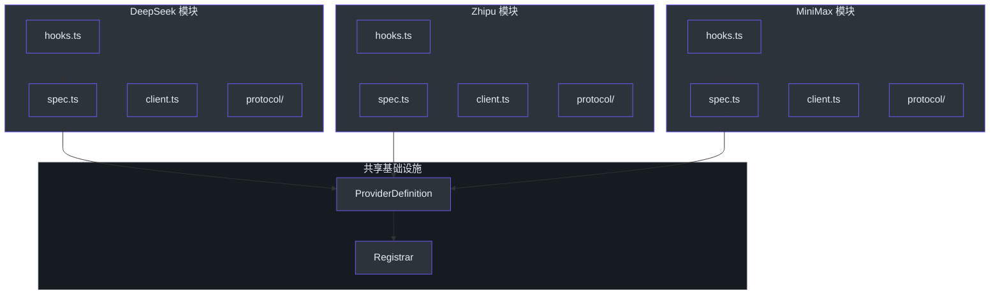
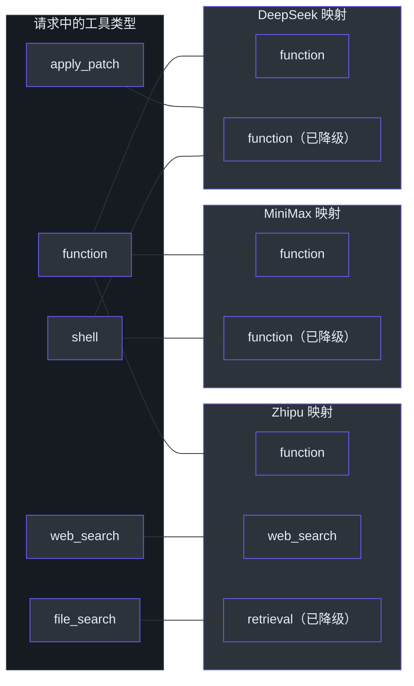
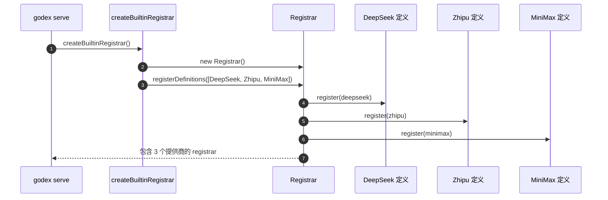

# 内置提供商

GodeX 内置了三个提供商，覆盖了最流行的非 OpenAI LLM 平台。每个提供商都是一个自包含模块，声明其能力、通过钩子转换请求、并将响应映射回标准的 Chat Completions 访问器。添加新提供商遵循相同的模式——实现 `ProviderSpec`，编写请求修补和响应标准化的钩子，然后在 `Registrar` 中注册。

## 概览

| 特性 | DeepSeek | Zhipu | MiniMax |
|---|---|---|---|
| **Spec 名称** | `deepseek` | `zhipu` | `minimax` |
| **默认 Base URL** | `api.deepseek.com` | `open.bigmodel.cn`（编程计划） | `api.minimaxi.com/v1` |
| **默认模型** | `deepseek-v4-pro` | `glm-5.1` | `MiniMax-M2.7` |
| **推理能力** | `native` | `boolean` | `none` |
| **最大工具数** | 128 | 128 | 128 |
| **响应格式** | text, json_object | text, json_object | text, json_object |
| **流式 Usage** | 是 | 是 | 是 |
| **缓存 Token** | 是 | 是 | 是 |

## 提供商架构

每个提供商遵循相同的结构模式：`spec.ts` 声明能力并创建 `ProviderSpec`，`hooks.ts` 实现请求修补和响应/流访问器，`client.ts` 创建用于发起 HTTP 调用的 `ProviderEdge`，`protocol/` 目录包含提供商特定的 DTO 类型。

所有提供商在启动时通过 `createBuiltinRegistrar` 注册（[src/providers/builtin.ts:49-55](https://github.com/Ahoo-Wang/GodeX/blob/main/src/providers/builtin.ts#L49-L55)），它创建一个 `Registrar` 并注册每个 `ProviderDefinition`。

## 工具能力对比

每个提供商声明其支持的工具类型以及哪些工具类型必须被**降级**为更简单的形式。降级意味着 GodeX 在将不支持的工具类型发送给提供商之前，会自动将其转换为最近的兼容类型。

| 工具类型 | DeepSeek | Zhipu | MiniMax |
|---|---|---|---|
| `function` | 支持 | 支持 | 支持 |
| `local_shell` | 降级为 `function` | 降级为 `function` | 降级为 `function` |
| `shell` | 降级为 `function` | 降级为 `function` | 降级为 `function` |
| `apply_patch` | 降级为 `function` | 降级为 `function` | 降级为 `function` |
| `custom` | 降级为 `function` | 降级为 `function` | 降级为 `function` |
| `tool_search` | 降级为 `function` | 降级为 `function` | 降级为 `function` |
| `namespace` | 降级为 `function` | 降级为 `function` | 降级为 `function` |
| `web_search` | - | 支持 | - |
| `web_search_preview` | - | 降级为 `web_search` | - |
| `file_search` | - | 降级为 `retrieval` | - |
| `mcp` | - | 支持 | - |

## 推理支持

每个提供商对推理（链式思考）的处理方式不同。桥接内核中的兼容性方案将传入的 `reasoning_effort` 映射到提供商特定的表示形式。

| 提供商 | Effort 类型 | 行为 |
|---|---|---|
| DeepSeek | `native` | 将 `high` 映射为 `high`，`xhigh` 映射为 `max`。在请求中添加 `thinking: {type: "enabled"}`。 |
| Zhipu | `boolean` | 检测到推理内容时添加 `thinking: {type: "enabled", clear_thinking: false}`。 |
| MiniMax | `none` | 完全移除 `reasoning_effort`；不支持推理。 |

DeepSeek 的 `deepSeekPatchRequest` 在 [src/providers/deepseek/hooks.ts:113-136](https://github.com/Ahoo-Wang/GodeX/blob/main/src/providers/deepseek/hooks.ts#L113-L136) 中处理此映射，Zhipu 的对应实现在 [src/providers/zhipu/hooks.ts:113-134](https://github.com/Ahoo-Wang/GodeX/blob/main/src/providers/zhipu/hooks.ts#L113-L134)。

## 工具选择支持

| 提供商 | 支持的工具选择值 |
|---|---|
| DeepSeek | `auto`、`none`、`required`、`function` |
| Zhipu | `auto`、`none` |
| MiniMax | `auto`、`none`、`required`、`function` |

## 提供商定义注册

每个提供商被包装在一个 `ProviderDefinition` 中，将提供商名称与工厂函数配对。这些定义被收集在 `BUILTIN_PROVIDER_DEFINITIONS` 中并在启动时注册（[src/providers/builtin.ts:22-41](https://github.com/Ahoo-Wang/GodeX/blob/main/src/providers/builtin.ts#L22-L41)）。

`ProviderDefinition` 接口定义在 [src/providers/definition.ts:6-11](https://github.com/Ahoo-Wang/GodeX/blob/main/src/providers/definition.ts#L6-L11)，要求提供 `name` 和一个 `create` 工厂函数，该函数从 `ProviderRuntimeConfig` 生成 `ProviderEdge`。

## 提供商规格

### DeepSeek

DeepSeek 规格目标为 `https://api.deepseek.com` 上的标准 Chat Completions API（[src/providers/deepseek/spec.ts:24-54](https://github.com/Ahoo-Wang/GodeX/blob/main/src/providers/deepseek/spec.ts#L24-L54)）。

| 属性 | 值 |
|---|---|
| 名称 | `deepseek` |
| 协议 | `chat_completions` |
| 默认 Base URL | `https://api.deepseek.com` |
| 默认模型 | `deepseek-v4-pro` |
| 认证 | Bearer |
| 推理 | 原生 Effort 级别 |

### Zhipu

Zhipu 规格默认使用编程计划端点 `https://open.bigmodel.cn/api/coding/paas/v4`（[src/providers/zhipu/spec.ts:24-57](https://github.com/Ahoo-Wang/GodeX/blob/main/src/providers/zhipu/spec.ts#L24-L57)）。

| 属性 | 值 |
|---|---|
| 名称 | `zhipu` |
| 协议 | `chat_completions` |
| 默认 Base URL | `https://open.bigmodel.cn/api/coding/paas/v4` |
| 默认模型 | `glm-5.1` |
| 认证 | Bearer |
| 推理 | 布尔值（thinking 启用/禁用） |

### MiniMax

MiniMax 规格目标为 `https://api.minimaxi.com/v1`（[src/providers/minimax/spec.ts:24-54](https://github.com/Ahoo-Wang/GodeX/blob/main/src/providers/minimax/spec.ts#L24-L54)）。

| 属性 | 值 |
|---|---|
| 名称 | `minimax` |
| 协议 | `chat_completions` |
| 默认 Base URL | `https://api.minimaxi.com/v1` |
| 默认模型 | `MiniMax-M2.7` |
| 认证 | Bearer |
| 推理 | 无 |

## 下一步

| 主题 | 说明 |
|---|---|
| [配置](./configuration.md) | 如何在 `godex.yaml` 中配置提供商 |
| [快速开始](./quick-start.md) | 安装并发起你的第一次调用 |
| [概览](./overview.md) | 架构和设计概念 |

## 参考

- [src/providers/builtin.ts:1-55](https://github.com/Ahoo-Wang/GodeX/blob/main/src/providers/builtin.ts#L1-L55) - 提供商定义和注册器
- [src/providers/deepseek/spec.ts:1-57](https://github.com/Ahoo-Wang/GodeX/blob/main/src/providers/deepseek/spec.ts#L1-L57) - DeepSeek 规格定义
- [src/providers/deepseek/hooks.ts:18-57](https://github.com/Ahoo-Wang/GodeX/blob/main/src/providers/deepseek/hooks.ts#L18-L57) - DeepSeek 能力和钩子
- [src/providers/zhipu/spec.ts:1-59](https://github.com/Ahoo-Wang/GodeX/blob/main/src/providers/zhipu/spec.ts#L1-L59) - Zhipu 规格定义
- [src/providers/zhipu/hooks.ts:16-69](https://github.com/Ahoo-Wang/GodeX/blob/main/src/providers/zhipu/hooks.ts#L16-L69) - Zhipu 能力和钩子
- [src/providers/minimax/spec.ts:1-57](https://github.com/Ahoo-Wang/GodeX/blob/main/src/providers/minimax/spec.ts#L1-L57) - MiniMax 规格定义
- [src/providers/minimax/hooks.ts:17-54](https://github.com/Ahoo-Wang/GodeX/blob/main/src/providers/minimax/hooks.ts#L17-L54) - MiniMax 能力和钩子
- [src/providers/definition.ts:6-29](https://github.com/Ahoo-Wang/GodeX/blob/main/src/providers/definition.ts#L6-L29) - ProviderDefinition 接口
- [src/bridge/provider-spec/contract.ts:54-74](https://github.com/Ahoo-Wang/GodeX/blob/main/src/bridge/provider-spec/contract.ts#L54-L74) - ProviderSpec 契约
