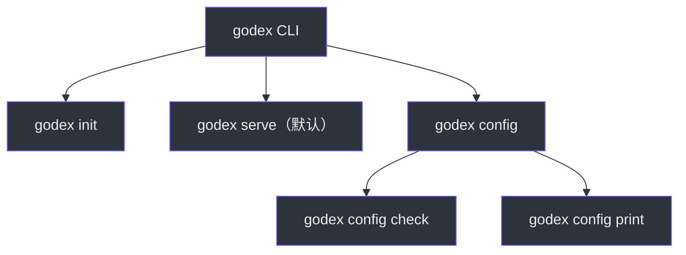
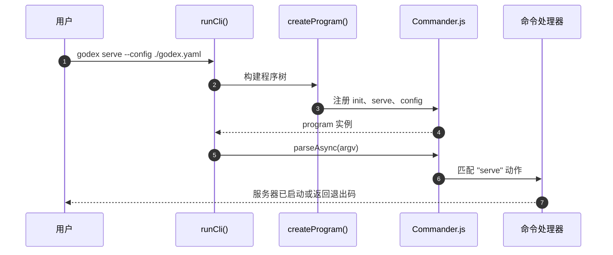
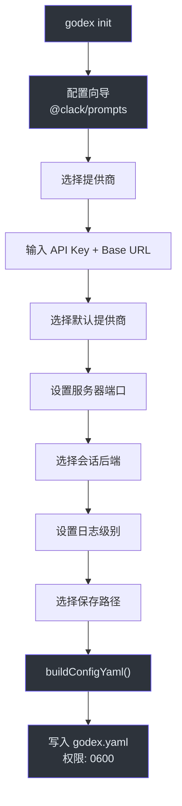
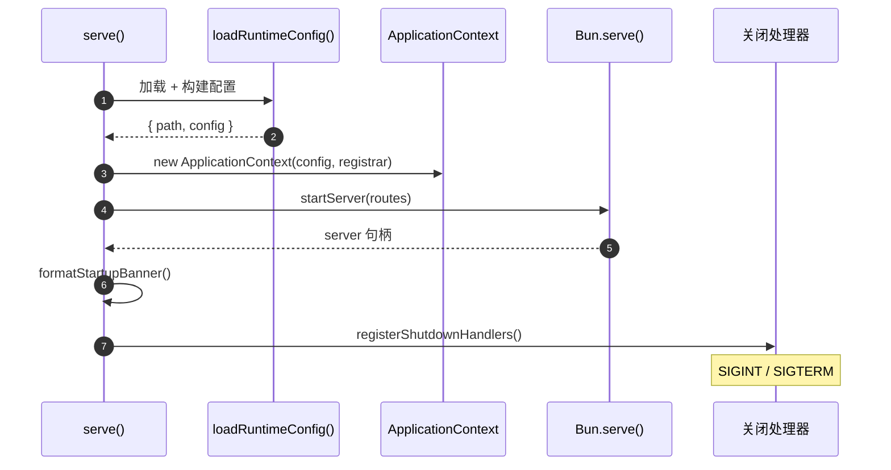

# 命令行界面

GodeX 以单个 `godex` 二进制文件发布，提供一组精简的命令用于引导配置、验证设置和运行 API 网关。CLI 是运维人员和 CI 管道的主要操作界面，因此优先考虑清晰的错误消息、合理的默认值，以及一个可在不到一分钟内生成可用 `godex.yaml` 的交互式向导。理解 CLI 结构是有效部署和运维 GodeX 的第一步。

## 概览

| 方面 | 详情 |
|---|---|
| 框架 | Commander.js（`commander` 包） |
| 入口点 | `runCli()`，位于 [src/cli/cli.ts:5-24](https://github.com/Ahoo-Wang/GodeX/blob/main/src/cli/cli.ts#L5) |
| 交互式提示 | `@clack/prompts` |
| 默认命令 | `serve` |
| 配置文件 | `godex.yaml`（YAML 格式，支持环境变量插值） |

## 命令概览



| 命令 | 用途 | 源码 |
|---|---|---|
| `godex init` | 交互式配置向导 | [src/cli/commands/init.ts](https://github.com/Ahoo-Wang/GodeX/blob/main/src/cli/commands/init.ts) |
| `godex serve` | 启动 API 网关 | [src/cli/commands/serve.ts](https://github.com/Ahoo-Wang/GodeX/blob/main/src/cli/commands/serve.ts) |
| `godex config check` | 验证配置而不启动 | [src/cli/commands/config.ts](https://github.com/Ahoo-Wang/GodeX/blob/main/src/cli/commands/config.ts) |
| `godex config print` | 打印已解析的配置（敏感信息已脱敏） | [src/cli/commands/config.ts](https://github.com/Ahoo-Wang/GodeX/blob/main/src/cli/commands/config.ts) |

## CLI 执行流程



`runCli` 位于
[src/cli/cli.ts:5-24](https://github.com/Ahoo-Wang/GodeX/blob/main/src/cli/cli.ts#L5)，
封装了 Commander 的 `parseAsync`，其错误处理能够区分 Commander 退出码（帮助、版本）和意外错误。程序在 `createProgram` 中构建，位于
[src/cli/program.ts:10-30](https://github.com/Ahoo-Wang/GodeX/blob/main/src/cli/program.ts#L10)，
它设置名称、描述、版本，并注册所有三个命令组。

## init 命令



init 命令位于
[src/cli/commands/init.ts:4-12](https://github.com/Ahoo-Wang/GodeX/blob/main/src/cli/commands/init.ts#L4)，
委托给 `runInit`（位于
[src/cli/init/run.ts:8-22](https://github.com/Ahoo-Wang/GodeX/blob/main/src/cli/init/run.ts#L8)），
由其驱动交互式向导。

### 支持的提供商

向导提供三个内置提供商，定义在
[src/cli/init/providers.ts:38-86](https://github.com/Ahoo-Wang/GodeX/blob/main/src/cli/init/providers.ts#L38)：

| 提供商 | 标签 | 默认模型 | API Key 占位符 |
|---|---|---|---|
| `deepseek` | DeepSeek | `deepseek-chat` | `${DEEPSEEK_API_KEY}` |
| `zhipu` | Zhipu (智谱) | `glm-4-plus` | `${ZHIPU_API_KEY}` |
| `minimax` | MiniMax | 默认模型 | `${MINIMAX_API_KEY}` |

### 提示序列

向导位于
[src/cli/init/prompts.ts:15-59](https://github.com/Ahoo-Wang/GodeX/blob/main/src/cli/init/prompts.ts#L15)，
收集以下信息：

1. **提供商选择** -- 从内置列表中多选（必需）
2. **提供商配置** -- 每个提供商的 API Key + Base URL
3. **默认提供商** -- 单选（仅选择一个时跳过）
4. **服务器端口** -- 文本输入，默认 `5678`
5. **会话后端** -- `sqlite` 或 `memory`
6. **日志级别** -- `debug`、`info` 或 `warn`

生成的配置通过 `buildConfigYaml`（位于
[src/cli/init/config-yaml.ts:6-53](https://github.com/Ahoo-Wang/GodeX/blob/main/src/cli/init/config-yaml.ts#L6)）使用 `js-yaml` 序列化，并以 `0600` 权限写入。

## serve 命令



serve 命令位于
[src/cli/serve.ts:12-62](https://github.com/Ahoo-Wang/GodeX/blob/main/src/cli/serve.ts#L12)，
执行以下步骤：

1. **加载配置** 通过 `loadRuntimeConfig`，位于
   [src/cli/runtime-config/load.ts:17-39](https://github.com/Ahoo-Wang/GodeX/blob/main/src/cli/runtime-config/load.ts#L17)
2. **验证** 提供商注册
3. **创建** `ApplicationContext`
4. **启动** Bun HTTP 服务器
5. **打印** 启动横幅
6. **注册** SIGINT/SIGTERM 关闭处理器

### 启动横幅

`formatStartupBanner` 位于
[src/cli/banner.ts:14-25](https://github.com/Ahoo-Wang/GodeX/blob/main/src/cli/banner.ts#L14)，
输出如下信息：

```
GodeX v0.0.2

  address:   http://0.0.0.0:5678
  env:       prod
  config:    /etc/godex/godex.yaml
  providers: deepseek, zhipu
  session:   sqlite (/data/sessions.db)
```

### 关闭处理

`registerShutdownHandlers` 位于
[src/cli/serve.ts:64-106](https://github.com/Ahoo-Wang/GodeX/blob/main/src/cli/serve.ts#L64)，
优雅地停止服务器、关闭 `ApplicationContext`，并以退出码 0 退出。`shuttingDown` 守卫可防止在快速重复信号时发生双重关闭。

## config 命令

`config` 命令组位于
[src/cli/commands/config.ts:16-47](https://github.com/Ahoo-Wang/GodeX/blob/main/src/cli/commands/config.ts#L16)，
提供两个子命令：

| 子命令 | 说明 |
|---|---|
| `godex config check` | 验证配置 + 提供商注册，失败时退出 |
| `godex config print` | 以 JSON 格式打印完全解析的配置，敏感信息已脱敏 |

两个子命令都接受与 `serve` 相同的 `--config`、`--port`、`--host` 和 `--log-level` 选项。

## 常用 CLI 选项

定义在 `CliOptions` 中，位于
[src/cli/runtime-config/options.ts:3-8](https://github.com/Ahoo-Wang/GodeX/blob/main/src/cli/runtime-config/options.ts#L3)：

| 选项 | 适用命令 | 说明 |
|---|---|---|
| `--config <path>` | serve、config | `godex.yaml` 的路径 |
| `--port <number>` | serve、config | 覆盖服务器端口（1-65535） |
| `--host <address>` | serve、config | 覆盖绑定地址 |
| `--log-level <level>` | serve、config | 覆盖日志级别 |

## 交叉参考

- [安装与设置](./installation-setup.md) -- 安装 CLI 二进制文件
- [服务器路由](../02-architecture/server-routes.md) -- `serve` 暴露的路由
- [配置 Schema](../07-configuration/config-schema.md) -- 完整的 godex.yaml 参考
- [日志](../07-configuration/logging.md) -- 日志级别配置
- [部署](../09-deployment/deployment.md) -- Docker 和原生二进制文件分发

## 参考

- [src/cli/cli.ts](https://github.com/Ahoo-Wang/GodeX/blob/main/src/cli/cli.ts) -- CLI 入口点
- [src/cli/program.ts](https://github.com/Ahoo-Wang/GodeX/blob/main/src/cli/program.ts) -- Commander 程序设置
- [src/cli/commands/init.ts](https://github.com/Ahoo-Wang/GodeX/blob/main/src/cli/commands/init.ts) -- init 命令注册
- [src/cli/commands/serve.ts](https://github.com/Ahoo-Wang/GodeX/blob/main/src/cli/commands/serve.ts) -- serve 命令注册
- [src/cli/commands/config.ts](https://github.com/Ahoo-Wang/GodeX/blob/main/src/cli/commands/config.ts) -- config 命令组
- [src/cli/serve.ts](https://github.com/Ahoo-Wang/GodeX/blob/main/src/cli/serve.ts) -- serve 实现和关闭处理器
- [src/cli/banner.ts](https://github.com/Ahoo-Wang/GodeX/blob/main/src/cli/banner.ts) -- 启动横幅格式化
- [src/cli/init/run.ts](https://github.com/Ahoo-Wang/GodeX/blob/main/src/cli/init/run.ts) -- 初始化向导运行器
- [src/cli/init/prompts.ts](https://github.com/Ahoo-Wang/GodeX/blob/main/src/cli/init/prompts.ts) -- 交互式提示序列
- [src/cli/init/config-yaml.ts](https://github.com/Ahoo-Wang/GodeX/blob/main/src/cli/init/config-yaml.ts) -- YAML 配置构建器
- [src/cli/init/providers.ts](https://github.com/Ahoo-Wang/GodeX/blob/main/src/cli/init/providers.ts) -- 内置提供商定义
