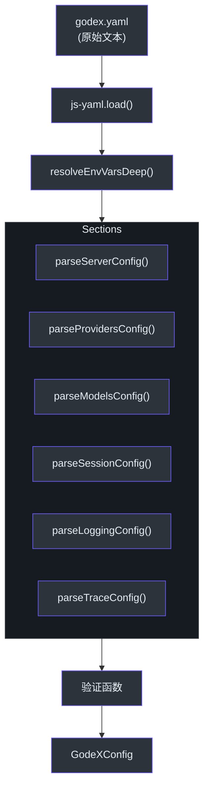
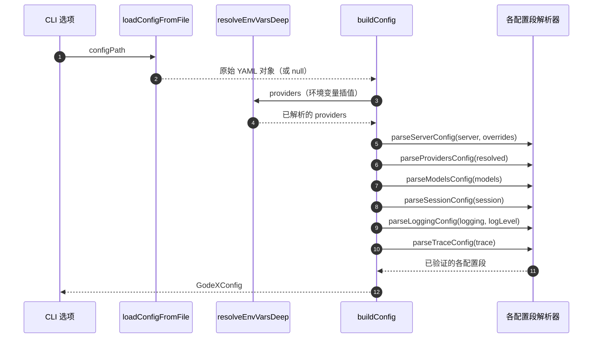
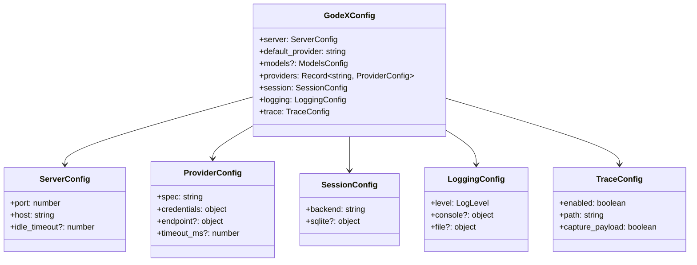

# 配置

GodeX 通过单个 YAML 文件进行配置，通常命名为 `godex.yaml`。配置文件控制网关的各个方面：监听端口、启用的提供商、会话存储方式、日志记录内容以及追踪记录方式。系统会读取文件、插值环境变量、应用 CLI 覆盖参数，并在服务器启动前验证每个字段。

## 概览

| 配置段 | 用途 | 是否必需 |
|---|---|---|
| `server` | 监听地址、端口、空闲超时 | 是（有默认值） |
| `default_provider` | 模型省略前缀时使用的提供商 | 是 |
| `providers` | 提供商名称到配置的映射 | 是 |
| `models` | 模型别名和通配符映射 | 否 |
| `session` | 对话历史后端 | 是（有默认值） |
| `logging` | 日志级别、控制台和文件输出 | 是（有默认值） |
| `trace` | 请求/响应追踪 | 是（有默认值） |

## 配置加载管道

原始 YAML 文件在成为系统其余部分使用的已验证 `GodeXConfig` 对象之前，需要经过一个多阶段管道处理（[src/config/builder.ts:17-39](https://github.com/Ahoo-Wang/GodeX/blob/main/src/config/builder.ts#L17-L39)）。



文件由 `loadConfigFromFile` 从磁盘读取（[src/config/reader.ts:5-35](https://github.com/Ahoo-Wang/GodeX/blob/main/src/config/reader.ts#L5-L35)），然后每个配置段由 `src/config/sections/` 中的专用函数解析。

## 环境变量插值

YAML 文件中的每个字符串值都支持 `${VAR}` 语法。插值是递归执行的，因此嵌套对象和数组都会被处理。这使你可以将 API Key 从配置文件中分离出来。

```yaml
providers:
  deepseek:
    spec: deepseek
    credentials:
      api_key: ${DEEPSEEK_API_KEY}
```

`resolveEnvVarsDeep` 函数通过遍历整个已解析的对象树来处理此过程（[src/config/env-interpolation.ts:9-20](https://github.com/Ahoo-Wang/GodeX/blob/main/src/config/env-interpolation.ts#L9-L20)）：

| 表达式 | 行为 |
|---|---|
| `${MY_VAR}` | 替换为 `process.env.MY_VAR` 的值 |
| `${MISSING_VAR}` | 保留为字面量 `${MISSING_VAR}` |
| 非字符串值 | 原样传递 |

## Server 配置段

控制 HTTP 服务器配置。在 [src/config/sections/server.ts:10-37](https://github.com/Ahoo-Wang/GodeX/blob/main/src/config/sections/server.ts#L10-L37) 中解析。

```yaml
server:
  port: 5678
  host: "0.0.0.0"
  idle_timeout: 0
```

| 字段 | 类型 | 默认值 | 说明 |
|---|---|---|---|
| `port` | `number` | `5678` | 监听端口。覆盖方式：`--port`、`GODEX_PORT` |
| `host` | `string` | `0.0.0.0` | 监听地址。覆盖方式：`--host`、`GODEX_HOST` |
| `idle_timeout` | `number` | `0` | 空闲连接超时时间（秒） |

`port` 的优先级顺序：CLI 参数 > YAML 值 > `GODEX_PORT` 环境变量 > 默认值 `5678`。

## Provider 配置段

每个提供商条目将一个逻辑名称映射到带有凭证的提供商规范。在 [src/config/sections/providers.ts:4-40](https://github.com/Ahoo-Wang/GodeX/blob/main/src/config/sections/providers.ts#L4-L40) 中解析。

```yaml
providers:
  deepseek:
    spec: deepseek
    credentials:
      api_key: ${DEEPSEEK_API_KEY}
    endpoint:
      base_url: https://api.deepseek.com
    timeout_ms: 30000
```

| 字段 | 类型 | 必需 | 说明 |
|---|---|---|---|
| `spec` | `string` | 是 | 提供商规范名称（例如 `deepseek`、`zhipu`、`minimax`） |
| `credentials.api_key` | `string` | 是 | 提供商 API 的 Bearer Token |
| `endpoint.base_url` | `string` | 否 | 覆盖提供商的默认 Base URL |
| `timeout_ms` | `number` | 否 | 单请求超时时间（毫秒） |

`spec` 字段是必填的。缺少 `spec` 的旧版提供商配置将在启动时产生错误（[src/config/sections/providers.ts:17-19](https://github.com/Ahoo-Wang/GodeX/blob/main/src/config/sections/providers.ts#L17-L19)）。

## Models 配置段

模型别名允许你将友好的模型名称映射到具体的提供商/模型对。通配符 `*` 用作兜底匹配。

```yaml
models:
  aliases:
    "gpt-5.5": deepseek/deepseek-v4-pro
    "glm": zhipu/glm-5.1
    "*": deepseek/deepseek-v4-flash
```

| 别名 | 解析为 | 行为 |
|---|---|---|
| `gpt-5.5` | `deepseek/deepseek-v4-pro` | 精确匹配 |
| `glm` | `zhipu/glm-5.1` | 精确匹配 |
| `*` | `deepseek/deepseek-v4-flash` | 任何未匹配模型的兜底方案 |

## Session 配置段

控制如何通过 `previous_response_id` 持久化对话历史以支持多轮对话。在 [src/config/sections/session.ts:5-27](https://github.com/Ahoo-Wang/GodeX/blob/main/src/config/sections/session.ts#L5-L27) 中解析。

```yaml
session:
  backend: sqlite
  sqlite:
    path: ./data/sessions.db
```

| 字段 | 类型 | 默认值 | 说明 |
|---|---|---|---|
| `backend` | `"memory" \| "sqlite"` | `memory` | 响应会话的存储后端 |
| `sqlite.path` | `string` | 自动 | SQLite 数据库文件路径 |

## Logging 配置段

控制通过 LogTape 进行的结构化日志输出。在 [src/config/sections/logging.ts:9-67](https://github.com/Ahoo-Wang/GodeX/blob/main/src/config/sections/logging.ts#L9-L67) 中解析。

```yaml
logging:
  level: info
  console:
    enabled: true
    level: info
  file:
    enabled: true
    level: debug
    dir: ./logs
    filename: godex.log
    max_size: 10485760
    max_files: 5
```

| 字段 | 类型 | 默认值 | 说明 |
|---|---|---|---|
| `level` | `LogLevel` | `info` | 全局最低日志级别。覆盖方式：`--log-level`、`GODEX_LOG_LEVEL` |
| `console.enabled` | `boolean` | - | 启用控制台输出 |
| `console.level` | `LogLevel` | 继承 `level` | 控制台专用日志级别 |
| `file.enabled` | `boolean` | - | 启用文件输出 |
| `file.dir` | `string` | 启用时必需 | 日志文件目录 |
| `file.filename` | `string` | 启用时必需 | 日志文件名 |
| `file.max_size` | `number` | - | 轮转前的最大文件大小（字节） |
| `file.max_files` | `number` | - | 保留的轮转文件最大数量 |

有效的日志级别：`trace`、`debug`、`info`、`warn`、`error`。

## Trace 配置段

控制请求/响应追踪子系统。在 [src/config/sections/trace.ts:6-49](https://github.com/Ahoo-Wang/GodeX/blob/main/src/config/sections/trace.ts#L6-L49) 中解析。

```yaml
trace:
  enabled: true
  path: ./data/trace.db
  capture_payload: false
  payload_max_bytes: 65536
  max_queue_size: 10000
  flush_interval_ms: 1000
  batch_size: 100
```

| 字段 | 类型 | 默认值 | 说明 |
|---|---|---|---|
| `enabled` | `boolean` | `true` | 启用或禁用追踪 |
| `path` | `string` | 自动 | 追踪 SQLite 数据库路径 |
| `capture_payload` | `boolean` | `false` | 记录完整的请求/响应体 |
| `payload_max_bytes` | `number` | `65536` | 捕获的最大 Payload 大小 |
| `max_queue_size` | `number` | `10000` | 内存中追踪事件队列大小 |
| `flush_interval_ms` | `number` | `1000` | 将追踪数据刷新到磁盘的间隔时间 |
| `batch_size` | `number` | `100` | 每次刷新的追踪批次数 |

## 完整配置构建流程

`buildConfig` 函数在 [src/config/builder.ts:17-39](https://github.com/Ahoo-Wang/GodeX/blob/main/src/config/builder.ts#L17-L39) 中将所有内容整合在一起。



## CLI 覆盖

CLI 层可以在不编辑 YAML 文件的情况下覆盖特定的配置值。这些覆盖通过 `ConfigOverrides` 接口传递给 `buildConfig`（[src/config/builder.ts:11-15](https://github.com/Ahoo-Wang/GodeX/blob/main/src/config/builder.ts#L11-L15)）。

| CLI 参数 | 配置路径 | 类型 |
|---|---|---|
| `--port` | `server.port` | `number` |
| `--host` | `server.host` | `string` |
| `--config` | （文件路径） | `string` |
| `--log-level` | `logging.level` | `LogLevel` |

## 完整示例

```yaml
server:
  port: 5678
  host: "0.0.0.0"
  idle_timeout: 0

default_provider: deepseek

models:
  aliases:
    "gpt-5.5": deepseek/deepseek-v4-pro
    "glm": zhipu/glm-5.1
    "*": deepseek/deepseek-v4-flash

providers:
  deepseek:
    spec: deepseek
    credentials:
      api_key: ${DEEPSEEK_API_KEY}
    endpoint:
      base_url: https://api.deepseek.com
    timeout_ms: 30000
  zhipu:
    spec: zhipu
    credentials:
      api_key: ${ZHIPU_API_KEY}
  minimax:
    spec: minimax
    credentials:
      api_key: ${MINIMAX_API_KEY}

session:
  backend: sqlite
  sqlite:
    path: ./data/sessions.db

logging:
  level: info
  console:
    enabled: true
  file:
    enabled: true
    dir: ./logs
    filename: godex.log

trace:
  enabled: true
  capture_payload: false
```

## 配置 Schema

顶层 `GodeXConfig` 类型定义在 [src/config/schema.ts:62-70](https://github.com/Ahoo-Wang/GodeX/blob/main/src/config/schema.ts#L62-70)：



## 下一步

| 主题 | 说明 |
|---|---|
| [快速开始](./quick-start.md) | 五分钟内安装并运行 GodeX |
| [内置提供商](./builtin-providers.md) | 对比各提供商能力 |
| [概览](./overview.md) | 架构和设计概念 |

## 参考

- [src/config/schema.ts:1-71](https://github.com/Ahoo-Wang/GodeX/blob/main/src/config/schema.ts#L1-L71) - 所有配置类型定义
- [src/config/reader.ts:5-35](https://github.com/Ahoo-Wang/GodeX/blob/main/src/config/reader.ts#L5-L35) - YAML 文件加载器
- [src/config/env-interpolation.ts:1-20](https://github.com/Ahoo-Wang/GodeX/blob/main/src/config/env-interpolation.ts#L1-L20) - `${VAR}` 插值
- [src/config/builder.ts:11-39](https://github.com/Ahoo-Wang/GodeX/blob/main/src/config/builder.ts#L11-L39) - 带覆盖的配置构建器
- [src/config/sections/server.ts:10-37](https://github.com/Ahoo-Wang/GodeX/blob/main/src/config/sections/server.ts#L10-L37) - Server 配置解析器
- [src/config/sections/providers.ts:4-40](https://github.com/Ahoo-Wang/GodeX/blob/main/src/config/sections/providers.ts#L4-L40) - Provider 配置解析器
- [src/config/sections/session.ts:5-27](https://github.com/Ahoo-Wang/GodeX/blob/main/src/config/sections/session.ts#L5-L27) - Session 配置解析器
- [src/config/sections/logging.ts:9-67](https://github.com/Ahoo-Wang/GodeX/blob/main/src/config/sections/logging.ts#L9-L67) - Logging 配置解析器
- [src/config/sections/trace.ts:6-49](https://github.com/Ahoo-Wang/GodeX/blob/main/src/config/sections/trace.ts#L6-L49) - Trace 配置解析器
