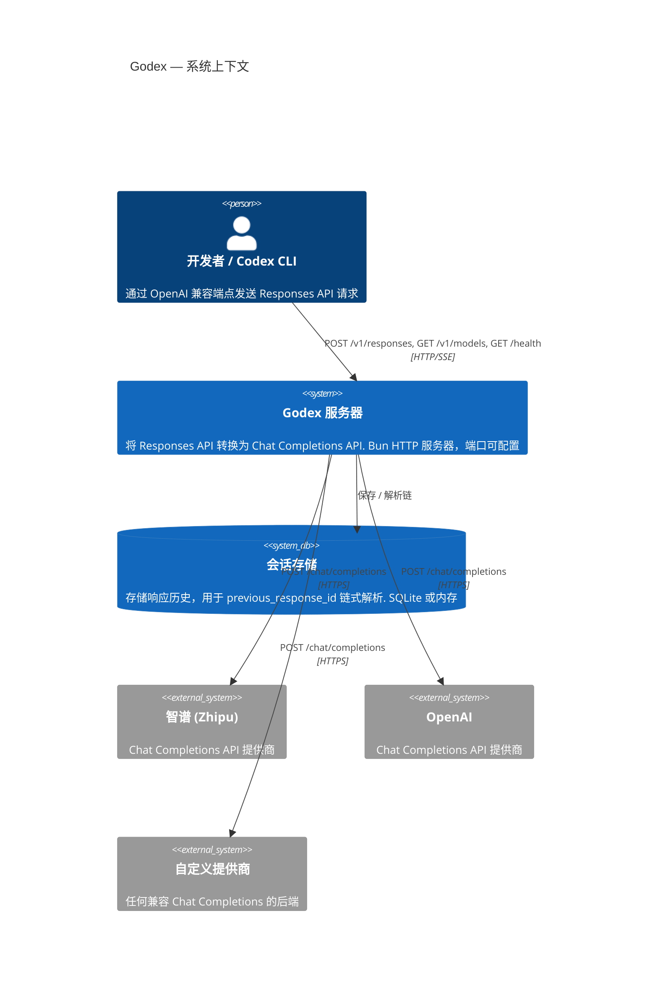

# 概述

Godex 是一个基于 [Bun](https://bun.sh) 和 **TypeScript** 构建的 **OpenAI Responses API 网关**。它将标准的 `/v1/responses` 请求转换为上游 Chat Completions API 调用，使任何 LLM 提供商都能作为支持 OpenAI 协议工具（包括 Codex CLI）的后端。

## 为什么选择 Godex？

- **协议转换**：Codex 等工具期望 OpenAI Responses API，但许多提供商仅提供 Chat Completions。Godex 弥补了这一差距。
- **提供商无关**：基于插件的适配器系统意味着添加新提供商只需实现少量接口，无需重写服务器。
- **流式优先**：整个管道围绕 `ReadableStream` 和 `TransformStream` 构建，确保低延迟 SSE 传输。
- **会话历史**：内置 `previous_response_id` 链式解析，支持 SQLite 或内存后端。

## 系统上下文



## 核心设计决策

| 决策 | 原因 |
|------|------|
| Bun 运行时 | 原生 `ReadableStream`、快速启动、内置 SQLite |
| 适配器模式 | 协议转换与提供商逻辑清晰分离 |
| 不可变能力集 | 防止运行时修改提供商特性标志 |
| 会话存储抽象 | 在不触及业务逻辑的情况下切换内存和 SQLite |

## 项目结构

```
src/
├── cli/              Commander CLI（serve、config check、init）
├── config/           godex.yaml Schema、环境变量插值、默认值
├── context/          ApplicationContext（DI）、ResponsesContext（每请求）
├── adapter/          适配器接口、DefaultAdapter、流转换器
│   ├── mapper/       RequestMapper / ResponseMapper / StreamMapper 契约
│   └── transformers/ ProviderEvent 到 Response 到 SSE 编码管道
├── providers/        提供商注册 + 内置工厂
│   └── zhipu/        参考提供商实现
├── resolver/         ModelResolver（模型选择器到提供商+模型）
├── server/           Bun HTTP 服务器、路由器、路由
├── session/          ResponseSessionStore（内存 + SQLite）、链式解析
├── error/            GodexError 层次结构，带域代码
├── protocol/openai/  OpenAI 兼容类型定义
├── logger/           结构化 JSON 日志
└── e2e/              带模拟上游的端到端测试
```

[安装与配置](/zh/01-getting-started/installation-setup)
