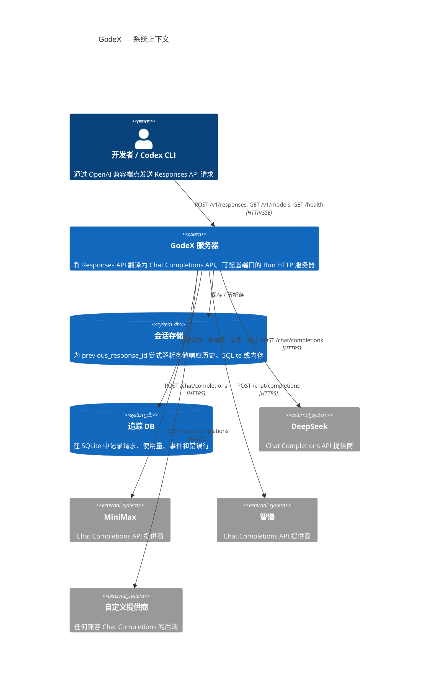

# 概述

GodeX 是一个基于 [Bun](https://bun.sh) 和 **TypeScript** 构建的 **OpenAI Responses API 网关**。它将标准的 `/v1/responses` 请求翻译为上游 Chat Completions API 调用，使任何 LLM 提供商都可以作为使用 OpenAI 协议工具的后端 — 包括 Codex CLI。

## 为什么选择 GodeX？

- **协议翻译**：Codex 等工具期望 OpenAI Responses API，但许多提供商仅提供 Chat Completions。GodeX 桥接了这个差距。
- **与提供商无关**：基于 spec 的提供商系统意味着添加新提供商只需声明能力和编写小 hooks，无需重写服务器。
- **流式优先**：整个管道基于 `ReadableStream` 和 `TransformStream` 构建，确保低延迟 SSE 交付。
- **会话历史**：内置 `previous_response_id` 链式解析，支持 SQLite 或内存后端。

## 系统上下文



## 关键设计决策

| 决策 | 理由 |
|------|------|
| Bun 运行时 | 原生 `ReadableStream`、快速启动、内置 SQLite |
| Bridge 内核 | 协议翻译与提供商逻辑清晰分离 |
| 不可变能力集 | 防止运行时变异提供商特性标志 |
| 会话存储抽象 | 在内存和 SQLite 之间切换无需修改业务逻辑 |
| 可组合流转换器 | 每个关注点（追踪、日志、持久化、验证）是独立阶段 |

## 项目结构

```
src/
├── cli/              Commander CLI（serve、config、init）
├── config/           godex.yaml 模式、环境变量插值、默认值
├── context/          ApplicationContext（DI）、ResponsesContext（每请求）
├── bridge/           与提供商无关的 Responses-to-Chat bridge 内核
│   ├── compatibility/  参数和响应格式兼容性规划
│   ├── request/        输入规范化和消息构建
│   ├── tools/          工具声明、tool_choice、身份映射
│   ├── output/         结构化输出合约规划和验证
│   ├── response/       同步 ResponseObject 重建
│   ├── stream/         流状态机和增量映射
│   ├── provider-spec/  ProviderSpec、ProviderEdge、工厂辅助
│   └── finish-reason/  提供商完成原因映射
├── providers/        提供商注册表、spec、hooks、客户端
│   ├── deepseek/      DeepSeek 提供商
│   ├── minimax/       MiniMax 提供商
│   ├── zhipu/         智谱提供商
│   ├── example/       仅 spec 的示例提供商
│   └── shared/        共享提供商工具（ChatProviderClient 等）
├── responses/        同步和流式编排管道
│   └── stream-transforms/  可组合 TransformStream 阶段
├── server/           Bun 路由（/health、/v1/models、/v1/responses）
├── resolver/         ModelResolver（模型选择器到 provider + model）
├── session/          内存和 SQLite 响应会话存储
├── trace/            SQLite 追踪记录器
├── error/            GodeXError 层次与域代码
├── protocol/         OpenAI 协议类型定义
├── tools/            内置工具定义（shell、apply_patch 等）
└── e2e/              使用模拟上游的端到端测试
```

[安装与配置](/zh/01-getting-started/installation-setup)
