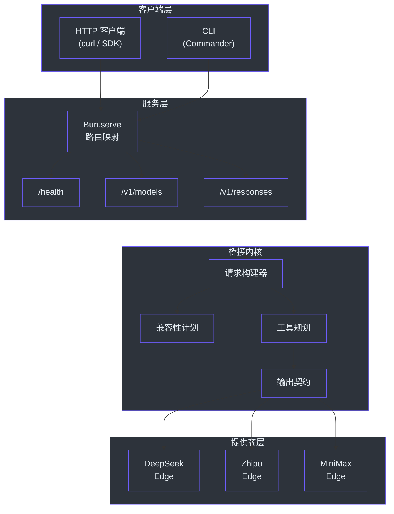
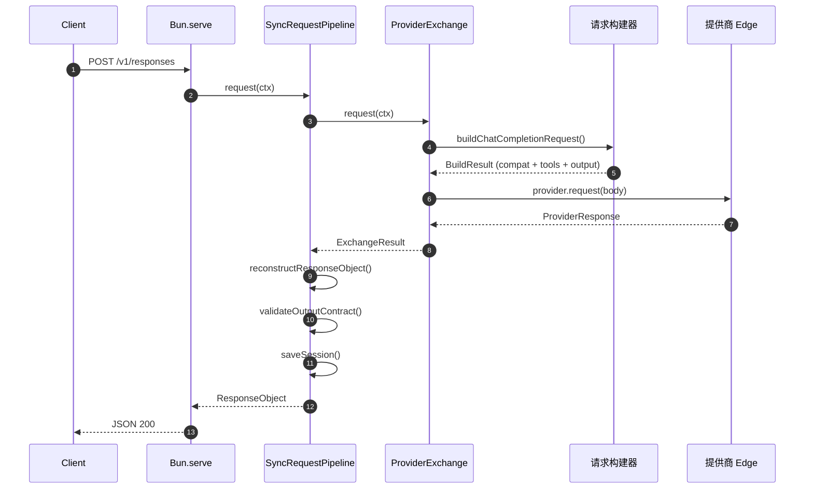
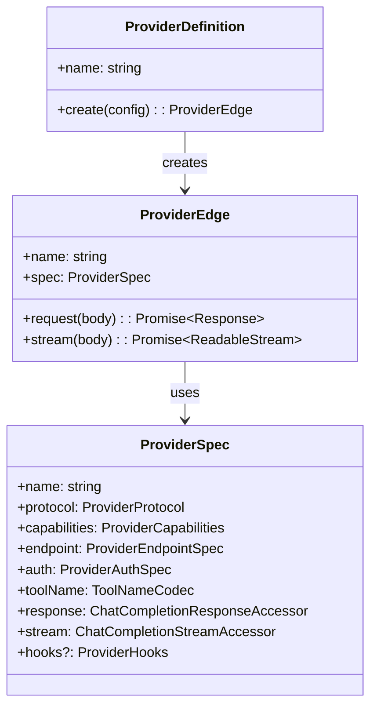
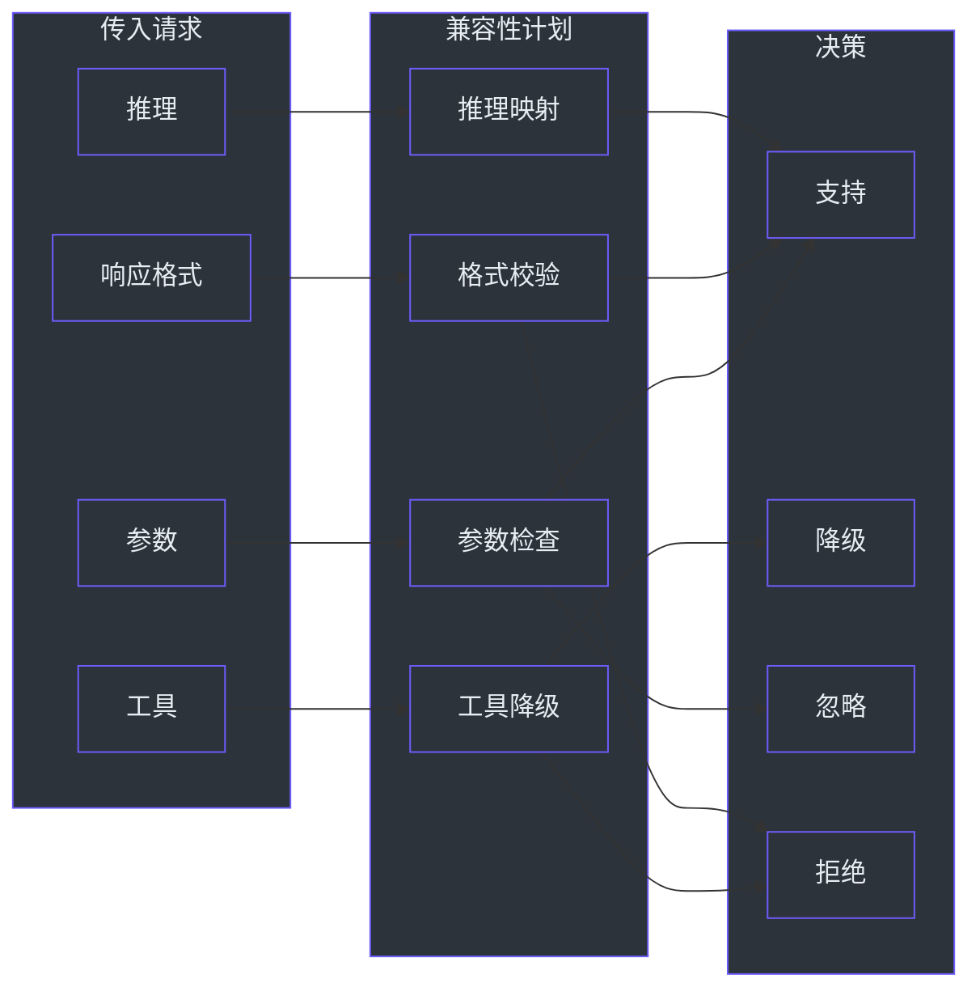

# 概述

GodeX 在 OpenAI Responses API 与众多非 OpenAI 大语言模型提供商之间架起了桥梁。你无需重写每个客户端 SDK 来适配各提供商的专有协议，只需将 OpenAI 兼容的工具指向 GodeX，它会在后台透明地完成请求和响应的转换。这消除了供应商锁定问题，让团队能够通过一次配置变更即可切换或组合 LLM 提供商。

## 概览

| 方面 | 详情 |
|---|---|
| **定义** | 兼容 OpenAI 的 Responses API 网关 |
| **协议** | 接收 OpenAI Responses API 请求；转换为 Chat Completions |
| **运行时** | 基于 Bun 构建，提供高性能 HTTP 服务 |
| **内置提供商** | DeepSeek、Zhipu、MiniMax |
| **会话后端** | 内存、SQLite |
| **配置** | YAML 文件，支持 `${VAR}` 环境变量插值 |
| **CLI** | `godex init` 向导、`godex serve` 运行时 |
| **可观测性** | 内置追踪记录器，支持载荷捕获 |

## 架构

GodeX 采用分层网关架构，每一层拥有单一职责：CLI 解析、配置构建、提供商注册、请求桥接和响应重建。

## 请求生命周期

每个传入请求都遵循一条确定性的系统路径。桥接内核验证兼容性、规划工具转换、将请求分发到正确的提供商边缘，然后将响应重建为 OpenAI Responses API 格式。

`SyncRequestPipeline` 负责编排整个流程：它将处理委托给 `ProviderExchange`，后者调用 `buildChatCompletionRequest` 将传入的 Responses API 载荷转换为针对目标提供商能力定制的 Chat Completions 请求 ([src/responses/sync-request-pipeline.ts:31-46](https://github.com/Ahoo-Wang/GodeX/blob/main/src/responses/sync-request-pipeline.ts#L31-L46))。

## 提供商规约契约

每个提供商都实现了 `ProviderSpec` 接口，该接口定义了能力、端点配置、认证、工具名称转换以及响应/流访问器的统一契约 ([src/bridge/provider-spec/contract.ts:54-74](https://github.com/Ahoo-Wang/GodeX/blob/main/src/bridge/provider-spec/contract.ts#L54-L74))。

| 契约字段 | 用途 |
|---|---|
| `name` | 唯一的提供商标识符（如 `deepseek`） |
| `protocol` | 始终为 `chat_completions` |
| `capabilities` | 声明支持的参数、工具、格式 |
| `endpoint` | 默认基础 URL |
| `auth` | 认证方案（始终为 Bearer） |
| `toolName` | 在 API 和提供商之间转换工具名称的编解码器 |
| `response` | 用于提取文本、用量、结束原因的访问器 |
| `stream` | 用于从 SSE 数据块中提取增量的访问器 |
| `hooks` | 可选的 `patchRequest`、`normalizeResponse`、`normalizeChunk` |

## 会话管理

GodeX 通过持久化响应并在客户端发送 `previous_response_id` 时回放历史消息来支持多轮对话。提供两种后端：

| 后端 | 描述 | 默认 |
|---|---|---|
| `memory` | 进程内映射；重启后丢失 | 是 |
| `sqlite` | 通过 SQLite 实现的文件持久化 | 按需启用 |

会话配置在 [src/config/sections/session.ts:5-27](https://github.com/Ahoo-Wang/GodeX/blob/main/src/config/sections/session.ts#L5-L27) 中解析，存储在 `ApplicationContext` 初始化期间创建 ([src/context/application-context.ts:20-30](https://github.com/Ahoo-Wang/GodeX/blob/main/src/context/application-context.ts#L20-L30))。

## 兼容性规划

在任何请求到达提供商之前，桥接内核会构建一份**兼容性计划**，将每个请求的参数、工具类型和响应格式与提供商声明的能力进行校验。不支持的功能要么降级为兼容的替代方案，要么以诊断信息拒绝 ([src/bridge/compatibility/compatibility-plan.ts:38-50](https://github.com/Ahoo-Wang/GodeX/blob/main/src/bridge/compatibility/compatibility-plan.ts#L38-L50))。

## 流式管道

对于流式请求，`StreamPipeline` 将多个 `TransformStream` 阶段串联起来：原始 SSE 摄取、事件桥接、输出契约校验、追踪记录、日志记录、会话持久化和兼容性诊断 ([src/responses/stream-pipeline.ts:37-85](https://github.com/Ahoo-Wang/GodeX/blob/main/src/responses/stream-pipeline.ts#L37-L85))。

```mermaid
flowchart LR
    SSE["上游 SSE"] --> Trace1["追踪原始数据"]
    Trace1 --> Bridge["流事件桥接"]
    Bridge --> Error["错误处理"]
    Error --> Validate["输出契约"]
    Validate --> Trace2["追踪转换数据"]
    Trace2 --> Log["响应日志"]
    Log --> Session["会话持久化"]
    Session --> CompatLog["兼容性诊断"]

    style SSE fill:#2d333b,stroke:#6d5dfc,color:#e6edf3
    style Trace1 fill:#2d333b,stroke:#6d5dfc,color:#e6edf3
    style Bridge fill:#2d333b,stroke:#6d5dfc,color:#e6edf3
    style Error fill:#2d333b,stroke:#6d5dfc,color:#e6edf3
    style Validate fill:#2d333b,stroke:#6d5dfc,color:#e6edf3
    style Trace2 fill:#2d333b,stroke:#6d5dfc,color:#e6edf3
    style Log fill:#2d333b,stroke:#6d5dfc,color:#e6edf3
    style Session fill:#2d333b,stroke:#6d5dfc,color:#e6edf3
    style CompatLog fill:#2d333b,stroke:#6d5dfc,color:#e6edf3
```

## 下一步

| 主题 | 描述 |
|---|---|
| [快速开始](./quick-start.md) | 安装 GodeX 并发起你的第一个 API 调用 |
| [配置](./configuration.md) | 完整的 `godex.yaml` 参考文档 |
| [内置提供商](./builtin-providers.md) | DeepSeek、Zhipu 和 MiniMax 对比 |

## 参考

- [src/index.ts:1-5](https://github.com/Ahoo-Wang/GodeX/blob/main/src/index.ts#L1-L5) - CLI 入口点
- [package.json:1-75](https://github.com/Ahoo-Wang/GodeX/blob/main/package.json#L1-L75) - 项目元数据和脚本
- [src/bridge/provider-spec/contract.ts:54-74](https://github.com/Ahoo-Wang/GodeX/blob/main/src/bridge/provider-spec/contract.ts#L54-L74) - ProviderSpec 接口
- [src/server/server.ts:21-27](https://github.com/Ahoo-Wang/GodeX/blob/main/src/server/server.ts#L21-L27) - 内置路由映射
- [src/responses/runtime.ts:19-41](https://github.com/Ahoo-Wang/GodeX/blob/main/src/responses/runtime.ts#L19-L41) - ResponsesBridgeRuntime
- [src/bridge/compatibility/compatibility-plan.ts:38-50](https://github.com/Ahoo-Wang/GodeX/blob/main/src/bridge/compatibility/compatibility-plan.ts#L38-L50) - CompatibilityPlan 接口
- [src/responses/sync-request-pipeline.ts:31-46](https://github.com/Ahoo-Wang/GodeX/blob/main/src/responses/sync-request-pipeline.ts#L31-L46) - 同步请求管道
- [src/responses/stream-pipeline.ts:37-85](https://github.com/Ahoo-Wang/GodeX/blob/main/src/responses/stream-pipeline.ts#L37-L85) - 流式管道
- [src/context/application-context.ts:10-40](https://github.com/Ahoo-Wang/GodeX/blob/main/src/context/application-context.ts#L10-L40) - 应用上下文
