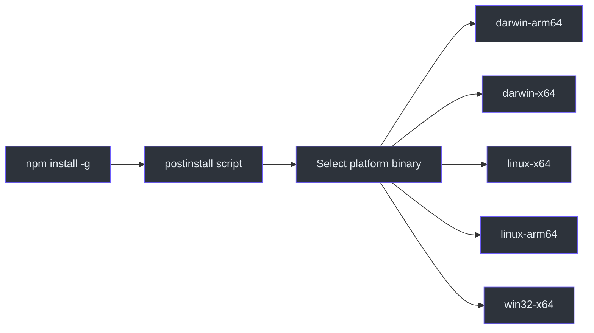
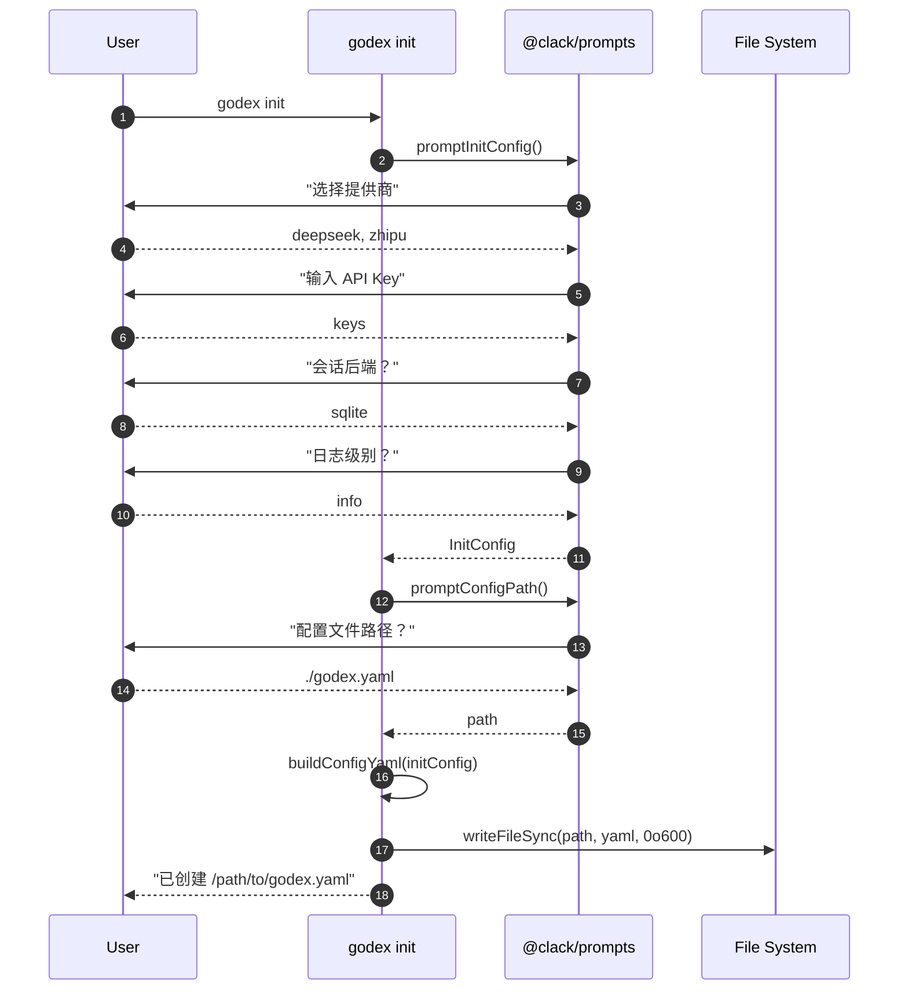
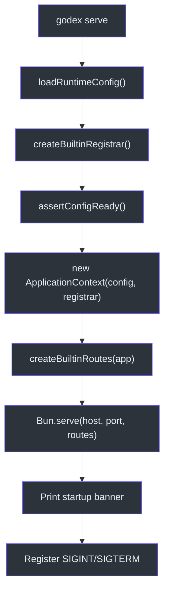
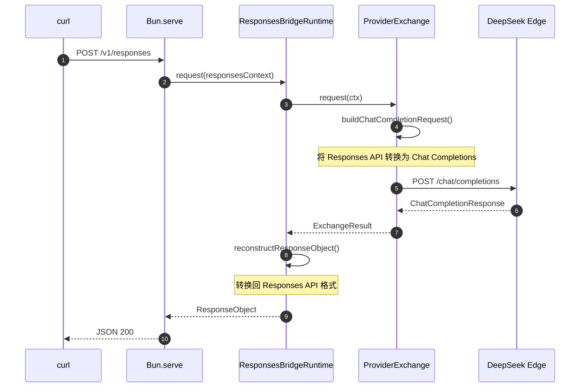

# 快速开始

搭建一个可用的 GodeX 网关只需不到五分钟。本指南将引导你完成安装、通过 `godex init` 向导进行交互式配置、启动服务器，以及发送你的第一个 Responses API 请求。完成之后，你将拥有一个运行中的网关，它能够将 OpenAI Responses API 调用转换为任意内置提供商的 Chat Completions 请求。

## 前提条件

| 要求 | 最低版本 |
|---|---|
| Bun | >= 1.0（用于开发） |
| Node.js | >= 18（仅用于 npm install） |
| 提供商 API Key | 至少拥有 DeepSeek、Zhipu 或 MiniMax 之一 |

## 概览

| 步骤 | 命令 | 说明 |
|---|---|---|
| 1. 安装 | `npm install -g @ahoo-wang/godex` | 安装原生二进制文件 |
| 2. 配置 | `godex init` | 交互式向导生成 `godex.yaml` |
| 3. 运行 | `godex serve` | 启动 HTTP 网关 |
| 4. 测试 | `curl localhost:5678/health` | 验证服务器是否正常运行 |
| 5. 调用 | `curl -X POST localhost:5678/v1/responses` | 发送你的第一个 API 请求 |

## 第一步 -- 安装 GodeX

GodeX 以独立原生二进制文件的形式发布。npm 包的 `postinstall` 脚本会自动选择正确的平台二进制文件。

```bash
npm install -g @ahoo-wang/godex
```

你也可以通过 Homebrew 安装，或者直接从 [GitHub Releases](https://github.com/Ahoo-Wang/GodeX/releases) 下载二进制文件。有关所有安装方式，请参阅[安装与设置](./installation-setup.md)。



## 第二步 -- 创建配置

运行交互式初始化向导。它会引导你选择提供商、输入 API Key、配置会话后端和日志级别，然后生成一个完整的 `godex.yaml` 文件（[src/cli/init/run.ts:8-22](https://github.com/Ahoo-Wang/GodeX/blob/main/src/cli/init/run.ts#L8-L22)）。

```bash
godex init
```

该向导使用 `@clack/prompts` 来收集以下信息：

| 提示项 | 说明 | 默认值 |
|---|---|---|
| 默认提供商 | 当模型前缀不明确时使用的提供商 | `deepseek` |
| API Key | 每个所选提供商的 Bearer Token | （来自环境变量） |
| Base URL | 覆盖每个提供商的端点地址 | 提供商默认值 |
| 会话后端 | `memory` 或 `sqlite` | `memory` |
| 日志级别 | `trace`、`debug`、`info`、`warn`、`error` | `info` |
| 端口 | 服务器监听端口 | `5678` |
| 配置文件路径 | `godex.yaml` 的写入位置 | `./godex.yaml` |



生成的 `godex.yaml` 文件内容类似如下（API Key 以环境变量引用的形式呈现）：

```yaml
server:
  port: 5678
default_provider: deepseek
providers:
  deepseek:
    spec: deepseek
    credentials:
      api_key: ${DEEPSEEK_API_KEY}
    endpoint:
      base_url: https://api.deepseek.com
  zhipu:
    spec: zhipu
    credentials:
      api_key: ${ZHIPU_API_KEY}
    endpoint:
      base_url: https://open.bigmodel.cn/api/coding/paas/v4
session:
  backend: sqlite
  sqlite:
    path: ./data/sessions.db
logging:
  level: info
```

YAML 构建器在 [src/cli/init/config-yaml.ts:6-53](https://github.com/Ahoo-Wang/GodeX/blob/main/src/cli/init/config-yaml.ts#L6-L53) 中组装此结构，并将文件权限设置为 `0600` 以保护 API Key。

## 第三步 -- 启动服务器

```bash
# 在环境中设置你的 API Key
export DEEPSEEK_API_KEY=sk-your-key-here

# 启动网关
godex serve
```

`serve` 命令会加载配置、注册内置提供商、创建 `ApplicationContext`，并启动 Bun 的 HTTP 服务器（[src/cli/serve.ts:12-47](https://github.com/Ahoo-Wang/GodeX/blob/main/src/cli/serve.ts#L12-L47)）。



常用的 CLI 覆盖参数：

| 参数 | 示例 | 效果 |
|---|---|---|
| `--port` | `godex serve --port 8080` | 覆盖监听端口 |
| `--host` | `godex serve --host 127.0.0.1` | 覆盖监听地址 |
| `--config` | `godex serve --config /etc/godex/godex.yaml` | 使用替代配置路径 |
| `--log-level` | `godex serve --log-level debug` | 覆盖日志级别 |

## 第四步 -- 验证服务器

```bash
curl http://localhost:5678/health
```

预期响应：

```json
{"status":"ok","providers":["deepseek","zhipu","minimax"],"unsupported_providers":[]}
```

健康检查路由注册在 [src/server/server.ts:22-23](https://github.com/Ahoo-Wang/GodeX/blob/main/src/server/server.ts#L22-L23)。

## 第五步 -- 发送你的第一个 API 调用

```bash
curl -X POST http://localhost:5678/v1/responses \
  -H "Content-Type: application/json" \
  -d '{
    "model": "deepseek/deepseek-v4-pro",
    "input": "用两句话解释桥接模式。"
  }'
```

服务器通过完整的桥接管道来路由请求：



你也可以在请求体中添加 `"stream": true` 来启用流式响应。

## 下一步

| 主题 | 说明 |
|---|---|
| [配置](./configuration.md) | 完整的 `godex.yaml` 参考及所有配置段说明 |
| [内置提供商](./builtin-providers.md) | 对比 DeepSeek、Zhipu 和 MiniMax 的能力 |
| [安装与设置](./installation-setup.md) | Docker、从源码构建及平台二进制文件 |

## 参考

- [src/cli/cli.ts:1-24](https://github.com/Ahoo-Wang/GodeX/blob/main/src/cli/cli.ts#L1-L24) - CLI 入口点和错误处理
- [src/cli/init/run.ts:8-22](https://github.com/Ahoo-Wang/GodeX/blob/main/src/cli/init/run.ts#L8-L22) - 初始化向导运行器
- [src/cli/init/config-yaml.ts:6-53](https://github.com/Ahoo-Wang/GodeX/blob/main/src/cli/init/config-yaml.ts#L6-L53) - YAML 构建器
- [src/cli/serve.ts:12-62](https://github.com/Ahoo-Wang/GodeX/blob/main/src/cli/serve.ts#L12-L62) - serve 命令及关闭处理器
- [src/server/server.ts:29-51](https://github.com/Ahoo-Wang/GodeX/blob/main/src/server/server.ts#L29-L51) - Bun 服务器启动
- [src/config/schema.ts:1-71](https://github.com/Ahoo-Wang/GodeX/blob/main/src/config/schema.ts#L1-L71) - 配置类型定义
- [package.json:18-24](https://github.com/Ahoo-Wang/GodeX/blob/main/package.json#L18-L24) - 二进制入口点和平台包
