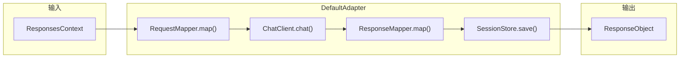
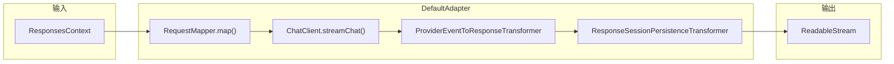
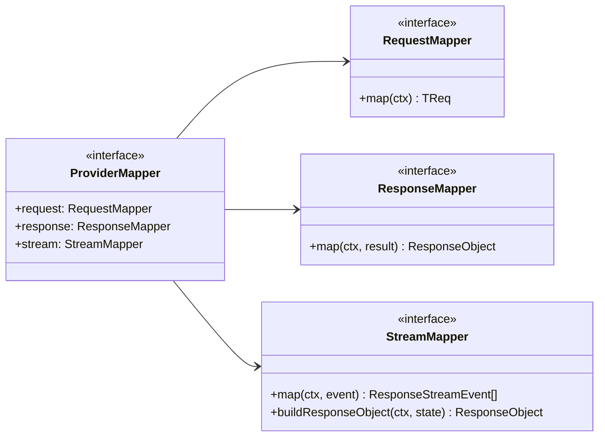

# 适配器模式

适配器层是核心转换引擎。它位于服务器路由和提供商实现之间，在 OpenAI Responses API 协议和提供商特定的 Chat Completions 格式之间进行转换。

## 适配器接口

```ts
interface Adapter {
  request(ctx: ResponsesContext): Promise<ResponseObject>;
  stream(ctx: ResponsesContext): Promise<ReadableStream<ResponseStreamEvent>>;
}
```

`DefaultAdapter` 通过委托给提供商的 mapper 和 chatClient 来实现这两个方法。

## 非流式路径



1. 通过 `RequestMapper` 将 `ResponsesContext` 映射为上游请求
2. 通过 `ChatClient.chat()` 发送到上游
3. 通过 `ResponseMapper` 将上游响应映射回来
4. 保存会话快照

## 流式路径



当 `store === false` 时，完全跳过 `ResponseSessionPersistenceTransformer`。

## Provider Mapper 契约



每个提供商实现这三个 mapper 接口，处理 Responses API 语义与其原生协议之间的转换。

[流式管道](/zh/02-architecture/stream-pipeline)
