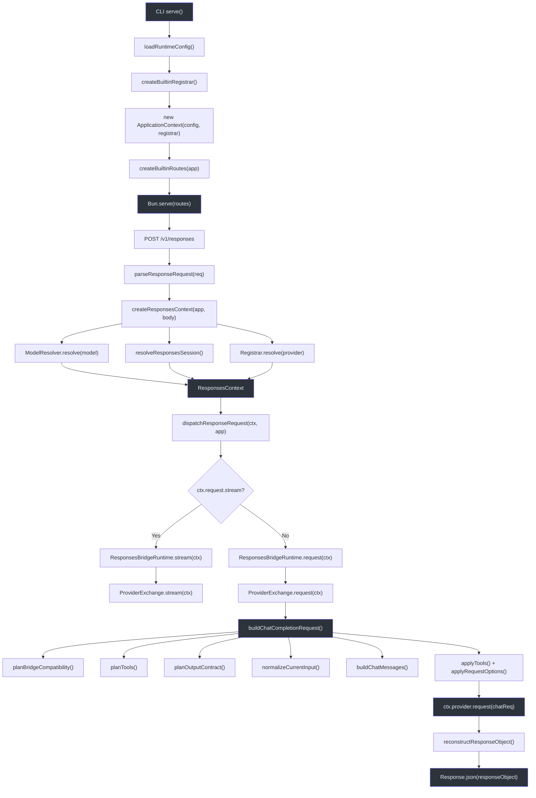
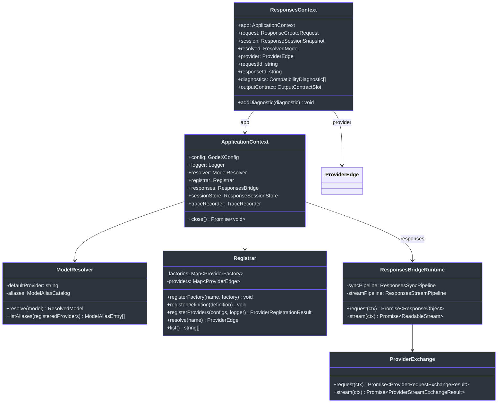
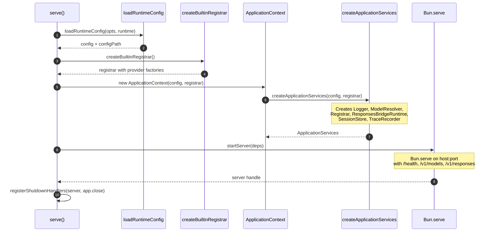
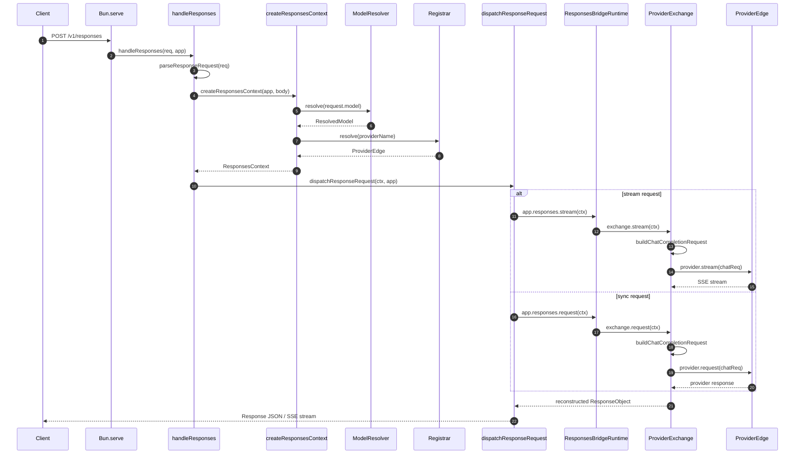

# 架构概览

GodeX 是一个网关，将 OpenAI **Responses API** 请求转换为 **Chat Completions API** 调用，支持任何已配置的上游 Provider。理解完整的请求生命周期对于调试兼容性问题、添加新 Provider 或扩展桥接层至关重要。本页追踪一个请求从 Bun 服务器接收到重建响应返回给调用者的全过程。

## 概览

| 层级 | 组件 | 职责 |
|------|------|------|
| CLI | `serve` | 引导配置、注册器、`ApplicationContext` 和 Bun 服务器 |
| 应用 | `ApplicationContext` | 持有配置、解析器、注册器、会话存储、追踪记录器 |
| 应用 | `ApplicationServices` | 工厂，连接 logger、`ModelResolver`、`Registrar`、`ResponsesBridgeRuntime` |
| 服务器 | `createBuiltinRoutes` | 将 `/health`、`/v1/models`、`/v1/responses` 映射到处理函数 |
| 路由 | `handleResponses` | 解析请求，创建 `ResponsesContext`，分发 |
| 上下文 | `ResponsesContext` | 每请求状态：已解析的模型、Provider、会话、诊断信息 |
| 桥接 | `ProviderExchange` | 构建 Chat Completion 请求，调用上游，记录追踪 |
| 桥接 | `ResponsesBridgeRuntime` | 选择同步或流式管道 |
| Provider | `Registrar` | 管理 `ProviderEdge` 工厂和已解析的实例 |
| 解析器 | `ModelResolver` | 将模型选择器映射为 `(provider, model)` 对 |

## 请求生命周期

## 核心类型

## 启动序列

## 请求处理序列

## 桥接管道详解

`ProviderExchange` 内部的桥接管道遵循固定的序列。每一步产生的决策和数据供下游步骤消费：

| 步骤 | 函数 | 输出 |
|------|------|------|
| 1 | `planBridgeCompatibility` | 兼容性计划，包含参数决策 |
| 2 | `planTools` | 工具声明、tool_choice、工具决策 |
| 3 | `planOutputContract` | 响应格式计划（原生、降级或合成） |
| 4 | `normalizeCurrentInput` + `normalizeResponseItems` | 标准化的 `ChatCompletionMessageParam[]` |
| 5 | `buildChatMessages` | 合并后的助手消息（含工具调用） |
| 6 | `applyTools` | `request.tools` 和 `request.tool_choice` |
| 7 | `applyRequestOptions` | stream、temperature、top_p、max_tokens、reasoning |

```mermaid
flowchart LR
    subgraph Bridge Pipeline
        direction LR
        A["planBridge<br>Compatibility"] --> B["planTools"]
        B --> C["planOutput<br>Contract"]
        C --> D["normalize<br>Input"]
        D --> E["buildChat<br>Messages"]
        E --> F["applyTools"]
        F --> G["applyRequest<br>Options"]
    end

    G --> H["provider.request()<br>or provider.stream()"]
    H --> I["reconstructResponse<br>Object()"]

    style A fill:#2d333b,stroke:#6d5dfc,color:#e6edf3
    style B fill:#2d333b,stroke:#6d5dfc,color:#e6edf3
    style C fill:#2d333b,stroke:#6d5dfc,color:#e6edf3
    style D fill:#2d333b,stroke:#6d5dfc,color:#e6edf3
    style E fill:#2d333b,stroke:#6d5dfc,color:#e6edf3
    style F fill:#2d333b,stroke:#6d5dfc,color:#e6edf3
    style G fill:#2d333b,stroke:#6d5dfc,color:#e6edf3
    style H fill:#2d333b,stroke:#6d5dfc,color:#e6edf3
    style I fill:#2d333b,stroke:#6d5dfc,color:#e6edf3
```

## 交叉引用

- **[兼容性](./compatibility.md)**：桥接如何在构建请求前规划功能兼容性
- **[请求构建](./request-building.md)**：从 Responses API 到 Chat Completions API 的逐步转换
- **[响应重建](./response-reconstruction.md)**：上游响应如何映射回 Responses API 格式

## 参考

- [src/cli/serve.ts:12-62](https://github.com/Ahoo-Wang/GodeX/blob/main/src/cli/serve.ts#L12-L62) -- CLI 入口点、服务器引导和关闭处理
- [src/context/application-context.ts:10-40](https://github.com/Ahoo-Wang/GodeX/blob/main/src/context/application-context.ts#L10-L40) -- `ApplicationContext` 类，持有所有共享服务
- [src/context/application-services.ts:1-48](https://github.com/Ahoo-Wang/GodeX/blob/main/src/context/application-services.ts#L1-L48) -- 工厂，连接 logger、解析器、注册器、桥接运行时
- [src/server/server.ts:21-51](https://github.com/Ahoo-Wang/GodeX/blob/main/src/server/server.ts#L21-L51) -- 路由映射创建和 Bun 服务器启动
- [src/server/routes/responses/handler.ts:1-33](https://github.com/Ahoo-Wang/GodeX/blob/main/src/server/routes/responses/handler.ts#L1-L33) -- Responses 路由处理函数，包含解析、上下文创建和分发
- [src/responses/runtime.ts:19-41](https://github.com/Ahoo-Wang/GodeX/blob/main/src/responses/runtime.ts#L19-L41) -- `ResponsesBridgeRuntime` 委派同步和流式管道
- [src/responses/provider-exchange.ts:1-123](https://github.com/Ahoo-Wang/GodeX/blob/main/src/responses/provider-exchange.ts#L1-L123) -- `ProviderExchange` 编排请求构建和上游调用
- [src/providers/registrar.ts:1-95](https://github.com/Ahoo-Wang/GodeX/blob/main/src/providers/registrar.ts#L1-L95) -- Provider 工厂注册和解析
- [src/resolver/model-resolver.ts:1-37](https://github.com/Ahoo-Wang/GodeX/blob/main/src/resolver/model-resolver.ts#L1-L37) -- 模型选择器解析和别名解析
