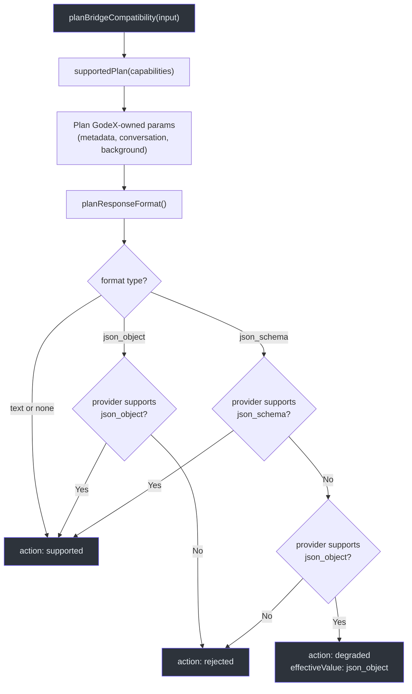
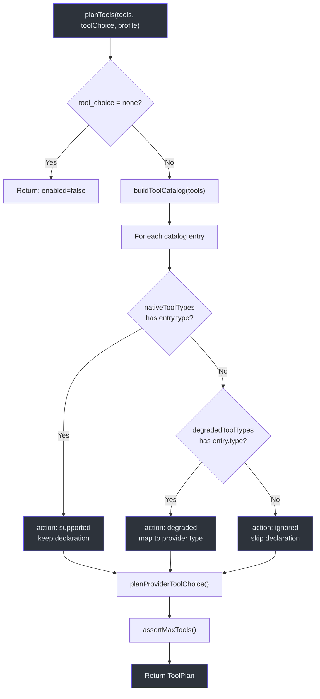
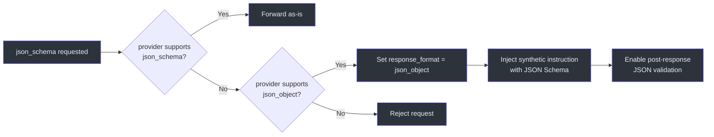
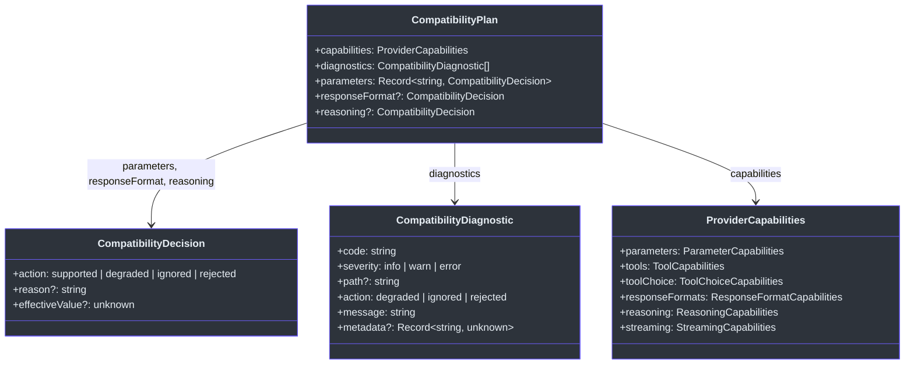

# 桥接兼容性规划

并非每个上游 Provider 都支持 OpenAI Responses API 的所有功能。GodeX 必须在任何请求发送之前决定：哪些功能是原生支持的，哪些可以降级到相近的替代方案，哪些必须静默忽略，哪些是硬性阻塞。兼容性子系统以确定性的方式做出这些决策，并为每个决策记录诊断信息，让运维人员完全了解某个请求为何被塑造成特定的形式。

## 概览

| 概念 | 类型 | 用途 |
|------|------|------|
| `ProviderCapabilities` | 接口 | 声明 Provider 支持的功能（参数、工具、格式、推理） |
| `CompatibilityPlan` | 接口 | 持有单个请求的所有决策 |
| `CompatibilityDecision` | 接口 | 一条决策：动作、原因、有效值 |
| `CompatibilityDiagnostic` | 接口 | 可观测记录：代码、严重程度、路径、消息、元数据 |
| `planBridgeCompatibility` | 函数 | 入口点；评估参数和响应格式 |
| `planTools` | 函数 | 评估工具声明和 tool_choice |
| `planOutputContract` | 函数 | 评估 JSON Schema 输出约束 |

## 决策动作

每个兼容性决策精确解析为以下四种动作之一：

| 动作 | 含义 | 诊断严重程度 |
|------|------|-------------|
| `supported` | 功能原生支持；原样转发 | --（不产生诊断） |
| `degraded` | 功能映射到相近替代方案；行为可能不同 | `warn` |
| `ignored` | 功能被静默丢弃；请求继续执行但不包含该功能 | `warn` |
| `rejected` | 功能为硬性阻塞；请求被中止并抛出 `BridgeError` | `error` |

## 能力域

Provider 通过 [`ProviderCapabilities`](https://github.com/Ahoo-Wang/GodeX/blob/main/src/bridge/compatibility/compatibility-plan.ts#L29-L36) 接口声明其能力：

| 域 | 字段 | 类型 | 示例 |
|----|------|------|------|
| 参数 | `parameters.supported` | `Set<string>` | `stream`、`temperature`、`top_p`、`max_output_tokens`、`reasoning`、`safety_identifier`、`user` |
| 工具 | `tools.supported` | `Set<string>` | `function`、`mcp`、`shell`、`apply_patch`、`custom` |
| 工具降级 | `tools.degraded` | `Map<string, string>` | `mcp -> function` |
| 工具选择 | `toolChoice.supported` | `Set<string>` | `auto`、`required`、`function` |
| 响应格式 | `responseFormats.supported` | `Set<string>` | `text`、`json_object`、`json_schema` |
| 推理 | `reasoning.effort` | `"none" / "boolean" / "native"` | 是否以及如何转发推理力度 |
| 流式 | `streaming.usage` | `boolean` | SSE 流是否包含 usage 数据 |

## 兼容性规划流程

## 工具兼容性

`planTools` 函数根据 Provider 的 `ToolPlanningProfile` 评估每个工具声明：

### 工具选择解析

| 请求值 | Provider 支持 | 结果 |
|--------|-------------|------|
| `auto` | `auto` | supported |
| `required` | `required` | supported |
| `required` | 仅 `auto` | 降级为 `auto` |
| `required` | 均不支持 | rejected（错误） |
| 具名函数/自定义 | 匹配声明 + Provider 类型 | supported 或 degraded |
| 具名函数/自定义 | 无匹配声明 | rejected（错误） |

## 响应格式降级

当 Provider 不原生支持 `json_schema` 但支持 `json_object` 时，输出契约会被降级。一条合成指令会被注入到系统消息中，包含原始 JSON Schema、验证规则以及 GodeX 将验证输出的说明：

| 降级路径 | Provider `response_format` | 合成指令 | 后验证 |
|---------|---------------------------|---------|--------|
| `json_schema` 到 `json_object` | `{ type: "json_object" }` | Schema 名称、描述和完整 JSON Schema | 当 `strict` 时启用 `requiresValidJson: true` |

## 推理力度模式

各 Provider 处理推理力度的方式不同。`reasoning.effort` 能力决定映射方式：

| 能力模式 | 行为 |
|---------|------|
| `native` | 直接转发 `reasoning_effort`（如 `low`、`medium`、`high`） |
| `boolean` | 映射为 `thinking.type`：`"none"` 变为 `"disabled"`，其他变为 `"enabled"` |
| `none` | 推理力度被静默忽略；不转发任何参数 |

## 诊断代码

每个非 supported 的决策会产生一个带机器可读代码的诊断：

| 代码 | 触发条件 |
|------|---------|
| `bridge.param.ignored` | GodeX 自有参数（metadata、conversation、background）或不支持的工具类型 |
| `bridge.param.degraded` | 功能被降级（json_schema 降为 json_object、tool_choice required 降为 auto） |
| `bridge.param.unsupported` | 硬性拒绝不支持的功能 |
| `bridge.tool.compatibility` | 工具声明非原生支持（动作视具体决策而定） |

## CompatibilityPlan 结构

## 交叉引用

- **[架构概览](./architecture-overview.md)**：兼容性规划在完整请求生命周期中的位置
- **[请求构建](./request-building.md)**：兼容性决策如何在请求构建过程中被消费
- **[响应重建](./response-reconstruction.md)**：响应后验证如何使用输出契约

## 参考

- [src/bridge/compatibility/planner.ts:1-164](https://github.com/Ahoo-Wang/GodeX/blob/main/src/bridge/compatibility/planner.ts#L1-L164) -- `planBridgeCompatibility` 入口点和参数决策记录
- [src/bridge/compatibility/compatibility-plan.ts:1-60](https://github.com/Ahoo-Wang/GodeX/blob/main/src/bridge/compatibility/compatibility-plan.ts#L1-L60) -- `CompatibilityPlan`、`CompatibilityDecision` 和 `ProviderCapabilities` 类型
- [src/bridge/compatibility/diagnostic.ts:1-10](https://github.com/Ahoo-Wang/GodeX/blob/main/src/bridge/compatibility/diagnostic.ts#L1-L10) -- `CompatibilityDiagnostic` 接口，包含严重程度和动作
- [src/bridge/tools/tool-plan.ts:1-319](https://github.com/Ahoo-Wang/GodeX/blob/main/src/bridge/tools/tool-plan.ts#L1-L319) -- `planTools`、工具声明决策和 tool_choice 解析
- [src/bridge/output/output-contract.ts:1-75](https://github.com/Ahoo-Wang/GodeX/blob/main/src/bridge/output/output-contract.ts#L1-L75) -- `planOutputContract` 和 JSON Schema 降级与合成指令
