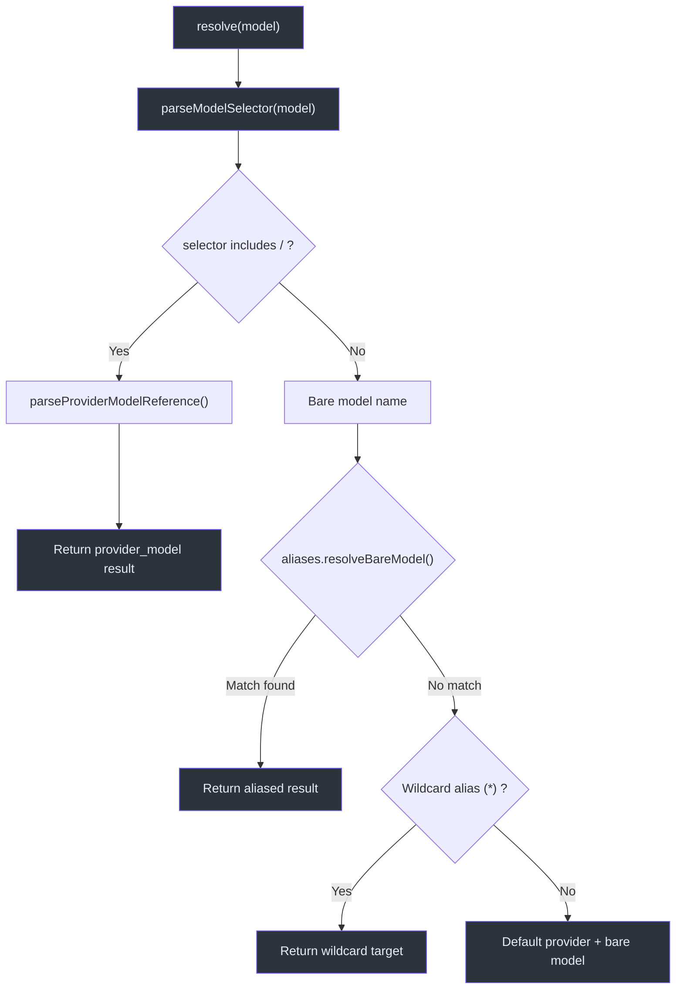
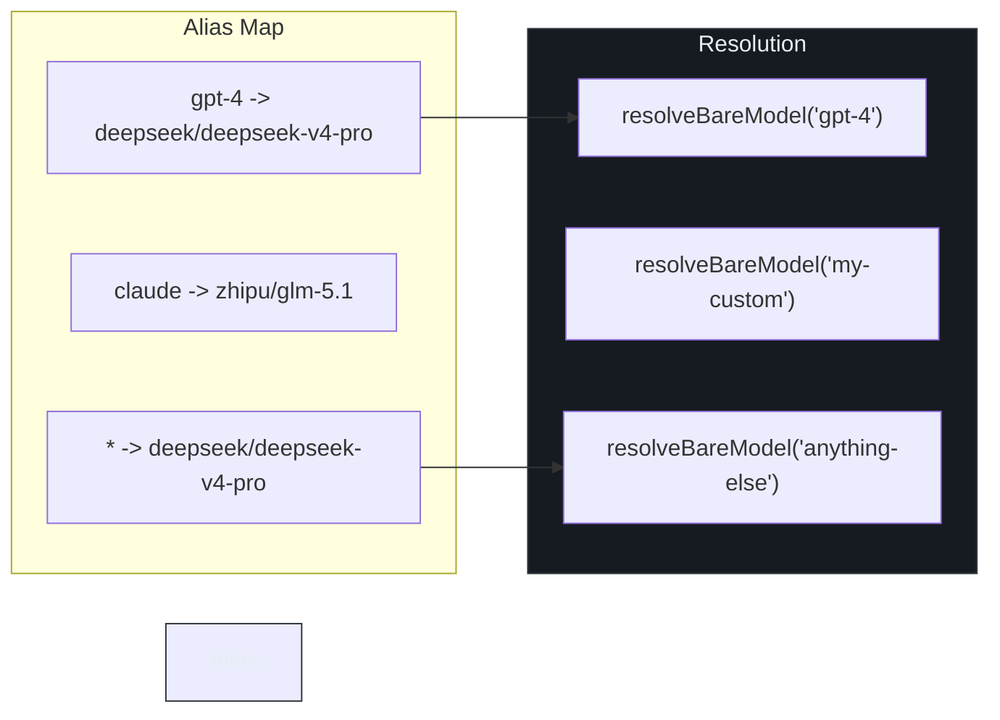
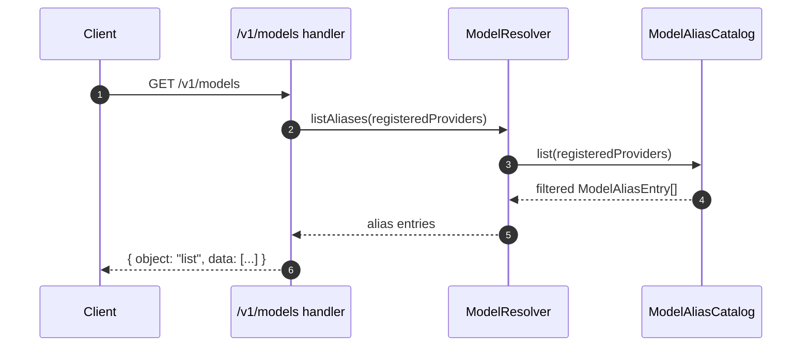

# 模型解析

当客户端向 `/v1/responses` 发送带有 `model` 字段的请求时，GodeX
必须决定**由哪个 Provider** 处理该调用以及**目标上游模型**是什么。
这个解析步骤是每个请求的第一个分支点，直接决定了路由、计费和兼容性行为。
`ModelResolver` 类封装了这一逻辑：它解析模型选择器，
查询别名目录，并回退到已配置的默认 Provider，
在所有情况下产生确定性的 `ResolvedModel` 结果。

## 概览

| 方面 | 详情 |
|------|------|
| 入口点 | `ModelResolver.resolve(model)` |
| 输入格式 | `"provider/model"` 或裸 `"model-name"` |
| 别名支持 | 具名别名 + 通配符（`*`） |
| 回退 | 配置中的默认 Provider |
| 输出 | `{ provider: string, model: string }` |

## 解析管道



解析器在创建时接收一个 `defaultProvider` 字符串和可选的别名映射，
位于 [src/resolver/model-resolver.ts:10-17](https://github.com/Ahoo-Wang/GodeX/blob/main/src/resolver/model-resolver.ts#L10)。

## 选择器解析

`parseModelSelector` 位于
[src/resolver/model-selector.ts:23-63](https://github.com/Ahoo-Wang/GodeX/blob/main/src/resolver/model-selector.ts#L23)，
负责验证和分类传入的模型值：

| 输入 | 类型 | 结果 |
|------|------|------|
| `"deepseek/deepseek-v4-pro"` | `provider_model` | 直接解析 |
| `"gpt-4"` | `bare` | 别名查找后回退 |
| `undefined` / `null` | -- | 抛出 `ServerError(missing_model)` |
| `42`（非字符串） | -- | 抛出 `ServerError(invalid_parameter)` |
| `""`（空字符串） | -- | 抛出 `ServerError(missing_model)` |

该函数使用来自
[src/resolver/model-reference.ts:6-18](https://github.com/Ahoo-Wang/GodeX/blob/main/src/resolver/model-reference.ts#L6)
的 `parseProviderModelReference`，在第一个斜杠处分割 `"provider/model"`，
确保两段都不为空。

## 别名目录

`ModelAliasCatalog` 位于
[src/resolver/model-aliases.ts:13-52](https://github.com/Ahoo-Wang/GodeX/blob/main/src/resolver/model-aliases.ts#L13)，
管理从短名称到 `provider/model` 目标的映射。



### 裸模型的解析策略

`resolveBareModel` 位于
[第 23 行](https://github.com/Ahoo-Wang/GodeX/blob/main/src/resolver/model-aliases.ts#L23)，
执行两轮查找：

1. **精确匹配** -- 在别名映射中查找裸模型名称。
2. **通配符匹配** -- 如果没有精确匹配，解析 `*` 别名目标。

如果两者都不匹配，`resolveBareModel` 返回 `undefined`，
解析器回退到 `{ provider: defaultProvider, model: bareName }`，
位于 [src/resolver/model-resolver.ts:26-31](https://github.com/Ahoo-Wang/GodeX/blob/main/src/resolver/model-resolver.ts#L26)。

## 为 /v1/models 列出别名



`listAliases` 方法位于
[src/resolver/model-resolver.ts:34-36](https://github.com/Ahoo-Wang/GodeX/blob/main/src/resolver/model-resolver.ts#L34)，
委托给 `ModelAliasCatalog.list`，该方法过滤目标 Provider 已注册的别名，
并跳过通配符条目，
位于 [src/resolver/model-aliases.ts:27-41](https://github.com/Ahoo-Wang/GodeX/blob/main/src/resolver/model-aliases.ts#L27)。

`/v1/models` 路由将每个条目转换为 OpenAI 兼容格式，
位于 [src/server/routes/models.ts:9-19](https://github.com/Ahoo-Wang/GodeX/blob/main/src/server/routes/models.ts#L9)：

```json
{
  "id": "gpt-4",
  "object": "model",
  "owned_by": "deepseek"
}
```

## ModelSelector 类型联合

位于
[src/resolver/model-selector.ts:11-21](https://github.com/Ahoo-Wang/GodeX/blob/main/src/resolver/model-selector.ts#L11)
的可辨识联合使分支类型安全：

| 判别值 | 形状 |
|--------|------|
| `kind: "provider_model"` | `{ selector, resolved: ResolvedModel }` |
| `kind: "bare"` | `{ selector, model: string }` |

## 配置示例

```yaml
default_provider: deepseek
models:
  aliases:
    gpt-4: "deepseek/deepseek-v4-pro"
    claude: "zhipu/glm-5.1"
    "*": "deepseek/deepseek-v4-pro"
```

使用此配置：

| 客户端发送 | 解析的 Provider | 解析的模型 |
|-----------|----------------|-----------|
| `"gpt-4"` | `deepseek` | `deepseek-v4-pro` |
| `"deepseek/deepseek-v4-pro"` | `deepseek` | `deepseek-v4-pro` |
| `"my-custom-model"` | `deepseek`（通配符） | `deepseek-v4-pro` |
| `"unknown"` | `deepseek`（默认） | `unknown` |

## 交叉引用

- [请求流](./request-flow.md) -- 模型解析在完整管道中的位置
- [桥接内核](./bridge-kernel.md) -- 已解析的模型如何到达 Provider
- [错误处理](../06-error-handling/error-handling.md) -- `missing_model` 和 `invalid_parameter` 错误
- [配置 Schema](../07-configuration/config-schema.md) -- 别名和 default_provider 设置
- [服务器路由](./server-routes.md) -- `/v1/models` 端点

## 参考

- [src/resolver/model-resolver.ts](https://github.com/Ahoo-Wang/GodeX/blob/main/src/resolver/model-resolver.ts) -- `ModelResolver` 类
- [src/resolver/model-aliases.ts](https://github.com/Ahoo-Wang/GodeX/blob/main/src/resolver/model-aliases.ts) -- `ModelAliasCatalog` 类
- [src/resolver/model-selector.ts](https://github.com/Ahoo-Wang/GodeX/blob/main/src/resolver/model-selector.ts) -- `parseModelSelector` 函数
- [src/resolver/model-reference.ts](https://github.com/Ahoo-Wang/GodeX/blob/main/src/resolver/model-reference.ts) -- `ResolvedModel` 类型和解析器
- [src/server/routes/models.ts](https://github.com/Ahoo-Wang/GodeX/blob/main/src/server/routes/models.ts) -- `/v1/models` 路由处理函数
