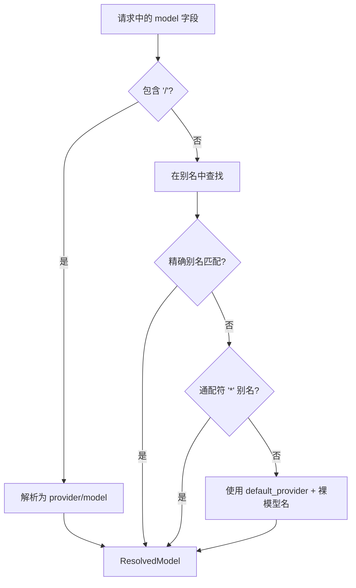

# 模型解析

模型解析器（`src/resolver/`）将请求中的 `model` 字段转换为具体的 `(provider, model)` 对，决定由哪个提供商处理请求以及使用哪个上游模型名称。

## 解析算法



### 解析顺序

1. **显式选择器** — 如果 `model` 包含 `/`，则解析为 `provider/model` 并直接使用。
2. **精确别名匹配** — 在 `models.aliases` 中查找裸模型名的精确键匹配。
3. **通配符回退** — 如果没有精确匹配，使用 `*` 别名作为兜底。
4. **默认提供商** — 如果没有别名匹配，将模型名与 `default_provider` 配对。

## 配置

模型别名在 `godex.yaml` 中配置：

```yaml
default_provider: deepseek

models:
  aliases:
    "gpt-5.5": deepseek/deepseek-v4-pro
    "glm": zhipu/glm-5.1
    "*": deepseek/deepseek-v4-flash
```

### 解析示例

| 输入 `model` | 解析结果 | 说明 |
|---------------|----------|------|
| `"gpt-5.5"` | `{ provider: "deepseek", model: "deepseek-v4-pro" }` | 精确别名匹配 |
| `"glm"` | `{ provider: "zhipu", model: "glm-5.1" }` | 精确别名匹配 |
| `"claude-4"` | `{ provider: "deepseek", model: "deepseek-v4-flash" }` | 无精确匹配，通配符 `*` 别名 |
| `"zhipu/glm-5.1"` | `{ provider: "zhipu", model: "glm-5.1" }` | 显式 `provider/model` 选择器 |
| `"unknown-model"`（无 `*` 别名） | `{ provider: "deepseek", model: "unknown-model" }` | 无别名，默认提供商回退 |

## 模块结构

```
src/resolver/
├── model-resolver.ts    # ModelResolver 类，包含 resolve() 和 listAliases()
├── model-aliases.ts     # ModelAliasCatalog，包含精确匹配、通配符和列表逻辑
├── model-selector.ts    # parseModelSelector()，用于 provider/model 字符串解析
├── model-reference.ts   # ResolvedModel 类型定义
└── index.ts             # 桶导出
```

## API 端点

`/v1/models` 端点使用 `ModelResolver.listAliases()` 返回已配置的模型列表，仅包含其提供商已注册的别名。

[Bridge 内核](/zh/02-architecture/bridge-kernel)
[请求流程](/zh/02-architecture/request-flow)
