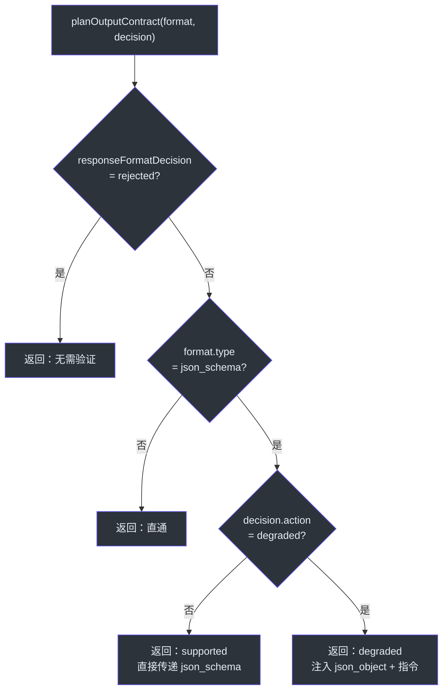
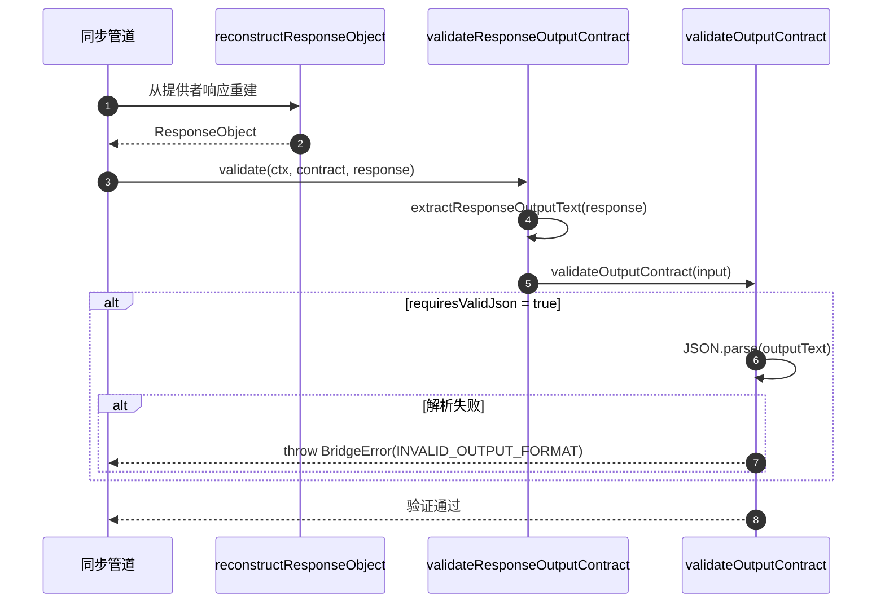
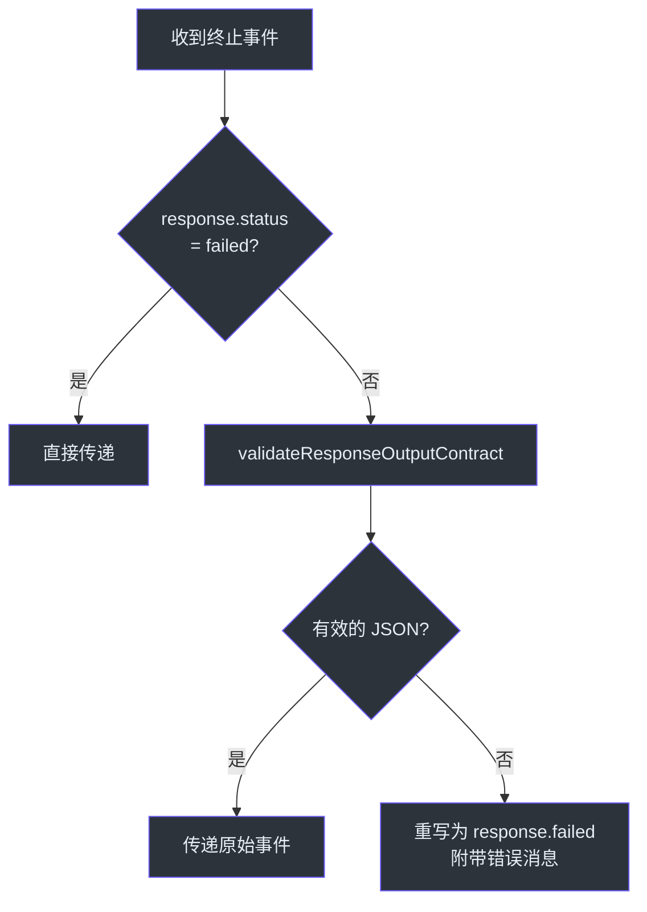

# 输出契约

输出契约解决了在不同能力的提供者之间保证结构化输出的问题。部分提供者原生支持 `json_schema`，部分仅支持 `json_object`，还有一些两者都不支持。GodeX 的输出契约层在请求时规划最佳格式策略，在需要降级时注入合成指令，并在响应时验证输出以确保契约得到履行。

## 概览

| 关注点 | 组件 | 关键文件 |
|---------|-----------|----------|
| 契约规划 | `planOutputContract` | [output-contract.ts:19](https://github.com/Ahoo-Wang/GodeX/blob/main/src/bridge/output/output-contract.ts#L19) |
| 输出验证 | `validateOutputContract` | [output-validator.ts:6](https://github.com/Ahoo-Wang/GodeX/blob/main/src/bridge/output/output-validator.ts#L6) |
| 响应级验证 | `validateResponseOutputContract` | [response-output-contract-validation.ts:14](https://github.com/Ahoo-Wang/GodeX/blob/main/src/responses/response-output-contract-validation.ts#L14) |
| 上下文契约槽 | `OutputContractSlot` | [output-contract-slot.ts:3](https://github.com/Ahoo-Wang/GodeX/blob/main/src/context/output-contract-slot.ts#L3) |

## 规划决策

`planOutputContract` ([output-contract.ts:19](https://github.com/Ahoo-Wang/GodeX/blob/main/src/bridge/output/output-contract.ts#L19)) 生成一个 `OutputContractPlan`，有四种可能的结果：

| 场景 | 动作 | `providerResponseFormat` | `syntheticInstruction` | `requiresValidJson` |
|----------|--------|--------------------------|----------------------|-------------------|
| 格式被提供者拒绝 | `rejected` | undefined | undefined | false |
| 未请求 json_schema | 直通 | 原始格式 | undefined | false |
| 原生支持 `json_schema` | `supported` | 原始 `json_schema` | undefined | false |
| `json_schema` 降级为 `json_object` | `degraded` | `{ type: "json_object" }` | 生成的指令 | true（如果 strict） |

## 合成指令生成

当 `json_schema` 降级为 `json_object` 时，GodeX 通过 `jsonSchemaInstruction` ([output-contract.ts:54](https://github.com/Ahoo-Wang/GodeX/blob/main/src/bridge/output/output-contract.ts#L54)) 生成合成指令。该指令包括：

1. Schema 名称和描述（如果提供）
2. 显式的 JSON 输出规则
3. 完整的 JSON Schema 作为格式指导

该指令被注入到系统消息中，使提供者知道需要输出匹配 schema 的有效 JSON，即使它只收到了 `json_object` 格式指令。

## 输出契约槽

`OutputContractSlot` ([output-contract-slot.ts:3](https://github.com/Ahoo-Wang/GodeX/blob/main/src/context/output-contract-slot.ts#L3)) 是 `ResponsesContext` 上的可变槽，保存当前的 `OutputContractPlan`。它在请求构建期间设置一次（在 `buildProviderRequest` 中，位于 [provider-exchange.ts:98](https://github.com/Ahoo-Wang/GodeX/blob/main/src/responses/provider-exchange.ts#L98)），并在响应验证期间读取。

| 方法 | 用途 |
|--------|---------|
| `set(plan)` | 存储规划的输出契约（在桥接请求构建期间调用） |
| `current()` | 返回当前活动的契约（在验证期间调用） |

## 验证流程

同步和流式路径的验证方式不同：

### 同步验证

在同步管道中，`validateResponseOutputContract` ([response-output-contract-validation.ts:14](https://github.com/Ahoo-Wang/GodeX/blob/main/src/responses/response-output-contract-validation.ts#L14)) 在 `reconstructResponseObject` 之后直接调用：

### 流式验证

在流式管道中，`ResponseOutputContractValidationTransformer` ([response-output-contract-validation-transformer.ts:13](https://github.com/Ahoo-Wang/GodeX/blob/main/src/responses/stream-transforms/response-output-contract-validation-transformer.ts#L13)) 拦截终止事件并验证输出契约。如果验证失败，它将终止事件重写为带有错误详情的 `response.failed`：

`failedResponse` 辅助函数 ([response-output-contract-validation-transformer.ts:54](https://github.com/Ahoo-Wang/GodeX/blob/main/src/responses/stream-transforms/response-output-contract-validation-transformer.ts#L54)) 构造一个新的 `ResponseObject`，其 `status` 为 `"failed"` 并附带适当的错误代码。

## 输出文本提取

`extractResponseOutputText` ([response-output-contract-validation.ts:25](https://github.com/Ahoo-Wang/GodeX/blob/main/src/responses/response-output-contract-validation.ts#L25)) 通过以下方式获取待验证的文本：

1. 如果可用，使用 `response.output_text`（字符串）
2. 否则，从所有 `message` 输出项中拼接 `output_text` 内容部分

这确保无论提供者如何构造响应，验证都能正常工作。

## 错误处理

当验证失败时，会记录一个诊断信息，代码为 `BRIDGE_RESPONSE_INVALID_OUTPUT_FORMAT`，严重级别为 `"error"`，路径为 `"response.output_text"` ([response-output-contract-validation.ts:36](https://github.com/Ahoo-Wang/GodeX/blob/main/src/responses/response-output-contract-validation.ts#L36))。然后将错误传播给调用者。

## 交叉引用

- [Sync Pipeline](./sync-pipeline.md) -- 同步验证发生的位置
- [Streaming Pipeline](./streaming-pipeline.md) -- 通过转换链进行流式验证的位置
- [Stream Reconstruction](./stream-reconstruction.md) -- 延迟终止事件使契约验证能在客户端看到终止事件之前执行

## 参考

- [output-contract.ts:19](https://github.com/Ahoo-Wang/GodeX/blob/main/src/bridge/output/output-contract.ts#L19) -- `planOutputContract` 函数
- [output-contract.ts:54](https://github.com/Ahoo-Wang/GodeX/blob/main/src/bridge/output/output-contract.ts#L54) -- `jsonSchemaInstruction` 合成指令生成器
- [output-validator.ts:6](https://github.com/Ahoo-Wang/GodeX/blob/main/src/bridge/output/output-validator.ts#L6) -- `validateOutputContract` 函数
- [output-contract-slot.ts:3](https://github.com/Ahoo-Wang/GodeX/blob/main/src/context/output-contract-slot.ts#L3) -- `OutputContractSlot` 类
- [response-output-contract-validation.ts:14](https://github.com/Ahoo-Wang/GodeX/blob/main/src/responses/response-output-contract-validation.ts#L14) -- `validateResponseOutputContract`（响应级）
- [response-output-contract-validation-transformer.ts:13](https://github.com/Ahoo-Wang/GodeX/blob/main/src/responses/stream-transforms/response-output-contract-validation-transformer.ts#L13) -- 流式验证转换器
