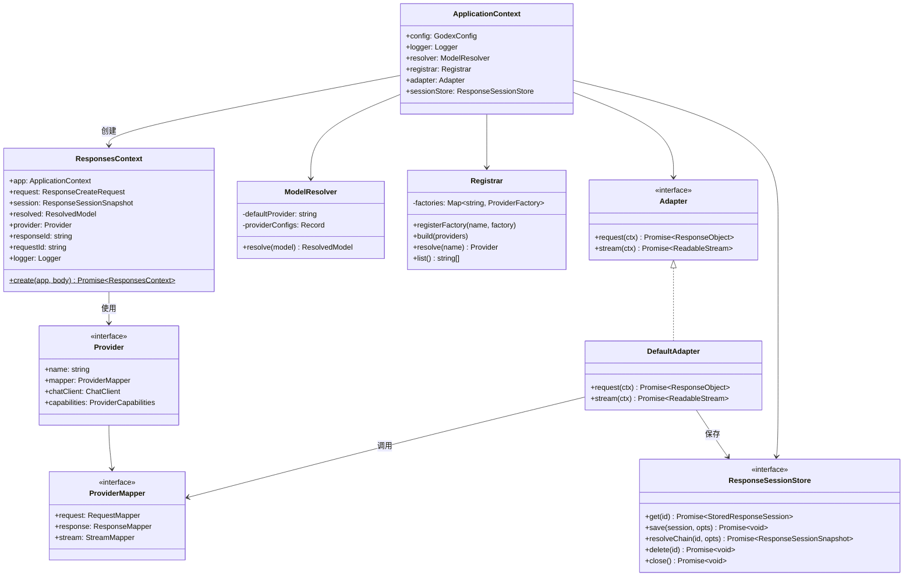

# 系统总览

Godex 采用分层架构，关注点清晰分离：协议处理在边界、适配器逻辑在中间、提供商特定代码隔离在插件中。

## 组件模型

## 层级职责

| 层级 | 模块 | 职责 |
|------|------|------|
| 服务器 | `src/server/` | HTTP 路由、SSE 编码、请求验证 |
| 上下文 | `src/context/` | 通过 `ResponsesContext` 编排每请求流程 |
| 适配器 | `src/adapter/` | Responses API 与提供商之间的协议转换 |
| 提供商 | `src/providers/` | 提供商特定的请求/响应/流映射 |
| 会话 | `src/session/` | 历史持久化和 `previous_response_id` 链式解析 |
| 配置 | `src/config/` | YAML Schema、环境变量插值、默认值 |
| 错误 | `src/error/` | 带域代码的结构化错误层次 |

[请求流程](/zh/02-architecture/request-flow)
