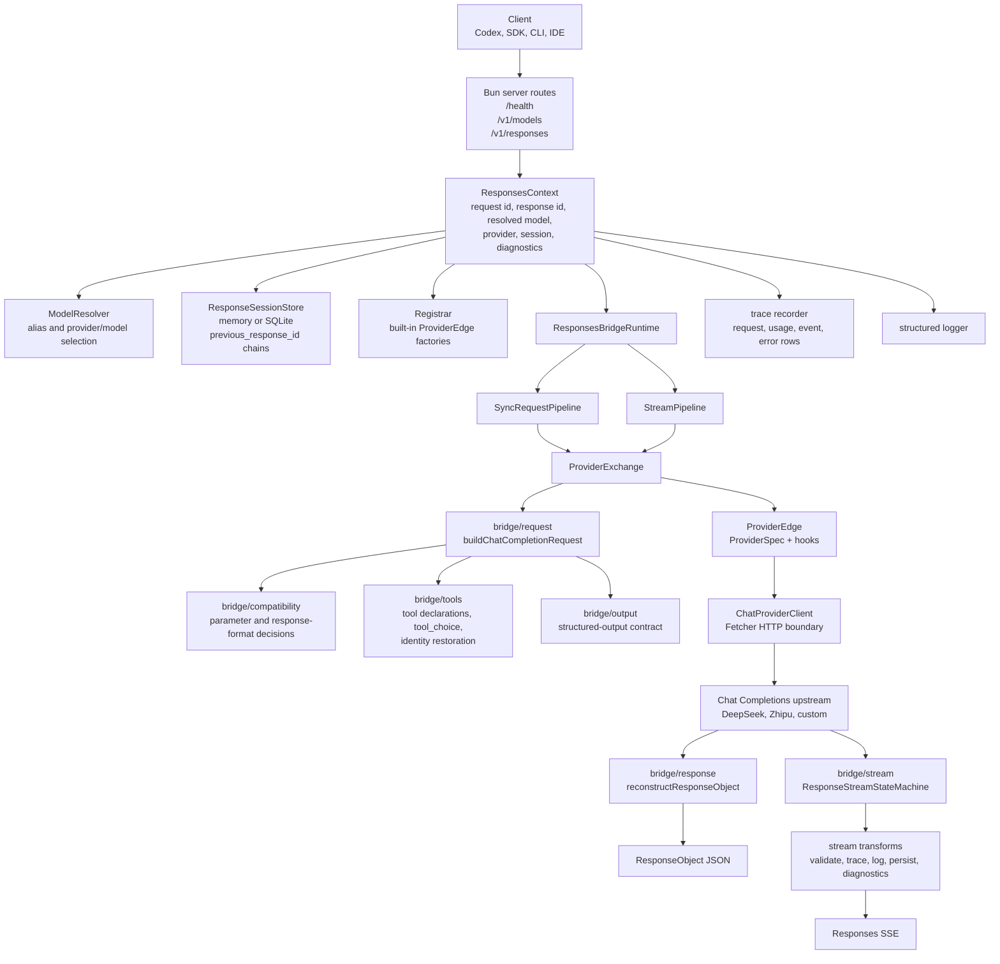
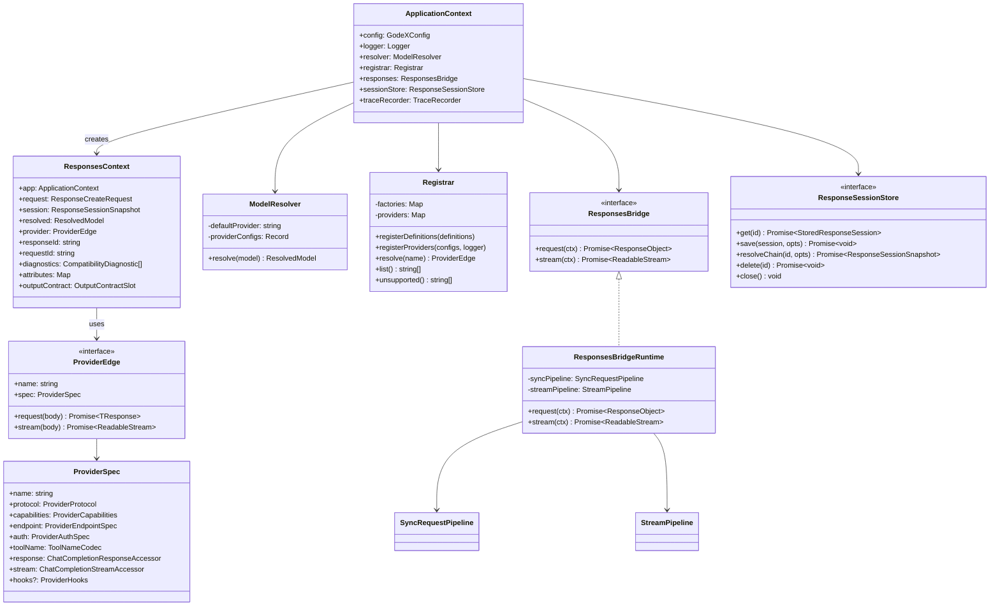
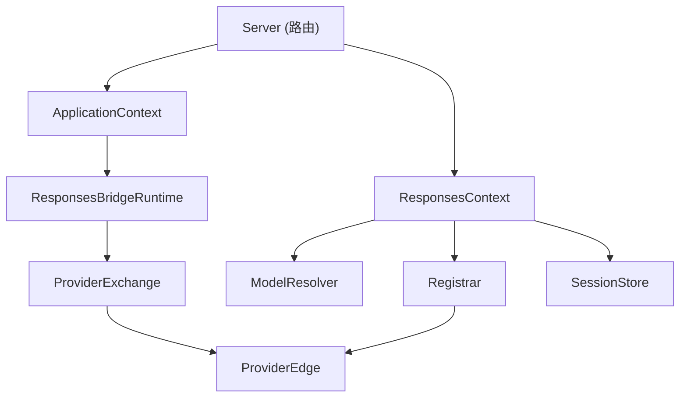

# 系统总览

GodeX 采用分层架构，关注点清晰分离：协议处理在边界层，桥接逻辑在中间层，提供商特定代码封装在 spec 和 hooks 中。

## 架构全景

## 组件模型

## 层级职责

| 层级 | 模块 | 职责 |
|------|------|------|
| Server | `src/server/` | HTTP 路由、请求解析、SSE 编码、错误处理 |
| Context | `src/context/` | `ApplicationContext`（应用级服务）和 `ResponsesContext`（请求级状态） |
| Bridge | `src/bridge/` | 与提供商无关的 Responses-to-Chat 规划与重建 |
| Responses | `src/responses/` | 同步和流式编排管道 |
| Provider | `src/providers/` | 提供商 spec、hooks、客户端和注册表 |
| Session | `src/session/` | 历史持久化和 `previous_response_id` 链式解析 |
| Resolver | `src/resolver/` | 模型别名和 provider/model 选择器解析 |
| Config | `src/config/` | YAML 模式、环境变量插值、默认值 |
| Error | `src/error/` | 结构化错误层次与域代码 |

## 依赖流

[请求流程](/zh/02-architecture/request-flow)

