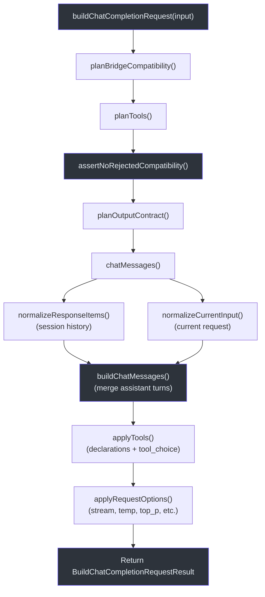
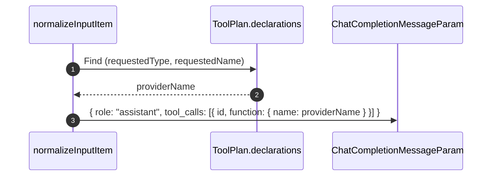
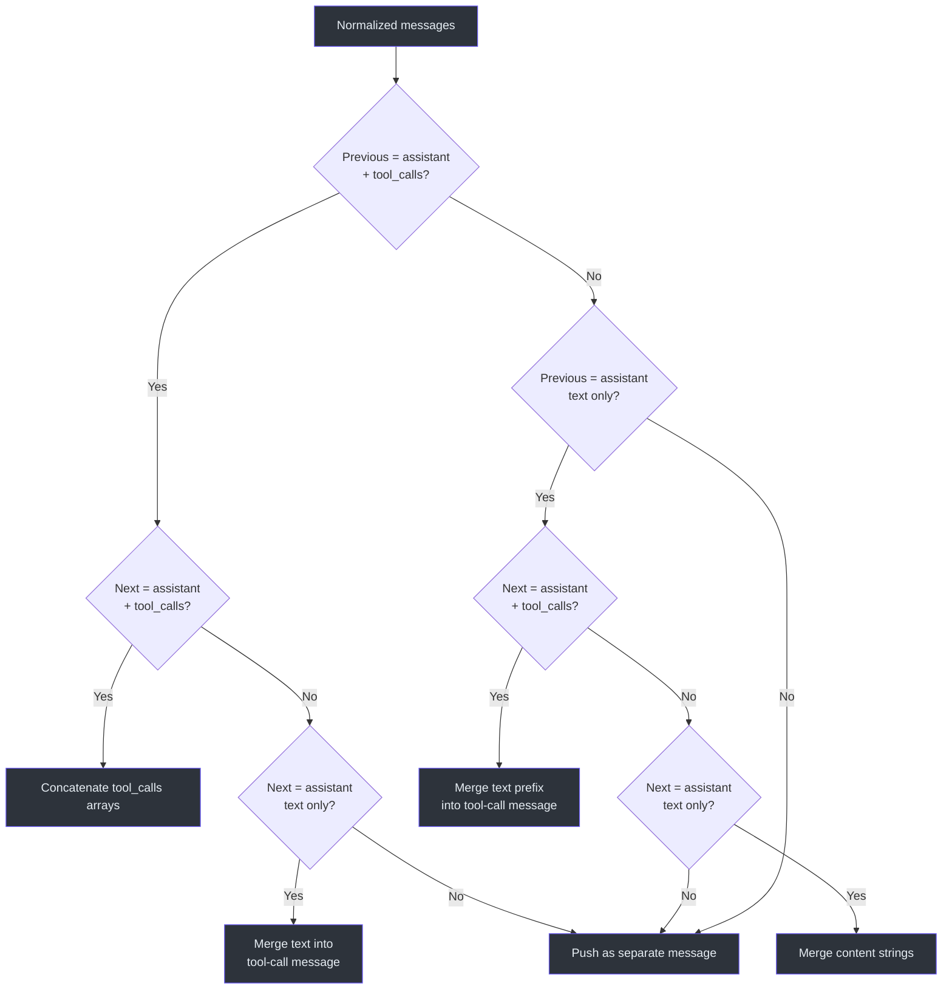
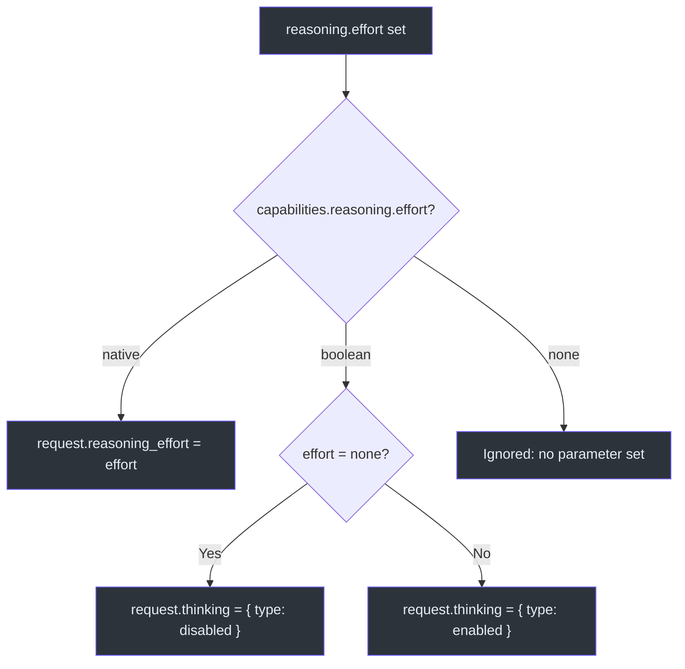

# 请求构建

GodeX 桥接的核心目标是将 OpenAI **Responses API** 的 `ResponseCreateRequest` 转换为 **Chat Completions API** 的 `ChatCompletionCreateRequest`。这不是简单的字段映射——它需要兼容性规划、工具声明翻译、输出契约协商、多种输入项类型的标准化，以及满足 Chat Completions 约束的消息合并。`buildChatCompletionRequest` 函数按固定顺序编排整个管道。

## 概览

| 步骤 | 函数 | 输出 | 来源 |
|------|------|------|------|
| 1 | `planBridgeCompatibility` | 包含参数和格式决策的 `CompatibilityPlan` | [planner.ts](https://github.com/Ahoo-Wang/GodeX/blob/main/src/bridge/compatibility/planner.ts#L25-L36) |
| 2 | `planTools` | 包含声明、tool_choice 和决策的 `ToolPlan` | [tool-plan.ts](https://github.com/Ahoo-Wang/GodeX/blob/main/src/bridge/tools/tool-plan.ts#L66-L106) |
| 3 | `planOutputContract` | 包含格式和合成指令的 `OutputContractPlan` | [output-contract.ts](https://github.com/Ahoo-Wang/GodeX/blob/main/src/bridge/output/output-contract.ts#L19-L52) |
| 4 | `normalizeCurrentInput` + `normalizeResponseItems` | `NormalizedChatMessage[]` | [input-normalizer.ts](https://github.com/Ahoo-Wang/GodeX/blob/main/src/bridge/request/input-normalizer.ts#L21-L46) |
| 5 | `buildChatMessages` | 合并助手轮次后的 `ChatCompletionMessageParam[]` | [message-builder.ts](https://github.com/Ahoo-Wang/GodeX/blob/main/src/bridge/request/message-builder.ts#L7-L56) |
| 6 | `applyTools` | `request.tools` 和 `request.tool_choice` | [request-builder.ts](https://github.com/Ahoo-Wang/GodeX/blob/main/src/bridge/request/request-builder.ts#L146-L172) |
| 7 | `applyRequestOptions` | stream、temperature、top_p、max_tokens、reasoning | [request-builder.ts](https://github.com/Ahoo-Wang/GodeX/blob/main/src/bridge/request/request-builder.ts#L174-L224) |

## 管道概览



## 输入标准化

Responses API 支持许多在 Chat Completions API 中没有直接等价物的输入项类型。`normalizeCurrentInput` 和 `normalizeResponseItems` 将每种项类型转换为一个或多个 `ChatCompletionMessageParam` 条目：

| Responses 项类型 | Chat Completions 映射 |
|-----------------|----------------------|
| `message`（角色：system/user/assistant/developer） | `{ role, content }`（developer 映射为 system） |
| 带有 `instructions` 的 `message` | 作为 `{ role: "system", content: instructions }` 前置插入 |
| `reasoning` | 追加到下一个助手消息的 `reasoning_content` 中 |
| `function_call` | `{ role: "assistant", tool_calls: [{ id, function }] }` |
| `function_call_output` | `{ role: "tool", tool_call_id, content }` |
| `shell_call` | `{ role: "assistant", tool_calls: [...] }`，action 经 JSON 序列化 |
| `shell_call_output` | `{ role: "tool", tool_call_id, content }`，输出经格式化 |
| `local_shell_call` | `{ role: "assistant", tool_calls: [...] }`，action 经 JSON 序列化 |
| `local_shell_call_output` | `{ role: "tool", tool_call_id, content }` |
| `apply_patch_call` | `{ role: "assistant", tool_calls: [...] }`，operation 经 JSON 序列化 |
| `apply_patch_call_output` | `{ role: "tool", tool_call_id, content }` |
| `custom_tool_call` | `{ role: "assistant", tool_calls: [...] }`，包含 `{ input }` 载荷 |
| `custom_tool_call_output` | `{ role: "tool", tool_call_id, content }` |

### 工具名称映射

每个工具调用使用 `ToolPlan.declarations` 中的 Provider 端名称。标准化器在声明中查找请求的名称和类型，找到映射的 `providerName`：



## 消息合并

Chat Completions API 不允许带有独立 tool_calls 的连续助手消息。`buildChatMessages` 使用四条规则合并相邻的助手消息：

| 前一条消息 | 下一条消息 | 合并策略 |
|-----------|-----------|---------|
| Assistant + tool_calls | Assistant + tool_calls | 拼接 `tool_calls` 数组 |
| Assistant（仅文本） | Assistant（仅文本） | 合并 `content` 字符串 |
| Assistant（仅文本） | Assistant + tool_calls | 将文本合并到工具调用消息中 |
| Assistant + tool_calls | Assistant（仅文本） | 将文本合并到工具调用消息中 |
| 其他 | 其他 | 作为独立消息推入 |



## 请求选项映射

`applyRequestOptions` 按条件将每个 Responses API 参数映射到 Chat Completions 等价物。仅当 Provider 的 `capabilities.parameters.supported` 集合包含该参数时才会转发：

| Responses 参数 | Chat Completions 字段 | 条件 |
|---------------|---------------------|------|
| `stream: true` | `request.stream = true` + `stream_options.include_usage` | Provider 支持 `stream`；usage 仅在 `streaming.usage` 为真时包含 |
| `temperature` | `request.temperature` | Provider 支持 `temperature` |
| `top_p` | `request.top_p` | Provider 支持 `top_p` |
| `max_output_tokens` | `request.max_tokens` | Provider 支持 `max_output_tokens` |
| `reasoning.effort` | `request.reasoning_effort` 或 `request.thinking` | Provider 能力模式：`native`、`boolean` 或 `none` |
| `safety_identifier` | `request.user_id` | Provider 支持 `safety_identifier` |
| `user` | `request.user_id` | Provider 支持 `user`（当无 safety_identifier 时的回退） |

### 推理力度映射



## 构建结果结构

`buildChatCompletionRequest` 返回一个 `BuildChatCompletionRequestResult`，包含：

| 字段 | 类型 | 用途 |
|------|------|------|
| `request` | `ChatCompletionCreateRequest` | 最终发送给上游的请求 |
| `compatibility` | `CompatibilityPlan` | 所有参数和格式决策 |
| `tools` | `ToolPlan` | 工具声明、tool_choice 和工具决策 |
| `output` | `OutputContractPlan` | 响应格式处理和验证要求 |

## 会话历史集成

当请求包含会话（来自 `previous_response_id`）时，会话的 `input_items` 会被标准化并前置到当前输入之前。系统前缀（连续的系统消息）首先被提取，合成指令（如有）插入其后，然后是历史消息和当前消息：

```
[来自 instructions 的系统消息] + [合成指令] + [会话历史] + [当前用户/助手消息]
```

## 交叉引用

- **[兼容性](./compatibility.md)**：`planBridgeCompatibility` 和 `planTools` 如何做出功能决策
- **[架构概览](./architecture-overview.md)**：请求构建在完整生命周期中的位置
- **[响应重建](./response-reconstruction.md)**：上游返回后响应如何映射回去

## 参考

- [src/bridge/request/request-builder.ts:1-329](https://github.com/Ahoo-Wang/GodeX/blob/main/src/bridge/request/request-builder.ts#L1-L329) -- `buildChatCompletionRequest` 编排完整管道
- [src/bridge/request/input-normalizer.ts:1-368](https://github.com/Ahoo-Wang/GodeX/blob/main/src/bridge/request/input-normalizer.ts#L1-L368) -- 输入项类型标准化和工具名称映射
- [src/bridge/request/message-builder.ts:1-163](https://github.com/Ahoo-Wang/GodeX/blob/main/src/bridge/request/message-builder.ts#L1-L163) -- 助手消息合并逻辑
- [src/bridge/compatibility/planner.ts:25-36](https://github.com/Ahoo-Wang/GodeX/blob/main/src/bridge/compatibility/planner.ts#L25-L36) -- `planBridgeCompatibility` 入口点
- [src/bridge/tools/tool-plan.ts:66-106](https://github.com/Ahoo-Wang/GodeX/blob/main/src/bridge/tools/tool-plan.ts#L66-L106) -- `planTools` 包含声明和 tool_choice 规划
- [src/bridge/output/output-contract.ts:19-52](https://github.com/Ahoo-Wang/GodeX/blob/main/src/bridge/output/output-contract.ts#L19-L52) -- `planOutputContract` 包含 JSON Schema 降级
