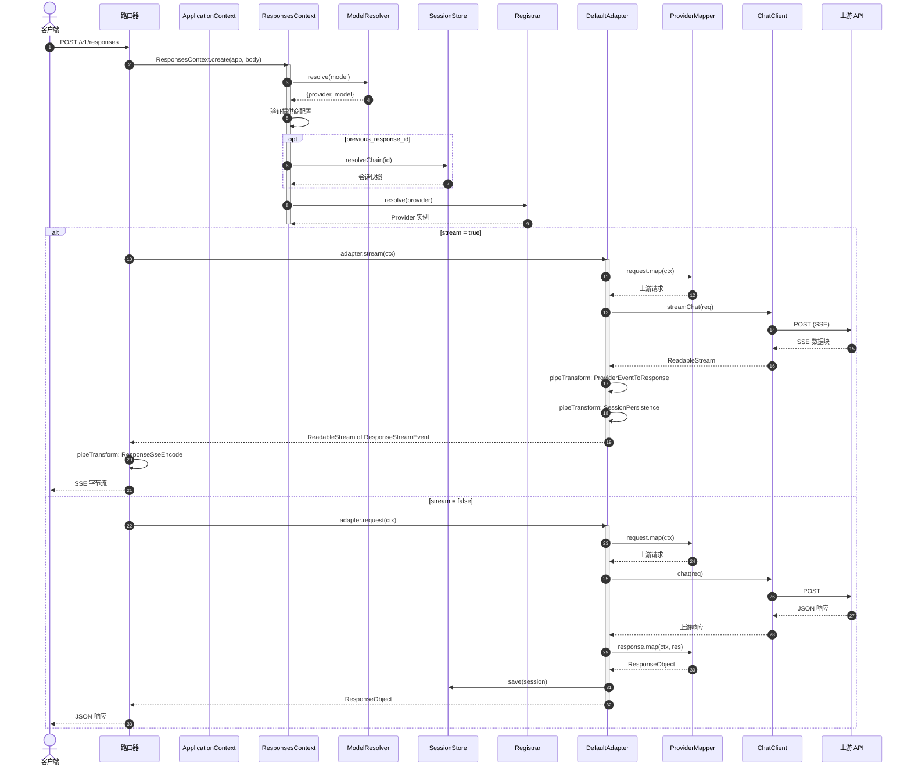

# 请求流程

本页跟踪请求从 HTTP 入口到 SSE 编码响应的完整生命周期。

## 完整请求生命周期

## 关键步骤

1. **模型解析**：`ModelResolver.resolve()` 解析模型字符串。包含 `/` 时，左侧为提供商名称；否则使用默认提供商。模型名称通过提供商的 `models` 表映射。

2. **会话链解析**：当存在 `previous_response_id` 时，`SessionStore.resolveChain()` 沿父指针链遍历，按时间顺序收集对话轮次。

3. **提供商查找**：`Registrar.resolve()` 返回已构建的 `Provider` 实例。

4. **请求映射**：`RequestMapper.map()` 将 Responses API 请求转换为提供商原生格式。

5. **响应映射**：单次 `ResponseMapper.map()` 调用（非流式）或 `StreamMapper.map()` 管道（流式）。

[适配器模式](/zh/02-architecture/adapter-pattern)
