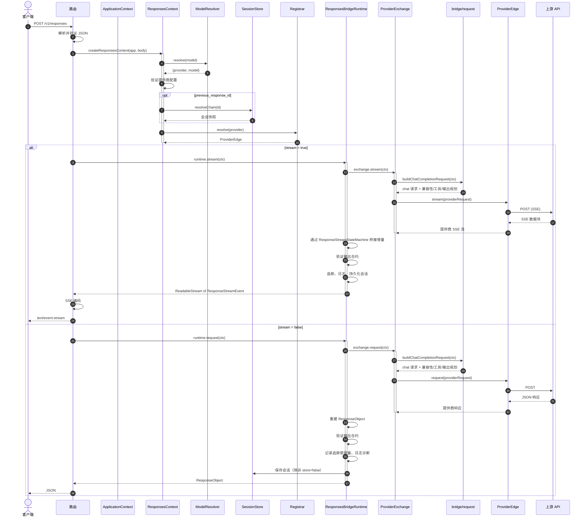

# 请求流程

本页追踪一个请求从 HTTP 入口到 SSE 编码响应的完整生命周期。

## 完整请求生命周期

## 关键步骤

1. **请求解析**：`parseResponseRequest()` 验证 JSON 封装并返回结构化请求体或错误响应。

2. **上下文创建**：`createResponsesContext()` 解析模型、验证提供商配置、可选地解析会话链，并从注册器解析 `ProviderEdge`。

3. **模型解析**：`ModelResolver.resolve()` 解析模型字符串。如果包含 `/`，则作为显式 `provider/model` 选择器。否则在 `models.aliases` 映射中查找（精确匹配、`*` 通配符、`default_provider` 回退）。

4. **会话链解析**：当存在 `previous_response_id` 时，`SessionStore.resolveChain()` 沿父指针链遍历，按时间顺序收集回合。

5. **提供商查找**：`Registrar.resolve()` 返回已构建的 `ProviderEdge`。

6. **请求构建**：Bridge 内核中的 `buildChatCompletionRequest()` 规划兼容性、工具和输出合约，然后规范化消息。

7. **响应重建**：同步管道通过 `reconstructResponseObject()` 重建 `ResponseObject`。流式管道通过 `ResponseStreamStateMachine` 映射增量。

[Bridge 内核](/zh/02-architecture/bridge-kernel)
