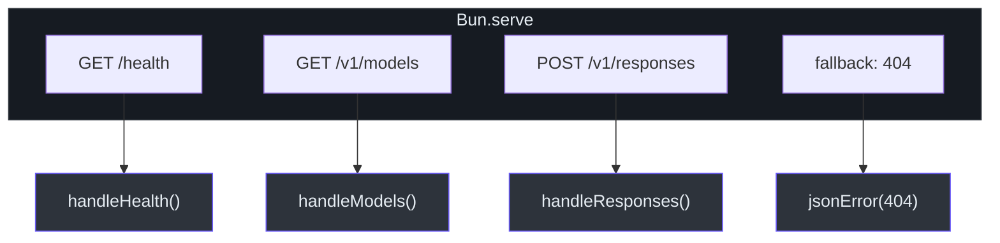
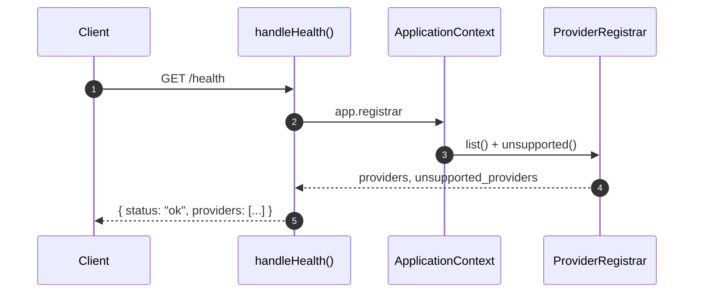
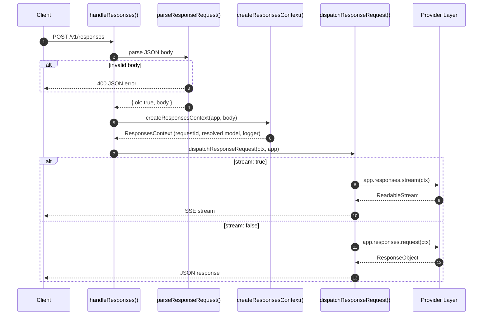
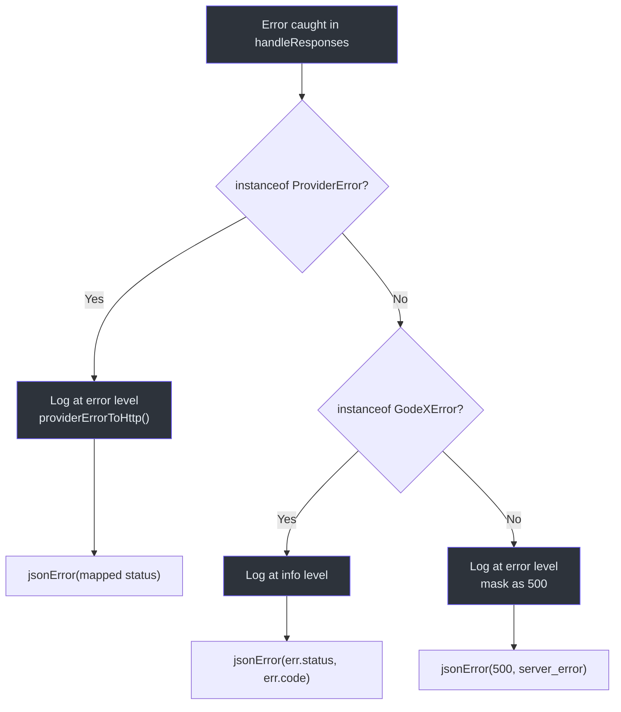

# 服务器路由

GodeX 运行在 Bun 内置的 HTTP 服务器上，暴露了一组精简而有针对性的路由。三个端点覆盖了完整的运行界面：用于负载均衡器的健康检查、用于客户端发现的模型列表，以及接受 OpenAI 兼容请求的主 `/v1/responses` 端点，该端点可以返回同步 JSON 响应或流式 Server-Sent Events。每个路由都通过 `ApplicationContext` 连接，使处理器可以访问解析器、日志器、提供商注册器和会话存储，而无需全局单例。

## 概览

| 方面 | 详情 |
|---|---|
| HTTP 服务器 | 带有静态路由映射的 `Bun.serve` |
| 路由 | `/health`、`/v1/models`、`/v1/responses` |
| 流式传输 | 通过 `ResponseSseEncoder` 的 SSE |
| 错误处理 | 带有结构化日志的 `responseRouteErrorToResponse` |
| 请求追踪 | 每个请求的 `TraceRecordingContext` |

## 路由映射



路由在 [src/server/server.ts:21-27](https://github.com/Ahoo-Wang/GodeX/blob/main/src/server/server.ts#L21) 的 `createBuiltinRoutes` 中注册。服务器通过 [第 29 行](https://github.com/Ahoo-Wang/GodeX/blob/main/src/server/server.ts#L29) 的 `startServer` 启动，它将路由映射连同主机名、端口和空闲超时一起传递给 `Bun.serve`。未匹配的路径会落入默认的 `fetch` 处理器，返回 404 JSON 错误。

## /health



[src/server/routes/health.ts:3-13](https://github.com/Ahoo-Wang/GodeX/blob/main/src/server/routes/health.ts#L3) 处的 `handleHealth` 返回一个 JSON 对象，包含：

| 字段 | 类型 | 描述 |
|---|---|---|
| `status` | `string` | 始终为 `"ok"` |
| `timestamp` | `number` | 请求时的 `Date.now()` |
| `providers` | `string[]` | 已注册的提供商 ID |
| `unsupported_providers` | `string[]` | 在配置中但未注册的提供商 |

## /v1/models

[src/server/routes/models.ts:9-19](https://github.com/Ahoo-Wang/GodeX/blob/main/src/server/routes/models.ts#L9) 处的 `handleModels` 使用 `ModelResolver` 列出经过已注册提供商过滤的已配置别名。

响应格式（OpenAI 兼容）：

```json
{
  "object": "list",
  "data": [
    { "id": "gpt-4", "object": "model", "owned_by": "deepseek" }
  ]
}
```

## /v1/responses 请求生命周期



### 步骤 1：请求解析

[src/server/routes/responses/request-parser.ts:13-70](https://github.com/Ahoo-Wang/GodeX/blob/main/src/server/routes/responses/request-parser.ts#L13) 处的 `parseResponseRequest` 验证：

| 检查 | 错误码 | 状态码 |
|---|---|---|
| 有效的 JSON 请求体 | `server.request.invalid_json` | 400 |
| 请求体是对象 | `server.request.invalid_parameter` | 400 |
| 无 `previous_response_id` + `conversation` 冲突 | `server.request.invalid_parameter` | 400 |

### 步骤 2：上下文创建

`createResponsesContext` 解析模型，加载由 `previous_response_id` 引用的任何会话链，并创建一个带有唯一 `requestId` 的请求作用域日志器。

### 步骤 3：调度

[src/server/routes/responses/response-dispatcher.ts:7-21](https://github.com/Ahoo-Wang/GodeX/blob/main/src/server/routes/responses/response-dispatcher.ts#L7) 处的 `dispatchResponseRequest` 根据 `ctx.request.stream` 进行分支：

- **同步** -- 调用 `app.responses.request(ctx)` 并返回 `Response.json()`。
- **流式** -- 调用 `app.responses.stream(ctx)`，通过 `ResponseSseEncoder` 进行管道传输，并带有 SSE 头部返回。

### SSE 头部

[src/server/routes/responses/sse.ts:1-7](https://github.com/Ahoo-Wang/GodeX/blob/main/src/server/routes/responses/sse.ts#L1) 处的 `sseHeaders` 设置：

```
Content-Type: text/event-stream
Cache-Control: no-cache
Connection: keep-alive
```

## 错误处理



[src/server/routes/responses/error-handler.ts:12-50](https://github.com/Ahoo-Wang/GodeX/blob/main/src/server/routes/responses/error-handler.ts#L12) 处的 `responseRouteErrorToResponse` 按优先级顺序处理错误，记录追踪错误，并在可用时附加 `x-request-id` 头。

## 请求日志

每个请求通过 [src/server/routes/responses/request-log.ts:4-25](https://github.com/Ahoo-Wang/GodeX/blob/main/src/server/routes/responses/request-log.ts#L4) 处的 `responseRequestLogEntry` 记录日志，捕获：

| 字段 | 描述 |
|---|---|
| `model` | 客户端指定的模型选择器 |
| `resolved` | 解析后的提供商 + 模型 |
| `stream` | 是否请求流式传输 |
| `previous_response_id` | 会话链引用 |
| `store` | 是否应持久化响应 |
| `input_count` | 输入项数量 |
| `tools_count` | 工具定义数量 |

## 交叉引用

- [请求流](./request-flow.md) -- 完整的端到端管道
- [模型解析](./model-resolution.md) -- 模型字段如何被解析
- [流式管道](../05-streaming-pipeline/overview.md) -- SSE 编码详情
- [错误处理](../06-error-handling/error-handling.md) -- 错误层次结构和错误码
- [配置 Schema](../07-configuration/config-schema.md) -- server.host、server.port、idle_timeout
- [CLI](../01-getting-started/cli.md) -- `godex serve` 命令

## 参考资料

- [src/server/server.ts](https://github.com/Ahoo-Wang/GodeX/blob/main/src/server/server.ts) -- Bun.serve 设置和路由注册
- [src/server/routes/health.ts](https://github.com/Ahoo-Wang/GodeX/blob/main/src/server/routes/health.ts) -- 健康检查处理器
- [src/server/routes/models.ts](https://github.com/Ahoo-Wang/GodeX/blob/main/src/server/routes/models.ts) -- 模型列表处理器
- [src/server/routes/responses/handler.ts](https://github.com/Ahoo-Wang/GodeX/blob/main/src/server/routes/responses/handler.ts) -- 主响应处理器
- [src/server/routes/responses/request-parser.ts](https://github.com/Ahoo-Wang/GodeX/blob/main/src/server/routes/responses/request-parser.ts) -- 请求验证
- [src/server/routes/responses/response-dispatcher.ts](https://github.com/Ahoo-Wang/GodeX/blob/main/src/server/routes/responses/response-dispatcher.ts) -- 同步/流式调度
- [src/server/routes/responses/error-handler.ts](https://github.com/Ahoo-Wang/GodeX/blob/main/src/server/routes/responses/error-handler.ts) -- 路由错误处理器
- [src/server/routes/responses/sse.ts](https://github.com/Ahoo-Wang/GodeX/blob/main/src/server/routes/responses/sse.ts) -- SSE 头部工具
- [src/server/routes/responses/request-log.ts](https://github.com/Ahoo-Wang/GodeX/blob/main/src/server/routes/responses/request-log.ts) -- 请求日志条目构建器
- [src/server/errors.ts](https://github.com/Ahoo-Wang/GodeX/blob/main/src/server/errors.ts) -- HTTP 错误映射辅助函数
