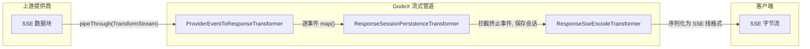

# 流式管道

流式管道是 GodeX 实时传输的核心。它链接三个 `TransformStream` 阶段，将提供商特定的 SSE 数据块转换为 OpenAI Responses API 事件，同时沿途持久化会话状态。

## 管道总览



## 转换器职责

| 阶段 | 转换器 | 输入 | 输出 | 副作用 |
|------|--------|------|------|---------|
| 1 | `ProviderEventToResponseTransformer` | `JsonServerSentEvent` | `ResponseStreamEvent` | 每事件调用 `StreamMapper.map()` |
| 2 | `ResponseSessionPersistenceTransformer` | `ResponseStreamEvent` | `ResponseStreamEvent` | 透传事件；在终止事件上通过会话存储保存响应 |
| 3 | `ResponseSseEncodeTransformer` | `ResponseStreamEvent` | `Uint8Array` | 序列化为 `event:` / `data:` 行 |

## 流状态管理

`StreamResponseState`（来自 `src/adapter/mapper/stream-response-state.ts`）是一个状态机，每次方法调用时产生 `ResponseStreamEvent` 数组。它由提供商的 `StreamMapper` 在流开始时创建，并存储在 `ResponsesContext.attributes` 中，键为 `"stream-response-state"`。

状态跟踪：
- 当前正在累积增量的活跃输出块（文本、推理、拒绝）
- 按调用索引的工具调用累积器
- 完成的输出项（通过 `OutputCollectionState`）
- 始终最新的 `snapshot: ResponseObject` 属性

### 会话持久化

`ResponseSessionPersistenceTransformer`：

- 透明地传递所有事件
- 在终止事件（`response.completed`、`response.incomplete`、`response.failed`）上，从事件中提取完整的 `ResponseObject` 并通过 `SessionStore.save()` 保存
- 在 `flush()` 中，如果未见到终止事件但状态已达到终止阶段，则保存 `StreamResponseState.snapshot`

当请求中 `store === false` 时，完全跳过此转换器。

## 阶段生命周期

```
IDLE --> start() --> IN_PROGRESS --> onFinish() --> COMPLETED/INCOMPLETE
                              \--> onError()  --> FAILED
```

每次阶段转换都经过验证；从未预期的阶段调用会抛出带有适当错误代码的 `AdapterError`（`ADAPTER_STREAM_INVALID_TRANSITION`、`ADAPTER_STREAM_DELTA_AFTER_TERMINAL` 等）。

[Provider 接口](/zh/03-provider-development/provider-interface)
