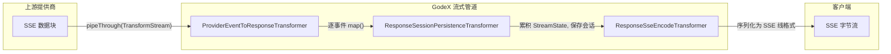

# 流式管道

流式管道是 GodeX 实时传输的核心。它链接三个 `TransformStream` 阶段，将提供商特定的 SSE 数据块转换为 OpenAI Responses API 事件，同时沿途持久化会话状态。

## 管道总览

## 转换器职责

| 阶段 | 转换器 | 输入 | 输出 | 副作用 |
|------|--------|------|------|---------|
| 1 | `ProviderEventToResponseTransformer` | `JsonServerSentEvent` | `ResponseStreamEvent` | 每事件调用 `StreamMapper.map()` |
| 2 | `ResponseSessionPersistenceTransformer` | `ResponseStreamEvent` | `ResponseStreamEvent` | 累积 `StreamState`，终止事件时保存会话 |
| 3 | `ResponseSseEncodeTransformer` | `ResponseStreamEvent` | `Uint8Array` | 序列化为 `event:` / `data:` 行 |

## 流状态累积

`ResponseSessionPersistenceTransformer` 在整个流过程中维护 `StreamState` 对象：

- 收集输出项（内容、工具调用等）
- 跟踪 token 使用量
- 在终止事件上调用 `StreamMapper.buildResponseObject()` 构建完整 `ResponseObject`
- 通过 `SessionStore.save()` 保存结果会话

当请求中 `store === false` 时，完全跳过此转换器。

[Provider 接口](/zh/03-provider-development/provider-interface)
